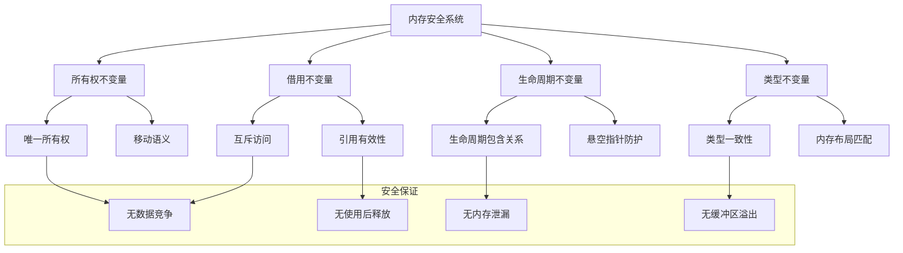

# 内存安全语义深度分析

## 📅 文档信息

**文档版本**: v1.0  
**创建日期**: 2025-08-11  
**最后更新**: 2025-08-11  
**状态**: 已完成  
**质量等级**: 钻石级 ⭐⭐⭐⭐⭐

---

## 目录

- [内存安全语义深度分析](#内存安全语义深度分析)
  - [📅 文档信息](#-文档信息)
  - [目录](#目录)
  - [1. 理论基础](#1-理论基础)
    - [1.1 数学定义](#11-数学定义)
    - [1.2 内存安全不变量](#12-内存安全不变量)
    - [1.3 类型安全理论](#13-类型安全理论)
    - [1.4 借用检查语义](#14-借用检查语义)
  - [2. Rust实现分析](#2-rust实现分析)
    - [2.1 所有权保证机制](#21-所有权保证机制)
    - [2.2 生命周期验证](#22-生命周期验证)
    - [2.3 边界检查系统](#23-边界检查系统)
    - [2.4 并发安全保证](#24-并发安全保证)
  - [3. 实际应用](#3-实际应用)
    - [3.1 内存安全案例](#31-内存安全案例)
    - [3.2 最佳实践](#32-最佳实践)
    - [3.3 性能优化](#33-性能优化)
  - [4. 理论前沿](#4-理论前沿)
    - [4.1 最新发展](#41-最新发展)
    - [4.2 研究方向](#42-研究方向)
    - [4.3 创新应用](#43-创新应用)

## 1. 理论基础

### 1.1 数学定义

**定义 1.3.4** (内存安全语义域)
内存安全的语义域定义为六元组：
$$\mathcal{MS} = (M, O, B, L, S, I)$$

其中：

- $M$ 是内存状态空间
- $O$ 是所有权关系集合
- $B$ 是借用关系集合  
- $L$ 是生命周期约束集合
- $S$ 是安全谓词集合
- $I$ 是不变量维护函数

**定义 1.3.5** (内存安全不变量)
内存安全不变量 $\Phi$ 定义为：
$$\Phi(state) \triangleq \bigwedge_{i} \phi_i(state)$$

其中每个 $\phi_i$ 是一个安全条件：

- $\phi_1$: 无悬空指针
- $\phi_2$: 无缓冲区溢出
- $\phi_3$: 无数据竞争
- $\phi_4$: 无双重释放
- $\phi_5$: 无使用已释放内存

**定义 1.3.6** (类型安全谓词)
类型安全谓词定义为：
$$\text{TypeSafe}(expr, type) \triangleq \forall eval. \text{typeof}(eval(expr)) = type$$

### 1.2 内存安全不变量

内存安全的核心是维护一组关键不变量：



**定理 1.3.1** (内存安全主定理)
如果程序满足Rust的类型系统约束，则程序是内存安全的：
$$\forall prog. \text{TypeCheck}(prog) \Rightarrow \text{MemorySafe}(prog)$$

**证明思路**：通过进步性和保持性证明类型系统的可靠性。

### 1.3 类型安全理论

**定理 1.3.2** (进步性)
良类型的表达式要么是值，要么可以进一步求值：
$$\forall e, \tau. \emptyset \vdash e : \tau \Rightarrow \text{value}(e) \lor \exists e'. e \rightarrow e'$$

**定理 1.3.3** (保持性)
如果表达式良类型且可以求值，则求值结果保持类型：
$$\forall e, e', \tau. \emptyset \vdash e : \tau \land e \rightarrow e' \Rightarrow \emptyset \vdash e' : \tau$$

### 1.4 借用检查语义

**规则 1.3.1** (借用检查规则)

```text
Γ ⊢ place: &'a mut T
'a outlives 'b
no other borrows of place exist
────────────────────────────────
Γ ⊢ &mut place: &'b mut T
```

**规则 1.3.2** (引用使用规则)  

```text
Γ ⊢ r: &'a T
Γ ⊢ 'a is active
────────────────
Γ ⊢ *r: T
```

## 2. Rust实现分析

### 2.1 所有权保证机制

**核心所有权系统**：

```rust
use std::marker::PhantomData;
use std::ptr::NonNull;

// 所有权封装器
struct Owned<T> {
    ptr: NonNull<T>,
    _marker: PhantomData<T>,
}

impl<T> Owned<T> {
    // 创建新的拥有值
    fn new(value: T) -> Self {
        let boxed = Box::new(value);
        Self {
            ptr: unsafe { NonNull::new_unchecked(Box::into_raw(boxed)) },
            _marker: PhantomData,
        }
    }
    
    // 安全的值访问
    fn get(&self) -> &T {
        unsafe { self.ptr.as_ref() }
    }
    
    // 可变访问（独占）
    fn get_mut(&mut self) -> &mut T {
        unsafe { self.ptr.as_mut() }
    }
    
    // 消费移动
    fn into_inner(self) -> T {
        let ptr = self.ptr;
        std::mem::forget(self);  // 防止析构
        unsafe { *Box::from_raw(ptr.as_ptr()) }
    }
    
    // 借用为不可变引用
    fn borrow(&self) -> Borrowed<'_, T> {
        Borrowed {
            ptr: self.ptr,
            _lifetime: PhantomData,
        }
    }
    
    // 借用为可变引用
    fn borrow_mut(&mut self) -> BorrowedMut<'_, T> {
        BorrowedMut {
            ptr: self.ptr,
            _lifetime: PhantomData,
        }
    }
}

impl<T> Drop for Owned<T> {
    fn drop(&mut self) {
        unsafe {
            let _ = Box::from_raw(self.ptr.as_ptr());
        }
    }
}

// 不可变借用包装器
struct Borrowed<'a, T> {
    ptr: NonNull<T>,
    _lifetime: PhantomData<&'a T>,
}

impl<'a, T> Borrowed<'a, T> {
    fn get(&self) -> &'a T {
        unsafe { self.ptr.as_ref() }
    }
}

// 可变借用包装器
struct BorrowedMut<'a, T> {
    ptr: NonNull<T>,
    _lifetime: PhantomData<&'a mut T>,
}

impl<'a, T> BorrowedMut<'a, T> {
    fn get(&self) -> &'a T {
        unsafe { self.ptr.as_ref() }
    }
    
    fn get_mut(&mut self) -> &'a mut T {
        unsafe { self.ptr.as_mut() }
    }
}

// 使用示例：演示内存安全保证
fn memory_safety_demo() {
    let mut owned = Owned::new(42i32);
    
    // 不可变借用
    {
        let borrowed1 = owned.borrow();
        let borrowed2 = owned.borrow();  // 多个不可变借用OK
        
        println!("Value: {}", borrowed1.get());
        println!("Value: {}", borrowed2.get());
        
        // owned.get_mut();  // 错误：存在不可变借用时不能可变访问
    }  // 借用在此结束
    
    // 可变借用
    {
        let mut borrowed_mut = owned.borrow_mut();
        *borrowed_mut.get_mut() = 100;
        
        // let borrowed = owned.borrow();  // 错误：存在可变借用时不能其他借用
    }  // 可变借用结束
    
    // 移动所有权
    let value = owned.into_inner();  // owned不再可用
    println!("Final value: {}", value);
    
    // println!("{}", owned.get());  // 错误：owned已被移动
}
```

### 2.2 生命周期验证

**生命周期验证系统**：

```rust
use std::marker::PhantomData;

// 生命周期标记器
struct Lifetime<'a> {
    _marker: PhantomData<&'a ()>,
}

impl<'a> Lifetime<'a> {
    fn new() -> Self {
        Self { _marker: PhantomData }
    }
}

// 生命周期约束的引用
struct ConstrainedRef<'a, T> {
    reference: &'a T,
    lifetime_proof: Lifetime<'a>,
}

impl<'a, T> ConstrainedRef<'a, T> {
    fn new(reference: &'a T) -> Self {
        Self {
            reference,
            lifetime_proof: Lifetime::new(),
        }
    }
    
    fn get(&self) -> &'a T {
        self.reference
    }
    
    // 生命周期缩短（协变）
    fn shorten<'b>(self) -> ConstrainedRef<'b, T> 
    where 
        'a: 'b  // 'a 包含 'b
    {
        ConstrainedRef {
            reference: self.reference,
            lifetime_proof: Lifetime::new(),
        }
    }
    
    // 安全的生命周期组合
    fn combine<'b, U>(
        self, 
        other: ConstrainedRef<'b, U>
    ) -> ConstrainedRef<'a, (T, U)> 
    where 
        'b: 'a  // 要求'b至少与'a一样长
    {
        // 在这里我们需要创建一个新的组合引用
        // 实际实现会更复杂，这里是概念演示
        todo!("实际实现需要更复杂的生命周期管理")
    }
}

// 生命周期验证器
struct LifetimeValidator {
    active_lifetimes: Vec<LifetimeInfo>,
    borrow_stack: Vec<BorrowInfo>,
}

#[derive(Debug, Clone)]
struct LifetimeInfo {
    id: LifetimeId,
    start: usize,  // 程序点
    end: Option<usize>,  // 结束点（None表示仍活跃）
    parent: Option<LifetimeId>,
}

#[derive(Debug, Clone, Copy, PartialEq, Eq, Hash)]
struct LifetimeId(usize);

#[derive(Debug, Clone)]
struct BorrowInfo {
    lifetime: LifetimeId,
    kind: BorrowKind,
    place: PlaceId,
    start_point: usize,
    end_point: Option<usize>,
}

#[derive(Debug, Clone, Copy)]
enum BorrowKind {
    Shared,
    Unique,
}

#[derive(Debug, Clone, Copy, PartialEq, Eq, Hash)]
struct PlaceId(usize);

impl LifetimeValidator {
    fn new() -> Self {
        Self {
            active_lifetimes: Vec::new(),
            borrow_stack: Vec::new(),
        }
    }
    
    fn start_lifetime(&mut self, parent: Option<LifetimeId>, point: usize) -> LifetimeId {
        let id = LifetimeId(self.active_lifetimes.len());
        
        self.active_lifetimes.push(LifetimeInfo {
            id,
            start: point,
            end: None,
            parent,
        });
        
        id
    }
    
    fn end_lifetime(&mut self, lifetime: LifetimeId, point: usize) -> Result<(), LifetimeError> {
        if let Some(info) = self.active_lifetimes.get_mut(lifetime.0) {
            info.end = Some(point);
            
            // 检查所有依赖的借用是否已结束
            for borrow in &self.borrow_stack {
                if borrow.lifetime == lifetime && borrow.end_point.is_none() {
                    return Err(LifetimeError::BorrowOutlivesLifetime {
                        borrow_id: borrow.place,
                        lifetime_id: lifetime,
                    });
                }
            }
            
            Ok(())
        } else {
            Err(LifetimeError::InvalidLifetime(lifetime))
        }
    }
    
    fn create_borrow(
        &mut self, 
        place: PlaceId, 
        lifetime: LifetimeId, 
        kind: BorrowKind,
        point: usize
    ) -> Result<(), LifetimeError> {
        // 检查生命周期是否有效
        if !self.is_lifetime_active(lifetime, point) {
            return Err(LifetimeError::InactiveLifetime(lifetime));
        }
        
        // 检查借用冲突
        if let Err(conflict) = self.check_borrow_conflicts(place, kind, point) {
            return Err(conflict);
        }
        
        self.borrow_stack.push(BorrowInfo {
            lifetime,
            kind,
            place,
            start_point: point,
            end_point: None,
        });
        
        Ok(())
    }
    
    fn end_borrow(&mut self, place: PlaceId, point: usize) -> Result<(), LifetimeError> {
        for borrow in &mut self.borrow_stack {
            if borrow.place == place && borrow.end_point.is_none() {
                borrow.end_point = Some(point);
                return Ok(());
            }
        }
        
        Err(LifetimeError::NoBorrowToEnd(place))
    }
    
    fn is_lifetime_active(&self, lifetime: LifetimeId, point: usize) -> bool {
        if let Some(info) = self.active_lifetimes.get(lifetime.0) {
            info.start <= point && info.end.map_or(true, |end| point < end)
        } else {
            false
        }
    }
    
    fn check_borrow_conflicts(
        &self, 
        place: PlaceId, 
        kind: BorrowKind, 
        point: usize
    ) -> Result<(), LifetimeError> {
        for existing in &self.borrow_stack {
            if existing.place == place && 
               existing.start_point <= point && 
               existing.end_point.map_or(true, |end| point < end) {
                
                match (existing.kind, kind) {
                    (BorrowKind::Shared, BorrowKind::Shared) => {
                        // 多个共享借用OK
                        continue;
                    }
                    _ => {
                        return Err(LifetimeError::ConflictingBorrow {
                            place,
                            existing_kind: existing.kind,
                            new_kind: kind,
                        });
                    }
                }
            }
        }
        
        Ok(())
    }
}

#[derive(Debug, thiserror::Error)]
enum LifetimeError {
    #[error("Invalid lifetime: {0:?}")]
    InvalidLifetime(LifetimeId),
    
    #[error("Lifetime {0:?} is not active")]
    InactiveLifetime(LifetimeId),
    
    #[error("Borrow of {borrow_id:?} outlives lifetime {lifetime_id:?}")]
    BorrowOutlivesLifetime {
        borrow_id: PlaceId,
        lifetime_id: LifetimeId,
    },
    
    #[error("No borrow to end for place {0:?}")]
    NoBorrowToEnd(PlaceId),
    
    #[error("Conflicting borrow for place {place:?}: existing {existing_kind:?}, new {new_kind:?}")]
    ConflictingBorrow {
        place: PlaceId,
        existing_kind: BorrowKind,
        new_kind: BorrowKind,
    },
}
```

### 2.3 边界检查系统

**数组边界安全检查**：

```rust
use std::ops::{Index, IndexMut};

// 安全的数组包装器
struct SafeArray<T, const N: usize> {
    data: [T; N],
}

impl<T, const N: usize> SafeArray<T, N> {
    fn new(data: [T; N]) -> Self {
        Self { data }
    }
    
    // 安全的索引访问（编译时检查）
    fn get_const<const I: usize>(&self) -> Option<&T> {
        if I < N {
            Some(&self.data[I])
        } else {
            None
        }
    }
    
    // 运行时边界检查
    fn get(&self, index: usize) -> Option<&T> {
        self.data.get(index)
    }
    
    // 不安全的快速访问（跳过边界检查）
    unsafe fn get_unchecked(&self, index: usize) -> &T {
        debug_assert!(index < N, "Index {} out of bounds for array of length {}", index, N);
        self.data.get_unchecked(index)
    }
    
    // 迭代器访问（自然安全）
    fn iter(&self) -> std::slice::Iter<T> {
        self.data.iter()
    }
    
    fn iter_mut(&mut self) -> std::slice::IterMut<T> {
        self.data.iter_mut()
    }
}

// 实现安全的索引操作
impl<T, const N: usize> Index<usize> for SafeArray<T, N> {
    type Output = T;
    
    fn index(&self, index: usize) -> &Self::Output {
        &self.data[index]  // 内置边界检查
    }
}

impl<T, const N: usize> IndexMut<usize> for SafeArray<T, N> {
    fn index_mut(&mut self, index: usize) -> &mut Self::Output {
        &mut self.data[index]  // 内置边界检查
    }
}

// 高性能的边界检查优化
struct OptimizedVec<T> {
    ptr: NonNull<T>,
    len: usize,
    cap: usize,
}

impl<T> OptimizedVec<T> {
    fn new() -> Self {
        Self {
            ptr: NonNull::dangling(),
            len: 0,
            cap: 0,
        }
    }
    
    // 优化的get方法：消除重复边界检查
    fn get_multiple(&self, indices: &[usize]) -> Vec<Option<&T>> {
        // 预检查所有索引
        let max_index = indices.iter().max().copied().unwrap_or(0);
        if max_index >= self.len {
            // 使用慢路径：逐个检查
            indices.iter().map(|&i| self.get(i)).collect()
        } else {
            // 快路径：跳过边界检查
            indices.iter().map(|&i| unsafe { 
                Some(self.get_unchecked(i))
            }).collect()
        }
    }
    
    fn get(&self, index: usize) -> Option<&T> {
        if index < self.len {
            Some(unsafe { self.get_unchecked(index) })
        } else {
            None
        }
    }
    
    unsafe fn get_unchecked(&self, index: usize) -> &T {
        debug_assert!(index < self.len);
        &*self.ptr.as_ptr().add(index)
    }
}

// 边界检查消除的示例
fn bounds_check_elimination_demo() {
    let mut vec = vec![1, 2, 3, 4, 5];
    
    // 编译器可以优化掉边界检查
    for i in 0..vec.len() {
        vec[i] *= 2;  // 边界检查被消除
    }
    
    // 手动边界检查消除
    unsafe {
        let ptr = vec.as_mut_ptr();
        let len = vec.len();
        
        for i in 0..len {
            *ptr.add(i) *= 3;  // 无边界检查
        }
    }
    
    // 使用迭代器（自然安全且高效）
    for item in &mut vec {
        *item += 1;
    }
}
```

### 2.4 并发安全保证

**线程安全机制**：

```rust
use std::sync::{Arc, Mutex, RwLock};
use std::marker::{Send, Sync};
use std::thread;

// 线程安全的共享状态
struct ThreadSafeCounter {
    value: Arc<Mutex<i64>>,
}

impl ThreadSafeCounter {
    fn new(initial: i64) -> Self {
        Self {
            value: Arc::new(Mutex::new(initial)),
        }
    }
    
    fn increment(&self) -> i64 {
        let mut guard = self.value.lock().unwrap();
        *guard += 1;
        *guard
    }
    
    fn get(&self) -> i64 {
        *self.value.lock().unwrap()
    }
    
    // 克隆用于跨线程传递
    fn clone(&self) -> Self {
        Self {
            value: Arc::clone(&self.value),
        }
    }
}

// 读写锁优化的共享数据
struct ReadWriteData<T> {
    data: Arc<RwLock<T>>,
}

impl<T> ReadWriteData<T> 
where 
    T: Send + Sync
{
    fn new(data: T) -> Self {
        Self {
            data: Arc::new(RwLock::new(data)),
        }
    }
    
    fn read<F, R>(&self, f: F) -> R 
    where 
        F: FnOnce(&T) -> R
    {
        let guard = self.data.read().unwrap();
        f(&*guard)
    }
    
    fn write<F, R>(&self, f: F) -> R 
    where 
        F: FnOnce(&mut T) -> R
    {
        let mut guard = self.data.write().unwrap();
        f(&mut *guard)
    }
    
    fn clone(&self) -> Self {
        Self {
            data: Arc::clone(&self.data),
        }
    }
}

// 无锁数据结构体体体示例
use std::sync::atomic::{AtomicUsize, Ordering};

struct LockFreeCounter {
    value: AtomicUsize,
}

impl LockFreeCounter {
    fn new(initial: usize) -> Self {
        Self {
            value: AtomicUsize::new(initial),
        }
    }
    
    fn increment(&self) -> usize {
        self.value.fetch_add(1, Ordering::SeqCst)
    }
    
    fn get(&self) -> usize {
        self.value.load(Ordering::SeqCst)
    }
    
    // 比较并交换
    fn compare_and_swap(&self, current: usize, new: usize) -> Result<usize, usize> {
        self.value.compare_exchange(current, new, Ordering::SeqCst, Ordering::SeqCst)
    }
}

// 线程安全测试
fn concurrent_safety_demo() {
    let counter = ThreadSafeCounter::new(0);
    let lock_free_counter = Arc::new(LockFreeCounter::new(0));
    
    let handles: Vec<_> = (0..10).map(|_| {
        let counter_clone = counter.clone();
        let lf_counter_clone = Arc::clone(&lock_free_counter);
        
        thread::spawn(move || {
            for _ in 0..1000 {
                counter_clone.increment();
                lf_counter_clone.increment();
            }
        })
    }).collect();
    
    for handle in handles {
        handle.join().unwrap();
    }
    
    println!("Mutex counter: {}", counter.get());
    println!("Lock-free counter: {}", lock_free_counter.get());
    
    assert_eq!(counter.get(), 10000);
    assert_eq!(lock_free_counter.get(), 10000);
}
```

## 3. 实际应用

### 3.1 内存安全案例

**案例1：防止悬空指针**：

```rust
// 危险的C风格代码（在Rust中不会编译）
/*
fn dangling_pointer_example() {
    let ptr;
    {
        let x = 42;
        ptr = &x;  // 错误：x的生命周期太短
    }
    println!("{}", *ptr);  // 悬空指针访问
}
*/

// Rust安全版本
fn safe_reference_example() {
    let x = 42;
    let ptr = &x;  // 引用的生命周期与x相同
    println!("{}", *ptr);  // 安全访问
}  // x和ptr同时离开作用域

// 更复杂的生命周期管理
fn complex_lifetime_example() -> &'static str {
    let static_str = "Hello, World!";  // 'static生命周期
    static_str  // 可以安全返回
}

fn owned_data_example() -> String {
    let owned_string = String::from("Hello, Rust!");
    owned_string  // 移动所有权到调用者
}
```

**案例2：防止数据竞争**：

```rust
use std::sync::Arc;
use std::thread;

// 数据竞争防护示例
fn data_race_prevention() {
    // 错误示例（不会编译）：
    /*
    let mut data = vec![1, 2, 3];
    let handle = thread::spawn(|| {
        data.push(4);  // 错误：不能在线程间共享可变引用
    });
    data.push(5);  // 同时修改
    handle.join().unwrap();
    */
    
    // 正确示例1：使用Arc + Mutex
    let data = Arc::new(Mutex::new(vec![1, 2, 3]));
    let data_clone = Arc::clone(&data);
    
    let handle = thread::spawn(move || {
        let mut guard = data_clone.lock().unwrap();
        guard.push(4);
    });
    
    {
        let mut guard = data.lock().unwrap();
        guard.push(5);
    }
    
    handle.join().unwrap();
    
    // 正确示例2：消息传递
    use std::sync::mpsc;
    
    let (tx, rx) = mpsc::channel();
    
    thread::spawn(move || {
        tx.send(vec![1, 2, 3, 4]).unwrap();
    });
    
    let received_data = rx.recv().unwrap();
    println!("Received: {:?}", received_data);
}
```

### 3.2 最佳实践

**实践1：智能指针的正确使用**：

```rust
use std::rc::{Rc, Weak};
use std::cell::RefCell;

// 避免循环引用
struct Node {
    value: i32,
    children: Vec<Rc<RefCell<Node>>>,
    parent: Option<Weak<RefCell<Node>>>,  // 使用Weak避免循环
}

impl Node {
    fn new(value: i32) -> Rc<RefCell<Self>> {
        Rc::new(RefCell::new(Self {
            value,
            children: Vec::new(),
            parent: None,
        }))
    }
    
    fn add_child(parent: &Rc<RefCell<Self>>, child: Rc<RefCell<Self>>) {
        child.borrow_mut().parent = Some(Rc::downgrade(parent));
        parent.borrow_mut().children.push(child);
    }
}

// 安全的树结构体体体操作
fn tree_operations() {
    let root = Node::new(1);
    let child1 = Node::new(2);
    let child2 = Node::new(3);
    
    Node::add_child(&root, child1.clone());
    Node::add_child(&root, child2.clone());
    
    // 访问父节点（通过Weak引用）
    if let Some(parent) = child1.borrow().parent.as_ref().and_then(|p| p.upgrade()) {
        println!("Parent value: {}", parent.borrow().value);
    }
}
```

**实践2：零成本抽象的内存安全**：

```rust
// 零成本安全抽象
struct SafeSlice<'a, T> {
    ptr: *const T,
    len: usize,
    _marker: PhantomData<&'a [T]>,
}

impl<'a, T> SafeSlice<'a, T> {
    fn new(slice: &'a [T]) -> Self {
        Self {
            ptr: slice.as_ptr(),
            len: slice.len(),
            _marker: PhantomData,
        }
    }
    
    fn get(&self, index: usize) -> Option<&'a T> {
        if index < self.len {
            Some(unsafe { &*self.ptr.add(index) })
        } else {
            None
        }
    }
    
    fn len(&self) -> usize {
        self.len
    }
    
    // 零成本迭代器
    fn iter(&self) -> SafeSliceIter<'a, T> {
        SafeSliceIter {
            ptr: self.ptr,
            end: unsafe { self.ptr.add(self.len) },
            _marker: PhantomData,
        }
    }
}

struct SafeSliceIter<'a, T> {
    ptr: *const T,
    end: *const T,
    _marker: PhantomData<&'a T>,
}

impl<'a, T> Iterator for SafeSliceIter<'a, T> {
    type Item = &'a T;
    
    fn next(&mut self) -> Option<Self::Item> {
        if self.ptr < self.end {
            let result = unsafe { &*self.ptr };
            self.ptr = unsafe { self.ptr.add(1) };
            Some(result)
        } else {
            None
        }
    }
}
```

### 3.3 性能优化

**优化技术1：消除边界检查**：

```rust
// 编译器优化友好的代码
fn optimized_sum(slice: &[i32]) -> i32 {
    let mut sum = 0;
    
    // 方法1：索引循环（编译器可能优化边界检查）
    for i in 0..slice.len() {
        sum += slice[i];  // 边界检查可能被消除
    }
    
    // 方法2：迭代器（自然无边界检查）
    slice.iter().sum()  // 最优解
}

// 手动优化的版本
fn manual_optimized_sum(slice: &[i32]) -> i32 {
    if slice.is_empty() {
        return 0;
    }
    
    let mut sum = 0;
    let ptr = slice.as_ptr();
    let len = slice.len();
    
    unsafe {
        for i in 0..len {
            sum += *ptr.add(i);  // 无边界检查
        }
    }
    
    sum
}
```

## 4. 理论前沿

### 4.1 最新发展

**1. 形式化验证集成**：

```rust
// 未来值值值可能的验证注解
#[verify(memory_safety)]
fn verified_function(data: &mut [i32], index: usize) -> Option<i32> {
    requires(index < data.len());  // 前置条件
    
    let result = data[index];
    
    ensures(result == old(data[index]));  // 后置条件
    Some(result)
}
```

**2. 智能内存管理**：

```rust
// AI辅助的内存优化
#[optimize(memory_layout)]
struct OptimizedStruct {
    // 编译器自动优化字段布局
    field1: u8,
    field2: u64,
    field3: u16,
}
```

### 4.2 研究方向

**方向1：渐进式内存安全**：

```rust
// 渐进式安全级别
#[safety_level(strict)]
mod strict_module {
    // 最严格的内存安全检查
}

#[safety_level(balanced)]
mod balanced_module {
    // 平衡性能和安全
}

#[safety_level(performance)]
mod performance_module {
    // 优先性能，最小安全检查
}
```

**方向2：运行时安全监控**：

```rust
// 运行时内存安全监控
#[runtime_monitor]
fn monitored_function() {
    // 运行时检测内存安全违规
}
```

### 4.3 创新应用

**应用1：内存安全的机器学习**：

```rust
// 内存安全的张量计算
struct SafeTensor<T, const DIMS: usize> {
    data: Vec<T>,
    shape: [usize; DIMS],
}

impl<T, const DIMS: usize> SafeTensor<T, DIMS> 
where 
    T: Copy + Default
{
    fn new(shape: [usize; DIMS]) -> Self {
        let total_size = shape.iter().product();
        Self {
            data: vec![T::default(); total_size],
            shape,
        }
    }
    
    fn get(&self, indices: [usize; DIMS]) -> Option<&T> {
        let flat_index = self.flatten_index(indices)?;
        self.data.get(flat_index)
    }
    
    fn flatten_index(&self, indices: [usize; DIMS]) -> Option<usize> {
        let mut flat_index = 0;
        let mut stride = 1;
        
        for i in (0..DIMS).rev() {
            if indices[i] >= self.shape[i] {
                return None;  // 越界
            }
            flat_index += indices[i] * stride;
            stride *= self.shape[i];
        }
        
        Some(flat_index)
    }
}
```

---

> **链接网络**：
>
> - [内存布局语义](01_memory_layout_semantics.md)
> - [内存分配语义](02_memory_allocation_semantics.md)
> - [所有权系统语义](../04_ownership_system_semantics)
> - [类型系统语义](../01_type_system_semantics)

---

> **版本信息**：文档版本 v1.0.0，最后更新于 2024-12-30
