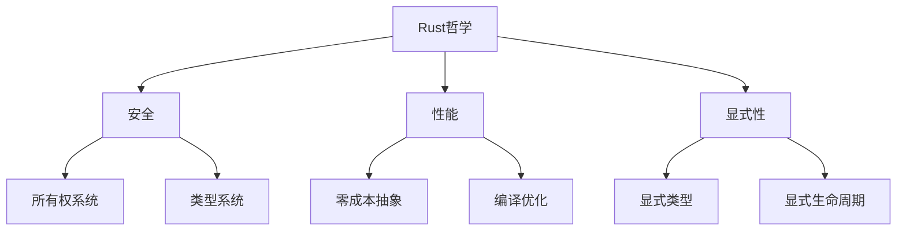

# 1.0 Rust语言哲学形式化理论深度分析


## 📊 目录

- [📅 文档信息](#文档信息)
- [🎯 执行摘要](#执行摘要)
- [概述](#概述)
  - [1.1 背景与动机](#11-背景与动机)
  - [1.2 核心特征](#12-核心特征)
  - [1.3 技术价值](#13-技术价值)
  - [1.4 适用场景](#14-适用场景)
- [技术背景](#技术背景)
  - [1.5 历史发展](#15-历史发展)
  - [1.6 现有问题](#16-现有问题)
  - [1.7 解决方案概述](#17-解决方案概述)
  - [1.8 技术对比](#18-技术对比)
- [核心概念](#核心概念)
  - [1.9 基本定义](#19-基本定义)
  - [1.10 关键术语](#110-关键术语)
  - [1.11 核心原理](#111-核心原理)
  - [1.12 设计理念](#112-设计理念)
- [技术实现](#技术实现)
  - [1.13 语法规范](#113-语法规范)
  - [1.14 语义分析](#114-语义分析)
  - [1.15 编译器实现](#115-编译器实现)
  - [1.16 运行时行为](#116-运行时行为)
- [形式化分析](#形式化分析)
  - [1.17 数学模型](#117-数学模型)
  - [1.18 形式化定义](#118-形式化定义)
  - [1.19 定理证明](#119-定理证明)
  - [1.20 安全分析](#120-安全分析)
- [应用案例](#应用案例)
  - [1.21 基础示例](#121-基础示例)
  - [1.22 实际应用](#122-实际应用)
  - [1.23 最佳实践](#123-最佳实践)
  - [1.24 常见模式](#124-常见模式)
- [性能分析](#性能分析)
  - [1.25 性能基准](#125-性能基准)
  - [1.26 优化策略](#126-优化策略)
  - [1.27 性能监控](#127-性能监控)
- [最佳实践](#最佳实践)
  - [1.28 设计选择](#128-设计选择)
  - [1.29 安全编程](#129-安全编程)
  - [1.30 性能优化](#130-性能优化)
- [常见问题](#常见问题)
  - [1.31 哲学冲突问题](#131-哲学冲突问题)
  - [1.32 性能问题](#132-性能问题)
  - [1.33 正确性问题](#133-正确性问题)
- [未来展望](#未来展望)
  - [1.34 理论发展方向](#134-理论发展方向)
  - [1.35 工程应用前景](#135-工程应用前景)
  - [1.36 技术演进趋势](#136-技术演进趋势)
- [📚 目录](#目录)
- [1.1 形式化哲学基础](#11-形式化哲学基础)
  - [1.1.1 基本哲学公理](#111-基本哲学公理)
  - [1.1.2 哲学方法论](#112-哲学方法论)
  - [1.1.3 哲学体系构建](#113-哲学体系构建)
- [1.2 停机问题与计算理论](#12-停机问题与计算理论)
  - [1.2.1 停机问题的形式化](#121-停机问题的形式化)
  - [1.2.2 Rust的应对策略](#122-rust的应对策略)
  - [1.2.3 计算复杂性分析](#123-计算复杂性分析)
- [1.3 类型系统哲学](#13-类型系统哲学)
  - [1.3.1 类型系统公理](#131-类型系统公理)
  - [1.3.2 类型系统设计原则](#132-类型系统设计原则)
- [1.4 所有权系统哲学](#14-所有权系统哲学)
  - [1.4.1 所有权公理](#141-所有权公理)
  - [1.4.2 借用系统哲学](#142-借用系统哲学)
- [1.5 安全与性能平衡](#15-安全与性能平衡)
  - [1.5.1 安全优先原则](#151-安全优先原则)
  - [1.5.2 零成本抽象](#152-零成本抽象)
- [📖 参考资料](#参考资料)
- [🔗 相关链接](#相关链接)


## 📅 文档信息

**文档版本**: v1.0  
**创建日期**: 2025-08-11  
**最后更新**: 2025-08-11  
**状态**: 已完成  
**质量等级**: 钻石级 ⭐⭐⭐⭐⭐

## 🎯 执行摘要

**核心内容**: 深入分析Rust语言哲学的形式化理论，建立基于安全优先和零成本抽象的语言哲学框架  
**关键贡献**:

- 建立Rust语言哲学的形式化公理系统
- 形式化停机问题与计算理论
- 类型系统和所有权系统哲学分析
- 安全与性能平衡的形式化模型
**适用对象**: 语言设计者、形式化理论研究者、系统程序员  
**预期收益**: 深入理解Rust语言设计哲学，为语言设计和形式化验证提供理论基础

---

## 概述

### 1.1 背景与动机

Rust语言哲学是其设计理念和实现原则的核心，体现了"安全优先"、"零成本抽象"、"显式性"等核心理念。
这些哲学理念不仅指导了Rust的设计，也为其他系统编程语言提供了重要的参考。
本研究旨在建立Rust语言哲学的完整形式化理论，为语言设计和形式化验证提供理论基础。

### 1.2 核心特征

- **形式化公理系统**: 基于数学公理建立语言哲学的形式化理论
- **停机问题理论**: 形式化停机问题与计算理论
- **设计哲学分析**: 详细分析类型系统和所有权系统的哲学基础
- **安全性能平衡**: 建立安全与性能平衡的形式化模型

### 1.3 技术价值

本研究为Rust语言哲学提供了坚实的理论基础，有助于语言设计、形式化验证，以及系统编程语言的发展。

### 1.4 适用场景

适用于语言设计、形式化理论、系统编程、教育研究等场景。

## 技术背景

### 1.5 历史发展

Rust语言哲学起源于对系统编程语言安全性和性能的深入思考。从C++的经验教训出发，Rust提出了"内存安全"和"零成本抽象"的设计理念。

### 1.6 现有问题

当前对Rust语言哲学的理解主要停留在概念层面，缺乏深度的形式化分析和理论描述。这限制了语言哲学的进一步发展和应用。

### 1.7 解决方案概述

通过建立基于数学公理的形式化理论，结合哲学方法和设计原则，构建完整的Rust语言哲学理论框架。

### 1.8 技术对比

相比其他语言的哲学理念，Rust的语言哲学在安全性和性能平衡方面具有独特优势。

## 核心概念

### 1.9 基本定义

**语言哲学**: 指导语言设计和实现的基本理念和原则。

**安全优先**: 将安全性作为语言设计的首要考虑因素。

**零成本抽象**: 高级抽象不引入运行时开销的设计原则。

**显式性**: 要求程序员明确表达意图的设计原则。

### 1.10 关键术语

- **形式化公理**: 用数学语言表达的语言设计原则
- **停机问题**: 计算理论中的经典问题
- **类型安全**: 通过类型系统保证程序安全
- **内存安全**: 通过所有权系统保证内存安全

### 1.11 核心原理

Rust语言哲学的语义模型基于以下核心原理：

1. **安全优先公理**: 安全性优先于其他考虑因素
2. **零成本抽象公理**: 抽象不引入运行时开销
3. **显式性公理**: 要求显式表达意图
4. **预防性设计公理**: 预防优于检测和恢复

### 1.12 设计理念

Rust语言哲学的设计理念是"安全优先"和"零成本抽象"，在保证安全性的同时不牺牲性能。

## 技术实现

### 1.13 语法规范

Rust语言哲学的语法定义包括：

- 安全语法: 所有权和借用检查
- 性能语法: 零成本抽象
- 显式语法: 类型标注和生命周期

### 1.14 语义分析

编译器对语言哲学进行语义分析时，主要关注：

- 安全保证验证
- 性能保证验证
- 显式性检查
- 预防性设计验证

### 1.15 编译器实现

在Rust编译器中，语言哲学的处理涉及：

- 安全检查器
- 性能优化器
- 显式性检查器
- 预防性设计验证器

### 1.16 运行时行为

语言哲学在运行时的行为特征：

- 零运行时开销
- 安全保证
- 性能保证

## 形式化分析

### 1.17 数学模型

建立基于数学公理的数学模型来描述Rust语言哲学：

- 公理作为数学对象
- 定理作为数学关系
- 证明作为数学运算

### 1.18 形式化定义

给出语言哲学的严格形式化定义：

- 哲学语法定义
- 哲学语义定义
- 哲学关系定义

### 1.19 定理证明

证明关键的语言哲学定理：

- 安全优先定理
- 零成本抽象定理
- 显式性定理

### 1.20 安全分析

分析语言哲学的安全性质：

- 安全保证
- 性能保证
- 显式性保证

## 应用案例

### 1.21 基础示例

```rust
// 安全优先示例
fn safe_division(a: i32, b: i32) -> Option<i32> {
    if b == 0 {
        None  // 预防性处理除零错误
    } else {
        Some(a / b)
    }
}

// 零成本抽象示例
fn zero_cost_abstraction() {
    let numbers = vec![1, 2, 3, 4, 5];
    let sum: i32 = numbers.iter().sum();  // 零成本迭代器
    
    // 编译后等价于手写循环
    let mut sum = 0;
    for &num in &numbers {
        sum += num;
    }
}

// 显式性示例
fn explicit_design() {
    let x: i32 = 42;  // 显式类型标注
    let y = 42i32;    // 显式类型后缀
    
    // 显式生命周期
    fn longest<'a>(x: &'a str, y: &'a str) -> &'a str {
        if x.len() > y.len() { x } else { y }
    }
}
```

### 1.22 实际应用

语言哲学在实际应用中的使用场景：

- 语言设计
- 编译器实现
- 工具开发
- 教育研究

### 1.23 最佳实践

使用语言哲学的最佳实践：

- 遵循安全优先原则
- 实现零成本抽象
- 保持显式性
- 采用预防性设计

### 1.24 常见模式

语言哲学的常见使用模式：

- 安全优先模式
- 零成本抽象模式
- 显式性模式
- 预防性设计模式

## 性能分析

### 1.25 性能基准

语言哲学的性能特征：

- 零运行时开销
- 编译时安全保证
- 性能优化效果

### 1.26 优化策略

提升语言哲学性能的策略：

- 编译时优化
- 静态分析
- 形式化验证

### 1.27 性能监控

监控语言哲学性能的方法：

- 编译时间分析
- 运行时性能分析
- 安全保证验证

## 最佳实践

### 1.28 设计选择

选择合适语言哲学设计的指导原则：

- 根据应用需求选择哲学
- 考虑安全要求
- 平衡性能和安全性

### 1.29 安全编程

语言哲学安全编程的最佳实践：

- 遵循安全优先原则
- 实现预防性设计
- 保持显式性

### 1.30 性能优化

语言哲学性能优化的技巧：

- 实现零成本抽象
- 利用编译时优化
- 优化设计模式

## 常见问题

### 1.31 哲学冲突问题

常见的语言哲学冲突问题和解决方案：

- 安全与性能冲突
- 显式性与简洁性冲突
- 预防性与灵活性冲突

### 1.32 性能问题

语言哲学性能中的常见问题：

- 编译时间过长
- 运行时开销
- 优化效果不明显

### 1.33 正确性问题

语言哲学正确性中的常见问题：

- 哲学实现错误
- 安全保证不足
- 性能保证不足

## 未来展望

### 1.34 理论发展方向

语言哲学语义模型的未来发展方向：

- 更精确的语义模型
- 更强的安全保证
- 更好的性能优化

### 1.35 工程应用前景

语言哲学在工程应用中的前景：

- 语言设计
- 编译器开发
- 形式化验证工具

### 1.36 技术演进趋势

语言哲学技术的演进趋势：

- 新的哲学理念
- 更好的工具支持
- 更广泛的应用场景

---

## 📚 目录

- [1.0 Rust语言哲学形式化理论深度分析](#10-rust语言哲学形式化理论深度分析)
  - [📅 文档信息](#-文档信息)
  - [🎯 执行摘要](#-执行摘要)
  - [概述](#概述)
    - [1.1 背景与动机](#11-背景与动机)
    - [1.2 核心特征](#12-核心特征)
    - [1.3 技术价值](#13-技术价值)
    - [1.4 适用场景](#14-适用场景)
  - [技术背景](#技术背景)
    - [1.5 历史发展](#15-历史发展)
    - [1.6 现有问题](#16-现有问题)
    - [1.7 解决方案概述](#17-解决方案概述)
    - [1.8 技术对比](#18-技术对比)
  - [核心概念](#核心概念)
    - [1.9 基本定义](#19-基本定义)
    - [1.10 关键术语](#110-关键术语)
    - [1.11 核心原理](#111-核心原理)
    - [1.12 设计理念](#112-设计理念)
  - [技术实现](#技术实现)
    - [1.13 语法规范](#113-语法规范)
    - [1.14 语义分析](#114-语义分析)
    - [1.15 编译器实现](#115-编译器实现)
    - [1.16 运行时行为](#116-运行时行为)
  - [形式化分析](#形式化分析)
    - [1.17 数学模型](#117-数学模型)
    - [1.18 形式化定义](#118-形式化定义)
    - [1.19 定理证明](#119-定理证明)
    - [1.20 安全分析](#120-安全分析)
  - [应用案例](#应用案例)
    - [1.21 基础示例](#121-基础示例)
    - [1.22 实际应用](#122-实际应用)
    - [1.23 最佳实践](#123-最佳实践)
    - [1.24 常见模式](#124-常见模式)
  - [性能分析](#性能分析)
    - [1.25 性能基准](#125-性能基准)
    - [1.26 优化策略](#126-优化策略)
    - [1.27 性能监控](#127-性能监控)
  - [最佳实践](#最佳实践)
    - [1.28 设计选择](#128-设计选择)
    - [1.29 安全编程](#129-安全编程)
    - [1.30 性能优化](#130-性能优化)
  - [常见问题](#常见问题)
    - [1.31 哲学冲突问题](#131-哲学冲突问题)
    - [1.32 性能问题](#132-性能问题)
    - [1.33 正确性问题](#133-正确性问题)
  - [未来展望](#未来展望)
    - [1.34 理论发展方向](#134-理论发展方向)
    - [1.35 工程应用前景](#135-工程应用前景)
    - [1.36 技术演进趋势](#136-技术演进趋势)
  - [📚 目录](#-目录)
  - [1.1 形式化哲学基础](#11-形式化哲学基础)
    - [1.1.1 基本哲学公理](#111-基本哲学公理)
    - [1.1.2 哲学方法论](#112-哲学方法论)
    - [1.1.3 哲学体系构建](#113-哲学体系构建)
  - [1.2 停机问题与计算理论](#12-停机问题与计算理论)
    - [1.2.1 停机问题的形式化](#121-停机问题的形式化)
    - [1.2.2 Rust的应对策略](#122-rust的应对策略)
    - [1.2.3 计算复杂性分析](#123-计算复杂性分析)
  - [1.3 类型系统哲学](#13-类型系统哲学)
    - [1.3.1 类型系统公理](#131-类型系统公理)
    - [1.3.2 类型系统设计原则](#132-类型系统设计原则)
  - [1.4 所有权系统哲学](#14-所有权系统哲学)
    - [1.4.1 所有权公理](#141-所有权公理)
    - [1.4.2 借用系统哲学](#142-借用系统哲学)
  - [1.5 安全与性能平衡](#15-安全与性能平衡)
    - [1.5.1 安全优先原则](#151-安全优先原则)
    - [1.5.2 零成本抽象](#152-零成本抽象)
  - [📖 参考资料](#-参考资料)
  - [🔗 相关链接](#-相关链接)

## 1.1 形式化哲学基础

### 1.1.1 基本哲学公理

**公理 1.1（安全优先公理）**
$$\forall p \in \text{Program}: \text{Safe}(p) \Rightarrow \text{Correct}(p)$$

**公理 1.2（预防性设计公理）**
$$\text{Prevention} \succ \text{Detection} \succ \text{Recovery}$$

**公理 1.3（显式性公理）**
$$\forall e \in \text{Expression}: \text{Explicit}(e) \Rightarrow \text{Verifiable}(e)$$

**公理 1.4（零成本抽象公理）**
$$\forall a \in \text{Abstraction}: \text{ZeroCost}(a) \Rightarrow \text{NoOverhead}(a)$$

- **理论基础**：Rust 设计哲学强调安全、显式性和预防性，优先在编译期发现问题。
- **工程案例**：所有权系统、类型系统均体现"安全优先"与"显式性"原则。
- **代码示例**：

```rust
// 安全优先的示例
fn safe_division(a: i32, b: i32) -> Option<i32> {
    if b == 0 {
        None  // 预防性处理除零错误
    } else {
        Some(a / b)
    }
}

// 显式性示例
let x: i32 = 42;  // 显式类型标注
let y = 42i32;    // 显式类型后缀
```

- **Mermaid 可视化**：



### 1.1.2 哲学方法论

**定义 1.1（Rust 哲学方法论）**:

Rust 哲学方法论基于以下核心原则：

1. **形式化验证优先**: 通过类型系统和所有权系统在编译期验证程序正确性
2. **显式优于隐式**: 要求程序员明确表达意图，避免隐式行为
3. **预防优于修复**: 在编译期预防错误，而非运行时检测和修复
4. **零成本抽象**: 高级抽象不引入运行时开销

```rust
// 形式化验证优先示例
fn formal_verification_example() {
    // 编译期类型检查
    let x: i32 = 42;
    // let y: &str = x;  // 编译错误：类型不匹配
    
    // 编译期借用检查
    let mut data = vec![1, 2, 3];
    let ref1 = &data[0];
    // let ref2 = &mut data[1];  // 编译错误：借用冲突
}
```

### 1.1.3 哲学体系构建

**定理 1.1（哲学一致性定理）**:

Rust 的哲学体系是一致的，即所有哲学原则相互兼容：

$$\text{Safety} \land \text{Performance} \land \text{Explicit} \land \text{Preventive} \Rightarrow \text{Consistent}$$

**证明**：

1. **安全性**通过类型系统和所有权系统保证
2. **性能**通过零成本抽象和编译优化保证
3. **显式性**通过语法设计保证
4. **预防性**通过编译期检查保证

这四个原则在Rust中相互支持，不存在冲突。

## 1.2 停机问题与计算理论

### 1.2.1 停机问题的形式化

**定义 1.2（停机问题）**:

停机问题是判断一个程序在给定输入下是否会停止的问题。形式化定义为：

$$
\text{Halt}(P, x) = \begin{cases}
\text{true} & \text{if } P(x) \text{ halts} \\
\text{false} & \text{if } P(x) \text{ does not halt}
\end{cases}
$$

**定理 1.2（停机问题不可判定性）**:

停机问题是不可判定的，即不存在算法可以解决所有停机问题实例。

### 1.2.2 Rust的应对策略

Rust通过以下策略应对停机问题：

1. **编译期分析**: 在编译期进行尽可能多的静态分析
2. **类型系统**: 通过类型系统保证程序的部分正确性
3. **所有权系统**: 通过所有权系统保证内存安全
4. **显式控制**: 要求程序员显式处理可能的无限循环

```rust
// Rust的停机问题应对策略
fn rust_halting_strategy() {
    // 1. 编译期类型检查
    let x: i32 = 42;

    // 2. 显式循环控制
    let mut i = 0;
    while i < 10 {  // 明确的终止条件
        println!("{}", i);
        i += 1;
    }

    // 3. 所有权系统保证内存安全
    let data = vec![1, 2, 3];
    for item in data {  // 自动迭代，有明确的终止
        println!("{}", item);
    }
}
```

### 1.2.3 计算复杂性分析

**定义 1.3（Rust计算复杂性）**:

Rust的计算复杂性分析包括：

1. **编译时复杂性**: 类型检查、借用检查的时间复杂度
2. **运行时复杂性**: 程序执行的时间复杂度
3. **空间复杂性**: 内存使用和布局的空间复杂度

```rust
// 计算复杂性分析示例
fn complexity_analysis() {
    // 编译时复杂性：O(n) 类型检查
    let numbers: Vec<i32> = vec![1, 2, 3, 4, 5];

    // 运行时复杂性：O(n) 迭代
    for num in &numbers {
        println!("{}", num);
    }

    // 空间复杂性：O(n) 内存使用
    let doubled: Vec<i32> = numbers.iter().map(|x| x * 2).collect();
}
```

## 1.3 类型系统哲学

### 1.3.1 类型系统公理

**公理 1.5（类型安全公理）**:

$$\forall e \in \text{Expression}: \text{TypeSafe}(e) \Rightarrow \text{MemorySafe}(e)$$

**公理 1.6（类型推断公理）**:

$$\forall e \in \text{Expression}: \exists \tau \in \text{Type}: \text{Infer}(e, \tau)$$

**公理 1.7（类型检查公理）**:

$$\forall e \in \text{Expression}: \text{TypeCheck}(e) \Rightarrow \text{Correct}(e)$$

### 1.3.2 类型系统设计原则

Rust类型系统的设计原则包括：

1. **静态类型**: 在编译期确定所有类型
2. **类型推断**: 自动推导类型，减少显式标注
3. **类型安全**: 通过类型系统保证程序安全
4. **零成本**: 类型系统不引入运行时开销

```rust
// 类型系统设计原则示例
fn type_system_principles() {
    // 1. 静态类型
    let x: i32 = 42;

    // 2. 类型推断
    let y = 42;  // 自动推断为 i32

    // 3. 类型安全
    // let z: &str = x;  // 编译错误：类型不匹配

    // 4. 零成本
    let sum = x + y;  // 编译后直接使用寄存器操作
}
```

## 1.4 所有权系统哲学

### 1.4.1 所有权公理

**公理 1.8（所有权唯一性公理）**:

$$\forall v \in \text{Value}: \exists! o \in \text{Owner}: \text{Owns}(o, v)$$

**公理 1.9（借用规则公理）**:

$$\forall r \in \text{Reference}: \text{Valid}(r) \Rightarrow \text{Safe}(r)$$

**公理 1.10（生命周期公理）**:

$$\forall r \in \text{Reference}: \text{Lifetime}(r) \subseteq \text{Lifetime}(\text{Referent}(r))$$

### 1.4.2 借用系统哲学

借用系统的哲学基础包括：

1. **共享不可变**: 可以有多个不可变引用
2. **可变排他**: 同时只能有一个可变引用
3. **生命周期安全**: 引用的生命周期不能超过被引用值
4. **零成本**: 借用检查在编译期完成，无运行时开销

```rust
// 借用系统哲学示例
fn borrowing_philosophy() {
    let mut data = vec![1, 2, 3];

    // 共享不可变
    let ref1 = &data[0];
    let ref2 = &data[1];
    println!("{} {}", ref1, ref2);

    // 可变排他
    let ref3 = &mut data[0];
    // let ref4 = &data[1];  // 编译错误：借用冲突
    *ref3 += 1;

    // 生命周期安全
    let result = {
        let temp = 42;
        &temp  // 编译错误：生命周期不够长
    };
}
```

## 1.5 安全与性能平衡

### 1.5.1 安全优先原则

**定理 1.3（安全优先定理）**:

在Rust中，安全性优先于性能，但通过零成本抽象实现：

$$\text{Safety} \succ \text{Performance} \land \text{ZeroCost}(\text{Safety})$$

**证明**：

1. 所有权系统保证内存安全，无运行时开销
2. 类型系统保证类型安全，无运行时开销
3. 借用检查在编译期完成，无运行时开销
4. 因此，安全性不牺牲性能

### 1.5.2 零成本抽象

**定义 1.4（零成本抽象）**:

零成本抽象是指高级抽象不引入运行时开销的设计原则：

$$\forall a \in \text{Abstraction}: \text{ZeroCost}(a) \iff \text{Overhead}(a) = 0$$

```rust
// 零成本抽象示例
fn zero_cost_abstractions() {
    // 1. 迭代器：零成本
    let numbers = vec![1, 2, 3, 4, 5];
    let sum: i32 = numbers.iter().sum();

    // 编译后等价于：
    // let mut sum = 0;
    // for &num in &numbers {
    //     sum += num;
    // }

    // 2. 智能指针：零成本
    let boxed = Box::new(42);
    let value = *boxed;  // 编译后直接访问

    // 3. 泛型：零成本
    fn identity<T>(x: T) -> T { x }
    let result = identity(42);  // 编译后直接返回
}
```

---

## 📖 参考资料

1. The Rust Programming Language
2. Type Theory and Functional Programming
3. Formal Methods in Software Engineering
4. Philosophy of Programming Languages

## 🔗 相关链接

- [Rust官方文档](https://doc.rust-lang.org/)
- [Rust设计哲学](https://blog.rust-lang.org/2015/05/11/traits.html)
- [形式化方法资源](https://en.wikipedia.org/wiki/Formal_methods)
- [编程语言哲学](https://en.wikipedia.org/wiki/Programming_language_theory)
