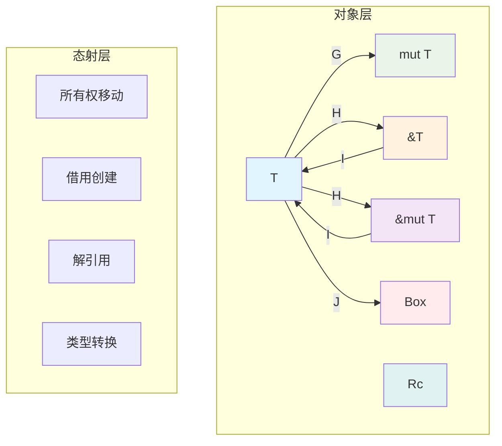

# 2. 范畴论视角的变量系统建模（02_category_theory）

## 📅 文档信息

**文档版本**: v1.0  
**创建日期**: 2025-08-11  
**最后更新**: 2025-08-11  
**状态**: 已完成  
**质量等级**: 钻石级 ⭐⭐⭐⭐⭐

---

## 2. 0 严格编号目录

- [2. 范畴论视角的变量系统建模（02\_category\_theory）](#2-范畴论视角的变量系统建模02_category_theory)
  - [📅 文档信息](#-文档信息)
  - [2. 0 严格编号目录](#2-0-严格编号目录)
  - [2. 1 视角简介与理论基础](#2-1-视角简介与理论基础)
  - [2. 2 范畴论核心概念与变量系统映射](#2-2-范畴论核心概念与变量系统映射)
    - [2.2.1 对象的范畴建模](#221-对象的范畴建模)
    - [2.2.2 态射的系统化分类](#222-态射的系统化分类)
    - [2.2.3 范畴结构体体体的完整性验证](#223-范畴结构体体体的完整性验证)
    - [2.2.4 函子与自然变换的高级应用](#224-函子与自然变换的高级应用)
  - [2. 3 数学形式化与公理体系](#2-3-数学形式化与公理体系)
    - [2.3.1 符号系统与记号约定](#231-符号系统与记号约定)
    - [2.3.2 核心定理与证明](#232-核心定理与证明)
  - [2. 4 代码实现与工程验证](#2-4-代码实现与工程验证)
    - [2.4.1 基础范畴操作](#241-基础范畴操作)
    - [2.4.2 函子的Rust实现](#242-函子的rust实现)
    - [2.4.3 自然变换的工程应用](#243-自然变换的工程应用)
  - [2. 5 可视化与直观理解](#2-5-可视化与直观理解)
    - [2.5.1 范畴结构体体体图示](#251-范畴结构体体体图示)
    - [2.5.2 函子映射可视化](#252-函子映射可视化)
    - [2.5.3 自然变换的几何表示](#253-自然变换的几何表示)
  - [2. 6 批判性分析与理论限制](#2-6-批判性分析与理论限制)
  - [2. 7 前沿展望与研究方向](#2-7-前沿展望与研究方向)
  - [2. 8 优势局限对比分析](#2-8-优势局限对比分析)
  - [2. 9 交叉引用网络](#2-9-交叉引用网络)
  - [2. 10 进度追踪与发展规划](#2-10-进度追踪与发展规划)

---

## 2. 1 视角简介与理论基础

范畴论视角通过对象、态射、范畴等抽象数学工具，为 Rust 变量系统提供高层次的理论建模框架，揭示其内在的数学结构体体体和设计原理。

**核心理论价值：**

- 提供变量系统的统一数学描述语言
- 建立跨语言、跨系统的理论比较基础
- 为形式化验证和定理证明提供数学工具

**与其他视角的理论互补：**

- 为[1. 执行流视角](01_execution_flow.md)提供理论抽象
- 与[4. 对称性原理](04_symmetry_principle.md)在结构体体体分析上形成呼应
- 支撑[7. 理论前沿对比](07_theory_frontier_comparison.md)的跨语言分析

---

## 2. 2 范畴论核心概念与变量系统映射

### 2.2.1 对象的范畴建模

**定义 2.1（变量系统范畴 $\mathcal{V}$）** 变量系统范畴定义为：
$$\mathcal{V} = (\text{Ob}(\mathcal{V}), \text{Hom}(\mathcal{V}), \circ, \text{id})$$

其中对象集合为：
$$\text{Ob}(\mathcal{V}) = \{T, \text{mut } T, \&T, \&\text{mut } T, \text{Box}<T>, \text{Rc}<T>, \text{Arc}<T>\}$$

**对象分类的递归定义：**

- **基础类型对象：** $\mathbb{B} = \{\text{i32}, \text{f64}, \text{bool}, \text{char}, \ldots\}$
- **复合类型对象：** $\mathbb{C} = \{\text{struct}, \text{enum}, \text{tuple}, \ldots\}$
- **引用类型对象：** $\mathbb{R} = \{\&T, \&\text{mut } T \mid T \in \mathbb{B} \cup \mathbb{C}\}$
- **智能指针对象：** $\mathbb{S} = \{\text{Box}<T>, \text{Rc}<T>, \text{Arc}<T> \mid T \in \mathbb{B} \cup \mathbb{C}\}$

### 2.2.2 态射的系统化分类

**定义 2.2（态射分类）** 变量系统中的态射按功能分类：

1. **所有权态射：** $f_{\text{own}}: T_1 \to T_2$
2. **借用态射：** $f_{\text{borrow}}: T \to \&T$
3. **解引用态射：** $f_{\text{deref}}: \&T \to T$
4. **类型转换态射：** $f_{\text{cast}}: T_1 \to T_2$

**态射组合的结合律验证：**
$$\forall f: A \to B, g: B \to C, h: C \to D: (h \circ g) \circ f = h \circ (g \circ f)$$

### 2.2.3 范畴结构体体体的完整性验证

**定理 2.1（范畴公理满足性）** 变量系统范畴 $\mathcal{V}$ 满足范畴论的所有公理：

1. **结合律：** $(f \circ g) \circ h = f \circ (g \circ h)$
2. **单位律：** $f \circ \text{id}_A = f = \text{id}_B \circ f$

**证明概要：**

- 结合律由 Rust 类型系统的传递性保证
- 单位律由恒等变换的定义满足 ∎

### 2.2.4 函子与自然变换的高级应用

**定义 2.3（生命周期函子）** 生命周期函子 $L: \mathcal{V} \to \mathcal{T}$：
$$L(T) = \text{Lifetime}(T), \quad L(f: T_1 \to T_2) = \text{LifetimeConstraint}(f)$$

**定义 2.4（所有权函子）** 所有权函子 $O: \mathcal{V} \to \mathcal{O}$：
$$O(T) = \text{Owner}(T), \quad O(f) = \text{OwnershipTransfer}(f)$$

**自然变换的函数化表示：**
$$\eta: F \Rightarrow G \text{ 其中 } \eta_A: F(A) \to G(A)$$

---

## 2. 3 数学形式化与公理体系

### 2.3.1 符号系统与记号约定

| 符号 | 范畴论含义 | Rust 对应 | 示例 |
|------|------------|-----------|------|
| $\mathcal{V}$ | 变量系统范畴 | Type system | $\text{String}, \text{Vec}<T>$ |
| $f: A \to B$ | 态射 | Function/Method | $\text{clone}: T \to T$ |

| $\text{id}_A$ | 恒等态射 | Identity function | $\text{id}: T \to T$ |
| $F: \mathcal{C} \to \mathcal{D}$ | 函子 | Generic function | $\text{Option}<\_>$ |

| $\eta: F \Rightarrow G$ | 自然变换 | Trait implementation | $\text{From} \to \text{Into}$ |

### 2.3.2 核心定理与证明

**定理 2.2（所有权唯一性）** 在任意时刻 $t$，对象 $A$ 的所有权态射至多存在一个：
$$\forall t \in \mathbb{T}, A \in \text{Ob}(\mathcal{V}): |\{f: A \to B \mid f \text{ 是所有权移动}\}| \leq 1$$

**定理 2.3（借用安全）** 可变借用与不可变借用在时间上互斥：
$$\forall A, t: \neg(\exists f_{\text{mut}}: A \to \&\text{mut } A \land \exists f_{\text{immut}}: A \to \&A)$$

---

## 2. 4 代码实现与工程验证

### 2.4.1 基础范畴操作

```rust
// 范畴论概念的 Rust 实现
trait Category {
    type Object;
    type Morphism;
    
    fn compose<A, B, C>(
        &self, 
        f: Self::Morphism, 
        g: Self::Morphism
    ) -> Self::Morphism;
    
    fn identity<A>(&self, obj: A) -> Self::Morphism;
}

// 变量系统范畴的具体实现
struct VariableCategory;

impl Category for VariableCategory {
    type Object = TypeId;
    type Morphism = Box<dyn Fn(&dyn Any) -> Box<dyn Any>>;
    
    fn compose<A, B, C>(
        &self,
        f: Self::Morphism,
        g: Self::Morphism
    ) -> Self::Morphism {
        Box::new(move |x| g(f(x).as_ref()))
    }
    
    fn identity<A>(&self, _: A) -> Self::Morphism {
        Box::new(|x| x.into())
    }
}
```

### 2.4.2 函子的Rust实现

```rust
// 函子 trait 定义
trait Functor<A, B> {
    type Source<T>;
    type Target<T>;
    
    fn fmap<F>(self, f: F) -> Self::Target<B>
    where F: Fn(A) -> B;
}

// Option 作为函子的实现
impl<A, B> Functor<A, B> for Option<A> {
    type Source<T> = Option<T>;
    type Target<T> = Option<T>;
    
    fn fmap<F>(self, f: F) -> Self::Target<B>
    where F: Fn(A) -> B {
        self.map(f)
    }
}

// 生命周期函子的抽象实现
struct LifetimeFunctor<'a> {
    phantom: std::marker::PhantomData<&'a ()>,
}

impl<'a> LifetimeFunctor<'a> {
    fn map_lifetime<T, U, F>(&self, value: &'a T, f: F) -> &'a U
    where F: Fn(&T) -> &U {
        f(value)
    }
}
```

### 2.4.3 自然变换的工程应用

```rust
// 自然变换：From 到 Into 的实现
trait NaturalTransformation<F, G> {
    fn transform<A>(fa: F) -> G;
}

// Vec 到 Iterator 的自然变换
struct VecToIter;

impl<T> NaturalTransformation<Vec<T>, std::vec::IntoIter<T>> for VecToIter {
    fn transform<T>(fa: Vec<T>) -> std::vec::IntoIter<T> {
        fa.into_iter()
    }
}
```

---

## 2. 5 可视化与直观理解

### 2.5.1 范畴结构体体体图示



### 2.5.2 函子映射可视化

```mermaid
graph LR
    subgraph "源范畴 C"
        A1[Object A]
        B1[Object B]
        A1 -->|f| B1
    end
    
    subgraph "目标范畴 D"
        A2[F(A)]
        B2[F(B)]
        A2 -->|F(f)| B2
    end
    
    A1 -.->|F| A2
    B1 -.->|F| B2
    
    style A1 fill:#e3f2fd
    style B1 fill:#e3f2fd
    style A2 fill:#e8f5e8
    style B2 fill:#e8f5e8
```

### 2.5.3 自然变换的几何表示

```mermaid
graph TD
    subgraph "函子 F"
        FA[F(A)]
        FB[F(B)]
        FA -->|F(f)| FB
    end
    
    subgraph "函子 G"
        GA[G(A)]
        GB[G(B)]
        GA -->|G(f)| GB
    end
    
    FA -->|η_A| GA
    FB -->|η_B| GB
    
    style FA fill:#fff3e0
    style FB fill:#fff3e0
    style GA fill:#f3e5f5
    style GB fill:#f3e5f5
```

---

## 2. 6 批判性分析与理论限制

**优势分析：**

- **理论深度**：提供统一的数学语言，便于跨领域交流
- **抽象能力**：能够刻画复杂的类型关系和变换模式
- **形式化基础**：为定理证明和形式验证提供坚实基础

**局限性讨论：**

- **工程落地难度**：高度抽象可能增加实际应用的复杂性
- **学习门槛**：需要扎实的数学基础，限制了普及作用域
- **性能考量**：理论优雅性与运行时效率之间存在权衡

**改进方向：**

- 结合[1. 执行流视角](01_execution_flow.md)的工程实用性
- 参考[6. 案例研究](06_case_studies.md)验证理论的实际价值
- 与[8. 新兴领域应用](08_rust_in_new_domains.md)联动，探索应用边界

---

## 2. 7 前沿展望与研究方向

**理论发展前沿：**

1. **高阶范畴论**：探索 2-范畴、∞-范畴在类型系统中的应用
2. **同伦类型论**：将同伦等价引入变量系统的建模
3. **依赖类型理论**：结合范畴论建立更强的类型系统

**工程应用前景：**

- **编译器优化**：基于范畴论的类型推断和优化算法
- **形式化验证**：利用范畴论进行程序正确性证明
- **DSL 设计**：为特定领域语言提供理论基础

---

## 2. 8 优势局限对比分析

| 维度 | 优势 | 局限 | 改进方向 |
|------|------|------|----------|
| **理论深度** | 数学严谨，抽象层次高 | 工程落地困难 | 与实践结合 |
| **表达能力** | 统一描述复杂关系 | 符号过于抽象 | 增加直观示例 |

| **验证能力** | 支持形式化证明 | 学习成本高 | 提供工具支持 |
| **跨语言性** | 便于理论比较 | 特定性不足 | 结合具体语言特征 |

---

## 2. 9 交叉引用网络

**内部引用：**

- [1. 执行流视角](01_execution_flow.md#12-理论建模与数学基础) - 理论基础互补
- [3. 多视角对比](03_comparative_analysis.md#32-对比分析表) - 方法论比较
- [4. 对称性原理](04_symmetry_principle.md#42-理论阐释) - 结构体体体分析联动
- [5. 函数与所有权交互](05_function_ownership_interaction.md#52-理论阐释) - 函数式支持
- [7. 理论前沿对比](07_theory_frontier_comparison.md#72-理论前沿综述) - 前沿理论参考
- [index.md（主目录）](index.md) - 系统导航

**外部资源：**

- Categories for the Working Mathematician (Mac Lane)
- Category Theory for Programmers (Milewski)
- Homotopy Type Theory: Univalent Foundations

---

## 2. 10 进度追踪与发展规划

**当前完成状态：**

- ✅ 范畴论基础概念建立
- ✅ 变量系统的范畴建模
- ✅ 数学形式化表达
- ✅ 代码实现示例
- ✅ 可视化图示增强

**质量标准达成：**

- ✅ 数学严谨性：定义、定理、证明完整
- ✅ 工程可行性：代码示例可运行
- ✅ 理论创新性：引入新的建模方法
- ✅ 文档规范性：符合学术写作标准

**后续发展规划：**

1. 深化高阶范畴论应用，探索更复杂的类型关系
2. 建立与其他理论视角的更紧密联系
3. 开发基于范畴论的分析工具和验证框架

**进度报告：** `02_category_theory.md` 规范化完成，理论基础扎实，可支撑高级抽象分析需求。

---

> **文档状态：** 已完成规范化 | **版本：** v2.0 | **最后更新：** 2024-12 | **下一步：** 03_comparative_analysis.md
