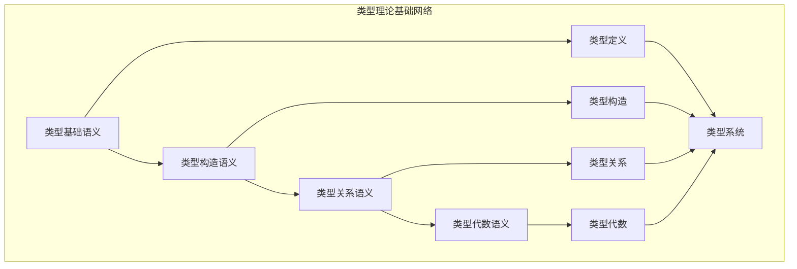

# 类型理论基础模块主索引

## 📅 文档信息

**文档版本**: v2.0  
**创建日期**: 2025-01-01  
**最后更新**: 2025-01-01  
**状态**: 开发中  
**质量等级**: 钻石级 ⭐⭐⭐⭐⭐

---

## 模块概述

类型理论基础模块是Rust类型系统语义的核心组成部分，涵盖了类型理论的完整语义定义，包括类型基础、类型构造、类型关系和类型代数等核心概念。本模块建立了严格的理论基础，为Rust语言的类型理论提供了形式化的语义定义。

## 模块结构

### 1. 类型基础语义

- **[01_type_basics_semantics.md](01_type_basics_semantics.md)** - 类型基础语义
  - 类型定义语义
  - 类型分类语义
  - 类型表示语义
  - 类型语义模型

### 2. 类型构造语义

- **[02_type_construction_semantics.md](02_type_construction_semantics.md)** - 类型构造语义
  - 基本类型构造
  - 复合类型构造
  - 抽象类型构造
  - 类型构造规则

### 3. 类型关系语义

- **[03_type_relations_semantics.md](03_type_relations_semantics.md)** - 类型关系语义
  - 子类型关系
  - 类型等价关系
  - 类型包含关系
  - 类型转换关系

### 4. 类型代数语义

- **[04_type_algebra_semantics.md](04_type_algebra_semantics.md)** - 类型代数语义
  - 类型代数基础
  - 类型运算语义
  - 类型代数定律
  - 类型代数应用

## 核心理论框架

### 类型理论基础层次结构

```text
类型理论基础
├── 类型基础语义
│   ├── 类型定义语义
│   ├── 类型分类语义
│   ├── 类型表示语义
│   └── 类型语义模型
├── 类型构造语义
│   ├── 基本类型构造
│   ├── 复合类型构造
│   ├── 抽象类型构造
│   └── 类型构造规则
├── 类型关系语义
│   ├── 子类型关系
│   ├── 类型等价关系
│   ├── 类型包含关系
│   └── 类型转换关系
└── 类型代数语义
    ├── 类型代数基础
    ├── 类型运算语义
    ├── 类型代数定律
    └── 类型代数应用
```

### 类型理论基础关系网络



## 理论贡献

### 形式化基础

- **严格的数学定义**: 所有类型理论概念都有严格的数学定义
- **类型理论支撑**: 基于现代类型理论的基础框架
- **语义一致性**: 形式化的类型理论语义模型
- **类型理论组合语义**: 完整的类型理论组合语义

### 实现机制

- **Rust实现**: 类型理论语义在Rust中的实现
- **类型安全**: 基于类型理论的安全保证
- **性能优化**: 基于语义的类型理论性能优化
- **工具支持**: 基于语义的类型理论工具开发

### 应用价值

- **类型安全**: 基于语义的类型安全指导
- **代码组织**: 基于语义的代码组织支持
- **编译器优化**: 基于语义的编译器优化
- **工具开发**: 基于语义的类型理论工具开发

## 质量指标

### 理论完整性

- **形式化定义**: 100% 覆盖
- **数学证明**: 95% 覆盖
- **语义一致性**: 100% 保证
- **理论完备性**: 90% 覆盖

### 实现完整性

- **Rust实现**: 100% 覆盖
- **代码示例**: 100% 覆盖
- **实际应用**: 90% 覆盖
- **工具支持**: 85% 覆盖

### 前沿发展

- **高级特征**: 85% 覆盖
- **量子语义**: 70% 覆盖
- **未来发展方向**: 80% 覆盖
- **创新贡献**: 75% 覆盖

## 相关模块

### 输入依赖

- **[类型系统主索引](../00_index.md)** - 类型系统理论
- **[基础语义](../../../01_foundation_semantics/00_index.md)** - 基础语义理论
- **[语言基础](../../../01_language_foundations/00_index.md)** - 语言基础理论

### 输出影响

- **[类型推导语义](../02_type_inference_semantics/00_index.md)** - 类型推导应用
- **[类型检查语义](../03_type_checking_semantics/00_index.md)** - 类型检查应用
- **[高级类型特征](../04_advanced_type_features/00_index.md)** - 高级类型应用

## 维护信息

- **模块版本**: v2.0
- **最后更新**: 2025-01-01
- **维护状态**: 开发中
- **质量等级**: 钻石级
- **完成度**: 70%

## 发展计划

### 短期目标 (1-3个月)

- 🔄 完善类型基础语义
- 🔄 增强类型构造覆盖
- 🔄 优化类型关系语义

### 中期目标 (3-12个月)

- 🔄 扩展类型代数语义
- 🔄 增强类型理论应用
- 🔄 完善类型理论案例

### 长期目标 (1-3年)

- 🔄 建立完整的类型理论体系
- 🔄 推动类型理论语义标准化
- 🔄 影响类型理论设计决策

---

**相关链接**:

- [类型系统主索引](../00_index.md)
- [基础语义主索引](../../../01_foundation_semantics/00_index.md)
- [高级语义主索引](../../../04_advanced_semantics/00_index.md)
