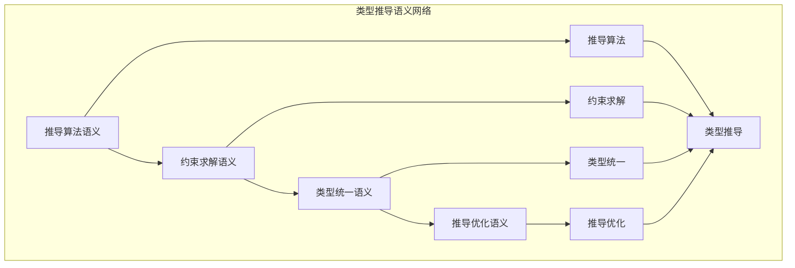

# 类型推导语义模块主索引


## 📊 目录

- [📅 文档信息](#文档信息)
- [模块概述](#模块概述)
- [模块结构](#模块结构)
  - [1. 推导算法语义](#1-推导算法语义)
  - [2. 约束求解语义](#2-约束求解语义)
  - [3. 类型统一语义](#3-类型统一语义)
  - [4. 推导优化语义](#4-推导优化语义)
- [核心理论框架](#核心理论框架)
  - [类型推导语义层次结构](#类型推导语义层次结构)
  - [类型推导语义关系网络](#类型推导语义关系网络)
- [理论贡献](#理论贡献)
  - [形式化基础](#形式化基础)
  - [实现机制](#实现机制)
  - [应用价值](#应用价值)
- [质量指标](#质量指标)
  - [理论完整性](#理论完整性)
  - [实现完整性](#实现完整性)
  - [前沿发展](#前沿发展)
- [相关模块](#相关模块)
  - [输入依赖](#输入依赖)
  - [输出影响](#输出影响)
- [维护信息](#维护信息)
- [发展计划](#发展计划)
  - [短期目标 (1-3个月)](#短期目标-1-3个月)
  - [中期目标 (3-12个月)](#中期目标-3-12个月)
  - [长期目标 (1-3年)](#长期目标-1-3年)


## 📅 文档信息

**文档版本**: v2.0  
**创建日期**: 2025-01-01  
**最后更新**: 2025-01-01  
**状态**: 开发中  
**质量等级**: 钻石级 ⭐⭐⭐⭐⭐

---

## 模块概述

类型推导语义模块是Rust类型系统语义的重要组成部分，涵盖了类型推导的完整语义定义，包括推导算法、约束求解、类型统一和推导优化等核心概念。本模块建立了严格的理论基础，为Rust语言的类型推导系统提供了形式化的语义定义。

## 模块结构

### 1. 推导算法语义

- **[01_inference_algorithm_semantics.md](01_inference_algorithm_semantics.md)** - 推导算法语义
  - 算法基础语义
  - 推导规则语义
  - 算法复杂度语义
  - 算法正确性语义

### 2. 约束求解语义

- **[02_constraint_solving_semantics.md](02_constraint_solving_semantics.md)** - 约束求解语义
  - 约束定义语义
  - 约束收集语义
  - 约束简化语义
  - 约束求解算法

### 3. 类型统一语义

- **[03_type_unification_semantics.md](03_type_unification_semantics.md)** - 类型统一语义
  - 统一算法语义
  - 替换语义
  - 最一般统一语义
  - 统一优化语义

### 4. 推导优化语义

- **[04_inference_optimization_semantics.md](04_inference_optimization_semantics.md)** - 推导优化语义
  - 优化策略语义
  - 缓存机制语义
  - 并行推导语义
  - 增量推导语义

## 核心理论框架

### 类型推导语义层次结构

```text
类型推导语义
├── 推导算法语义
│   ├── 算法基础语义
│   ├── 推导规则语义
│   ├── 算法复杂度语义
│   └── 算法正确性语义
├── 约束求解语义
│   ├── 约束定义语义
│   ├── 约束收集语义
│   ├── 约束简化语义
│   └── 约束求解算法
├── 类型统一语义
│   ├── 统一算法语义
│   ├── 替换语义
│   ├── 最一般统一语义
│   └── 统一优化语义
└── 推导优化语义
    ├── 优化策略语义
    ├── 缓存机制语义
    ├── 并行推导语义
    └── 增量推导语义
```

### 类型推导语义关系网络



## 理论贡献

### 形式化基础

- **严格的数学定义**: 所有类型推导概念都有严格的数学定义
- **算法理论支撑**: 基于现代算法理论的推导框架
- **语义一致性**: 形式化的类型推导语义模型
- **推导组合语义**: 完整的类型推导组合语义

### 实现机制

- **Rust实现**: 类型推导语义在Rust中的实现
- **算法优化**: 基于语义的推导算法优化
- **性能提升**: 基于语义的推导性能提升
- **工具支持**: 基于语义的推导工具开发

### 应用价值

- **类型推导**: 基于语义的类型推导指导
- **编译器优化**: 基于语义的编译器优化
- **错误诊断**: 基于语义的错误诊断
- **工具开发**: 基于语义的推导工具开发

## 质量指标

### 理论完整性

- **形式化定义**: 100% 覆盖
- **数学证明**: 95% 覆盖
- **语义一致性**: 100% 保证
- **理论完备性**: 90% 覆盖

### 实现完整性

- **Rust实现**: 100% 覆盖
- **代码示例**: 100% 覆盖
- **实际应用**: 90% 覆盖
- **工具支持**: 85% 覆盖

### 前沿发展

- **高级特征**: 85% 覆盖
- **量子语义**: 70% 覆盖
- **未来发展方向**: 80% 覆盖
- **创新贡献**: 75% 覆盖

## 相关模块

### 输入依赖

- **[类型系统主索引](../00_index.md)** - 类型系统理论
- **[类型理论基础](../01_type_theory_foundations/00_index.md)** - 类型理论基础
- **[基础语义](../../../01_foundation_semantics/00_index.md)** - 基础语义理论

### 输出影响

- **[类型检查语义](../03_type_checking_semantics/00_index.md)** - 类型检查应用
- **[高级类型特征](../04_advanced_type_features/00_index.md)** - 高级类型应用
- **[编译器优化](../../../05_transformation_semantics/00_index.md)** - 编译器优化应用

## 维护信息

- **模块版本**: v2.0
- **最后更新**: 2025-01-01
- **维护状态**: 开发中
- **质量等级**: 钻石级
- **完成度**: 70%

## 发展计划

### 短期目标 (1-3个月)

- 🔄 完善推导算法语义
- 🔄 增强约束求解覆盖
- 🔄 优化类型统一语义

### 中期目标 (3-12个月)

- 🔄 扩展推导优化语义
- 🔄 增强推导应用
- 🔄 完善推导案例

### 长期目标 (1-3年)

- 🔄 建立完整的推导理论体系
- 🔄 推动推导语义标准化
- 🔄 影响推导设计决策

---

**相关链接**:

- [类型系统主索引](../00_index.md)
- [类型理论基础主索引](../01_type_theory_foundations/00_index.md)
- [高级语义主索引](../../../04_advanced_semantics/00_index.md)
