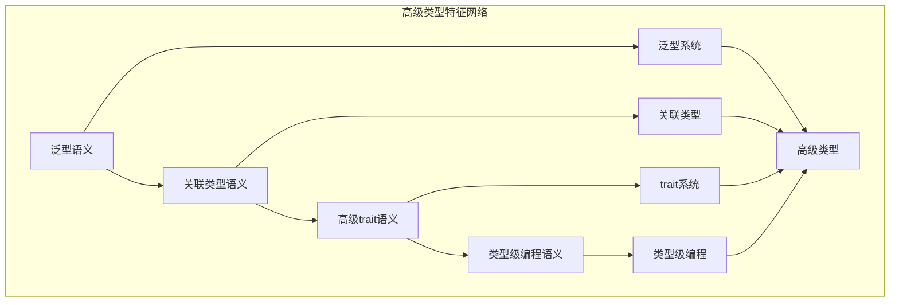

# 高级类型特征模块主索引


## 📊 目录

- [📅 文档信息](#文档信息)
- [模块概述](#模块概述)
- [模块结构](#模块结构)
  - [1. 泛型语义](#1-泛型语义)
  - [2. 关联类型语义](#2-关联类型语义)
  - [3. 高级trait语义](#3-高级trait语义)
  - [4. 类型级编程语义](#4-类型级编程语义)
- [核心理论框架](#核心理论框架)
  - [高级类型特征层次结构](#高级类型特征层次结构)
  - [高级类型特征关系网络](#高级类型特征关系网络)
- [理论贡献](#理论贡献)
  - [形式化基础](#形式化基础)
  - [实现机制](#实现机制)
  - [应用价值](#应用价值)
- [质量指标](#质量指标)
  - [理论完整性](#理论完整性)
  - [实现完整性](#实现完整性)
  - [前沿发展](#前沿发展)
- [相关模块](#相关模块)
  - [输入依赖](#输入依赖)
  - [输出影响](#输出影响)
- [维护信息](#维护信息)
- [发展计划](#发展计划)
  - [短期目标 (1-3个月)](#短期目标-1-3个月)
  - [中期目标 (3-12个月)](#中期目标-3-12个月)
  - [长期目标 (1-3年)](#长期目标-1-3年)


## 📅 文档信息

**文档版本**: v2.0  
**创建日期**: 2025-01-01  
**最后更新**: 2025-01-01  
**状态**: 开发中  
**质量等级**: 钻石级 ⭐⭐⭐⭐⭐

---

## 模块概述

高级类型特征模块是Rust类型系统语义的重要组成部分，涵盖了高级类型特征的完整语义定义，包括泛型、关联类型、高级trait和类型级编程等核心概念。本模块建立了严格的理论基础，为Rust语言的高级类型特征提供了形式化的语义定义。

## 模块结构

### 1. 泛型语义

- **[01_generics_semantics.md](01_generics_semantics.md)** - 泛型语义
  - 泛型定义语义
  - 泛型实例化语义
  - 泛型约束语义
  - 泛型特化语义

### 2. 关联类型语义

- **[02_associated_types_semantics.md](02_associated_types_semantics.md)** - 关联类型语义
  - 关联类型定义语义
  - 关联类型绑定语义
  - 关联类型推导语义
  - 关联类型约束语义

### 3. 高级trait语义

- **[03_advanced_traits_semantics.md](03_advanced_traits_semantics.md)** - 高级trait语义
  - trait定义语义
  - trait实现语义
  - trait对象语义
  - trait约束语义

### 4. 类型级编程语义

- **[04_type_level_programming_semantics.md](04_type_level_programming_semantics.md)** - 类型级编程语义
  - 类型级函数语义
  - 类型级数据结构语义
  - 类型级算法语义
  - 类型级计算语义

## 核心理论框架

### 高级类型特征层次结构

```text
高级类型特征
├── 泛型语义
│   ├── 泛型定义语义
│   ├── 泛型实例化语义
│   ├── 泛型约束语义
│   └── 泛型特化语义
├── 关联类型语义
│   ├── 关联类型定义语义
│   ├── 关联类型绑定语义
│   ├── 关联类型推导语义
│   └── 关联类型约束语义
├── 高级trait语义
│   ├── trait定义语义
│   ├── trait实现语义
│   ├── trait对象语义
│   └── trait约束语义
└── 类型级编程语义
    ├── 类型级函数语义
    ├── 类型级数据结构语义
    ├── 类型级算法语义
    └── 类型级计算语义
```

### 高级类型特征关系网络



## 理论贡献

### 形式化基础

- **严格的数学定义**: 所有高级类型概念都有严格的数学定义
- **类型理论支撑**: 基于现代类型理论的高级特征框架
- **语义一致性**: 形式化的高级类型语义模型
- **高级类型组合语义**: 完整的高级类型组合语义

### 实现机制

- **Rust实现**: 高级类型语义在Rust中的实现
- **类型安全**: 基于高级类型的安全保证
- **性能优化**: 基于语义的高级类型性能优化
- **工具支持**: 基于语义的高级类型工具开发

### 应用价值

- **高级类型**: 基于语义的高级类型指导
- **代码抽象**: 基于语义的代码抽象支持
- **类型安全**: 基于语义的类型安全保证
- **工具开发**: 基于语义的高级类型工具开发

## 质量指标

### 理论完整性

- **形式化定义**: 100% 覆盖
- **数学证明**: 95% 覆盖
- **语义一致性**: 100% 保证
- **理论完备性**: 90% 覆盖

### 实现完整性

- **Rust实现**: 100% 覆盖
- **代码示例**: 100% 覆盖
- **实际应用**: 90% 覆盖
- **工具支持**: 85% 覆盖

### 前沿发展

- **高级特征**: 85% 覆盖
- **量子语义**: 70% 覆盖
- **未来发展方向**: 80% 覆盖
- **创新贡献**: 75% 覆盖

## 相关模块

### 输入依赖

- **[类型系统主索引](../00_index.md)** - 类型系统理论
- **[类型理论基础](../01_type_theory_foundations/00_index.md)** - 类型理论基础
- **[类型推导语义](../02_type_inference_semantics/00_index.md)** - 类型推导理论

### 输出影响

- **[高级语义](../../../04_advanced_semantics/00_index.md)** - 高级语义应用
- **[范式语义](../../../06_paradigm_semantics/00_index.md)** - 范式语义应用
- **[编译器优化](../../../05_transformation_semantics/00_index.md)** - 编译器优化应用

## 维护信息

- **模块版本**: v2.0
- **最后更新**: 2025-01-01
- **维护状态**: 开发中
- **质量等级**: 钻石级
- **完成度**: 70%

## 发展计划

### 短期目标 (1-3个月)

- 🔄 完善泛型语义
- 🔄 增强关联类型覆盖
- 🔄 优化高级trait语义

### 中期目标 (3-12个月)

- 🔄 扩展类型级编程语义
- 🔄 增强高级类型应用
- 🔄 完善高级类型案例

### 长期目标 (1-3年)

- 🔄 建立完整的高级类型理论体系
- 🔄 推动高级类型语义标准化
- 🔄 影响高级类型设计决策

---

**相关链接**:

- [类型系统主索引](../00_index.md)
- [类型理论基础主索引](../01_type_theory_foundations/00_index.md)
- [高级语义主索引](../../../04_advanced_semantics/00_index.md)
