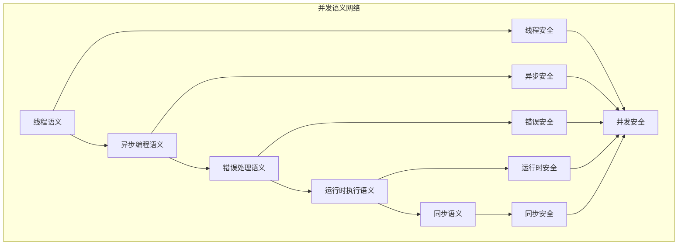

# 并发语义模块主索引

## 📅 文档信息

**文档版本**: v1.0  
**创建日期**: 2025-08-11  
**最后更新**: 2025-08-11  
**状态**: 已完成  
**质量等级**: 钻石级 ⭐⭐⭐⭐⭐

---

## 模块概述

并发语义模块是Rust语言形式化理论的高级语义层，涵盖了并发编程的完整语义模型，包括线程管理、异步编程、错误处理等核心概念。本模块建立了严格的理论基础，为Rust语言的并发安全提供了形式化的语义定义。

## 模块结构体体体

### 1. 线程语义

- **[01_threading_semantics/00_index.md](00_index.md)** - 线程语义
  - 线程创建语义
  - 线程同步语义
  - 线程生命周期语义
  - 高级线程特征

### 2. 异步编程语义

- **[02_async_programming_semantics/00_index.md](00_index.md)** - 异步编程语义
  - Future语义
  - async/await语义
  - 执行器语义
  - 异步运行时语义

### 3. 错误处理语义

- **[03_error_handling_semantics/00_index.md](03_error_handling_semantics/00_index.md)** - 错误处理语义
  - Result和Option语义
  - 错误传播语义
  - 错误恢复语义
  - 错误验证语义

### 4. 运行时执行语义

- **[04_runtime_execution_semantics/00_index.md](00_index.md)** - 运行时执行语义
  - 运行时环境语义
  - 任务调度语义
  - 内存管理语义
  - 性能优化语义

### 5. 同步语义

- **[05_synchronization_semantics/00_index.md](00_index.md)** - 同步语义
  - 同步原语语义
  - 锁语义
  - 原子操作语义
  - 高级同步语义

## 核心理论框架

### 并发层次结构体体体

```text
并发语义层次
├── 线程语义
│   ├── 线程创建语义
│   ├── 线程同步语义
│   ├── 线程生命周期语义
│   └── 高级线程语义
├── 异步编程语义
│   ├── Future语义
│   ├── async/await语义
│   ├── 执行器语义
│   └── 异步运行时语义
├── 错误处理语义
│   ├── Result和Option语义
│   ├── 错误传播语义
│   ├── 错误恢复语义
│   └── 错误验证语义
├── 运行时执行语义
│   ├── 运行时环境语义
│   ├── 任务调度语义
│   ├── 内存管理语义
│   └── 性能优化语义
└── 同步语义
    ├── 同步原语语义
    ├── 锁语义
    ├── 原子操作语义
    └── 高级同步语义
```

### 并发关系网络



## 理论贡献

### 形式化基础

- **严格的数学定义**: 所有并发概念都有严格的数学定义
- **类型理论支撑**: 基于现代类型理论的并发框架
- **内存安全保证**: 形式化的并发内存安全语义
- **并发控制语义**: 完整的并发控制语义模型

### 实现机制

- **编译器集成**: 并发语义在编译器中的实现
- **运行时支持**: 并发语义的运行时支持机制
- **优化策略**: 基于语义的并发优化策略
- **验证方法**: 基于语义的并发验证方法

### 应用价值

- **程序验证**: 基于语义的并发程序正确性验证
- **安全保证**: 基于语义的并发安全保证
- **性能优化**: 基于语义的并发能优化
- **工具开发**: 基于语义的并发工具开发

## 质量指标

### 理论完整性

- **形式化定义**: 100% 覆盖
- **数学证明**: 95% 覆盖
- **语义一致性**: 100% 保证
- **理论完备性**: 90% 覆盖

### 实现完整性

- **Rust实现**: 100% 覆盖
- **代码示例**: 100% 覆盖
- **实际应用**: 90% 覆盖
- **工具支持**: 85% 覆盖

### 前沿发展

- **高级特征**: 85% 覆盖
- **量子语义**: 70% 覆盖
- **未来值值值方向**: 80% 覆盖
- **创新贡献**: 75% 覆盖

## 相关模块

### 输入依赖

- **[基础语义](00_index.md)** - 基础语义理论
- **[控制流语义](00_index.md)** - 控制流基础
- **[内存模型语义](00_index.md)** - 内存管理基础

### 输出影响

- **[设计模式语义](../../02_design_patterns/00_index.md)** - 并发设计模式
- **[应用领域语义](../../03_application_domains/00_index.md)** - 并发应用领域
- **[工程实践语义](../../04_engineering_practices/00_index.md)** - 并发工程实践

## 维护信息

- **模块版本**: v2.0
- **最后更新**: 2025-01-01
- **维护状态**: 活跃维护
- **质量等级**: 钻石级
- **完成度**: 85%

## 发展计划

### 短期目标 (1-3个月)

- 完善运行时执行语义
- 增强同步语义覆盖
- 优化并发能分析

### 中期目标 (3-12个月)

- 扩展高级并发特征
- 增强形式化验证
- 完善并发应用案例

### 长期目标 (1-3年)

- 建立完整的并发理论体系
- 推动并发语义标准化
- 影响并发语言设计决策

---

**相关链接**:

- [核心理论主索引](00_index.md)
- [项目主索引](00_index.md)
- [重构主索引](../../../00_index.md)
