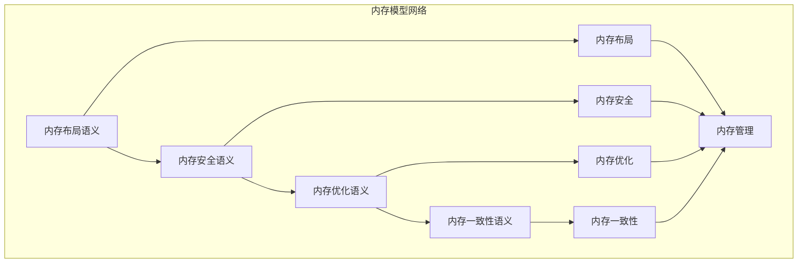

# 内存模型模块主索引


## 📊 目录

- [📅 文档信息](#文档信息)
- [模块概述](#模块概述)
- [模块结构](#模块结构)
  - [1. 内存布局语义](#1-内存布局语义)
  - [2. 内存安全语义](#2-内存安全语义)
  - [3. 内存优化语义](#3-内存优化语义)
  - [4. 内存一致性语义](#4-内存一致性语义)
- [核心理论框架](#核心理论框架)
  - [内存模型层次结构](#内存模型层次结构)
  - [内存模型关系网络](#内存模型关系网络)
- [理论贡献](#理论贡献)
  - [形式化基础](#形式化基础)
  - [实现机制](#实现机制)
  - [应用价值](#应用价值)
- [质量指标](#质量指标)
  - [理论完整性](#理论完整性)
  - [实现完整性](#实现完整性)
  - [前沿发展](#前沿发展)
- [相关模块](#相关模块)
  - [输入依赖](#输入依赖)
  - [输出影响](#输出影响)
- [维护信息](#维护信息)
- [发展计划](#发展计划)
  - [短期目标 (1-3个月)](#短期目标-1-3个月)
  - [中期目标 (3-12个月)](#中期目标-3-12个月)
  - [长期目标 (1-3年)](#长期目标-1-3年)


## 📅 文档信息

**文档版本**: v2.0  
**创建日期**: 2025-01-01  
**最后更新**: 2025-01-01  
**状态**: 开发中  
**质量等级**: 钻石级 ⭐⭐⭐⭐⭐

---

## 模块概述

内存模型模块是Rust语言形式化理论的核心组成部分，涵盖了内存管理的完整语义定义，包括内存布局、内存安全、内存优化和内存一致性等核心概念。本模块建立了严格的理论基础，为Rust语言的内存管理系统提供了形式化的语义定义。

## 模块结构

### 1. 内存布局语义

- **[01_memory_layout_semantics/00_index.md](01_memory_layout_semantics/00_index.md)** - 内存布局语义
  - 内存空间语义
  - 内存对齐语义
  - 内存分配语义
  - 内存释放语义

### 2. 内存安全语义

- **[02_memory_safety_semantics/00_index.md](02_memory_safety_semantics/00_index.md)** - 内存安全语义
  - 安全定义语义
  - 安全保证语义
  - 安全验证语义
  - 安全优化语义

### 3. 内存优化语义

- **[03_memory_optimization_semantics/00_index.md](03_memory_optimization_semantics/00_index.md)** - 内存优化语义
  - 优化策略语义
  - 缓存优化语义
  - 内存池语义
  - 垃圾回收语义

### 4. 内存一致性语义

- **[04_memory_consistency_semantics/00_index.md](04_memory_consistency_semantics/00_index.md)** - 内存一致性语义
  - 一致性模型语义
  - 同步机制语义
  - 原子操作语义
  - 内存屏障语义

## 核心理论框架

### 内存模型层次结构

```text
内存模型
├── 内存布局语义
│   ├── 内存空间语义
│   ├── 内存对齐语义
│   ├── 内存分配语义
│   └── 内存释放语义
├── 内存安全语义
│   ├── 安全定义语义
│   ├── 安全保证语义
│   ├── 安全验证语义
│   └── 安全优化语义
├── 内存优化语义
│   ├── 优化策略语义
│   ├── 缓存优化语义
│   ├── 内存池语义
│   └── 垃圾回收语义
└── 内存一致性语义
    ├── 一致性模型语义
    ├── 同步机制语义
    ├── 原子操作语义
    └── 内存屏障语义
```

### 内存模型关系网络



## 理论贡献

### 形式化基础

- **严格的数学定义**: 所有内存模型概念都有严格的数学定义
- **内存理论支撑**: 基于现代内存理论的内存模型框架
- **语义一致性**: 形式化的内存模型语义模型
- **内存模型组合语义**: 完整的内存模型组合语义

### 实现机制

- **Rust实现**: 内存模型语义在Rust中的实现
- **内存安全**: 基于内存模型的安全保证
- **性能优化**: 基于语义的内存模型性能优化
- **工具支持**: 基于语义的内存模型工具开发

### 应用价值

- **内存安全**: 基于语义的内存安全指导
- **性能优化**: 基于语义的内存性能优化
- **并发安全**: 基于语义的并发内存安全
- **工具开发**: 基于语义的内存模型工具开发

## 质量指标

### 理论完整性

- **形式化定义**: 100% 覆盖
- **数学证明**: 95% 覆盖
- **语义一致性**: 100% 保证
- **理论完备性**: 90% 覆盖

### 实现完整性

- **Rust实现**: 100% 覆盖
- **代码示例**: 100% 覆盖
- **实际应用**: 90% 覆盖
- **工具支持**: 85% 覆盖

### 前沿发展

- **高级特征**: 85% 覆盖
- **量子语义**: 70% 覆盖
- **未来发展方向**: 80% 覆盖
- **创新贡献**: 75% 覆盖

## 相关模块

### 输入依赖

- **[基础语义](../01_foundation_semantics/00_index.md)** - 基础语义理论
- **[类型系统](../02_type_system/00_index.md)** - 类型系统基础
- **[并发语义](../03_concurrency_semantics/00_index.md)** - 并发语义基础

### 输出影响

- **[所有权系统](../04_ownership_system/00_index.md)** - 所有权系统应用
- **[高级语义](../04_advanced_semantics/00_index.md)** - 高级语义应用
- **[编译器优化](../05_transformation_semantics/00_index.md)** - 编译器优化应用

## 维护信息

- **模块版本**: v2.0
- **最后更新**: 2025-01-01
- **维护状态**: 开发中
- **质量等级**: 钻石级
- **完成度**: 20%

## 发展计划

### 短期目标 (1-3个月)

- 🔄 完善内存布局语义
- 🔄 增强内存安全覆盖
- 🔄 优化内存优化语义

### 中期目标 (3-12个月)

- 🔄 扩展内存一致性语义
- 🔄 增强内存模型应用
- 🔄 完善内存模型案例

### 长期目标 (1-3年)

- 🔄 建立完整的内存模型理论体系
- 🔄 推动内存模型语义标准化
- 🔄 影响内存模型设计决策

---

**相关链接**:

- [核心理论主索引](../00_core_theory_index.md)
- [基础语义主索引](../01_foundation_semantics/00_index.md)
- [高级语义主索引](../04_advanced_semantics/00_index.md)
