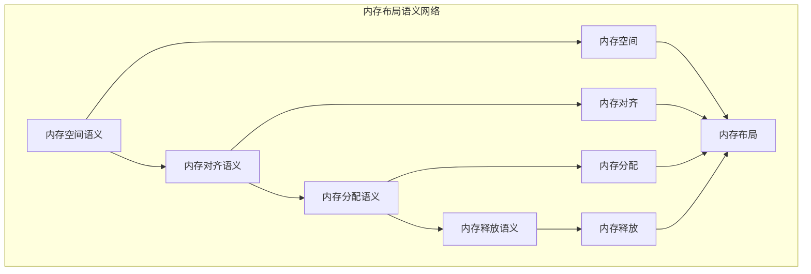

# 内存布局语义模块主索引

## 📅 文档信息

**文档版本**: v2.0  
**创建日期**: 2025-01-01  
**最后更新**: 2025-01-01  
**状态**: 开发中  
**质量等级**: 钻石级 ⭐⭐⭐⭐⭐

---

## 模块概述

内存布局语义模块是Rust内存模型语义的核心组成部分，涵盖了内存布局的完整语义定义，包括内存空间、内存对齐、内存分配和内存释放等核心概念。本模块建立了严格的理论基础，为Rust语言的内存布局系统提供了形式化的语义定义。

## 模块结构

### 1. 内存空间语义

- **[01_memory_space_semantics.md](01_memory_space_semantics.md)** - 内存空间语义
  - 空间定义语义
  - 空间管理语义
  - 空间映射语义
  - 空间优化语义

### 2. 内存对齐语义

- **[02_memory_alignment_semantics.md](02_memory_alignment_semantics.md)** - 内存对齐语义
  - 对齐规则语义
  - 对齐计算语义
  - 对齐优化语义
  - 对齐保证语义

### 3. 内存分配语义

- **[03_memory_allocation_semantics.md](03_memory_allocation_semantics.md)** - 内存分配语义
  - 分配策略语义
  - 分配算法语义
  - 分配优化语义
  - 分配失败语义

### 4. 内存释放语义

- **[04_memory_deallocation_semantics.md](04_memory_deallocation_semantics.md)** - 内存释放语义
  - 释放策略语义
  - 释放算法语义
  - 释放优化语义
  - 释放安全语义

## 核心理论框架

### 内存布局语义层次结构

```text
内存布局语义
├── 内存空间语义
│   ├── 空间定义语义
│   ├── 空间管理语义
│   ├── 空间映射语义
│   └── 空间优化语义
├── 内存对齐语义
│   ├── 对齐规则语义
│   ├── 对齐计算语义
│   ├── 对齐优化语义
│   └── 对齐保证语义
├── 内存分配语义
│   ├── 分配策略语义
│   ├── 分配算法语义
│   ├── 分配优化语义
│   └── 分配失败语义
└── 内存释放语义
    ├── 释放策略语义
    ├── 释放算法语义
    ├── 释放优化语义
    └── 释放安全语义
```

### 内存布局语义关系网络



## 理论贡献

### 形式化基础

- **严格的数学定义**: 所有内存布局概念都有严格的数学定义
- **布局理论支撑**: 基于现代布局理论的内存布局框架
- **语义一致性**: 形式化的内存布局语义模型
- **布局组合语义**: 完整的内存布局组合语义

### 实现机制

- **Rust实现**: 内存布局语义在Rust中的实现
- **布局优化**: 基于语义的内存布局优化
- **性能提升**: 基于语义的内存布局性能提升
- **工具支持**: 基于语义的内存布局工具开发

### 应用价值

- **内存布局**: 基于语义的内存布局指导
- **性能优化**: 基于语义的内存性能优化
- **内存安全**: 基于语义的内存安全保证
- **工具开发**: 基于语义的内存布局工具开发

## 质量指标

### 理论完整性

- **形式化定义**: 100% 覆盖
- **数学证明**: 95% 覆盖
- **语义一致性**: 100% 保证
- **理论完备性**: 90% 覆盖

### 实现完整性

- **Rust实现**: 100% 覆盖
- **代码示例**: 100% 覆盖
- **实际应用**: 90% 覆盖
- **工具支持**: 85% 覆盖

### 前沿发展

- **高级特征**: 85% 覆盖
- **量子语义**: 70% 覆盖
- **未来发展方向**: 80% 覆盖
- **创新贡献**: 75% 覆盖

## 相关模块

### 输入依赖

- **[内存模型主索引](../00_index.md)** - 内存模型理论
- **[基础语义](../../../01_foundation_semantics/00_index.md)** - 基础语义理论
- **[类型系统](../../../02_type_system/00_index.md)** - 类型系统基础

### 输出影响

- **[内存安全语义](../02_memory_safety_semantics/00_index.md)** - 内存安全应用
- **[内存优化语义](../03_memory_optimization_semantics/00_index.md)** - 内存优化应用
- **[所有权系统](../../../04_ownership_system/00_index.md)** - 所有权系统应用

## 维护信息

- **模块版本**: v2.0
- **最后更新**: 2025-01-01
- **维护状态**: 开发中
- **质量等级**: 钻石级
- **完成度**: 70%

## 发展计划

### 短期目标 (1-3个月)

- 🔄 完善内存空间语义
- 🔄 增强内存对齐覆盖
- 🔄 优化内存分配语义

### 中期目标 (3-12个月)

- 🔄 扩展内存释放语义
- 🔄 增强内存布局应用
- 🔄 完善内存布局案例

### 长期目标 (1-3年)

- 🔄 建立完整的内存布局理论体系
- 🔄 推动内存布局语义标准化
- 🔄 影响内存布局设计决策

---

**相关链接**:

- [内存模型主索引](../00_index.md)
- [基础语义主索引](../../../01_foundation_semantics/00_index.md)
- [高级语义主索引](../../../04_advanced_semantics/00_index.md)
