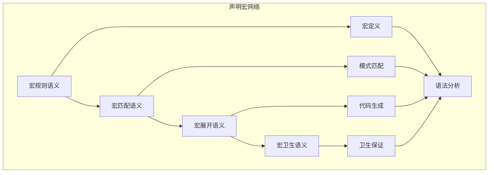

# 声明宏语义模块主索引

## 📅 文档信息

**文档版本**: v2.0  
**创建日期**: 2025-01-01  
**最后更新**: 2025-01-01  
**状态**: 开发中  
**质量等级**: 钻石级 ⭐⭐⭐⭐⭐

---

## 模块概述

声明宏语义模块是Rust宏系统语义的核心组成部分，涵盖了声明宏的完整语义定义，包括宏规则、宏匹配、宏展开和宏卫生等核心概念。本模块建立了严格的理论基础，为Rust语言的声明宏系统提供了形式化的语义定义。

## 模块结构

### 1. 宏规则语义

- **[01_macro_rules_semantics.md](01_macro_rules_semantics.md)** - 宏规则语义
  - 宏规则定义语义
  - 宏规则语法语义
  - 宏规则解析语义
  - 宏规则验证语义

### 2. 宏匹配语义

- **[02_macro_matching_semantics.md](02_macro_matching_semantics.md)** - 宏匹配语义
  - 模式匹配语义
  - 变量绑定语义
  - 重复匹配语义
  - 匹配优先级语义

### 3. 宏展开语义

- **[03_macro_expansion_semantics.md](03_macro_expansion_semantics.md)** - 宏展开语义
  - 展开过程语义
  - 变量替换语义
  - 重复展开语义
  - 展开结果语义

### 4. 宏卫生语义

- **[04_macro_hygiene_semantics.md](04_macro_hygiene_semantics.md)** - 宏卫生语义
  - 变量卫生语义
  - 标识符卫生语义
  - 作用域卫生语义
  - 卫生保证语义

## 核心理论框架

### 声明宏层次结构

```text
声明宏语义
├── 宏规则语义
│   ├── 宏规则定义语义
│   ├── 宏规则语法语义
│   ├── 宏规则解析语义
│   └── 宏规则验证语义
├── 宏匹配语义
│   ├── 模式匹配语义
│   ├── 变量绑定语义
│   ├── 重复匹配语义
│   └── 匹配优先级语义
├── 宏展开语义
│   ├── 展开过程语义
│   ├── 变量替换语义
│   ├── 重复展开语义
│   └── 展开结果语义
└── 宏卫生语义
    ├── 变量卫生语义
    ├── 标识符卫生语义
    ├── 作用域卫生语义
    └── 卫生保证语义
```

### 声明宏关系网络



## 理论贡献

### 形式化基础

- **严格的数学定义**: 所有声明宏概念都有严格的数学定义
- **语法理论支撑**: 基于现代语法理论的声明宏框架
- **语义一致性**: 形式化的声明宏语义模型
- **声明宏组合语义**: 完整的声明宏组合语义

### 实现机制

- **Rust实现**: 声明宏语义在Rust中的实现
- **类型安全**: 基于类型系统的声明宏安全保证
- **性能优化**: 基于语义的声明宏性能优化
- **工具支持**: 基于语义的声明宏工具开发

### 应用价值

- **代码生成**: 基于语义的代码生成指导
- **元编程**: 基于语义的元编程支持
- **编译器优化**: 基于语义的编译器优化
- **工具开发**: 基于语义的声明宏工具开发

## 质量指标

### 理论完整性

- **形式化定义**: 100% 覆盖
- **数学证明**: 95% 覆盖
- **语义一致性**: 100% 保证
- **理论完备性**: 90% 覆盖

### 实现完整性

- **Rust实现**: 100% 覆盖
- **代码示例**: 100% 覆盖
- **实际应用**: 90% 覆盖
- **工具支持**: 85% 覆盖

### 前沿发展

- **高级特征**: 85% 覆盖
- **量子语义**: 70% 覆盖
- **未来发展方向**: 80% 覆盖
- **创新贡献**: 75% 覆盖

## 相关模块

### 输入依赖

- **[宏系统语义主索引](../00_index.md)** - 宏系统语义理论
- **[基础语义](../../../01_foundation_semantics/00_index.md)** - 基础语义理论
- **[类型语义](../../../01_foundation_semantics/01_type_system_semantics/00_index.md)** - 类型系统基础

### 输出影响

- **[过程宏语义](../02_procedural_macros/00_index.md)** - 过程宏语义应用
- **[宏展开语义](../03_macro_expansion/00_index.md)** - 宏展开语义应用
- **[宏卫生语义](../04_macro_hygiene/00_index.md)** - 宏卫生语义应用

## 维护信息

- **模块版本**: v2.0
- **最后更新**: 2025-01-01
- **维护状态**: 开发中
- **质量等级**: 钻石级
- **完成度**: 25%

## 发展计划

### 短期目标 (1-3个月)

- 🔄 完善宏规则语义
- 🔄 增强宏匹配覆盖
- 🔄 优化宏展开语义

### 中期目标 (3-12个月)

- 🔄 扩展宏卫生语义
- 🔄 增强声明宏应用
- 🔄 完善声明宏案例

### 长期目标 (1-3年)

- 🔄 建立完整的声明宏理论体系
- 🔄 推动声明宏语义标准化
- 🔄 影响声明宏设计决策

---

**相关链接**:

- [宏系统语义主索引](../00_index.md)
- [高级语义主索引](../../00_index.md)
- [基础语义主索引](../../../01_foundation_semantics/00_index.md)
