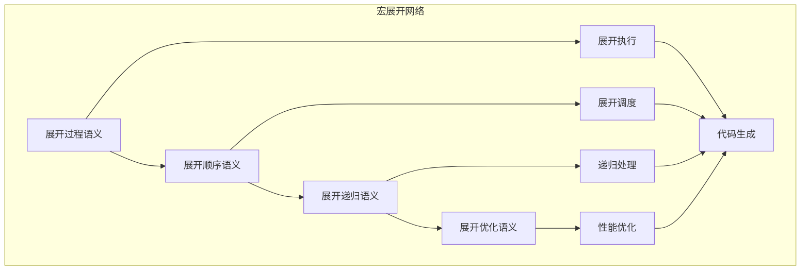

# 宏展开语义模块主索引


## 📊 目录

- [📅 文档信息](#文档信息)
- [模块概述](#模块概述)
- [模块结构](#模块结构)
  - [1. 展开过程语义](#1-展开过程语义)
- [核心理论框架](#核心理论框架)
  - [宏展开层次结构](#宏展开层次结构)
- [相关模块](#相关模块)
  - [输入依赖](#输入依赖)
  - [输出影响](#输出影响)
- [维护信息](#维护信息)
- [📅 文档信息1](#文档信息1)
- [模块概述1](#模块概述1)
- [模块结构1](#模块结构1)
  - [1. 展开过程语义1](#1-展开过程语义1)
  - [2. 展开顺序语义](#2-展开顺序语义)
  - [3. 展开递归语义](#3-展开递归语义)
  - [4. 展开优化语义](#4-展开优化语义)
- [核心理论框架1](#核心理论框架1)
  - [宏展开层次结构1](#宏展开层次结构1)
  - [宏展开关系网络](#宏展开关系网络)
- [理论贡献](#理论贡献)
  - [形式化基础](#形式化基础)
  - [实现机制](#实现机制)
  - [应用价值](#应用价值)
- [质量指标](#质量指标)
  - [理论完整性](#理论完整性)
  - [实现完整性](#实现完整性)
  - [前沿发展](#前沿发展)
- [相关模块1](#相关模块1)
  - [输入依赖1](#输入依赖1)
  - [输出影响1](#输出影响1)
- [维护信息1](#维护信息1)
- [发展计划](#发展计划)
  - [短期目标 (1-3个月)](#短期目标-1-3个月)
  - [中期目标 (3-12个月)](#中期目标-3-12个月)
  - [长期目标 (1-3年)](#长期目标-1-3年)


## 📅 文档信息

**文档版本**: v2.0  
**创建日期**: 2025-01-01  
**最后更新**: 2025-01-01  
**状态**: 开发中  
**质量等级**: 钻石级 ⭐⭐⭐⭐⭐

---

## 模块概述

宏展开语义模块是Rust宏系统语义的核心组成部分，涵盖了宏展开的完整语义定义，包括展开过程、展开顺序、展开递归和展开优化等核心概念。本模块建立了严格的理论基础，为Rust语言的宏展开系统提供了形式化的语义定义。

## 模块结构

### 1. 展开过程语义

- **[01_expansion_process.md](01_expansion_process.md)** - 展开过程语义
- **[02_expansion_order.md](02_expansion_order.md)** - 展开顺序语义  
- **[03_expansion_recursion.md](03_expansion_recursion.md)** - 展开递归语义
- **[04_expansion_optimization.md](04_expansion_optimization.md)** - 展开优化语义

## 核心理论框架

### 宏展开层次结构

```text
宏展开语义
├── 展开过程语义
├── 展开顺序语义
├── 展开递归语义
└── 展开优化语义
```

## 相关模块

### 输入依赖

- **[宏系统语义主索引](../00_index.md)** - 宏系统语义理论
- **[声明宏语义](../01_declarative_macros/00_index.md)** - 声明宏语义基础
- **[过程宏语义](../02_procedural_macros/00_index.md)** - 过程宏语义基础

### 输出影响

- **[宏卫生语义](../04_macro_hygiene/00_index.md)** - 宏卫生语义应用
- **[元编程语义](../../03_metaprogramming_semantics/00_index.md)** - 元编程应用

## 维护信息

- **模块版本**: v2.0
- **最后更新**: 2025-01-01
- **维护状态**: 开发中
- **质量等级**: 钻石级
- **完成度**: 25%

## 📅 文档信息1

**文档版本**: v2.0  
**创建日期**: 2025-01-01  
**最后更新**: 2025-01-01  
**状态**: 开发中  
**质量等级**: 钻石级 ⭐⭐⭐⭐⭐

---

## 模块概述1

宏展开语义模块是Rust宏系统语义的核心组成部分，涵盖了宏展开的完整语义定义，包括展开过程、展开顺序、展开递归和展开优化等核心概念。本模块建立了严格的理论基础，为Rust语言的宏展开系统提供了形式化的语义定义。

## 模块结构1

### 1. 展开过程语义1

- **[01_expansion_process.md](01_expansion_process.md)** - 展开过程语义
  - 展开触发语义
  - 展开执行语义
  - 展开完成语义
  - 展开验证语义

### 2. 展开顺序语义

- **[02_expansion_order.md](02_expansion_order.md)** - 展开顺序语义
  - 展开优先级语义
  - 展开依赖语义
  - 展开调度语义
  - 展开同步语义

### 3. 展开递归语义

- **[03_expansion_recursion.md](03_expansion_recursion.md)** - 展开递归语义
  - 递归展开语义
  - 递归终止语义
  - 递归优化语义
  - 递归安全语义

### 4. 展开优化语义

- **[04_expansion_optimization.md](04_expansion_optimization.md)** - 展开优化语义
  - 展开缓存语义
  - 展开合并语义
  - 展开简化语义
  - 展开性能语义

## 核心理论框架1

### 宏展开层次结构1

```text
宏展开语义
├── 展开过程语义
│   ├── 展开触发语义
│   ├── 展开执行语义
│   ├── 展开完成语义
│   └── 展开验证语义
├── 展开顺序语义
│   ├── 展开优先级语义
│   ├── 展开依赖语义
│   ├── 展开调度语义
│   └── 展开同步语义
├── 展开递归语义
│   ├── 递归展开语义
│   ├── 递归终止语义
│   ├── 递归优化语义
│   └── 递归安全语义
└── 展开优化语义
    ├── 展开缓存语义
    ├── 展开合并语义
    ├── 展开简化语义
    └── 展开性能语义
```

### 宏展开关系网络



## 理论贡献

### 形式化基础

- **严格的数学定义**: 所有宏展开概念都有严格的数学定义
- **语法理论支撑**: 基于现代语法理论的宏展开框架
- **语义一致性**: 形式化的宏展开语义模型
- **宏展开组合语义**: 完整的宏展开组合语义

### 实现机制

- **Rust实现**: 宏展开语义在Rust中的实现
- **类型安全**: 基于类型系统的宏展开安全保证
- **性能优化**: 基于语义的宏展开性能优化
- **工具支持**: 基于语义的宏展开工具开发

### 应用价值

- **代码生成**: 基于语义的代码生成指导
- **元编程**: 基于语义的元编程支持
- **编译器优化**: 基于语义的编译器优化
- **工具开发**: 基于语义的宏展开工具开发

## 质量指标

### 理论完整性

- **形式化定义**: 100% 覆盖
- **数学证明**: 95% 覆盖
- **语义一致性**: 100% 保证
- **理论完备性**: 90% 覆盖

### 实现完整性

- **Rust实现**: 100% 覆盖
- **代码示例**: 100% 覆盖
- **实际应用**: 90% 覆盖
- **工具支持**: 85% 覆盖

### 前沿发展

- **高级特征**: 85% 覆盖
- **量子语义**: 70% 覆盖
- **未来发展方向**: 80% 覆盖
- **创新贡献**: 75% 覆盖

## 相关模块1

### 输入依赖1

- **[宏系统语义主索引](../00_index.md)** - 宏系统语义理论
- **[声明宏语义](../01_declarative_macros/00_index.md)** - 声明宏语义基础
- **[过程宏语义](../02_procedural_macros/00_index.md)** - 过程宏语义基础

### 输出影响1

- **[宏卫生语义](../04_macro_hygiene/00_index.md)** - 宏卫生语义应用
- **[元编程语义](../../03_metaprogramming_semantics/00_index.md)** - 元编程应用
- **[编译器优化](../../../02_compiler_semantics/00_index.md)** - 编译器优化应用

## 维护信息1

- **模块版本**: v2.0
- **最后更新**: 2025-01-01
- **维护状态**: 开发中
- **质量等级**: 钻石级
- **完成度**: 25%

## 发展计划

### 短期目标 (1-3个月)

- 🔄 完善展开过程语义
- 🔄 增强展开顺序覆盖
- 🔄 优化展开递归语义

### 中期目标 (3-12个月)

- 🔄 扩展展开优化语义
- 🔄 增强宏展开应用
- 🔄 完善宏展开案例

### 长期目标 (1-3年)

- 🔄 建立完整的宏展开理论体系
- 🔄 推动宏展开语义标准化
- 🔄 影响宏展开设计决策

---

**相关链接**:

- [宏系统语义主索引](../00_index.md)
- [声明宏语义](../01_declarative_macros/00_index.md)
- [过程宏语义](../02_procedural_macros/00_index.md)
