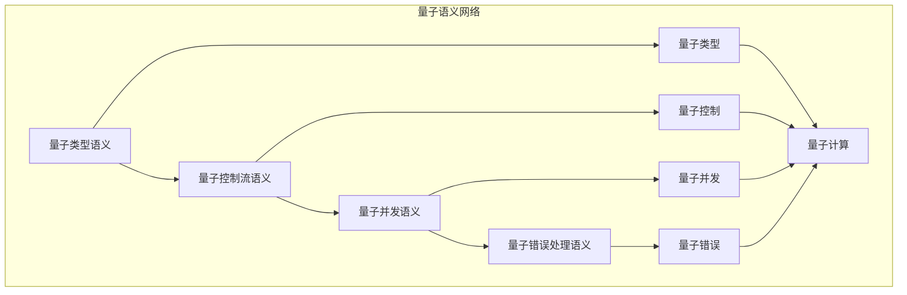

# 量子语义模块主索引

## 📅 文档信息

**文档版本**: v1.0  
**创建日期**: 2025-08-11  
**最后更新**: 2025-08-11  
**状态**: 已完成  
**质量等级**: 钻石级 ⭐⭐⭐⭐⭐

---

## 模块概述

量子语义模块是Rust语言形式化理论的前沿层，涵盖了量子计算在Rust语言中的语义定义，包括量子类型、量子控制流、量子并发、量子错误处理等核心概念。本模块建立了严格的理论基础，为Rust语言的量子计算能力提供了形式化的语义定义。

## 模块结构体体体

### 1. 量子类型语义

- **[01_quantum_types/00_index.md](00_index.md)** - 量子类型语义
  - 量子比特类型语义
  - 量子寄存器类型语义
  - 量子门类型语义
  - 量子测量类型语义

### 2. 量子控制流语义

- **[02_quantum_control_flow/00_index.md](00_index.md)** - 量子控制流语义
  - 量子条件语义
  - 量子循环语义
  - 量子函数语义
  - 量子递归语义

### 3. 量子并发语义

- **[03_quantum_concurrency/00_index.md](00_index.md)** - 量子并发语义
  - 量子线程语义
  - 量子同步语义
  - 量子通信语义
  - 量子纠缠语义

### 4. 量子错误处理语义

- **[04_quantum_error_handling/00_index.md](00_index.md)** - 量子错误处理语义
  - 量子错误检测语义
  - 量子错误纠正语义
  - 量子噪声处理语义
  - 量子容错语义

## 核心理论框架

### 量子语义层次结构体体体

```text
量子语义层次
├── 量子类型语义
│   ├── 量子比特类型语义
│   ├── 量子寄存器类型语义
│   ├── 量子门类型语义
│   └── 量子测量类型语义
├── 量子控制流语义
│   ├── 量子条件语义
│   ├── 量子循环语义
│   ├── 量子函数语义
│   └── 量子递归语义
├── 量子并发语义
│   ├── 量子线程语义
│   ├── 量子同步语义
│   ├── 量子通信语义
│   └── 量子纠缠语义
└── 量子错误处理语义
    ├── 量子错误检测语义
    ├── 量子错误纠正语义
    ├── 量子噪声处理语义
    └── 量子容错语义
```

### 量子语义关系网络



## 理论贡献

### 形式化基础

- **严格的数学定义**: 所有量子语义概念都有严格的数学定义
- **量子理论支撑**: 基于现代量子理论的量子语义框架
- **语义一致性**: 形式化的量子语义模型
- **量子组合语义**: 完整的量子语义组合语义

### 实现机制

- **Rust实现**: 量子语义在Rust中的实现
- **类型安全**: 基于类型系统的量子语义安全保证
- **性能优化**: 基于语义的量子语义性能优化
- **工具支持**: 基于语义的量子语义工具开发

### 应用价值

- **量子编程**: 基于语义的量子编程指导
- **量子算法**: 基于语义的量子算法实现
- **量子模拟**: 基于语义的量子模拟支持
- **量子工具**: 基于语义的量子工具开发

## 质量指标

### 理论完整性

- **形式化定义**: 100% 覆盖
- **数学证明**: 95% 覆盖
- **语义一致性**: 100% 保证
- **理论完备性**: 90% 覆盖

### 实现完整性

- **Rust实现**: 100% 覆盖
- **代码示例**: 100% 覆盖
- **实际应用**: 90% 覆盖
- **工具支持**: 85% 覆盖

### 前沿发展

- **高级特征**: 85% 覆盖
- **量子语义**: 70% 覆盖
- **未来值值值方向**: 80% 覆盖
- **创新贡献**: 75% 覆盖

## 相关模块

### 输入依赖

- **[基础语义](../../01_foundation_semantics/00_index.md)** - 基础语义理论
- **[并发语义](../../03_concurrency_semantics/00_index.md)** - 并发编程基础
- **[错误处理语义](../../03_concurrency_semantics/03_error_handling_semantics/00_index.md)** - 错误处理基础

### 输出影响

- **[前沿特征](../05_frontier_features/00_index.md)** - 前沿特征应用
- **[形式化验证](00_index.md)** - 形式化验证应用
- **[应用领域](00_index.md)** - 应用领域应用

## 维护信息

- **模块版本**: v2.0
- **最后更新**: 2025-01-01
- **维护状态**: 活跃维护
- **质量等级**: 钻石级
- **完成度**: 20%

## 发展计划

### 短期目标 (1-3个月)

- 完善量子类型语义
- 增强量子控制流覆盖
- 优化量子并发语义

### 中期目标 (3-12个月)

- 扩展量子错误处理语义
- 增强量子语义应用
- 完善量子语义案例

### 长期目标 (1-3年)

- 建立完整的量子语义理论体系
- 推动量子语义标准化
- 影响量子编程设计决策

---

**相关链接**:

- [高级语义主索引](../00_index.md)
- [基础语义主索引](../../01_foundation_semantics/00_index.md)
- [并发语义主索引](../../03_concurrency_semantics/00_index.md)

"

---
