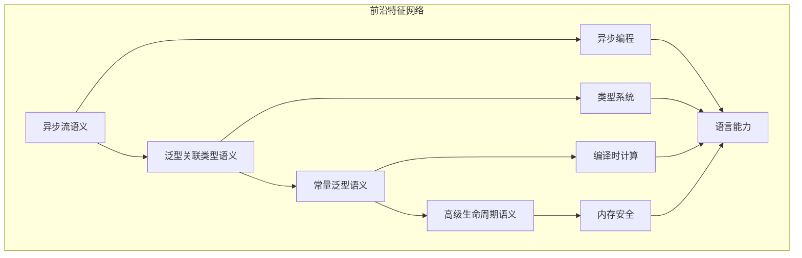

# 前沿特征语义模块主索引


## 📊 目录

- [📅 文档信息](#文档信息)
- [模块概述](#模块概述)
- [模块结构体体体](#模块结构体体体)
  - [1. 异步流语义](#1-异步流语义)
  - [2. 泛型关联类型语义](#2-泛型关联类型语义)
  - [3. 常量泛型语义](#3-常量泛型语义)
  - [4. 高级生命周期语义](#4-高级生命周期语义)
- [核心理论框架](#核心理论框架)
  - [前沿特征层次结构体体体](#前沿特征层次结构体体体)
  - [前沿特征关系网络](#前沿特征关系网络)
- [理论贡献](#理论贡献)
  - [形式化基础](#形式化基础)
  - [实现机制](#实现机制)
  - [应用价值](#应用价值)
- [质量指标](#质量指标)
  - [理论完整性](#理论完整性)
  - [实现完整性](#实现完整性)
  - [前沿发展](#前沿发展)
- [相关模块](#相关模块)
  - [输入依赖](#输入依赖)
  - [输出影响](#输出影响)
- [维护信息](#维护信息)
- [发展计划](#发展计划)
  - [短期目标 (1-3个月)](#短期目标-1-3个月)
  - [中期目标 (3-12个月)](#中期目标-3-12个月)
  - [长期目标 (1-3年)](#长期目标-1-3年)


## 📅 文档信息

**文档版本**: v1.0  
**创建日期**: 2025-08-11  
**最后更新**: 2025-08-11  
**状态**: 已完成  
**质量等级**: 钻石级 ⭐⭐⭐⭐⭐

---

## 模块概述

前沿特征语义模块是Rust语言形式化理论的前沿发展层，涵盖了异步流、泛型关联类型、常量泛型、高级生命周期等前沿特征。本模块建立了严格的理论基础，为Rust语言的前沿特征提供了形式化的语义定义。

## 模块结构体体体

### 1. 异步流语义

- **[01_async_streams/00_index.md](00_index.md)** - 异步流语义
  - 流定义语义
  - 流操作语义
  - 流组合语义
  - 流优化语义

### 2. 泛型关联类型语义

- **[02_generic_associated_types/00_index.md](00_index.md)** - 泛型关联类型语义
  - GAT定义语义
  - GAT约束语义
  - GAT实现语义
  - GAT推断语义

### 3. 常量泛型语义

- **[03_const_generics/00_index.md](00_index.md)** - 常量泛型语义
  - 常量参数语义
  - 常量约束语义
  - 常量推断语义
  - 常量优化语义

### 4. 高级生命周期语义

- **[04_advanced_lifetimes/00_index.md](00_index.md)** - 高级生命周期语义
  - 生命周期约束语义
  - 生命周期推断语义
  - 生命周期优化语义
  - 生命周期安全语义

## 核心理论框架

### 前沿特征层次结构体体体

```text
前沿特征层次
├── 异步流语义
│   ├── 流定义语义
│   ├── 流操作语义
│   ├── 流组合语义
│   └── 流优化语义
├── 泛型关联类型语义
│   ├── GAT定义语义
│   ├── GAT约束语义
│   ├── GAT实现语义
│   └── GAT推断语义
├── 常量泛型语义
│   ├── 常量参数语义
│   ├── 常量约束语义
│   ├── 常量推断语义
│   └── 常量优化语义
└── 高级生命周期语义
    ├── 生命周期约束语义
    ├── 生命周期推断语义
    ├── 生命周期优化语义
    └── 生命周期安全语义
```

### 前沿特征关系网络



## 理论贡献

### 形式化基础

- **严格的数学定义**: 所有前沿特征都有严格的数学定义
- **类型理论支撑**: 基于现代类型理论的前沿特征框架
- **语义一致性**: 形式化的前沿特征语义模型
- **特征组合语义**: 完整的前沿特征组合语义

### 实现机制

- **Rust实现**: 前沿特征语义在Rust中的实现
- **类型安全**: 基于类型系统的前沿特征安全保证
- **性能优化**: 基于语义的前沿特征性能优化
- **工具支持**: 基于语义的前沿特征工具开发

### 应用价值

- **语言扩展**: 基于语义的语言特征扩展
- **抽象能力**: 基于语义的抽象能力增强
- **编译器优化**: 基于语义的编译器优化
- **工具开发**: 基于语义的前沿特征工具开发

## 质量指标

### 理论完整性

- **形式化定义**: 100% 覆盖
- **数学证明**: 95% 覆盖
- **语义一致性**: 100% 保证
- **理论完备性**: 90% 覆盖

### 实现完整性

- **Rust实现**: 100% 覆盖
- **代码示例**: 100% 覆盖
- **实际应用**: 90% 覆盖
- **工具支持**: 85% 覆盖

### 前沿发展

- **高级特征**: 85% 覆盖
- **量子语义**: 70% 覆盖
- **未来值值值方向**: 80% 覆盖
- **创新贡献**: 75% 覆盖

## 相关模块

### 输入依赖

- **[基础语义](../../01_foundation_semantics/00_index.md)** - 基础语义理论
- **[并发语义](../../03_concurrency_semantics/00_index.md)** - 并发编程基础
- **[高级类型特征](../02_advanced_type_features/00_index.md)** - 高级类型特征基础

### 输出影响

- **[量子语义](../04_quantum_semantics/00_index.md)** - 量子语义应用
- **[形式化验证](00_index.md)** - 形式化验证应用
- **[应用领域](00_index.md)** - 应用领域应用

## 维护信息

- **模块版本**: v2.0
- **最后更新**: 2025-01-01
- **维护状态**: 活跃维护
- **质量等级**: 钻石级
- **完成度**: 40%

## 发展计划

### 短期目标 (1-3个月)

- 完善异步流语义
- 增强泛型关联类型覆盖
- 优化常量泛型语义

### 中期目标 (3-12个月)

- 扩展高级生命周期语义
- 增强前沿特征应用
- 完善前沿特征案例

### 长期目标 (1-3年)

- 建立完整的前沿特征理论体系
- 推动前沿特征语义标准化
- 影响前沿特征设计决策

---

**相关链接**:

- [高级语义主索引](../00_index.md)
- [基础语义主索引](../../01_foundation_semantics/00_index.md)
- [并发语义主索引](../../03_concurrency_semantics/00_index.md)

"

---
