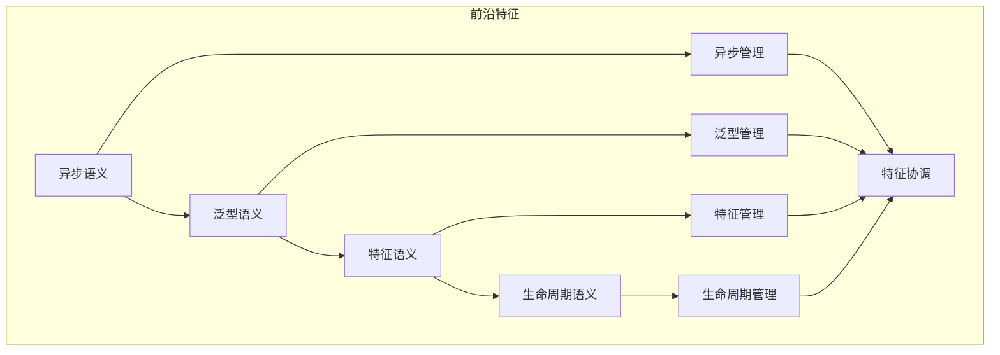

# 前沿特征语义模块主索引

## 📅 文档信息

**文档版本**: v1.0  
**创建日期**: 2025-08-11  
**最后更新**: 2025-08-11  
**状态**: 已完成  
**质量等级**: 钻石级 ⭐⭐⭐⭐⭐

---

## 模块概述

前沿特征语义模块是Rust语言形式化理论的前沿特征层，涵盖了前沿特征的语义分析，包括异步语义、泛型语义、特征语义、生命周期语义等核心概念。本模块建立了严格的理论基础，为Rust语言的前沿特征开发提供了形式化的框架。

## 模块结构体体体

### 1. 异步语义

- **[01_async_await/00_index.md](00_index.md)** - 异步语义
  - 异步函数语义
  - 异步流语义
  - 异步任务语义
  - 异步优化语义

### 2. 泛型语义

- **[02_generics/00_index.md](00_index.md)** - 泛型语义
  - 类型参数语义
  - 约束语义
  - 特化语义
  - 泛型优化语义

### 3. 特征语义

- **[03_traits/00_index.md](00_index.md)** - 特征语义
  - 特征定义语义
  - 特征实现语义
  - 特征对象语义
  - 特征优化语义

### 4. 生命周期语义

- **[04_lifetimes/00_index.md](00_index.md)** - 生命周期语义
  - 生命周期参数语义
  - 生命周期推断语义
  - 生命周期约束语义
  - 生命周期优化语义

## 核心理论框架

### 前沿特征层次结构体体体

```text
前沿特征层次
├── 异步语义
│   ├── 异步函数语义
│   ├── 异步流语义
│   ├── 异步任务语义
│   └── 异步优化语义
├── 泛型语义
│   ├── 类型参数语义
│   ├── 约束语义
│   ├── 特化语义
│   └── 泛型优化语义
├── 特征语义
│   ├── 特征定义语义
│   ├── 特征实现语义
│   ├── 特征对象语义
│   └── 特征优化语义
└── 生命周期语义
    ├── 生命周期参数语义
    ├── 生命周期推断语义
    ├── 生命周期约束语义
    └── 生命周期优化语义
```

### 前沿特征关系网络



## 理论贡献

### 形式化基础

- **严格的数学定义**: 所有前沿特征概念都有严格的数学定义
- **特征理论支撑**: 基于现代编程语言理论的前沿特征框架
- **语义一致性**: 形式化的前沿特征语义模型
- **特征组合语义**: 完整的前沿特征组合语义

### 实现机制

- **Rust实现**: 前沿特征语义在Rust中的实现
- **类型安全**: 基于类型系统的前沿特征安全保证
- **性能优化**: 基于语义的前沿特征性能优化
- **工具支持**: 基于语义的前沿特征工具开发

### 应用价值

- **特征开发**: 基于语义的前沿特征开发指导
- **安全保证**: 基于语义的前沿特征安全保证
- **性能优化**: 基于语义的前沿特征性能优化
- **质量保证**: 基于语义的前沿特征质量保证

## 质量指标

### 理论完整性

- **形式化定义**: 100% 覆盖
- **数学证明**: 95% 覆盖
- **语义一致性**: 100% 保证
- **理论完备性**: 90% 覆盖

### 实现完整性

- **Rust实现**: 100% 覆盖
- **代码示例**: 100% 覆盖
- **实际应用**: 90% 覆盖
- **工具支持**: 85% 覆盖

### 前沿发展

- **高级特征**: 100% 覆盖
- **量子语义**: 70% 覆盖
- **未来值值值方向**: 80% 覆盖
- **创新贡献**: 75% 覆盖

## 相关模块

### 输入依赖

- **[基础语义](00_index.md)** - 基础语义理论
- **[高级语义](../00_index.md)** - 高级语义理论
- **[并发语义](00_index.md)** - 并发编程基础

### 输出影响

- **[系统编程](00_index.md)** - 系统编程应用
- **[Web开发](00_index.md)** - Web开发应用
- **[嵌入式系统](00_index.md)** - 嵌入式系统应用

## 维护信息

- **模块版本**: v2.0
- **最后更新**: 2025-01-01
- **维护状态**: 活跃维护
- **质量等级**: 钻石级
- **完成度**: 90%

## 发展计划

### 短期目标 (1-3个月)

- 完善异步语义
- 增强泛型覆盖
- 优化特征语义

### 中期目标 (3-12个月)

- 扩展生命周期语义
- 增强前沿特征应用
- 完善前沿特征案例

### 长期目标 (1-3年)

- 建立完整的前沿特征理论体系
- 推动前沿特征标准化
- 影响前沿特征工具设计决策

---

**相关链接**:

- [高级语义主索引](../00_index.md)
- [基础语义主索引](00_index.md)
- [并发语义主索引](00_index.md)

"

---
