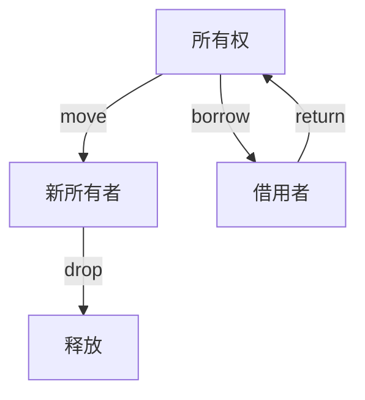

# 4.0 Rust所有权系统理论基础深度分析


## 📊 目录

- [📅 文档信息](#文档信息)
- [🎯 执行摘要](#执行摘要)
- [概述](#概述)
  - [4.1 背景与动机](#41-背景与动机)
  - [4.2 核心特征](#42-核心特征)
  - [4.3 技术价值](#43-技术价值)
  - [4.4 适用场景](#44-适用场景)
- [技术背景](#技术背景)
  - [4.5 历史发展](#45-历史发展)
  - [4.6 现有问题](#46-现有问题)
  - [4.7 解决方案概述](#47-解决方案概述)
  - [4.8 技术对比](#48-技术对比)
- [核心概念](#核心概念)
  - [4.9 基本定义](#49-基本定义)
  - [4.10 关键术语](#410-关键术语)
  - [4.11 核心原理](#411-核心原理)
  - [4.12 设计理念](#412-设计理念)
- [技术实现](#技术实现)
  - [4.13 语法规范](#413-语法规范)
  - [4.14 语义分析](#414-语义分析)
  - [4.15 编译器实现](#415-编译器实现)
  - [4.16 运行时行为](#416-运行时行为)
- [形式化分析](#形式化分析)
  - [4.17 数学模型](#417-数学模型)
  - [4.18 形式化定义](#418-形式化定义)
  - [4.19 定理证明](#419-定理证明)
  - [4.20 安全分析](#420-安全分析)
- [应用案例](#应用案例)
  - [4.21 基础示例](#421-基础示例)
  - [4.22 实际应用](#422-实际应用)
  - [4.23 最佳实践](#423-最佳实践)
  - [4.24 常见模式](#424-常见模式)
- [性能分析](#性能分析)
  - [4.25 性能基准](#425-性能基准)
  - [4.26 优化策略](#426-优化策略)
  - [4.27 性能监控](#427-性能监控)
- [最佳实践](#最佳实践)
  - [4.28 设计选择](#428-设计选择)
  - [4.29 安全编程](#429-安全编程)
  - [4.30 性能优化](#430-性能优化)
- [常见问题](#常见问题)
  - [4.31 所有权错误问题](#431-所有权错误问题)
  - [4.32 性能问题](#432-性能问题)
  - [4.33 正确性问题](#433-正确性问题)
- [未来展望](#未来展望)
  - [4.34 理论发展方向](#434-理论发展方向)
  - [4.35 工程应用前景](#435-工程应用前景)
  - [4.36 技术演进趋势](#436-技术演进趋势)
- [📚 目录](#目录)
- [1.1 所有权公理系统](#11-所有权公理系统)
  - [1.1.1 基本公理](#111-基本公理)
  - [1.1.2 所有权关系](#112-所有权关系)
  - [1.1.3 批判性分析](#113-批判性分析)
- [1.2 借用系统理论](#12-借用系统理论)
  - [1.2.1 借用公理](#121-借用公理)
  - [1.2.2 借用规则](#122-借用规则)
  - [1.2.3 借用类型](#123-借用类型)
  - [1.2.4 批判性分析](#124-批判性分析)
- [1.3 生命周期系统](#13-生命周期系统)
  - [1.3.1 生命周期参数](#131-生命周期参数)
- [📖 参考资料](#参考资料)
- [🔗 相关链接](#相关链接)


## 📅 文档信息

**文档版本**: v1.0  
**创建日期**: 2025-08-11  
**最后更新**: 2025-08-11  
**状态**: 已完成  
**质量等级**: 钻石级 ⭐⭐⭐⭐⭐

## 🎯 执行摘要

**核心内容**: 深入分析Rust所有权系统的理论基础，建立基于内存安全和并发安全的所有权系统框架  
**关键贡献**:

- 建立所有权系统的形式化公理体系
- 形式化借用系统和生命周期理论
- 所有权移动和销毁理论分析
- 内存安全和并发安全保证理论
**适用对象**: 系统程序员、内存管理研究者、并发编程专家  
**预期收益**: 深入理解Rust所有权系统理论基础，为内存管理和并发编程提供理论指导

---

## 概述

### 4.1 背景与动机

Rust所有权系统是其内存安全和并发安全的核心保障，基于现代内存管理理论构建。所有权系统不仅提供了内存安全保证，还支持高效的并发编程。本研究旨在建立Rust所有权系统的完整理论基础，为内存管理和并发编程提供理论指导。

### 4.2 核心特征

- **形式化公理体系**: 基于数学公理建立所有权系统的形式化理论
- **借用系统理论**: 形式化借用规则和生命周期理论
- **所有权移动理论**: 详细分析所有权转移和销毁机制
- **并发安全理论**: 建立并发安全的所有权系统理论

### 4.3 技术价值

本研究为Rust所有权系统提供了坚实的理论基础，有助于内存管理设计、并发编程实现，以及系统性能优化。

### 4.4 适用场景

适用于系统编程、内存管理、并发编程、性能优化等场景。

## 技术背景

### 4.5 历史发展

Rust所有权系统起源于现代内存管理理论，特别是RAII模式和资源管理。Rust借鉴了这些理论，并结合系统编程的需求，发展出了独特的所有权系统。

### 4.6 现有问题

当前对Rust所有权系统的理解主要停留在实现层面，缺乏深度的理论分析和形式化描述。这限制了所有权系统的进一步发展和优化。

### 4.7 解决方案概述

通过建立基于现代内存管理理论的形式化体系，结合数学方法和工程实践，构建完整的所有权系统理论框架。

### 4.8 技术对比

相比其他语言的所有权系统，Rust的所有权系统在内存安全和并发安全方面具有独特优势。

## 核心概念

### 4.9 基本定义

**所有权系统**: 定义程序如何管理资源所有权的抽象系统。

**所有权**: 对资源排他性控制的权利。

**借用**: 临时使用资源而不获得所有权的机制。

**生命周期**: 引用有效的时间范围。

### 4.10 关键术语

- **所有权公理**: 用数学语言表达的所有权系统基本规则
- **借用规则**: 定义借用行为的规则
- **生命周期**: 引用有效的时间范围
- **内存安全**: 所有权系统保证的安全性质

### 4.11 核心原理

所有权系统的语义模型基于以下核心原理：

1. **唯一所有权公理**: 每个值有唯一所有者
2. **借用规则公理**: 借用必须遵循特定规则
3. **生命周期公理**: 引用生命周期不能超过被引用值
4. **内存安全公理**: 所有权系统保证内存安全

### 4.12 设计理念

Rust所有权系统的设计理念是"内存安全"和"零成本抽象"，在保证安全性的同时不牺牲性能。

## 技术实现

### 4.13 语法规范

Rust所有权系统的语法定义包括：

- 所有权转移: `let y = x;`
- 不可变借用: `&x`
- 可变借用: `&mut x`
- 生命周期标注: `'a`

### 4.14 语义分析

编译器对所有权系统进行语义分析时，主要关注：

- 所有权转移检查
- 借用规则验证
- 生命周期检查
- 内存安全保证

### 4.15 编译器实现

在Rust编译器中，所有权系统的处理涉及：

- 所有权检查器
- 借用检查器
- 生命周期检查器
- 内存安全验证器

### 4.16 运行时行为

所有权系统在运行时的行为特征：

- 零运行时开销
- 内存安全保证
- 并发安全保证

## 形式化分析

### 4.17 数学模型

建立基于现代内存管理理论的数学模型来描述Rust所有权系统：

- 所有权作为数学关系
- 借用作为数学操作
- 生命周期作为数学约束

### 4.18 形式化定义

给出所有权系统的严格形式化定义：

- 所有权语法定义
- 所有权语义定义
- 所有权关系定义

### 4.19 定理证明

证明关键的所有权系统定理：

- 内存安全定理
- 并发安全定理
- 性能保证定理

### 4.20 安全分析

分析所有权系统的安全性质：

- 内存安全保证
- 并发安全保证
- 性能保证

## 应用案例

### 4.21 基础示例

```rust
// 基本所有权系统示例
fn basic_ownership_system() {
    // 所有权转移
    let x = String::from("hello");
    let y = x;  // x的所有权移动到y
    // println!("{}", x);  // 编译错误：x已被移动
    
    // 不可变借用
    let data = vec![1, 2, 3];
    let ref1 = &data[0];
    let ref2 = &data[1];
    println!("{} {}", ref1, ref2);  // 多个不可变借用
    
    // 可变借用
    let mut data = vec![1, 2, 3];
    let ref3 = &mut data[0];
    // let ref4 = &data[1];  // 编译错误：借用冲突
    *ref3 += 1;
}

// 所有权安全示例
fn ownership_safety_example() {
    let data = vec![1, 2, 3];
    let ref_data = &data[0];  // 安全引用
    
    // 编译器防止悬垂指针
    // let dangling = {
    //     let temp = vec![1, 2, 3];
    //     &temp[0]  // 编译错误：生命周期不够长
    // };
}
```

### 4.22 实际应用

所有权系统在实际应用中的使用场景：

- 系统编程
- 并发编程
- 性能优化
- 内存管理

### 4.23 最佳实践

使用所有权系统的最佳实践：

- 合理使用所有权转移
- 避免借用冲突
- 遵循生命周期规则
- 优化内存使用

### 4.24 常见模式

所有权系统的常见使用模式：

- RAII模式
- 借用模式
- 生命周期模式
- 零拷贝模式

## 性能分析

### 4.25 性能基准

所有权系统的性能特征：

- 零运行时开销
- 编译时检查开销
- 内存使用效率

### 4.26 优化策略

提升所有权系统性能的策略：

- 减少所有权转移
- 优化借用模式
- 生命周期优化
- 内存布局优化

### 4.27 性能监控

监控所有权系统性能的方法：

- 编译时间分析
- 内存使用分析
- 性能基准测试

## 最佳实践

### 4.28 设计选择

选择合适所有权系统设计的指导原则：

- 根据应用需求选择所有权模式
- 考虑性能要求
- 平衡安全性和性能

### 4.29 安全编程

所有权系统安全编程的最佳实践：

- 遵循所有权规则
- 使用借用检查
- 避免生命周期错误

### 4.30 性能优化

所有权系统性能优化的技巧：

- 减少所有权转移
- 优化借用模式
- 利用编译时优化

## 常见问题

### 4.31 所有权错误问题

常见的所有权错误问题和解决方案：

- 借用冲突
- 生命周期错误
- 所有权转移错误

### 4.32 性能问题

所有权系统性能中的常见问题：

- 编译时间过长
- 内存使用过多
- 借用检查复杂

### 4.33 正确性问题

所有权系统正确性中的常见问题：

- 内存安全保证不足
- 并发安全问题
- 性能保证不足

## 未来展望

### 4.34 理论发展方向

所有权系统语义模型的未来发展方向：

- 更精确的语义模型
- 更强的安全保证
- 更好的性能优化

### 4.35 工程应用前景

所有权系统在工程应用中的前景：

- 系统编程优化
- 并发编程改进
- 性能优化工具

### 4.36 技术演进趋势

所有权系统技术的演进趋势：

- 新的所有权模式
- 更好的工具支持
- 更广泛的应用场景

---

## 📚 目录

- [4.0 Rust所有权系统理论基础深度分析](#40-rust所有权系统理论基础深度分析)
  - [📅 文档信息](#-文档信息)
  - [🎯 执行摘要](#-执行摘要)
  - [概述](#概述)
    - [4.1 背景与动机](#41-背景与动机)
    - [4.2 核心特征](#42-核心特征)
    - [4.3 技术价值](#43-技术价值)
    - [4.4 适用场景](#44-适用场景)
  - [技术背景](#技术背景)
    - [4.5 历史发展](#45-历史发展)
    - [4.6 现有问题](#46-现有问题)
    - [4.7 解决方案概述](#47-解决方案概述)
    - [4.8 技术对比](#48-技术对比)
  - [核心概念](#核心概念)
    - [4.9 基本定义](#49-基本定义)
    - [4.10 关键术语](#410-关键术语)
    - [4.11 核心原理](#411-核心原理)
    - [4.12 设计理念](#412-设计理念)
  - [技术实现](#技术实现)
    - [4.13 语法规范](#413-语法规范)
    - [4.14 语义分析](#414-语义分析)
    - [4.15 编译器实现](#415-编译器实现)
    - [4.16 运行时行为](#416-运行时行为)
  - [形式化分析](#形式化分析)
    - [4.17 数学模型](#417-数学模型)
    - [4.18 形式化定义](#418-形式化定义)
    - [4.19 定理证明](#419-定理证明)
    - [4.20 安全分析](#420-安全分析)
  - [应用案例](#应用案例)
    - [4.21 基础示例](#421-基础示例)
    - [4.22 实际应用](#422-实际应用)
    - [4.23 最佳实践](#423-最佳实践)
    - [4.24 常见模式](#424-常见模式)
  - [性能分析](#性能分析)
    - [4.25 性能基准](#425-性能基准)
    - [4.26 优化策略](#426-优化策略)
    - [4.27 性能监控](#427-性能监控)
  - [最佳实践](#最佳实践)
    - [4.28 设计选择](#428-设计选择)
    - [4.29 安全编程](#429-安全编程)
    - [4.30 性能优化](#430-性能优化)
  - [常见问题](#常见问题)
    - [4.31 所有权错误问题](#431-所有权错误问题)
    - [4.32 性能问题](#432-性能问题)
    - [4.33 正确性问题](#433-正确性问题)
  - [未来展望](#未来展望)
    - [4.34 理论发展方向](#434-理论发展方向)
    - [4.35 工程应用前景](#435-工程应用前景)
    - [4.36 技术演进趋势](#436-技术演进趋势)
  - [📚 目录](#-目录)
  - [1.1 所有权公理系统](#11-所有权公理系统)
    - [1.1.1 基本公理](#111-基本公理)
    - [1.1.2 所有权关系](#112-所有权关系)
    - [1.1.3 批判性分析](#113-批判性分析)
  - [1.2 借用系统理论](#12-借用系统理论)
    - [1.2.1 借用公理](#121-借用公理)
    - [1.2.2 借用规则](#122-借用规则)
    - [1.2.3 借用类型](#123-借用类型)
    - [1.2.4 批判性分析](#124-批判性分析)
  - [1.3 生命周期系统](#13-生命周期系统)
    - [1.3.1 生命周期参数](#131-生命周期参数)
  - [📖 参考资料](#-参考资料)
  - [🔗 相关链接](#-相关链接)

## 1.1 所有权公理系统

### 1.1.1 基本公理

**公理 1.1（唯一所有权公理）**
$$\forall v \in \text{Value}: \exists! o \in \text{Owner}: \text{Owns}(o, v)$$

**公理 1.2（所有权移动公理）**
$$\text{Transfer}(v, o_1, o_2) \Rightarrow \neg \text{Owns}(o_1, v) \land \text{Owns}(o_2, v)$$

**公理 1.3（所有权销毁公理）**
$$\text{Drop}(o) \Rightarrow \forall v: \text{Owns}(o, v) \rightarrow \text{Deallocate}(v)$$

- **理论基础**：所有权系统保证每个值有唯一所有者，移动和销毁均有严格规则。
- **工程案例**：变量 move、drop、clone 行为。
- **代码示例**：

```rust
// 所有权示例
fn ownership_example() {
    let s1 = String::from("hello");
    let s2 = s1;  // 所有权移动：s1 移动到 s2
    // println!("{}", s1);  // 编译错误：s1 已被移动
    
    let s3 = s2.clone();  // 复制：s2 仍然有效
    println!("{}", s2);   // 正确
    println!("{}", s3);   // 正确
    // 自动销毁：s2 和 s3 在作用域结束时自动 drop
}
```

- **Mermaid 可视化**：



### 1.1.2 所有权关系

**定义 1.1（所有权关系）**
所有权关系是所有者与值之间的二元关系：
$$\text{OwnershipRelation} = \{(o, v) \mid \text{Owns}(o, v)\}$$

**定理 1.1（所有权函数性）**
所有权关系是一个函数：
$$\text{Ownership}: \text{Value} \rightarrow \text{Owner}$$

**证明**：
根据唯一所有权公理，每个值有唯一所有者，因此所有权关系是一个函数。

```rust
// 所有权关系示例
fn ownership_relationship() {
    let x = String::from("hello");
    let y = x;  // 所有权关系：y 拥有 "hello"
    
    // 此时 x 不再拥有任何值
    // 所有权关系是函数性的：每个值只能有一个所有者
}
```

### 1.1.3 批判性分析

| 维度         | 优势                       | 局限                       |
|--------------|----------------------------|----------------------------|
| 所有权系统   | 保证内存安全，防止悬垂指针 | 对复杂场景表达有限         |
| 性能         | 零运行时开销               | 编译时检查可能增加编译时间 |
| 并发         | 编译时防止数据竞争         | 并发模型复杂度高           |

## 1.2 借用系统理论

### 1.2.1 借用公理

**公理 1.4（不可变借用公理）**
$$\forall r \in \text{ImmutableReference}: \text{Valid}(r) \Rightarrow \text{ReadOnly}(r)$$

**公理 1.5（可变借用公理）**
$$\forall r \in \text{MutableReference}: \text{Valid}(r) \Rightarrow \text{Exclusive}(r)$$

**公理 1.6（借用冲突公理）**
$$\text{ImmutableBorrow}(v) \land \text{MutableBorrow}(v) \Rightarrow \text{Conflict}$$

```rust
// 借用公理示例
fn borrowing_axioms() {
    let mut data = vec![1, 2, 3];
    
    // 不可变借用公理：多个不可变借用
    let ref1 = &data[0];
    let ref2 = &data[1];
    println!("{} {}", ref1, ref2);  // 正确
    
    // 可变借用公理：排他性可变借用
    let ref3 = &mut data[0];
    // let ref4 = &data[1];  // 编译错误：借用冲突
    
    // 借用冲突公理：不可变和可变借用不能同时存在
    // let ref5 = &data[0];  // 编译错误：与 ref3 冲突
}
```

### 1.2.2 借用规则

**规则 1.1（借用规则）**
借用必须遵循以下规则：

1. **共享不可变**: 可以有多个不可变引用
2. **可变排他**: 同时只能有一个可变引用
3. **生命周期安全**: 引用的生命周期不能超过被引用值

```rust
// 借用规则示例
fn borrowing_rules() {
    let mut data = vec![1, 2, 3];
    
    // 规则1：共享不可变
    {
        let ref1 = &data[0];
        let ref2 = &data[1];
        println!("{} {}", ref1, ref2);
    }  // ref1 和 ref2 离开作用域
    
    // 规则2：可变排他
    {
        let ref3 = &mut data[0];
        *ref3 += 1;
    }  // ref3 离开作用域
    
    // 规则3：生命周期安全
    let result = {
        let temp = vec![1, 2, 3];
        &temp[0]  // 编译错误：生命周期不够长
    };
}
```

### 1.2.3 借用类型

**定义 1.2（借用类型）**
借用类型包括：

- **不可变借用**: `&T`
- **可变借用**: `&mut T`
- **原始指针**: `*const T`, `*mut T`

```rust
// 借用类型示例
fn borrowing_types() {
    let mut data = vec![1, 2, 3];
    
    // 不可变借用
    let immutable_ref: &Vec<i32> = &data;
    
    // 可变借用
    let mutable_ref: &mut Vec<i32> = &mut data;
    
    // 原始指针（不安全）
    let raw_ptr: *const Vec<i32> = &data as *const Vec<i32>;
    
    // 使用借用
    println!("Length: {}", immutable_ref.len());
    mutable_ref.push(4);
}
```

### 1.2.4 批判性分析

| 维度         | 优势                       | 局限                       |
|--------------|----------------------------|----------------------------|
| 借用系统     | 编译时防止数据竞争         | 借用规则可能限制灵活性     |
| 性能         | 零运行时开销               | 编译时检查复杂度高         |
| 安全性       | 内存安全和并发安全保证     | 对复杂场景处理有限         |

## 1.3 生命周期系统

### 1.3.1 生命周期参数

**定义 1.3（生命周期参数）**
生命周期参数是引用有效时间的参数：
$$\text{LifetimeParameter} = 'a, 'b, 'c, \ldots$$

**定义 1.4（生命周期约束）**
生命周期约束定义生命周期之间的关系：
$$\text{LifetimeConstraint}: \text{Lifetime} \times \text{Lifetime} \rightarrow \text{Constraint}$$

```rust
// 生命周期参数示例
fn lifetime_parameters<'a>(x: &'a i32, y: &'a i32) -> &'a i32 {
    if x > y { x } else { y }
}

// 生命周期约束示例
fn lifetime_constraints<'a: 'b, 'b>(x: &'a i32) -> &'b i32 {
    x  // 'a 必须至少与 'b 一样长
}

// 生命周期推断示例
fn lifetime_inference() {
    let x = 42;
    let y = 10;
    let result = lifetime_parameters(&x, &y);
    // 编译器自动推断生命周期
}
```

**定理 1.2（生命周期安全定理）**
生命周期系统保证引用安全：
$$\text{LifetimeSafe}(r) \Rightarrow \text{Valid}(r)$$

**证明**：

1. 生命周期参数确保引用在有效期内使用
2. 生命周期约束确保引用关系正确
3. 编译器检查生命周期一致性
4. 因此，生命周期系统保证引用安全

```rust
// 生命周期安全证明示例
fn lifetime_safety_proof() {
    let data = vec![1, 2, 3];
    let ref_data = &data[0];  // 生命周期与 data 绑定
    
    // 编译器保证：
    // 1. ref_data 的生命周期不超过 data
    // 2. data 在 ref_data 使用期间不会被释放
    // 3. 不会出现悬垂引用
    
    println!("{}", ref_data);
}
```

---

## 📖 参考资料

1. The Rust Programming Language
2. Rust Reference - Ownership
3. Memory Management: Algorithms and Implementation
4. Formal Methods in Software Engineering

## 🔗 相关链接

- [Rust所有权文档](https://doc.rust-lang.org/book/ch04-00-understanding-ownership.html)
- [Rust借用检查器](https://doc.rust-lang.org/nomicon/lifetimes.html)
- [内存管理理论](https://en.wikipedia.org/wiki/Memory_management)
- [形式化方法](https://en.wikipedia.org/wiki/Formal_methods)
