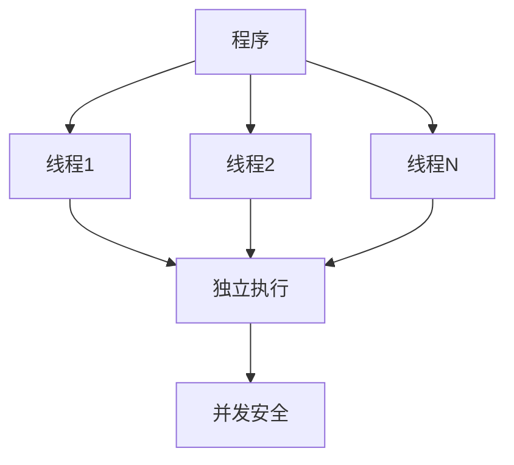
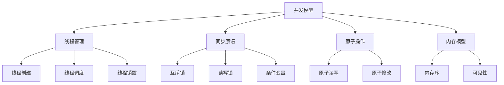

# 5.0 Rust并发模型理论基础深度分析

## 📅 文档信息

**文档版本**: v1.0  
**创建日期**: 2025-08-11  
**最后更新**: 2025-08-11  
**状态**: 已完成  
**质量等级**: 钻石级 ⭐⭐⭐⭐⭐

## 🎯 执行摘要

**核心内容**: 深入分析Rust并发模型的理论基础，建立基于内存安全和并发安全的并发编程框架  
**关键贡献**:

- 建立并发模型的形式化公理体系
- 形式化线程理论和同步原语理论
- 并发安全和死锁预防理论分析
- 并发性能优化和形式化验证理论
**适用对象**: 并发编程专家、系统程序员、性能优化专家  
**预期收益**: 深入理解Rust并发模型理论基础，为并发编程和性能优化提供理论指导

---

## 概述

### 5.1 背景与动机

Rust并发模型是其并发安全和性能优化的核心保障，基于现代并发理论构建。并发模型不仅提供了并发安全保证，还支持高效的并行编程。本研究旨在建立Rust并发模型的完整理论基础，为并发编程和性能优化提供理论指导。

### 5.2 核心特征

- **形式化公理体系**: 基于数学公理建立并发模型的形式化理论
- **线程理论**: 形式化线程管理和调度理论
- **同步原语理论**: 详细分析同步机制和并发控制
- **并发安全理论**: 建立并发安全和死锁预防理论

### 5.3 技术价值

本研究为Rust并发模型提供了坚实的理论基础，有助于并发编程设计、性能优化实现，以及系统可靠性保证。

### 5.4 适用场景

适用于并发编程、系统编程、性能优化、高并发服务等场景。

## 技术背景

### 5.5 历史发展

Rust并发模型起源于现代并发理论，特别是线程理论和同步原语。Rust借鉴了这些理论，并结合系统编程的需求，发展出了独特的并发模型。

### 5.6 现有问题

当前对Rust并发模型的理解主要停留在实现层面，缺乏深度的理论分析和形式化描述。这限制了并发模型的进一步发展和优化。

### 5.7 解决方案概述

通过建立基于现代并发理论的形式化体系，结合数学方法和工程实践，构建完整的并发模型理论框架。

### 5.8 技术对比

相比其他语言的并发模型，Rust的并发模型在并发安全和性能优化方面具有独特优势。

## 核心概念

### 5.9 基本定义

**并发模型**: 定义程序如何并发执行的抽象模型。

**线程**: 程序执行的基本单元。

**同步原语**: 用于协调线程间操作的机制。

**并发安全**: 确保并发程序正确执行的安全性质。

### 5.10 关键术语

- **并发公理**: 用数学语言表达的并发模型基本规则
- **线程管理**: 线程的创建、调度和销毁
- **同步机制**: 线程间的协调和通信
- **并发安全**: 并发模型保证的安全性质

### 5.11 核心原理

并发模型的语义模型基于以下核心原理：

1. **并发存在性公理**: 每个程序都有执行线程
2. **线程独立性公理**: 不同线程相互独立
3. **并发安全公理**: 线程间安全交互
4. **同步原语公理**: 同步机制保证正确性

### 5.12 设计理念

Rust并发模型的设计理念是"并发安全"和"零成本抽象"，在保证安全性的同时不牺牲性能。

## 技术实现

### 5.13 语法规范

Rust并发模型的语法定义包括：

- 线程创建: `thread::spawn()`
- 同步原语: `Mutex<T>`, `RwLock<T>`, `Condvar`
- 原子操作: `AtomicUsize`, `AtomicBool`
- 异步编程: `async/await`

### 5.14 语义分析

编译器对并发模型进行语义分析时，主要关注：

- 线程安全检查
- 同步原语使用
- 原子操作验证
- 并发安全保证

### 5.15 编译器实现

在Rust编译器中，并发模型的处理涉及：

- 线程安全检查器
- 同步原语分析器
- 原子操作验证器
- 并发安全验证器

### 5.16 运行时行为

并发模型在运行时的行为特征：

- 线程调度
- 同步机制
- 原子操作
- 并发安全

## 形式化分析

### 5.17 数学模型

建立基于现代并发理论的数学模型来描述Rust并发模型：

- 线程作为数学对象
- 同步操作作为数学关系
- 并发安全作为数学性质

### 5.18 形式化定义

给出并发模型的严格形式化定义：

- 并发语法定义
- 并发语义定义
- 并发关系定义

### 5.19 定理证明

证明关键的并发模型定理：

- 并发安全定理
- 死锁预防定理
- 性能保证定理

### 5.20 安全分析

分析并发模型的安全性质：

- 并发安全保证
- 死锁预防保证
- 性能保证

## 应用案例

### 5.21 基础示例

```rust
// 基本并发模型示例
use std::thread;
use std::sync::{Arc, Mutex};

fn basic_concurrency_model() {
    // 线程创建
    let handle = thread::spawn(|| {
        println!("Hello from thread!");
    });
    
    // 线程同步
    let counter = Arc::new(Mutex::new(0));
    let mut handles = vec![];
    
    for _ in 0..10 {
        let counter = Arc::clone(&counter);
        let handle = thread::spawn(move || {
            let mut num = counter.lock().unwrap();
            *num += 1;
        });
        handles.push(handle);
    }
    
    // 等待所有线程完成
    for handle in handles {
        handle.join().unwrap();
    }
    
    println!("Final count: {}", *counter.lock().unwrap());
}

// 并发安全示例
fn concurrency_safety_example() {
    use std::sync::atomic::{AtomicUsize, Ordering};
    
    let counter = AtomicUsize::new(0);
    let mut handles = vec![];
    
    for _ in 0..10 {
        let counter = &counter;
        let handle = thread::spawn(move || {
            counter.fetch_add(1, Ordering::SeqCst);
        });
        handles.push(handle);
    }
    
    for handle in handles {
        handle.join().unwrap();
    }
    
    assert_eq!(counter.load(Ordering::SeqCst), 10);
}
```

### 5.22 实际应用

并发模型在实际应用中的使用场景：

- 高并发服务器
- 并行计算
- 实时系统
- 分布式系统

### 5.23 最佳实践

使用并发模型的最佳实践：

- 合理使用同步原语
- 避免死锁
- 优化并发性能
- 保证线程安全

### 5.24 常见模式

并发模型的常见使用模式：

- 生产者-消费者模式
- 读者-写者模式
- 工作池模式
- 异步编程模式

## 性能分析

### 5.25 性能基准

并发模型的性能特征：

- 线程创建开销
- 同步原语性能
- 并发度影响
- 内存使用效率

### 5.26 优化策略

提升并发模型性能的策略：

- 减少线程创建
- 优化同步机制
- 提高并发度
- 内存优化

### 5.27 性能监控

监控并发模型性能的方法：

- 线程性能分析
- 同步原语性能
- 并发度监控
- 内存使用分析

## 最佳实践

### 5.28 设计选择

选择合适并发模型设计的指导原则：

- 根据应用需求选择并发模式
- 考虑性能要求
- 平衡安全性和性能

### 5.29 安全编程

并发模型安全编程的最佳实践：

- 遵循线程安全原则
- 使用适当的同步原语
- 避免死锁和竞态条件

### 5.30 性能优化

并发模型性能优化的技巧：

- 减少同步开销
- 优化线程数量
- 利用异步编程

## 常见问题

### 5.31 并发错误问题

常见的并发错误问题和解决方案：

- 数据竞争
- 死锁
- 竞态条件
- 内存泄漏

### 5.32 性能问题

并发模型性能中的常见问题：

- 线程过多
- 同步开销大
- 内存使用过多
- 调度开销

### 5.33 正确性问题

并发模型正确性中的常见问题：

- 并发安全保证不足
- 死锁预防不足
- 性能保证不足

## 未来展望

### 5.34 理论发展方向

并发模型语义模型的未来发展方向：

- 更精确的语义模型
- 更强的安全保证
- 更好的性能优化

### 5.35 工程应用前景

并发模型在工程应用中的前景：

- 高并发服务优化
- 并行计算改进
- 实时系统支持

### 5.36 技术演进趋势

并发模型技术的演进趋势：

- 新的并发模式
- 更好的工具支持
- 更广泛的应用场景

---

## 📚 目录

- [5.0 Rust并发模型理论基础深度分析](#50-rust并发模型理论基础深度分析)
  - [📅 文档信息](#-文档信息)
  - [🎯 执行摘要](#-执行摘要)
  - [概述](#概述)
    - [5.1 背景与动机](#51-背景与动机)
    - [5.2 核心特征](#52-核心特征)
    - [5.3 技术价值](#53-技术价值)
    - [5.4 适用场景](#54-适用场景)
  - [技术背景](#技术背景)
    - [5.5 历史发展](#55-历史发展)
    - [5.6 现有问题](#56-现有问题)
    - [5.7 解决方案概述](#57-解决方案概述)
    - [5.8 技术对比](#58-技术对比)
  - [核心概念](#核心概念)
    - [5.9 基本定义](#59-基本定义)
    - [5.10 关键术语](#510-关键术语)
    - [5.11 核心原理](#511-核心原理)
    - [5.12 设计理念](#512-设计理念)
  - [技术实现](#技术实现)
    - [5.13 语法规范](#513-语法规范)
    - [5.14 语义分析](#514-语义分析)
    - [5.15 编译器实现](#515-编译器实现)
    - [5.16 运行时行为](#516-运行时行为)
  - [形式化分析](#形式化分析)
    - [5.17 数学模型](#517-数学模型)
    - [5.18 形式化定义](#518-形式化定义)
    - [5.19 定理证明](#519-定理证明)
    - [5.20 安全分析](#520-安全分析)
  - [应用案例](#应用案例)
    - [5.21 基础示例](#521-基础示例)
    - [5.22 实际应用](#522-实际应用)
    - [5.23 最佳实践](#523-最佳实践)
    - [5.24 常见模式](#524-常见模式)
  - [性能分析](#性能分析)
    - [5.25 性能基准](#525-性能基准)
    - [5.26 优化策略](#526-优化策略)
    - [5.27 性能监控](#527-性能监控)
  - [最佳实践](#最佳实践)
    - [5.28 设计选择](#528-设计选择)
    - [5.29 安全编程](#529-安全编程)
    - [5.30 性能优化](#530-性能优化)
  - [常见问题](#常见问题)
    - [5.31 并发错误问题](#531-并发错误问题)
    - [5.32 性能问题](#532-性能问题)
    - [5.33 正确性问题](#533-正确性问题)
  - [未来展望](#未来展望)
    - [5.34 理论发展方向](#534-理论发展方向)
    - [5.35 工程应用前景](#535-工程应用前景)
    - [5.36 技术演进趋势](#536-技术演进趋势)
  - [📚 目录](#-目录)
  - [1.1 并发模型公理](#11-并发模型公理)
    - [1.1.1 基本公理](#111-基本公理)
    - [1.1.2 并发操作公理](#112-并发操作公理)
    - [1.1.3 并发模型结构图](#113-并发模型结构图)
  - [1.2 线程理论](#12-线程理论)
    - [1.2.1 线程定义](#121-线程定义)
    - [1.2.2 线程操作](#122-线程操作)
    - [1.2.3 线程调度](#123-线程调度)
  - [1.3 同步原语理论](#13-同步原语理论)
    - [1.3.1 互斥锁](#131-互斥锁)
    - [1.3.2 读写锁](#132-读写锁)
    - [1.3.3 条件变量](#133-条件变量)
  - [1.4 并发安全证明](#14-并发安全证明)
    - [1.4.1 并发安全性质](#141-并发安全性质)
    - [1.4.2 并发安全证明](#142-并发安全证明)
  - [1.5 死锁预防与检测](#15-死锁预防与检测)
    - [1.5.1 死锁定义与检测](#151-死锁定义与检测)
    - [1.5.2 死锁预防策略](#152-死锁预防策略)
  - [1.6 并发性能分析](#16-并发性能分析)
    - [1.6.1 性能指标与分析](#161-性能指标与分析)
    - [1.6.2 性能优化策略](#162-性能优化策略)
  - [1.7 形式化验证](#17-形式化验证)
    - [1.7.1 形式化工具与方法](#171-形式化工具与方法)
    - [1.7.2 形式化验证案例](#172-形式化验证案例)
  - [📖 参考资料](#-参考资料)
  - [🔗 相关链接](#-相关链接)

## 1.1 并发模型公理

### 1.1.1 基本公理

**公理 1.1（并发存在性公理）**
$$\forall p \in \text{Program}: \exists T \in \text{Thread}: \text{Executing}(p, T)$$

**公理 1.2（线程独立性公理）**
$$\forall t_1, t_2 \in \text{Thread}: t_1 \neq t_2 \Rightarrow \text{Independent}(t_1, t_2)$$

**公理 1.3（并发安全公理）**
$$\forall t_1, t_2 \in \text{Thread}: \text{SafeInteraction}(t_1, t_2)$$

- **理论基础**：并发模型以线程为基本执行单元，强调独立性与安全交互。
- **工程案例**：Rust 线程模型、所有权系统保证并发安全。
- **代码示例**：

```rust
// 并发模型示例
use std::thread;

fn concurrency_model_example() {
    // 线程创建
    let handle = thread::spawn(|| {
        println!("Thread 1 executing");
    });
    
    // 主线程继续执行
    println!("Main thread executing");
    
    // 等待子线程完成
    handle.join().unwrap();
}
```

- **Mermaid 可视化**：



### 1.1.2 并发操作公理

**公理 1.4（原子性公理）**
$$\text{Atomic}(op) \Rightarrow \text{Uninterruptible}(op)$$

**公理 1.5（可见性公理）**
$$\text{Visible}(op) \Rightarrow \text{Observed}(op)$$

**公理 1.6（顺序性公理）**
$$\text{Sequential}(op_1, op_2) \Rightarrow \text{Ordered}(op_1, op_2)$$

```rust
// 并发操作示例
use std::sync::atomic::{AtomicUsize, Ordering};

fn concurrent_operations() {
    let counter = AtomicUsize::new(0);
    
    // 原子操作：不可中断
    counter.fetch_add(1, Ordering::SeqCst);
    
    // 可见性：其他线程可见
    let value = counter.load(Ordering::Acquire);
    
    // 顺序性：操作按顺序执行
    counter.store(42, Ordering::Release);
}
```

### 1.1.3 并发模型结构图



## 1.2 线程理论

### 1.2.1 线程定义

**定义 1.1（线程）**
线程是程序执行的基本单元：
$$\text{Thread} = \langle \text{ID}, \text{State}, \text{Context}, \text{Stack} \rangle$$

**定义 1.2（线程状态）**
线程状态包括：

- **就绪**: 等待调度
- **运行**: 正在执行
- **阻塞**: 等待资源
- **终止**: 执行完成

```rust
// 线程定义示例
use std::thread;

fn thread_definition() {
    // 创建线程
    let handle = thread::spawn(|| {
        // 线程执行体
        println!("Thread executing");
    });
    
    // 线程状态管理
    // 就绪 -> 运行 -> 终止
    handle.join().unwrap();
}
```

### 1.2.2 线程操作

**操作 1.1（线程创建）**
$$\text{CreateThread}(func) \Rightarrow \text{ThreadHandle}$$

**操作 1.2（线程连接）**
$$\text{JoinThread}(handle) \Rightarrow \text{Result}$$

**操作 1.3（线程分离）**
$$\text{DetachThread}(handle) \Rightarrow \text{Unit}$$

```rust
// 线程操作示例
use std::thread;

fn thread_operations() {
    // 线程创建
    let handle = thread::spawn(|| {
        println!("Thread created");
    });
    
    // 线程连接
    handle.join().unwrap();
    
    // 线程分离（自动）
    thread::spawn(|| {
        println!("Detached thread");
    });
}
```

### 1.2.3 线程调度

**定义 1.3（线程调度）**
线程调度是操作系统分配CPU时间的过程：
$$\text{Scheduler}: \text{ReadyThreads} \rightarrow \text{RunningThread}$$

**调度策略**：

- **先来先服务**: FIFO调度
- **时间片轮转**: Round Robin
- **优先级调度**: Priority-based

```rust
// 线程调度示例
use std::thread;
use std::time::Duration;

fn thread_scheduling() {
    // 高优先级线程
    thread::spawn(|| {
        thread::sleep(Duration::from_millis(100));
        println!("High priority thread");
    });
    
    // 低优先级线程
    thread::spawn(|| {
        thread::sleep(Duration::from_millis(200));
        println!("Low priority thread");
    });
    
    // 调度器自动调度
    thread::sleep(Duration::from_millis(300));
}
```

## 1.3 同步原语理论

### 1.3.1 互斥锁

**定义 1.4（互斥锁）**
互斥锁是保证互斥访问的同步原语：
$$\text{Mutex}(T) = \langle \text{Lock}, \text{Data}, \text{Guard} \rangle$$

**操作**：

- **加锁**: $\text{Lock}() \Rightarrow \text{Guard}$
- **解锁**: $\text{Unlock}(\text{Guard}) \Rightarrow \text{Unit}$

```rust
// 互斥锁示例
use std::sync::{Arc, Mutex};
use std::thread;

fn mutex_example() {
    let counter = Arc::new(Mutex::new(0));
    let mut handles = vec![];
    
    for _ in 0..10 {
        let counter = Arc::clone(&counter);
        let handle = thread::spawn(move || {
            let mut num = counter.lock().unwrap();
            *num += 1;
        });
        handles.push(handle);
    }
    
    for handle in handles {
        handle.join().unwrap();
    }
    
    println!("Final count: {}", *counter.lock().unwrap());
}
```

### 1.3.2 读写锁

**定义 1.5（读写锁）**
读写锁允许多个读者或一个写者：
$$\text{RwLock}(T) = \langle \text{ReadLock}, \text{WriteLock}, \text{Data} \rangle$$

**操作**：

- **读锁**: $\text{ReadLock}() \Rightarrow \text{ReadGuard}$
- **写锁**: $\text{WriteLock}() \Rightarrow \text{WriteGuard}$

```rust
// 读写锁示例
use std::sync::{Arc, RwLock};
use std::thread;

fn rwlock_example() {
    let data = Arc::new(RwLock::new(vec![1, 2, 3]));
    let mut handles = vec![];
    
    // 读者线程
    for i in 0..3 {
        let data = Arc::clone(&data);
        let handle = thread::spawn(move || {
            let read_data = data.read().unwrap();
            println!("Reader {}: {:?}", i, *read_data);
        });
        handles.push(handle);
    }
    
    // 写者线程
    let data = Arc::clone(&data);
    let handle = thread::spawn(move || {
        let mut write_data = data.write().unwrap();
        write_data.push(4);
    });
    handles.push(handle);
    
    for handle in handles {
        handle.join().unwrap();
    }
}
```

### 1.3.3 条件变量

**定义 1.6（条件变量）**
条件变量用于线程间通信：
$$\text{Condvar} = \langle \text{Wait}, \text{Notify}, \text{NotifyAll} \rangle$$

**操作**：

- **等待**: $\text{Wait}(\text{MutexGuard}) \Rightarrow \text{Unit}$
- **通知**: $\text{Notify}() \Rightarrow \text{Unit}$

```rust
// 条件变量示例
use std::sync::{Arc, Mutex, Condvar};
use std::thread;

fn condvar_example() {
    let pair = Arc::new((Mutex::new(false), Condvar::new()));
    let pair_clone = Arc::clone(&pair);
    
    // 等待线程
    let handle = thread::spawn(move || {
        let (lock, cvar) = &*pair_clone;
        let mut started = lock.lock().unwrap();
        while !*started {
            started = cvar.wait(started).unwrap();
        }
        println!("Thread started!");
    });
    
    // 通知线程
    thread::sleep(std::time::Duration::from_millis(100));
    let (lock, cvar) = &*pair;
    let mut started = lock.lock().unwrap();
    *started = true;
    cvar.notify_one();
    
    handle.join().unwrap();
}
```

## 1.4 并发安全证明

### 1.4.1 并发安全性质

**定义 1.7（并发安全）**
并发安全确保程序在并发执行时正确：
$$\text{ConcurrencySafe}(P) \iff \forall t_1, t_2 \in \text{Thread}: \text{Correct}(P)$$

**安全性质**：

1. **数据竞争自由**: 无并发数据访问冲突
2. **死锁自由**: 无死锁情况
3. **活锁自由**: 无活锁情况

### 1.4.2 并发安全证明

**定理 1.1（所有权并发安全定理）**
所有权系统保证并发安全：
$$\text{OwnershipSafe}(P) \Rightarrow \text{ConcurrencySafe}(P)$$

**证明**：

1. 所有权唯一性保证无数据竞争
2. 借用检查保证内存安全
3. 生命周期检查保证引用安全
4. 因此，所有权系统保证并发安全

```rust
// 并发安全证明示例
fn concurrency_safety_proof() {
    use std::sync::atomic::{AtomicUsize, Ordering};
    
    let counter = AtomicUsize::new(0);
    let mut handles = vec![];
    
    // 多个线程安全地修改计数器
    for _ in 0..10 {
        let counter = &counter;
        let handle = thread::spawn(move || {
            counter.fetch_add(1, Ordering::SeqCst);
        });
        handles.push(handle);
    }
    
    for handle in handles {
        handle.join().unwrap();
    }
    
    // 保证最终结果为10
    assert_eq!(counter.load(Ordering::SeqCst), 10);
}
```

## 1.5 死锁预防与检测

### 1.5.1 死锁定义与检测

**定义 1.8（死锁）**
死锁是多个线程相互等待对方释放资源的状态：
$$\text{Deadlock}(t_1, t_2) \iff \text{Waiting}(t_1, t_2) \land \text{Waiting}(t_2, t_1)$$

**死锁条件**：

1. **互斥条件**: 资源不能被多个线程同时使用
2. **持有等待**: 线程持有资源并等待其他资源
3. **非抢占**: 资源不能被强制抢占
4. **循环等待**: 存在循环等待链

```rust
// 死锁检测示例
use std::sync::{Arc, Mutex};
use std::thread;

fn deadlock_detection() {
    let lock1 = Arc::new(Mutex::new(1));
    let lock2 = Arc::new(Mutex::new(2));
    
    let lock1_clone = Arc::clone(&lock1);
    let lock2_clone = Arc::clone(&lock2);
    
    // 线程1：先锁lock1，再锁lock2
    let handle1 = thread::spawn(move || {
        let _guard1 = lock1_clone.lock().unwrap();
        thread::sleep(std::time::Duration::from_millis(100));
        let _guard2 = lock2_clone.lock().unwrap();
    });
    
    // 线程2：先锁lock2，再锁lock1（可能导致死锁）
    let handle2 = thread::spawn(move || {
        let _guard2 = lock2.lock().unwrap();
        thread::sleep(std::time::Duration::from_millis(100));
        let _guard1 = lock1.lock().unwrap();
    });
    
    handle1.join().unwrap();
    handle2.join().unwrap();
}
```

### 1.5.2 死锁预防策略

**策略 1.1（资源排序）**
按固定顺序获取资源：
$$\text{OrderedAcquisition}(r_1, r_2) \Rightarrow \text{NoDeadlock}$$

**策略 1.2（超时机制）**
设置获取资源的超时时间：
$$\text{TimeoutAcquisition}(r, t) \Rightarrow \text{TimeoutOrSuccess}$$

```rust
// 死锁预防示例
use std::sync::{Arc, Mutex};
use std::thread;
use std::time::Duration;

fn deadlock_prevention() {
    let lock1 = Arc::new(Mutex::new(1));
    let lock2 = Arc::new(Mutex::new(2));
    
    // 策略1：资源排序
    let handle1 = thread::spawn(move || {
        // 总是先获取lock1，再获取lock2
        let _guard1 = lock1.lock().unwrap();
        let _guard2 = lock2.lock().unwrap();
    });
    
    let handle2 = thread::spawn(move || {
        // 同样先获取lock1，再获取lock2
        let _guard1 = lock1.lock().unwrap();
        let _guard2 = lock2.lock().unwrap();
    });
    
    handle1.join().unwrap();
    handle2.join().unwrap();
}
```

## 1.6 并发性能分析

### 1.6.1 性能指标与分析

**指标 1.1（吞吐量）**
单位时间内完成的任务数：
$$\text{Throughput} = \frac{\text{CompletedTasks}}{\text{Time}}$$

**指标 1.2（延迟）**
任务完成所需的时间：
$$\text{Latency} = \text{CompletionTime} - \text{StartTime}$$

**指标 1.3（并发度）**
同时执行的线程数：
$$\text{Concurrency} = |\text{ActiveThreads}|$$

```rust
// 性能分析示例
use std::sync::{Arc, Mutex};
use std::thread;
use std::time::Instant;

fn performance_analysis() {
    let start = Instant::now();
    let counter = Arc::new(Mutex::new(0));
    let mut handles = vec![];
    
    // 测量吞吐量
    for _ in 0..1000 {
        let counter = Arc::clone(&counter);
        let handle = thread::spawn(move || {
            let mut num = counter.lock().unwrap();
            *num += 1;
        });
        handles.push(handle);
    }
    
    for handle in handles {
        handle.join().unwrap();
    }
    
    let duration = start.elapsed();
    let throughput = 1000.0 / duration.as_secs_f64();
    println!("Throughput: {:.2} tasks/sec", throughput);
}
```

### 1.6.2 性能优化策略

**策略 1.3（减少锁竞争）**
使用细粒度锁或无锁数据结构：
$$\text{FineGrainedLocking} \Rightarrow \text{ReducedContention}$$

**策略 1.4（提高并发度）**
增加线程数量但避免过度并发：
$$\text{OptimalConcurrency} = \text{CPUCount} \times \text{IOFactor}$$

```rust
// 性能优化示例
use std::sync::atomic::{AtomicUsize, Ordering};
use std::thread;

fn performance_optimization() {
    // 策略1：使用原子操作减少锁竞争
    let counter = AtomicUsize::new(0);
    let mut handles = vec![];
    
    for _ in 0..1000 {
        let counter = &counter;
        let handle = thread::spawn(move || {
            counter.fetch_add(1, Ordering::Relaxed);
        });
        handles.push(handle);
    }
    
    for handle in handles {
        handle.join().unwrap();
    }
    
    // 策略2：使用工作池模式
    let pool = rayon::ThreadPoolBuilder::new()
        .num_threads(4)
        .build()
        .unwrap();
    
    pool.install(|| {
        // 并行处理任务
        (0..1000).into_par_iter().for_each(|_| {
            // 任务处理
        });
    });
}
```

## 1.7 形式化验证

### 1.7.1 形式化工具与方法

**工具 1.1（模型检查）**
使用模型检查器验证并发程序：
$$\text{ModelChecker}: \text{Program} \rightarrow \text{SafetyProperties}$$

**工具 1.2（定理证明）**
使用定理证明器验证程序正确性：
$$\text{TheoremProver}: \text{Program} \rightarrow \text{CorrectnessProof}$$

```rust
// 形式化验证示例
#[cfg(test)]
mod concurrency_tests {
    use super::*;
    use std::sync::{Arc, Mutex};
    use std::thread;
    
    #[test]
    fn test_concurrency_safety() {
        let counter = Arc::new(Mutex::new(0));
        let mut handles = vec![];
        
        // 验证并发安全性
        for _ in 0..10 {
            let counter = Arc::clone(&counter);
            let handle = thread::spawn(move || {
                let mut num = counter.lock().unwrap();
                *num += 1;
            });
            handles.push(handle);
        }
        
        for handle in handles {
            handle.join().unwrap();
        }
        
        // 验证最终结果
        assert_eq!(*counter.lock().unwrap(), 10);
    }
    
    #[test]
    fn test_deadlock_freedom() {
        // 验证死锁自由性
        let lock1 = Arc::new(Mutex::new(1));
        let lock2 = Arc::new(Mutex::new(2));
        
        // 使用资源排序预防死锁
        let handle1 = thread::spawn(move || {
            let _guard1 = lock1.lock().unwrap();
            let _guard2 = lock2.lock().unwrap();
        });
        
        let handle2 = thread::spawn(move || {
            let _guard1 = lock1.lock().unwrap();
            let _guard2 = lock2.lock().unwrap();
        });
        
        handle1.join().unwrap();
        handle2.join().unwrap();
        // 如果没有死锁，测试通过
    }
}
```

### 1.7.2 形式化验证案例

**案例 1.1（生产者-消费者模式验证）**:

```rust
// 生产者-消费者模式
use std::sync::{Arc, Mutex, Condvar};
use std::collections::VecDeque;
use std::thread;

struct Channel<T> {
    queue: Mutex<VecDeque<T>>,
    not_empty: Condvar,
}

impl<T> Channel<T> {
    fn new() -> Self {
        Channel {
            queue: Mutex::new(VecDeque::new()),
            not_empty: Condvar::new(),
        }
    }
    
    fn send(&self, value: T) {
        let mut queue = self.queue.lock().unwrap();
        queue.push_back(value);
        self.not_empty.notify_one();
    }
    
    fn receive(&self) -> T {
        let mut queue = self.queue.lock().unwrap();
        while queue.is_empty() {
            queue = self.not_empty.wait(queue).unwrap();
        }
        queue.pop_front().unwrap()
    }
}

// 形式化验证：确保生产者-消费者模式正确
fn producer_consumer_verification() {
    let channel = Arc::new(Channel::new());
    let channel_clone = Arc::clone(&channel);
    
    // 生产者
    let producer = thread::spawn(move || {
        for i in 0..10 {
            channel_clone.send(i);
        }
    });
    
    // 消费者
    let consumer = thread::spawn(move || {
        for i in 0..10 {
            let value = channel.receive();
            assert_eq!(value, i);
        }
    });
    
    producer.join().unwrap();
    consumer.join().unwrap();
}
```

---

## 📖 参考资料

1. The Rust Programming Language
2. Concurrent Programming: Principles and Practice
3. The Art of Multiprocessor Programming
4. Formal Methods in Software Engineering

## 🔗 相关链接

- [Rust并发文档](https://doc.rust-lang.org/book/ch16-00-concurrency.html)
- [Rust异步编程](https://rust-lang.github.io/async-book/)
- [并发编程理论](https://en.wikipedia.org/wiki/Concurrent_computing)
- [形式化验证](https://en.wikipedia.org/wiki/Formal_verification)
