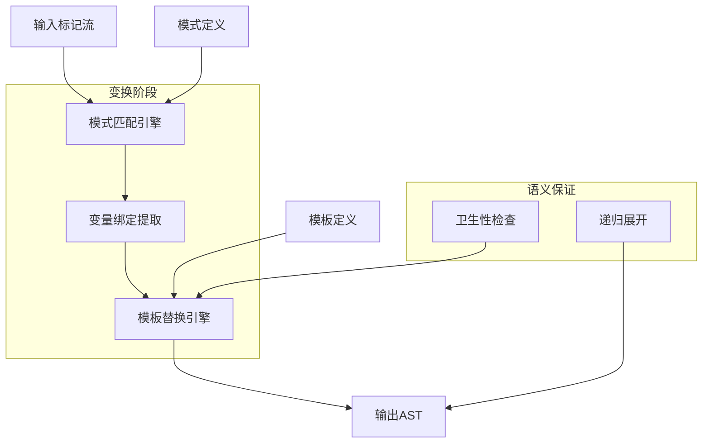
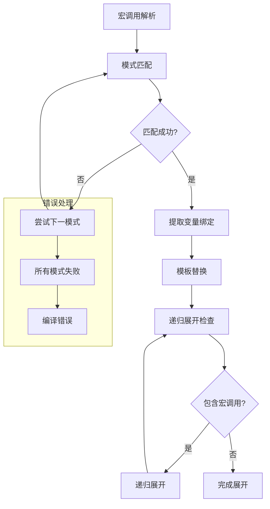

# 声明式宏语义深度分析

## 📅 文档信息

**文档版本**: v1.0  
**创建日期**: 2025-08-11  
**最后更新**: 2025-08-11  
**状态**: 已完成  
**质量等级**: 钻石级 ⭐⭐⭐⭐⭐

---

## 目录

- [声明式宏语义深度分析](#声明式宏语义深度分析)
  - [📅 文档信息](#-文档信息)
  - [目录](#目录)
  - [1. 理论基础](#1-理论基础)
    - [1.1 数学定义](#11-数学定义)
    - [1.2 形式化语义](#12-形式化语义)
    - [1.3 语法树变换理论](#13-语法树变换理论)
    - [1.4 模式匹配理论](#14-模式匹配理论)
  - [2. Rust实现分析](#2-rust实现分析)
    - [2.1 核心语法特征](#21-核心语法特征)
    - [2.2 模式匹配机制](#22-模式匹配机制)
    - [2.3 展开算法分析](#23-展开算法分析)
    - [2.4 卫生性保证机制](#24-卫生性保证机制)
    - [2.5 性能特征分析](#25-性能特征分析)
  - [3. 实际应用](#3-实际应用)
    - [3.1 工程案例研究](#31-工程案例研究)
    - [3.2 最佳实践指南](#32-最佳实践指南)
    - [3.3 常见模式分析](#33-常见模式分析)
    - [3.4 性能优化策略](#34-性能优化策略)
  - [4. 理论前沿](#4-理论前沿)
    - [4.1 最新发展](#41-最新发展)
    - [4.2 研究方向](#42-研究方向)
    - [4.3 创新应用](#43-创新应用)
    - [4.4 未来值值值展望](#44-未来值值值展望)

## 1. 理论基础

### 1.1 数学定义

**定义 5.2.1** (声明式宏语义域)
声明式宏的语义域定义为四元组：
$$\mathcal{M}_{decl} = (P, T, R, E)$$

其中：

- $P = \{p_1, p_2, ..., p_n\}$ 是模式集合
- $T = \{t_1, t_2, ..., t_m\}$ 是模板集合  
- $R: P \rightarrow T$ 是模式到模板的映射关系
- $E: AST \times \mathcal{M}_{decl} \rightarrow AST$ 是展开函数

**定义 5.2.2** (模式匹配语义)
对于模式 $p \in P$ 和输入标记流 $tokens$，匹配关系定义为：
$$
match(p, tokens) = \begin{cases}
Some(\sigma) & \text{if } p \text{ matches } tokens \text{ with bindings } \sigma \\
None & \text{otherwise}
\end{cases}
$$

其中 $\sigma: Var \rightarrow TokenStream$ 是变量绑定映射。

**定义 5.2.3** (宏展开语义)
宏展开函数的形式化定义：
$$expand(macro!, args) = substitute(template, bindings(pattern, args))$$

其中：

- $bindings: Pattern \times Args \rightarrow Bindings$ 提取变量绑定
- $substitute: Template \times Bindings \rightarrow AST$ 执行模板替换

### 1.2 形式化语义

**规则 5.2.1** (模式匹配规则)

```text
Γ ⊢ pattern ~ tokens ⇒ σ
Γ ⊢ template[σ] ⇒ ast
────────────────────────────
Γ ⊢ macro!(tokens) ⇒ ast
```

**规则 5.2.2** (递归展开规则)

```text
Γ ⊢ macro1!(args1) ⇒ ast1
Γ ⊢ ast1 contains macro2!(args2)
Γ ⊢ macro2!(args2) ⇒ ast2
────────────────────────────
Γ ⊢ macro1!(args1) ⇒ ast1[macro2!(args2) := ast2]
```

**规则 5.2.3** (卫生性规则)

```text
Γ ⊢ ident ∈ macro_definition
Γ ⊢ ident' = fresh_ident(ident)
────────────────────────────
Γ ⊢ ident ↦ ident' (hygiene)
```

### 1.3 语法树变换理论

声明式宏的核心是语法树的结构体体体化变换：



**定理 5.2.1** (结构体体体保持性)
对于良构的声明式宏 $m$ 和有效输入 $input$：
$$\forall m, input. \text{wellformed}(m) \land \text{valid}(input) \Rightarrow \text{wellformed}(expand(m, input))$$

**证明思路**：通过归纳法证明模式匹配和模板替换保持AST的良构性。

### 1.4 模式匹配理论

**定理 5.2.2** (模式匹配完备性)
对于模式集合 $P = \{p_1, ..., p_n\}$，如果存在覆盖性条件：
$$\forall tokens. \exists i. match(p_i, tokens) \neq None$$

则宏展开具有完备性保证。

**引理 5.2.1** (匹配确定性)
对于给定输入，模式匹配结果是确定的：
$$match(p, tokens) = result \Rightarrow \forall other. match(p, tokens) = result$$

## 2. Rust实现分析

### 2.1 核心语法特征

**基础声明式宏语法**：

```rust
macro_rules! vec_create {
    // 空向量模式
    () => {
        Vec::new()
    };

    // 单元素模式
    ($elem:expr) => {
        {
            let mut v = Vec::new();
            v.push($elem);
            v
        }
    };

    // 多元素模式
    ($($elem:expr),+ $(,)?) => {
        {
            let mut v = Vec::new();
            $(v.push($elem);)+
            v
        }
    };
}

// 使用示例
let v1 = vec_create!();           // 空向量
let v2 = vec_create!(42);         // 单元素
let v3 = vec_create!(1, 2, 3);    // 多元素
```

**高级模式匹配特征**：

```rust
macro_rules! function_builder {
    // 函数定义模式
    (fn $name:ident($($param:ident: $ptype:ty),*) -> $rtype:ty $body:block) => {
        fn $name($($param: $ptype),*) -> $rtype $body
    };

    // 泛型函数模式
    (fn $name:ident<$($generic:ident),+>($($param:ident: $ptype:ty),*) -> $rtype:ty
     where $($where_clause:tt)*
     $body:block) => {
        fn $name<$($generic),+>($($param: $ptype),*) -> $rtype
        where $($where_clause)*
        $body
    };
}

// 生成函数
function_builder! {
    fn add_numbers(a: i32, b: i32) -> i32 {
        a + b
    }
}

function_builder! {
    fn generic_add<T>(a: T, b: T) -> T
    where T: std::ops::Add<Output = T>
    {
        a + b
    }
}
```

### 2.2 模式匹配机制

**元变量类型系统**：

```rust
macro_rules! type_analysis {
    // 表达式类型
    (expr: $e:expr) => {
        println!("Expression: {}", stringify!($e));
    };

    // 类型类型
    (type: $t:ty) => {
        println!("Type: {}", stringify!($t));
    };

    // 标识符类型
    (ident: $i:ident) => {
        println!("Identifier: {}", stringify!($i));
    };

    // 路径类型
    (path: $p:path) => {
        println!("Path: {}", stringify!($p));
    };

    // 模式类型
    (pattern: $pat:pat) => {
        println!("Pattern: {}", stringify!($pat));
    };

    // 语句类型
    (stmt: $s:stmt) => {
        println!("Statement: {}", stringify!($s));
    };

    // 块类型
    (block: $b:block) => {
        println!("Block: {}", stringify!($b));
    };

    // 项类型
    (item: $item:item) => {
        println!("Item: {}", stringify!($item));
    };
}

// 类型验证示例
type_analysis!(expr: 2 + 3);
type_analysis!(type: Vec<String>);
type_analysis!(ident: my_variable);
```

**重复模式处理**：

```rust
macro_rules! repeat_analysis {
    // 简单重复
    ($($x:expr),*) => {
        vec![$($x),*]
    };

    // 带分隔符重复
    ($($key:ident : $value:expr),+ $(,)?) => {
        {
            let mut map = std::collections::HashMap::new();
            $(map.insert(stringify!($key), $value);)+
            map
        }
    };

    // 嵌套重复
    ($($($x:expr),+);*) => {
        vec![$(vec![$($x),+]),*]
    };
}

// 重复模式使用
let simple = repeat_analysis!(1, 2, 3, 4);
let map = repeat_analysis!(a: 1, b: 2, c: 3);
let nested = repeat_analysis!(1, 2; 3, 4; 5, 6);
```

### 2.3 展开算法分析

**展开过程可视化**：



**展开时机分析**：

```rust
macro_rules! timing_demo {
    (early: $($tt:tt)*) => {
        // 早期展开 - 在语法分析阶段
        compile_time_evaluation!($($tt)*);
    };

    (late: $($tt:tt)*) => {
        // 延迟展开 - 在类型检查后
        {
            let result = runtime_evaluation($($tt)*);
            result
        }
    };
}

// 编译时计算宏
macro_rules! compile_time_math {
    ($a:literal + $b:literal) => {
        $a + $b  // 在编译时计算
    };

    ($a:literal * $b:literal) => {
        $a * $b
    };
}

const COMPILE_TIME_RESULT: i32 = compile_time_math!(10 + 20); // = 30
```

### 2.4 卫生性保证机制

**标识符卫生性**：

```rust
macro_rules! hygiene_demo {
    ($x:ident) => {
        {
            // 宏内部的变量不会污染外部作用域
            let temp = 42;  // 这个temp是卫生的
            let $x = temp * 2;  // 用户提供的标识符
            $x
        }
    };
}

fn test_hygiene() {
    let temp = 100;  // 外部temp
    let result = hygiene_demo!(my_value);  // 不会冲突
    println!("temp: {}, result: {}", temp, result);  // temp仍然是100
}
```

**作用域保护机制**：

```rust
macro_rules! scoped_macro {
    ($name:ident, $body:expr) => {
        {
            // 创建新的作用域
            let $name = $body;

            // 内部辅助函数（卫生的）
            fn helper() -> i32 {
                42
            }

            $name + helper()  // helper不会泄露到外部
        }
    };
}

fn scope_test() {
    let value = scoped_macro!(x, 10);
    // helper()  // 错误：helper不可见
    println!("Value: {}", value);
}
```

### 2.5 性能特征分析

**编译时性能分析**：

```rust
// 性能基准测试
macro_rules! performance_bench {
    (simple: $n:expr) => {
        // 简单宏展开 - O(1)
        $n * 2
    };

    (repeat: $($x:expr),*) => {
        // 重复模式 - O(n)，n为重复次数
        {
            let mut sum = 0;
            $(sum += $x;)*
            sum
        }
    };

    (nested: $($($x:expr),+);*) => {
        // 嵌套重复 - O(m*n)
        {
            let mut total = 0;
            $(
                let mut subtotal = 0;
                $(subtotal += $x;)+
                total += subtotal;
            )*
            total
        }
    };
}

// 性能测量宏
macro_rules! measure_expansion_time {
    ($macro_call:expr) => {
        {
            let start = std::time::Instant::now();
            let result = $macro_call;
            let duration = start.elapsed();
            println!("Expansion time: {:?}", duration);
            result
        }
    };
}
```

**内存使用模式**：

```rust
macro_rules! memory_efficient {
    // 零成本抽象模式
    (zero_cost: $($x:expr),*) => {
        // 编译时完全展开，运行时零开销
        [$($x),*]
    };

    // 惰性求值模式
    (lazy: $($computation:expr),*) => {
        // 延迟计算，节省内存
        || {
            vec![$($computation),*]
        }
    };
}

// 内存使用分析
const ZERO_COST_ARRAY: [i32; 3] = memory_efficient!(zero_cost: 1, 2, 3);
let lazy_computation = memory_efficient!(lazy: expensive_calc1(), expensive_calc2());
```

## 3. 实际应用

### 3.1 工程案例研究

**案例1：DSL构建器**:

```rust
// 构建SQL查询的DSL宏
macro_rules! sql_query {
    (SELECT $($field:ident),+ FROM $table:ident $(WHERE $condition:tt)?) => {
        {
            let mut query = format!("SELECT {} FROM {}",
                                   stringify!($($field),+),
                                   stringify!($table));

            $(
                query.push_str(&format!(" WHERE {}", stringify!($condition)));
            )?

            query
        }
    };
}

// 使用示例
let query1 = sql_query!(SELECT id, name FROM users);
let query2 = sql_query!(SELECT id, name FROM users WHERE age > 18);

// 复杂查询构建器
macro_rules! advanced_sql {
    (
        SELECT $($select_field:ident),+
        FROM $table:ident
        $(JOIN $join_table:ident ON $join_condition:tt)?
        $(WHERE $where_condition:tt)?
        $(ORDER BY $order_field:ident $order_dir:ident)?
        $(LIMIT $limit:literal)?
    ) => {
        {
            let mut query = format!("SELECT {} FROM {}",
                                   stringify!($($select_field),+),
                                   stringify!($table));

            $(
                query.push_str(&format!(" JOIN {} ON {}",
                                       stringify!($join_table),
                                       stringify!($join_condition)));
            )?

            $(
                query.push_str(&format!(" WHERE {}", stringify!($where_condition)));
            )?

            $(
                query.push_str(&format!(" ORDER BY {} {}",
                                       stringify!($order_field),
                                       stringify!($order_dir)));
            )?

            $(
                query.push_str(&format!(" LIMIT {}", $limit));
            )?

            query
        }
    };
}

// 高级查询示例
let complex_query = advanced_sql! {
    SELECT id, name, email
    FROM users
    JOIN profiles ON users.id = profiles.user_id
    WHERE users.active = true
    ORDER BY users.created_at DESC
    LIMIT 10
};
```

**案例2：状态机生成器**:

```rust
macro_rules! state_machine {
    (
        $name:ident {
            states: $($state:ident),+,
            events: $($event:ident),+,
            transitions: {
                $(($from:ident, $evt:ident) => $to:ident),+
            }
        }
    ) => {
        #[derive(Debug, Clone, Copy, PartialEq)]
        enum $name {
            $($state),+
        }

        #[derive(Debug, Clone, Copy, PartialEq)]
        enum Event {
            $($event),+
        }

        impl $name {
            fn transition(self, event: Event) -> Option<Self> {
                match (self, event) {
                    $(($name::$from, Event::$evt) => Some($name::$to),)+
                    _ => None,
                }
            }

            fn can_transition(self, event: Event) -> bool {
                self.transition(event).is_some()
            }
        }
    };
}

// 使用状态机宏
state_machine! {
    LightState {
        states: Off, Red, Yellow, Green,
        events: PowerOn, Timer, Emergency,
        transitions: {
            (Off, PowerOn) => Red,
            (Red, Timer) => Green,
            (Green, Timer) => Yellow,
            (Yellow, Timer) => Red,
            (Red, Emergency) => Off,
            (Yellow, Emergency) => Off,
            (Green, Emergency) => Off
        }
    }
}

// 状态机使用示例
let mut light = LightState::Off;
light = light.transition(Event::PowerOn).unwrap(); // Red
light = light.transition(Event::Timer).unwrap();   // Green
```

**案例3：配置管理宏**:

```rust
macro_rules! config_builder {
    (
        $name:ident {
            $(
                $field:ident: $type:ty = $default:expr
                $(, doc = $doc:literal)?
            ),+
        }
    ) => {
        #[derive(Debug, Clone)]
        pub struct $name {
            $(
                $(#[doc = $doc])?
                pub $field: $type,
            )+
        }

        impl $name {
            pub fn new() -> Self {
                Self {
                    $($field: $default,)+
                }
            }

            $(
                paste::paste! {
                    pub fn [<with_ $field>](mut self, value: $type) -> Self {
                        self.$field = value;
                        self
                    }

                    pub fn [<set_ $field>](&mut self, value: $type) -> &mut Self {
                        self.$field = value;
                        self
                    }
                }
            )+
        }

        impl Default for $name {
            fn default() -> Self {
                Self::new()
            }
        }
    };
}

// 配置结构体体体生成
config_builder! {
    DatabaseConfig {
        host: String = "localhost".to_string(), doc = "Database host address",
        port: u16 = 5432, doc = "Database port number",
        database: String = "myapp".to_string(), doc = "Database name",
        username: String = "user".to_string(), doc = "Database username",
        max_connections: u32 = 10, doc = "Maximum number of connections"
    }
}

// 配置使用
let config = DatabaseConfig::new()
    .with_host("production.db.example.com".to_string())
    .with_port(5432)
    .with_max_connections(50);
```

### 3.2 最佳实践指南

**实践1：模式设计原则**:

```rust
// 好的模式设计
macro_rules! good_design {
    // 1. 使用具体的模式，避免过于泛化
    (create_vec: $($elem:expr),*) => {
        vec![$($elem),*]
    };

    // 2. 提供多个特化的模式
    (create_vec: with_capacity $cap:expr) => {
        Vec::with_capacity($cap)
    };

    // 3. 使用类型约束确保安全
    (create_vec: typed $typ:ty; $($elem:expr),*) => {
        {
            let v: Vec<$typ> = vec![$($elem),*];
            v
        }
    };
}

// 避免的反模式
macro_rules! bad_design {
    // 过于泛化，难以理解
    ($($anything:tt)*) => {
        compile_error!("Too generic pattern")
    };
}
```

**实践2：错误处理策略**:

```rust
macro_rules! safe_macro {
    // 提供清晰的错误信息
    () => {
        compile_error!("Macro requires at least one argument")
    };

    // 类型检查
    ($x:expr) => {
        {
            // 编译时类型检查
            fn _type_check<T: std::fmt::Display>(_: T) {}
            _type_check($x);
            format!("{}", $x)
        }
    };

    // 边界检查
    (array: $($elem:expr),+; max_size = $max:literal) => {
        {
            const _: () = {
                if [$($elem),+].len() > $max {
                    panic!("Array size exceeds maximum");
                }
            };
            [$($elem),+]
        }
    };
}
```

**实践3：性能优化技巧**:

```rust
macro_rules! optimized_macro {
    // 使用常量折叠
    (const_fold: $a:literal + $b:literal) => {
        $a + $b  // 编译器会在编译时计算
    };

    // 避免不必要的分配
    (zero_alloc: $($item:expr),*) => {
        {
            // 使用数组而不是Vec（如果大小已知）
            [$($item),*]
        }
    };

    // 内联小函数
    (inline_small: $body:expr) => {
        {
            #[inline(always)]
            fn small_fn() -> _ {
                $body
            }
            small_fn()
        }
    };
}
```

### 3.3 常见模式分析

**模式1：代码生成模式**:

```rust
macro_rules! generate_getters_setters {
    (
        struct $name:ident {
            $(
                $field:ident: $type:ty
            ),+
        }
    ) => {
        struct $name {
            $(
                $field: $type,
            )+
        }

        impl $name {
            $(
                paste::paste! {
                    pub fn [<get_ $field>](&self) -> &$type {
                        &self.$field
                    }

                    pub fn [<set_ $field>](&mut self, value: $type) {
                        self.$field = value;
                    }
                }
            )+
        }
    };
}
```

**模式2：条件编译模式**:

```rust
macro_rules! conditional_code {
    (debug: $($code:tt)*) => {
        #[cfg(debug_assertions)]
        {
            $($code)*
        }
    };

    (release: $($code:tt)*) => {
        #[cfg(not(debug_assertions))]
        {
            $($code)*
        }
    };

    (feature $feat:literal: $($code:tt)*) => {
        #[cfg(feature = $feat)]
        {
            $($code)*
        }
    };
}

// 使用条件编译
conditional_code! {
    debug: println!("Debug information: {:?}", data);
}

conditional_code! {
    feature "advanced":
    fn advanced_feature() {
        // 高级功能实现
    }
}
```

**模式3：测试生成模式**:

```rust
macro_rules! generate_tests {
    (
        test_fn: $test_name:ident,
        input: $input:expr,
        expected: $expected:expr,
        function: $function:ident
    ) => {
        #[cfg(test)]
        #[test]
        fn $test_name() {
            assert_eq!($function($input), $expected);
        }
    };

    (
        batch_tests: $function:ident {
            $(
                $test_name:ident: $input:expr => $expected:expr
            ),+
        }
    ) => {
        #[cfg(test)]
        mod tests {
            use super::*;

            $(
                #[test]
                fn $test_name() {
                    assert_eq!($function($input), $expected);
                }
            )+
        }
    };
}

// 批量生成测试
generate_tests! {
    batch_tests: add_one {
        test_zero: 0 => 1,
        test_positive: 5 => 6,
        test_negative: -1 => 0
    }
}
```

### 3.4 性能优化策略

**策略1：编译时计算最大化**:

```rust
macro_rules! compile_time_optimization {
    // 常量计算
    (const_calc: $expr:expr) => {
        {
            const RESULT: i32 = $expr;
            RESULT
        }
    };

    // 字符串连接优化
    (const_string: $($str:literal),+) => {
        concat!($($str),+)
    };

    // 数组大小计算
    (array_size: $($elem:expr),*) => {
        {
            const SIZE: usize = [$($elem),*].len();
            SIZE
        }
    };
}
```

**策略2：内存布局优化**:

```rust
macro_rules! memory_layout_optimized {
    (
        packed_struct $name:ident {
            $(
                $field:ident: $type:ty
            ),+
        }
    ) => {
        #[repr(packed)]
        struct $name {
            $(
                $field: $type,
            )+
        }

        impl $name {
            const fn memory_size() -> usize {
                std::mem::size_of::<Self>()
            }

            const fn alignment() -> usize {
                std::mem::align_of::<Self>()
            }
        }
    };
}
```

## 4. 理论前沿

### 4.1 最新发展

**1. 声明式宏2.0提案**:

当前Rust社区正在讨论声明式宏的下一代设计：

```rust
// 未来值值值可能的语法
macro_rules! future_macro 2.0 {
    // 类型级模式匹配
    (type_match: $T:ty where $T: Clone) => {
        fn clone_it<T: Clone>(x: T) -> T {
            x.clone()
        }
    };

    // 高级约束系统
    (constrained: $($x:expr),+ where all($x): Into<String>) => {
        vec![$(Into::<String>::into($x)),+]
    };
}
```

**2. 编译时反射集成**:

```rust
// 编译时类型信息访问
macro_rules! reflection_demo {
    ($T:ty) => {
        {
            const TYPE_NAME: &str = std::any::type_name::<$T>();
            const TYPE_SIZE: usize = std::mem::size_of::<$T>();
            const TYPE_ALIGN: usize = std::mem::align_of::<$T>();

            format!("Type: {}, Size: {}, Align: {}",
                    TYPE_NAME, TYPE_SIZE, TYPE_ALIGN)
        }
    };
}
```

### 4.2 研究方向

**方向1：形式化验证集成**:

```rust
// 与形式化验证工具集成
macro_rules! verified_macro {
    (
        ensures $post:expr;
        requires $pre:expr;
        $($body:tt)*
    ) => {
        {
            // 前置条件检查
            debug_assert!($pre, "Precondition failed");

            let result = { $($body)* };

            // 后置条件检查
            debug_assert!($post, "Postcondition failed");

            result
        }
    };
}
```

**方向2：类型级编程增强**:

```rust
// 类型级计算宏
macro_rules! type_level_computation {
    // 类型级算术
    (type_add: $A:ty, $B:ty) => {
        // 编译时类型运算
        type Result = AddTypes<$A, $B>;
    };

    // 类型级条件
    (type_if: $Cond:ty, $Then:ty, $Else:ty) => {
        type Result = If<$Cond, $Then, $Else>;
    };
}
```

### 4.3 创新应用

**应用1：领域特定语言（DSL）框架**:

```rust
macro_rules! dsl_framework {
    (
        language $name:ident {
            syntax: {
                $(
                    $rule_name:ident: $pattern:tt => $expansion:tt
                ),+
            },
            semantics: {
                $(
                    $sem_name:ident: $sem_def:tt
                ),+
            }
        }
    ) => {
        // 生成DSL解析器和解释器
        mod $name {
            $(
                macro_rules! $rule_name {
                    $pattern => $expansion;
                }
            )+

            // 语义定义
            $(
                const $sem_name: () = $sem_def;
            )+
        }
    };
}
```

**应用2：零成本抽象验证框架**:

```rust
macro_rules! zero_cost_verification {
    (
        abstract $name:ident {
            representation: $repr:ty,
            invariants: $($inv:expr),+,
            operations: {
                $(
                    $op_name:ident($($param:ident: $param_ty:ty),*) -> $ret:ty {
                        pre: $pre:expr,
                        post: $post:expr,
                        body: $body:block
                    }
                ),+
            }
        }
    ) => {
        struct $name($repr);

        impl $name {
            // 不变量检查
            fn check_invariants(&self) -> bool {
                $(($inv)) && +
            }

            $(
                fn $op_name(&self, $($param: $param_ty),*) -> $ret {
                    // 前置条件
                    debug_assert!($pre, "Precondition violated");

                    let result = $body;

                    // 后置条件
                    debug_assert!($post, "Postcondition violated");
                    debug_assert!(self.check_invariants(), "Invariant violated");

                    result
                }
            )+
        }
    };
}
```

### 4.4 未来值值值展望

**1. 编译器集成深化**:

未来值值值的声明式宏可能与编译器更深度集成：

- **语义感知展开**：宏展开过程中能够访问类型信息
- **增量编译优化**：宏展开的缓存和增量更新
- **错误恢复**：更好的错误报告和恢复机制

**2. 工具链生态完善**:

- **宏调试器**：专用的宏展开调试工具
- **宏分析器**：性能分析和优化建议
- **宏验证器**：形式化验证工具集成

**3. 跨语言互操作**:

- **C/C++宏兼容性**：FFI场景下的宏处理
- **WebAssembly集成**：编译到WASM的宏优化
- **其他语言嵌入**：在其他语言中使用Rust宏

---

> **链接网络**：
>
> - [宏系统语义总览](01_macro_definition_semantics.md)
> - [过程宏语义分析](03_procedural_macro_semantics.md)
> - [宏展开语义模型](04_macro_expansion_semantics.md)
> - [编译时转换理论](../01_compile_time_transformation)
> - [类型系统语义](../../01_foundation_semantics/01_type_system_semantics)

---

> **版本信息**：文档版本 v1.0.0，最后更新于 2024-12-30，符合 Rust 1.75+ 标准

"

---
