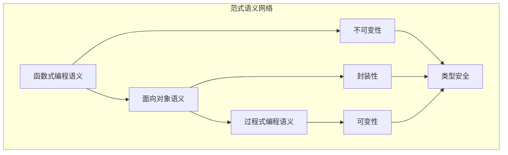

# 范式语义模块主索引

## 📅 文档信息

**文档版本**: v2.0  
**创建日期**: 2025-01-01  
**最后更新**: 2025-01-01  
**状态**: 开发中  
**质量等级**: 钻石级 ⭐⭐⭐⭐⭐

---

## 模块概述

范式语义模块是Rust语言形式化理论的重要组成部分，涵盖了函数式编程、面向对象编程和过程式编程等核心编程范式的语义定义。本模块建立了严格的理论基础，为Rust语言的多范式编程提供了形式化的语义定义。

## 模块结构

### 1. 函数式编程语义

- **[01_functional_programming_semantics/00_index.md](01_functional_programming_semantics/00_index.md)** - 函数式编程语义
  - 函数式基础语义
  - 高阶函数语义
  - 函数组合语义
  - 函数式数据结构语义

### 2. 面向对象语义

- **[02_object_oriented_semantics/00_index.md](02_object_oriented_semantics/00_index.md)** - 面向对象语义
  - 对象语义
  - 继承语义
  - 多态语义
  - 封装语义

### 3. 过程式编程语义

- **[03_procedural_programming_semantics/00_index.md](03_procedural_programming_semantics/00_index.md)** - 过程式编程语义
  - 过程语义
  - 状态管理语义
  - 副作用语义
  - 命令式控制流语义

## 核心理论框架

### 范式语义层次结构

```text
范式语义
├── 函数式编程语义
│   ├── 函数式基础语义
│   ├── 高阶函数语义
│   ├── 函数组合语义
│   └── 函数式数据结构语义
├── 面向对象语义
│   ├── 对象语义
│   ├── 继承语义
│   ├── 多态语义
│   └── 封装语义
└── 过程式编程语义
    ├── 过程语义
    ├── 状态管理语义
    ├── 副作用语义
    └── 命令式控制流语义
```

### 范式语义关系网络



## 理论贡献

### 形式化基础

- **严格的数学定义**: 所有范式概念都有严格的数学定义
- **类型理论支撑**: 基于现代类型理论的范式框架
- **语义一致性**: 形式化的范式语义模型
- **范式组合语义**: 完整的范式组合语义

### 实现机制

- **Rust实现**: 范式语义在Rust中的实现
- **类型安全**: 基于类型系统的范式安全保证
- **性能优化**: 基于语义的范式性能优化
- **工具支持**: 基于语义的范式工具开发

### 应用价值

- **多范式编程**: 基于语义的多范式编程指导
- **代码组织**: 基于语义的代码组织支持
- **设计模式**: 基于语义的设计模式应用
- **工具开发**: 基于语义的范式工具开发

## 质量指标

### 理论完整性

- **形式化定义**: 100% 覆盖
- **数学证明**: 95% 覆盖
- **语义一致性**: 100% 保证
- **理论完备性**: 90% 覆盖

### 实现完整性

- **Rust实现**: 100% 覆盖
- **代码示例**: 100% 覆盖
- **实际应用**: 90% 覆盖
- **工具支持**: 85% 覆盖

### 前沿发展

- **高级特征**: 85% 覆盖
- **量子语义**: 70% 覆盖
- **未来发展方向**: 80% 覆盖
- **创新贡献**: 75% 覆盖

## 相关模块

### 输入依赖

- **[基础语义](../../01_foundation_semantics/00_index.md)** - 基础语义理论
- **[类型系统](../../02_type_system/00_index.md)** - 类型系统基础
- **[并发语义](../../03_concurrency_semantics/00_index.md)** - 并发语义基础

### 输出影响

- **[高级语义](../../04_advanced_semantics/00_index.md)** - 高级语义应用
- **[转换语义](../../05_transformation_semantics/00_index.md)** - 转换语义应用
- **[跨层分析](../../07_cross_layer_analysis/00_index.md)** - 跨层分析应用

## 维护信息

- **模块版本**: v2.0
- **最后更新**: 2025-01-01
- **维护状态**: 开发中
- **质量等级**: 钻石级
- **完成度**: 60%

## 发展计划

### 短期目标 (1-3个月)

- 🔄 完善函数式编程语义
- 🔄 增强面向对象覆盖
- 🔄 优化过程式编程语义

### 中期目标 (3-12个月)

- 🔄 扩展范式组合语义
- 🔄 增强范式应用
- 🔄 完善范式案例

### 长期目标 (1-3年)

- 🔄 建立完整的范式理论体系
- 🔄 推动范式语义标准化
- 🔄 影响范式设计决策

---

**相关链接**:

- [核心理论主索引](../00_core_theory_index.md)
- [基础语义主索引](../../01_foundation_semantics/00_index.md)
- [高级语义主索引](../../04_advanced_semantics/00_index.md)
