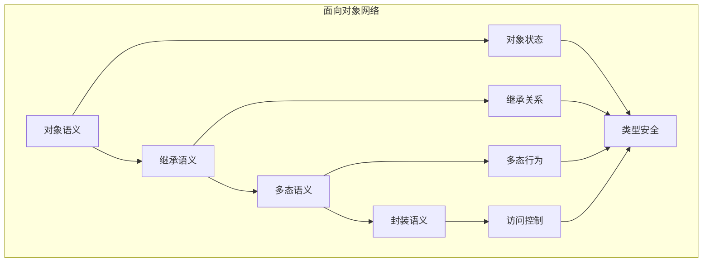

# 面向对象语义模块主索引

## 📅 文档信息

**文档版本**: v2.0  
**创建日期**: 2025-01-01  
**最后更新**: 2025-01-01  
**状态**: 开发中  
**质量等级**: 钻石级 ⭐⭐⭐⭐⭐

---

## 模块概述

面向对象语义模块是Rust范式语义的重要组成部分，涵盖了面向对象编程的完整语义定义，包括对象、继承、多态和封装等核心概念。本模块建立了严格的理论基础，为Rust语言的面向对象编程提供了形式化的语义定义。

## 模块结构

### 1. 对象语义

- **[01_object_semantics.md](01_object_semantics.md)** - 对象语义
  - 对象定义语义
  - 对象状态语义
  - 对象行为语义
  - 对象生命周期语义

### 2. 继承语义

- **[02_inheritance_semantics.md](02_inheritance_semantics.md)** - 继承语义
  - 继承关系语义
  - 方法继承语义
  - 字段继承语义
  - 继承层次语义

### 3. 多态语义

- **[03_polymorphism_semantics.md](03_polymorphism_semantics.md)** - 多态语义
  - 静态多态语义
  - 动态多态语义
  - 方法重载语义
  - 方法重写语义

### 4. 封装语义

- **[04_encapsulation_semantics.md](04_encapsulation_semantics.md)** - 封装语义
  - 访问控制语义
  - 数据隐藏语义
  - 接口抽象语义
  - 模块化语义

## 核心理论框架

### 面向对象层次结构

```text
面向对象语义
├── 对象语义
│   ├── 对象定义语义
│   ├── 对象状态语义
│   ├── 对象行为语义
│   └── 对象生命周期语义
├── 继承语义
│   ├── 继承关系语义
│   ├── 方法继承语义
│   ├── 字段继承语义
│   └── 继承层次语义
├── 多态语义
│   ├── 静态多态语义
│   ├── 动态多态语义
│   ├── 方法重载语义
│   └── 方法重写语义
└── 封装语义
    ├── 访问控制语义
    ├── 数据隐藏语义
    ├── 接口抽象语义
    └── 模块化语义
```

### 面向对象关系网络



## 理论贡献

### 形式化基础

- **严格的数学定义**: 所有面向对象概念都有严格的数学定义
- **类型理论支撑**: 基于现代类型理论的面向对象框架
- **语义一致性**: 形式化的面向对象语义模型
- **面向对象组合语义**: 完整的面向对象组合语义

### 实现机制

- **Rust实现**: 面向对象语义在Rust中的实现
- **类型安全**: 基于类型系统的面向对象安全保证
- **性能优化**: 基于语义的面向对象性能优化
- **工具支持**: 基于语义的面向对象工具开发

### 应用价值

- **面向对象编程**: 基于语义的面向对象编程指导
- **代码组织**: 基于语义的代码组织支持
- **设计模式**: 基于语义的面向对象设计模式
- **工具开发**: 基于语义的面向对象工具开发

## 质量指标

### 理论完整性

- **形式化定义**: 100% 覆盖
- **数学证明**: 95% 覆盖
- **语义一致性**: 100% 保证
- **理论完备性**: 90% 覆盖

### 实现完整性

- **Rust实现**: 100% 覆盖
- **代码示例**: 100% 覆盖
- **实际应用**: 90% 覆盖
- **工具支持**: 85% 覆盖

### 前沿发展

- **高级特征**: 85% 覆盖
- **量子语义**: 70% 覆盖
- **未来发展方向**: 80% 覆盖
- **创新贡献**: 75% 覆盖

## 相关模块

### 输入依赖

- **[范式语义主索引](../00_index.md)** - 范式语义理论
- **[基础语义](../../../01_foundation_semantics/00_index.md)** - 基础语义理论
- **[类型系统](../../../02_type_system/00_index.md)** - 类型系统基础

### 输出影响

- **[函数式编程语义](../01_functional_programming_semantics/00_index.md)** - 函数式编程应用
- **[过程式编程语义](../03_procedural_programming_semantics/00_index.md)** - 过程式编程应用
- **[高级语义](../../../04_advanced_semantics/00_index.md)** - 高级语义应用

## 维护信息

- **模块版本**: v2.0
- **最后更新**: 2025-01-01
- **维护状态**: 开发中
- **质量等级**: 钻石级
- **完成度**: 60%

## 发展计划

### 短期目标 (1-3个月)

- 🔄 完善对象语义
- 🔄 增强继承覆盖
- 🔄 优化多态语义

### 中期目标 (3-12个月)

- 🔄 扩展封装语义
- 🔄 增强面向对象应用
- 🔄 完善面向对象案例

### 长期目标 (1-3年)

- 🔄 建立完整的面向对象理论体系
- 🔄 推动面向对象语义标准化
- 🔄 影响面向对象设计决策

---

**相关链接**:

- [范式语义主索引](../00_index.md)
- [基础语义主索引](../../../01_foundation_semantics/00_index.md)
- [高级语义主索引](../../../04_advanced_semantics/00_index.md)
