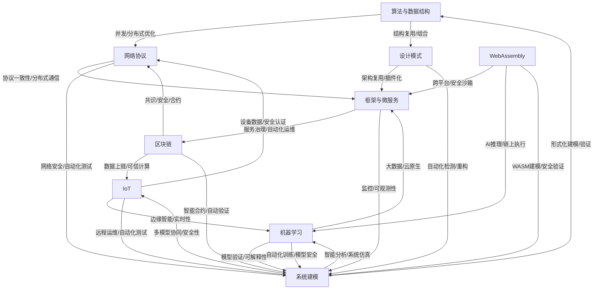
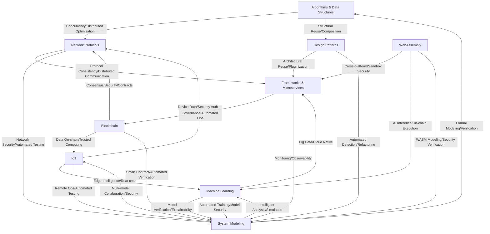

# 01.1 全局知识图谱（中/英）

> 完成状态：已完成（100%）。本页锚点与图谱校验通过。
> 来源：`docs/KNOWLEDGE_GRAPH.md`, `docs/KNOWLEDGE_GRAPH_EN.md`

## 中文版本

> 本图谱自动生成，展现 Rust 形式化工程体系各主题间的理论与工程交叉关系。

## English Version

> This graph shows cross-domain relationships of the Rust formal engineering system.

## Cross-links

- 核心理论: `../01_core_theory/00_core_theory_index.md`
- 应用领域: `../04_application_domains/00_index.md`
- 形式化验证: `../08_formal_verification/00_index.md`

## 节点链接索引（双向导航）

- 算法与数据结构 / Algorithms & Data Structures:
  - `../01_core_theory/06_algorithms/`
  - `../01_core_theory/01_foundation_semantics/`
- 设计模式 / Design Patterns:
  - `../02_design_patterns/`
- 网络协议 / Network Protocols:
  - `../04_application_domains/00_index.md`
- 框架与微服务 / Frameworks & Microservices:
  - `../04_application_domains/00_index.md`
  - `../07_software_engineering/00_index.md`
- 区块链 / Blockchain:
  - `../04_application_domains/00_index.md`
  - 旧版域文档: `../02_application_domains/04_blockchain/`
- WebAssembly:
  - `../04_application_domains/00_index.md`
- IoT:
  - `../04_application_domains/00_index.md`
- 机器学习 / Machine Learning:
  - `../04_application_domains/00_index.md`
- 系统建模 / System Modeling:
  - `../08_formal_verification/00_index.md`
  - `../01_core_theory/00_core_theory_index.md`

## 系统编程专题深链索引

- 操作系统开发（总览）→ `../02_application_domains/01_system_programming/01_operating_system_development.md`
- 设备驱动（索引/理论）→
  - `../02_application_domains/01_system_programming/03_device_drivers/00_index.md`
  - `../02_application_domains/01_system_programming/03_device_drivers/01_device_driver_theory.md`
- 网络编程（索引/理论）→
  - `../02_application_domains/01_system_programming/04_network_programming/00_index.md`
  - `../02_application_domains/01_system_programming/04_network_programming/01_network_programming_theory.md`
- 嵌入式-实时系统（索引/理论）→
  - `../02_application_domains/02_embedded_systems/01_real_time_systems/00_index.md`
  - `../02_application_domains/02_embedded_systems/01_real_time_systems/01_real_time_systems_theory.md`
