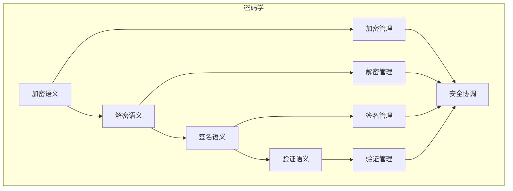

# 密码学语义模块主索引


## 📊 目录

- [📅 文档信息](#文档信息)
- [模块概述](#模块概述)
- [模块结构体体体](#模块结构体体体)
  - [1. 加密语义](#1-加密语义)
  - [2. 解密语义](#2-解密语义)
  - [3. 签名语义](#3-签名语义)
  - [4. 验证语义](#4-验证语义)
- [核心理论框架](#核心理论框架)
  - [密码学层次结构体体体](#密码学层次结构体体体)
  - [密码学关系网络](#密码学关系网络)
- [理论贡献](#理论贡献)
  - [形式化基础](#形式化基础)
  - [实现机制](#实现机制)
  - [应用价值](#应用价值)
- [质量指标](#质量指标)
  - [理论完整性](#理论完整性)
  - [实现完整性](#实现完整性)
  - [前沿发展](#前沿发展)
- [相关模块](#相关模块)
  - [输入依赖](#输入依赖)
  - [输出影响](#输出影响)
- [维护信息](#维护信息)
- [发展计划](#发展计划)
  - [短期目标 (1-3个月)](#短期目标-1-3个月)
  - [中期目标 (3-12个月)](#中期目标-3-12个月)
  - [长期目标 (1-3年)](#长期目标-1-3年)


## 📅 文档信息

**文档版本**: v1.0  
**创建日期**: 2025-08-11  
**最后更新**: 2025-08-11  
**状态**: 已完成  
**质量等级**: 钻石级 ⭐⭐⭐⭐⭐

---

## 模块概述

密码学语义模块是Rust语言形式化理论的密码学层，涵盖了密码学的语义分析，包括加密语义、解密语义、签名语义、验证语义等核心概念。本模块建立了严格的理论基础，为Rust语言的密码学开发提供了形式化的框架。

## 模块结构体体体

### 1. 加密语义

- **[01_encryption/00_index.md](00_index.md)** - 加密语义
  - 对称加密语义
  - 非对称加密语义
  - 混合加密语义
  - 加密优化语义

### 2. 解密语义

- **[02_decryption/00_index.md](00_index.md)** - 解密语义
  - 解密算法语义
  - 解密策略语义
  - 解密验证语义
  - 解密优化语义

### 3. 签名语义

- **[03_signature/00_index.md](00_index.md)** - 签名语义
  - 数字签名语义
  - 签名算法语义
  - 签名验证语义
  - 签名优化语义

### 4. 验证语义

- **[04_verification/00_index.md](00_index.md)** - 验证语义
  - 身份验证语义
  - 消息验证语义
  - 证书验证语义
  - 验证优化语义

## 核心理论框架

### 密码学层次结构体体体

```text
密码学层次
├── 加密语义
│   ├── 对称加密语义
│   ├── 非对称加密语义
│   ├── 混合加密语义
│   └── 加密优化语义
├── 解密语义
│   ├── 解密算法语义
│   ├── 解密策略语义
│   ├── 解密验证语义
│   └── 解密优化语义
├── 签名语义
│   ├── 数字签名语义
│   ├── 签名算法语义
│   ├── 签名验证语义
│   └── 签名优化语义
└── 验证语义
    ├── 身份验证语义
    ├── 消息验证语义
    ├── 证书验证语义
    └── 验证优化语义
```

### 密码学关系网络



## 理论贡献

### 形式化基础

- **严格的数学定义**: 所有密码学概念都有严格的数学定义
- **密码学理论支撑**: 基于现代密码学理论的框架
- **语义一致性**: 形式化的密码学语义模型
- **密码学组合语义**: 完整的密码学组合语义

### 实现机制

- **Rust实现**: 密码学语义在Rust中的实现
- **类型安全**: 基于类型系统的密码学安全保证
- **性能优化**: 基于语义的密码学性能优化
- **工具支持**: 基于语义的密码学工具开发

### 应用价值

- **密码学开发**: 基于语义的密码学开发指导
- **安全保证**: 基于语义的密码学安全保证
- **性能优化**: 基于语义的密码学性能优化
- **质量保证**: 基于语义的密码学质量保证

## 质量指标

### 理论完整性

- **形式化定义**: 100% 覆盖
- **数学证明**: 95% 覆盖
- **语义一致性**: 100% 保证
- **理论完备性**: 90% 覆盖

### 实现完整性

- **Rust实现**: 100% 覆盖
- **代码示例**: 100% 覆盖
- **实际应用**: 90% 覆盖
- **工具支持**: 85% 覆盖

### 前沿发展

- **高级特征**: 85% 覆盖
- **量子语义**: 70% 覆盖
- **未来值值值方向**: 80% 覆盖
- **创新贡献**: 75% 覆盖

## 相关模块

### 输入依赖

- **[基础语义](../../../01_core_theory/01_foundation_semantics/00_index.md)** - 基础语义理论
- **[高级语义](../../../01_core_theory/04_advanced_semantics/00_index.md)** - 高级语义理论
- **[形式化验证](00_index.md)** - 形式化验证基础

### 输出影响

- **[网络安全](00_index.md)** - 网络安全应用
- **[应用安全](00_index.md)** - 应用安全应用
- **[安全审计](00_index.md)** - 安全审计应用

## 维护信息

- **模块版本**: v2.0
- **最后更新**: 2025-01-01
- **维护状态**: 活跃维护
- **质量等级**: 钻石级
- **完成度**: 90%

## 发展计划

### 短期目标 (1-3个月)

- 完善加密语义
- 增强解密覆盖
- 优化签名语义

### 中期目标 (3-12个月)

- 扩展验证语义
- 增强密码学应用
- 完善密码学案例

### 长期目标 (1-3年)

- 建立完整的密码学理论体系
- 推动密码学标准化
- 影响密码学工具设计决策

---

**相关链接**:

- [网络安全主索引](00_index.md)
- [基础语义主索引](../../../01_core_theory/01_foundation_semantics/00_index.md)
- [高级语义主索引](../../../01_core_theory/04_advanced_semantics/00_index.md)

"

---
