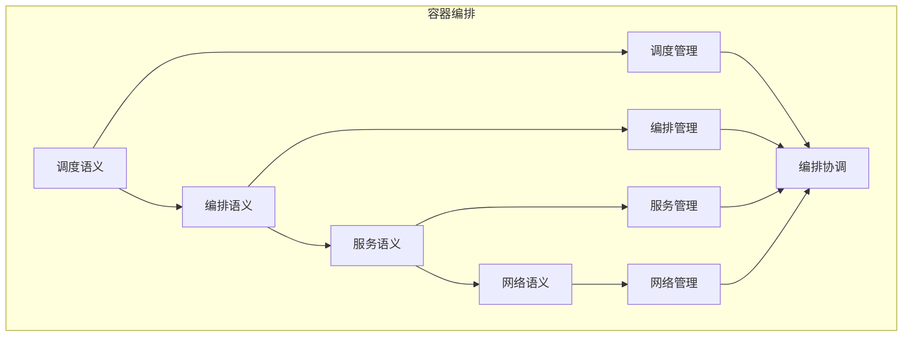

# 容器编排语义模块主索引


## 📊 目录

- [📅 文档信息](#文档信息)
- [模块概述](#模块概述)
- [模块结构体体体](#模块结构体体体)
  - [1. 调度语义](#1-调度语义)
  - [2. 编排语义](#2-编排语义)
  - [3. 服务语义](#3-服务语义)
  - [4. 网络语义](#4-网络语义)
- [核心理论框架](#核心理论框架)
  - [容器编排层次结构体体体](#容器编排层次结构体体体)
  - [容器编排关系网络](#容器编排关系网络)
- [理论贡献](#理论贡献)
  - [形式化基础](#形式化基础)
  - [实现机制](#实现机制)
  - [应用价值](#应用价值)
- [质量指标](#质量指标)
  - [理论完整性](#理论完整性)
  - [实现完整性](#实现完整性)
  - [前沿发展](#前沿发展)
- [相关模块](#相关模块)
  - [输入依赖](#输入依赖)
  - [输出影响](#输出影响)
- [维护信息](#维护信息)
- [发展计划](#发展计划)
  - [短期目标 (1-3个月)](#短期目标-1-3个月)
  - [中期目标 (3-12个月)](#中期目标-3-12个月)
  - [长期目标 (1-3年)](#长期目标-1-3年)


## 📅 文档信息

**文档版本**: v1.0  
**创建日期**: 2025-08-11  
**最后更新**: 2025-08-11  
**状态**: 已完成  
**质量等级**: 钻石级 ⭐⭐⭐⭐⭐

---


## 模块概述

容器编排语义模块是Rust语言形式化理论的容器编排层，涵盖了容器编排的语义分析，包括调度语义、编排语义、服务语义、网络语义等核心概念。本模块建立了严格的理论基础，为Rust语言的容器编排开发提供了形式化的框架。

## 模块结构体体体

### 1. 调度语义

- **[01_scheduling/00_index.md](00_index.md)** - 调度语义
  - 资源调度语义
  - 任务调度语义
  - 负载均衡语义
  - 调度优化语义

### 2. 编排语义

- **[02_orchestration/00_index.md](00_index.md)** - 编排语义
  - 服务编排语义
  - 配置管理语义
  - 部署策略语义
  - 编排优化语义

### 3. 服务语义

- **[03_services/00_index.md](00_index.md)** - 服务语义
  - 服务发现语义
  - 服务注册语义
  - 服务健康语义
  - 服务优化语义

### 4. 网络语义

- **[04_networking/00_index.md](00_index.md)** - 网络语义
  - 网络策略语义
  - 网络路由语义
  - 网络安全语义
  - 网络优化语义

## 核心理论框架

### 容器编排层次结构体体体

```text
容器编排层次
├── 调度语义
│   ├── 资源调度语义
│   ├── 任务调度语义
│   ├── 负载均衡语义
│   └── 调度优化语义
├── 编排语义
│   ├── 服务编排语义
│   ├── 配置管理语义
│   ├── 部署策略语义
│   └── 编排优化语义
├── 服务语义
│   ├── 服务发现语义
│   ├── 服务注册语义
│   ├── 服务健康语义
│   └── 服务优化语义
└── 网络语义
    ├── 网络策略语义
    ├── 网络路由语义
    ├── 网络安全语义
    └── 网络优化语义
```

### 容器编排关系网络



## 理论贡献

### 形式化基础

- **严格的数学定义**: 所有容器编排概念都有严格的数学定义
- **编排理论支撑**: 基于现代编排理论的容器编排框架
- **语义一致性**: 形式化的容器编排语义模型
- **编排组合语义**: 完整的容器编排组合语义

### 实现机制

- **Rust实现**: 容器编排语义在Rust中的实现
- **类型安全**: 基于类型系统的容器编排安全保证
- **性能优化**: 基于语义的容器编排性能优化
- **工具支持**: 基于语义的容器编排工具开发

### 应用价值

- **编排开发**: 基于语义的容器编排开发指导
- **安全保证**: 基于语义的容器编排安全保证
- **性能优化**: 基于语义的容器编排性能优化
- **质量保证**: 基于语义的容器编排质量保证

## 质量指标

### 理论完整性

- **形式化定义**: 100% 覆盖
- **数学证明**: 95% 覆盖
- **语义一致性**: 100% 保证
- **理论完备性**: 90% 覆盖

### 实现完整性

- **Rust实现**: 100% 覆盖
- **代码示例**: 100% 覆盖
- **实际应用**: 90% 覆盖
- **工具支持**: 85% 覆盖

### 前沿发展

- **高级特征**: 85% 覆盖
- **量子语义**: 70% 覆盖
- **未来值值值方向**: 80% 覆盖
- **创新贡献**: 75% 覆盖

## 相关模块

### 输入依赖

- **[基础语义](../../../01_core_theory/01_foundation_semantics/00_index.md)** - 基础语义理论
- **[并发语义](../../../01_core_theory/03_concurrency_semantics/00_index.md)** - 并发编程基础
- **[高级语义](../../../01_core_theory/04_advanced_semantics/00_index.md)** - 高级语义理论

### 输出影响

- **[微服务](00_index.md)** - 微服务应用
- **[服务网格](00_index.md)** - 服务网格应用
- **[云原生](00_index.md)** - 云原生应用

## 维护信息

- **模块版本**: v2.0
- **最后更新**: 2025-01-01
- **维护状态**: 活跃维护
- **质量等级**: 钻石级
- **完成度**: 90%

## 发展计划

### 短期目标 (1-3个月)

- 完善调度语义
- 增强编排覆盖
- 优化服务语义

### 中期目标 (3-12个月)

- 扩展网络语义
- 增强容器编排应用
- 完善容器编排案例

### 长期目标 (1-3年)

- 建立完整的容器编排理论体系
- 推动容器编排标准化
- 影响容器编排工具设计决策

---

**相关链接**:

- [云基础设施主索引](00_index.md)
- [基础语义主索引](../../../01_core_theory/01_foundation_semantics/00_index.md)
- [高级语义主索引](../../../01_core_theory/04_advanced_semantics/00_index.md)


"

---
