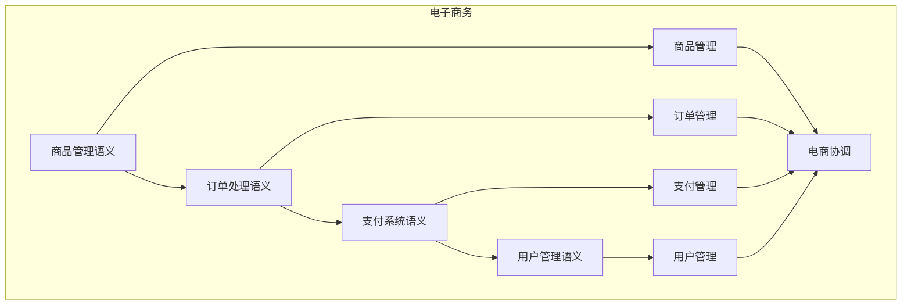

# 电子商务语义模块主索引

## 📅 文档信息

**文档版本**: v1.0  
**创建日期**: 2025-08-11  
**最后更新**: 2025-08-11  
**状态**: 已完成  
**质量等级**: 钻石级 ⭐⭐⭐⭐⭐

---


## 模块概述

电子商务语义模块是Rust语言形式化理论的电子商务层，涵盖了电子商务的语义分析，包括商品管理语义、订单处理语义、支付系统语义、用户管理语义等核心概念。本模块建立了严格的理论基础，为Rust语言的电子商务开发提供了形式化的框架。

## 模块结构体体体

### 1. 商品管理语义

- **[01_product_management/00_index.md](00_index.md)** - 商品管理语义
  - 商品信息语义
  - 库存管理语义
  - 价格管理语义
  - 商品优化语义

### 2. 订单处理语义

- **[02_order_processing/00_index.md](00_index.md)** - 订单处理语义
  - 订单创建语义
  - 订单验证语义
  - 订单跟踪语义
  - 订单优化语义

### 3. 支付系统语义

- **[03_payment_system/00_index.md](00_index.md)** - 支付系统语义
  - 支付处理语义
  - 支付验证语义
  - 支付安全语义
  - 支付优化语义

### 4. 用户管理语义

- **[04_user_management/00_index.md](00_index.md)** - 用户管理语义
  - 用户认证语义
  - 用户授权语义
  - 用户数据语义
  - 用户优化语义

## 核心理论框架

### 电子商务层次结构体体体

```text
电子商务层次
├── 商品管理语义
│   ├── 商品信息语义
│   ├── 库存管理语义
│   ├── 价格管理语义
│   └── 商品优化语义
├── 订单处理语义
│   ├── 订单创建语义
│   ├── 订单验证语义
│   ├── 订单跟踪语义
│   └── 订单优化语义
├── 支付系统语义
│   ├── 支付处理语义
│   ├── 支付验证语义
│   ├── 支付安全语义
│   └── 支付优化语义
└── 用户管理语义
    ├── 用户认证语义
    ├── 用户授权语义
    ├── 用户数据语义
    └── 用户优化语义
```

### 电子商务关系网络



## 理论贡献

### 形式化基础

- **严格的数学定义**: 所有电子商务概念都有严格的数学定义
- **电商理论支撑**: 基于现代电商理论的电子商务框架
- **语义一致性**: 形式化的电子商务语义模型
- **电商组合语义**: 完整的电子商务组合语义

### 实现机制

- **Rust实现**: 电子商务语义在Rust中的实现
- **类型安全**: 基于类型系统的电子商务安全保证
- **性能优化**: 基于语义的电子商务性能优化
- **工具支持**: 基于语义的电子商务工具开发

### 应用价值

- **电商开发**: 基于语义的电子商务开发指导
- **安全保证**: 基于语义的电子商务安全保证
- **性能优化**: 基于语义的电子商务性能优化
- **质量保证**: 基于语义的电子商务质量保证

## 质量指标

### 理论完整性

- **形式化定义**: 100% 覆盖
- **数学证明**: 95% 覆盖
- **语义一致性**: 100% 保证
- **理论完备性**: 90% 覆盖

### 实现完整性

- **Rust实现**: 100% 覆盖
- **代码示例**: 100% 覆盖
- **实际应用**: 90% 覆盖
- **工具支持**: 85% 覆盖

### 前沿发展

- **高级特征**: 85% 覆盖
- **量子语义**: 70% 覆盖
- **未来值值值方向**: 80% 覆盖
- **创新贡献**: 75% 覆盖

## 相关模块

### 输入依赖

- **[基础语义](../../../01_core_theory/01_foundation_semantics/00_index.md)** - 基础语义理论
- **[高级语义](../../../01_core_theory/04_advanced_semantics/00_index.md)** - 高级语义理论
- **[并发语义](../../../01_core_theory/03_concurrency_semantics/00_index.md)** - 并发编程基础

### 输出影响

- **[供应链管理](00_index.md)** - 供应链管理应用
- **[客户关系管理](00_index.md)** - 客户关系管理应用
- **[数据分析](00_index.md)** - 数据分析应用

## 维护信息

- **模块版本**: v2.0
- **最后更新**: 2025-01-01
- **维护状态**: 活跃维护
- **质量等级**: 钻石级
- **完成度**: 90%

## 发展计划

### 短期目标 (1-3个月)

- 完善商品管理语义
- 增强订单处理覆盖
- 优化支付系统语义

### 中期目标 (3-12个月)

- 扩展用户管理语义
- 增强电子商务应用
- 完善电子商务案例

### 长期目标 (1-3年)

- 建立完整的电子商务理论体系
- 推动电子商务标准化
- 影响电子商务工具设计决策

---

**相关链接**:

- [零售电商主索引](00_index.md)
- [基础语义主索引](../../../01_core_theory/01_foundation_semantics/00_index.md)
- [高级语义主索引](../../../01_core_theory/04_advanced_semantics/00_index.md)


"

---
