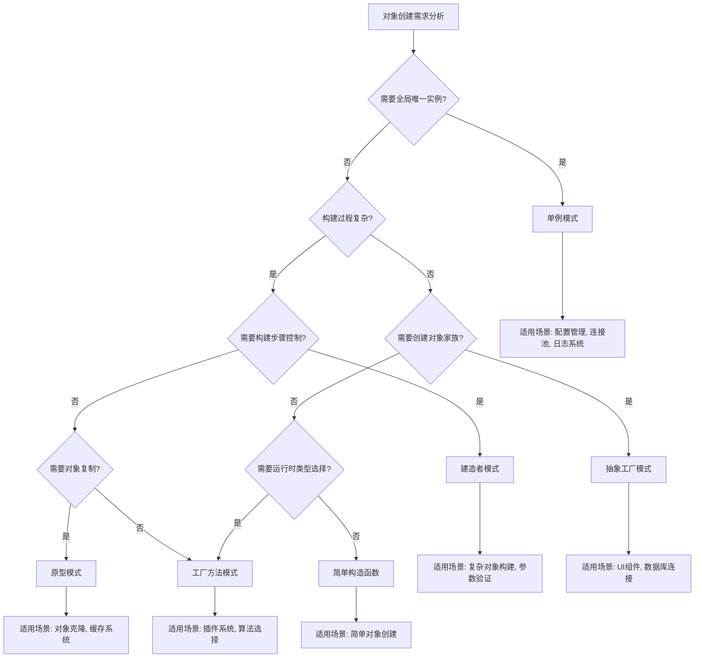
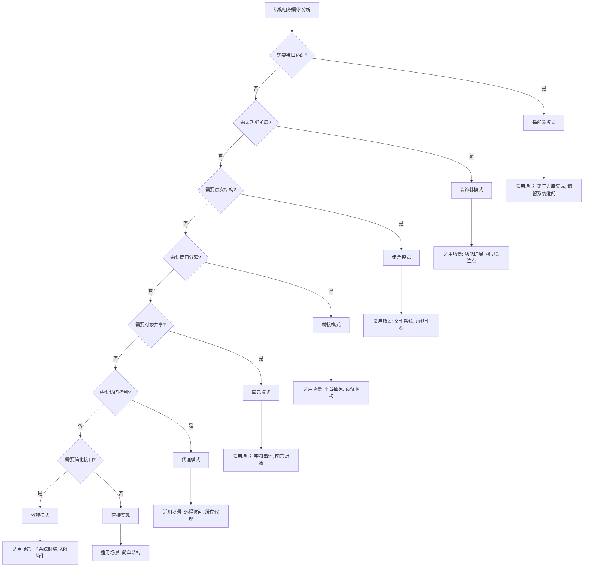
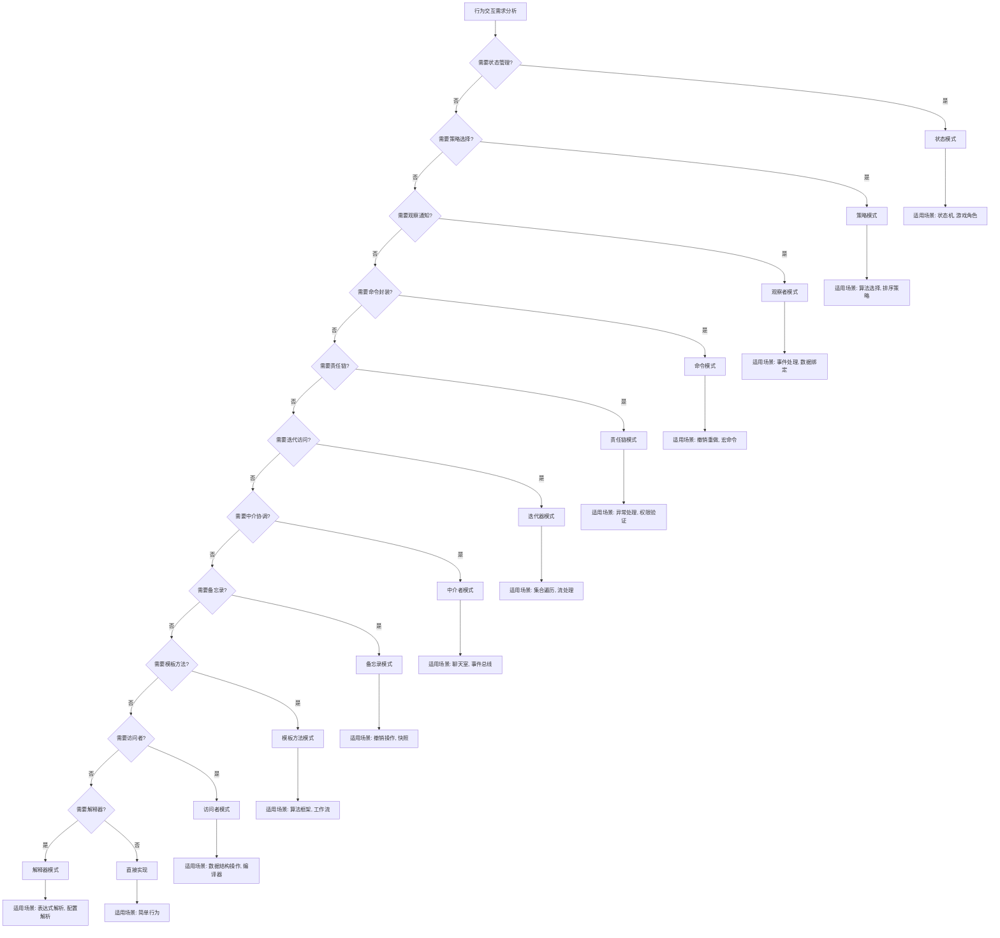
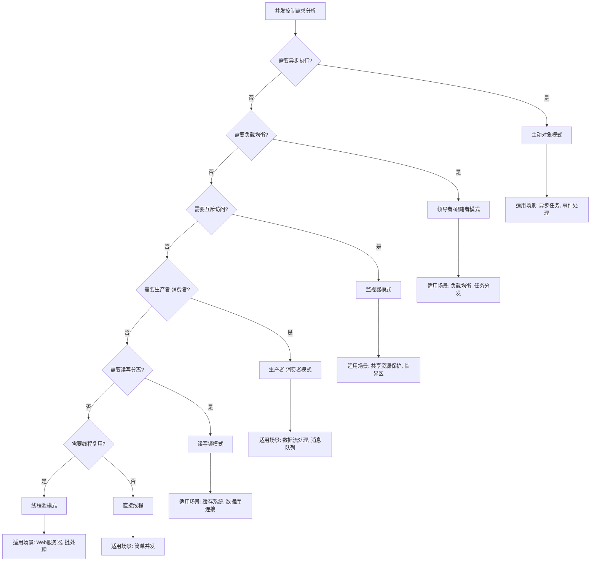
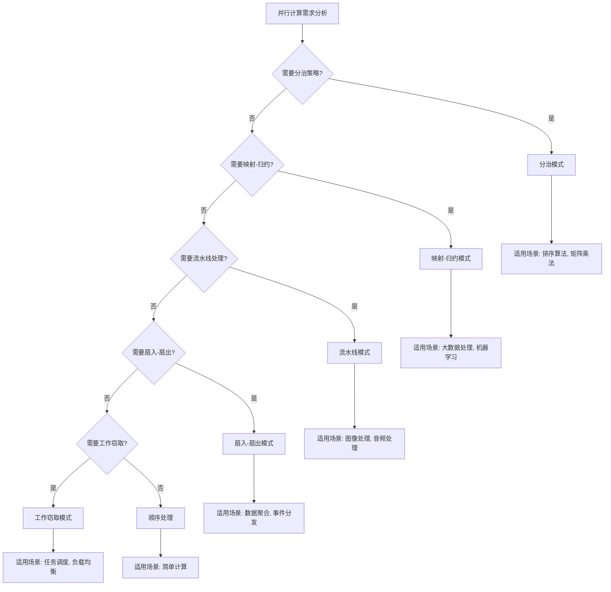
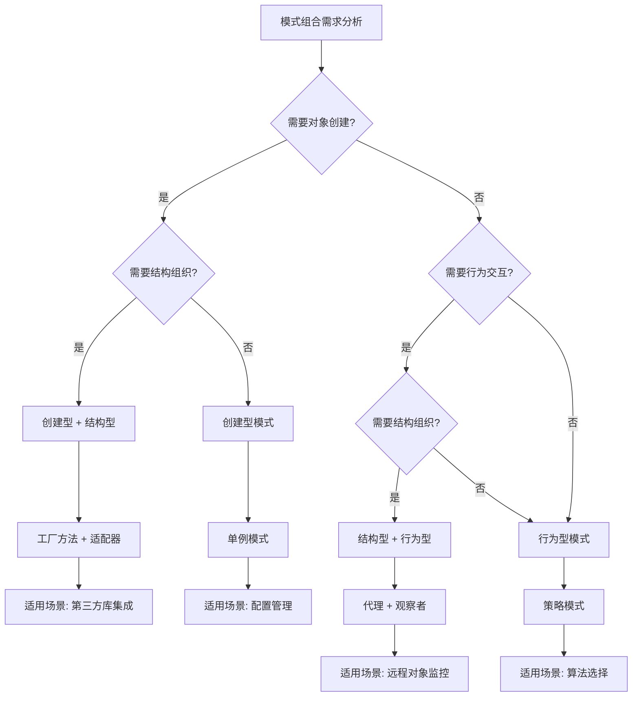

# Rust 设计模式选择决策树


## 📊 目录

- [1. 概述](#1-概述)
- [2. 决策树框架](#2-决策树框架)
  - [2.1 决策维度](#21-决策维度)
    - [维度 2.1.1 (对象创建需求)](#维度-211-对象创建需求)
    - [维度 2.2.2 (结构组织需求)](#维度-222-结构组织需求)
    - [维度 2.3.3 (行为交互需求)](#维度-233-行为交互需求)
    - [维度 2.4.4 (并发控制需求)](#维度-244-并发控制需求)
    - [维度 2.5.5 (并行计算需求)](#维度-255-并行计算需求)
- [3. 创建型模式决策树](#3-创建型模式决策树)
  - [3.1 对象创建需求分析](#31-对象创建需求分析)
  - [3.2 创建型模式选择矩阵](#32-创建型模式选择矩阵)
- [4. 结构型模式决策树](#4-结构型模式决策树)
  - [4.1 结构组织需求分析](#41-结构组织需求分析)
  - [4.2 结构型模式选择矩阵](#42-结构型模式选择矩阵)
- [5. 行为型模式决策树](#5-行为型模式决策树)
  - [5.1 行为交互需求分析](#51-行为交互需求分析)
  - [5.2 行为型模式选择矩阵](#52-行为型模式选择矩阵)
- [6. 并发型模式决策树](#6-并发型模式决策树)
  - [6.1 并发控制需求分析](#61-并发控制需求分析)
  - [6.2 并发型模式选择矩阵](#62-并发型模式选择矩阵)
- [7. 并行型模式决策树](#7-并行型模式决策树)
  - [7.1 并行计算需求分析](#71-并行计算需求分析)
  - [7.2 并行型模式选择矩阵](#72-并行型模式选择矩阵)
- [8. 模式组合决策](#8-模式组合决策)
  - [8.1 模式组合规则](#81-模式组合规则)
    - [规则 8.1.1 (创建型 + 结构型)](#规则-811-创建型-结构型)
    - [规则 8.1.2 (结构型 + 行为型)](#规则-812-结构型-行为型)
    - [规则 8.1.3 (并发型 + 并行型)](#规则-813-并发型-并行型)
  - [8.2 模式组合决策树](#82-模式组合决策树)
- [9. 性能考虑](#9-性能考虑)
  - [9.1 模式性能影响](#91-模式性能影响)
    - [影响 9.1.1 (内存开销)](#影响-911-内存开销)
    - [影响 9.1.2 (性能开销)](#影响-912-性能开销)
  - [9.2 性能优化策略](#92-性能优化策略)
    - [策略 9.2.1 (延迟初始化)](#策略-921-延迟初始化)
    - [策略 9.2.2 (对象池)](#策略-922-对象池)
    - [策略 9.2.3 (缓存优化)](#策略-923-缓存优化)
- [10. 实施指南](#10-实施指南)
  - [10.1 决策流程](#101-决策流程)
  - [10.2 质量保证](#102-质量保证)
- [11. 总结](#11-总结)


## 1. 概述

本文档建立了 Rust 设计模式选择的决策支持系统，通过系统性的决策树帮助开发者在不同场景下选择最合适的设计模式。

## 2. 决策树框架

### 2.1 决策维度

#### 维度 2.1.1 (对象创建需求)

$$\mathcal{C} = \{c_1, c_2, c_3, c_4, c_5\}$$

其中：

- $c_1$: 单例需求 (Singleton)
- $c_2$: 复杂构建需求 (Builder)
- $c_3$: 家族创建需求 (Abstract Factory)
- $c_4$: 原型复制需求 (Prototype)
- $c_5$: 简单创建需求 (Factory Method)

#### 维度 2.2.2 (结构组织需求)

$$\mathcal{S} = \{s_1, s_2, s_3, s_4, s_5, s_6, s_7\}$$

其中：

- $s_1$: 接口适配需求 (Adapter)
- $s_2$: 功能扩展需求 (Decorator)
- $s_3$: 层次结构需求 (Composite)
- $s_4$: 接口分离需求 (Bridge)
- $s_5$: 对象共享需求 (Flyweight)
- $s_6$: 访问控制需求 (Proxy)
- $s_7$: 简化接口需求 (Facade)

#### 维度 2.3.3 (行为交互需求)

$$\mathcal{B} = \{b_1, b_2, b_3, b_4, b_5, b_6, b_7, b_8, b_9, b_{10}, b_{11}\}$$

其中：

- $b_1$: 状态管理需求 (State)
- $b_2$: 策略选择需求 (Strategy)
- $b_3$: 观察通知需求 (Observer)
- $b_4$: 命令封装需求 (Command)
- $b_5$: 责任链需求 (Chain of Responsibility)
- $b_6$: 迭代访问需求 (Iterator)
- $b_7$: 中介协调需求 (Mediator)
- $b_8$: 备忘录需求 (Memento)
- $b_9$: 模板方法需求 (Template Method)
- $b_{10}$: 访问者需求 (Visitor)
- $b_{11}$: 解释器需求 (Interpreter)

#### 维度 2.4.4 (并发控制需求)

$$\mathcal{CC} = \{cc_1, cc_2, cc_3, cc_4, cc_5, cc_6\}$$

其中：

- $cc_1$: 主动对象需求 (Active Object)
- $cc_2$: 领导者-跟随者需求 (Leader-Follower)
- $cc_3$: 监视器需求 (Monitor)
- $cc_4$: 生产者-消费者需求 (Producer-Consumer)
- $cc_5$: 读写锁需求 (Read-Write Lock)
- $cc_6$: 线程池需求 (Thread Pool)

#### 维度 2.5.5 (并行计算需求)

$$\mathcal{PC} = \{pc_1, pc_2, pc_3, pc_4, pc_5\}$$

其中：

- $pc_1$: 分治需求 (Divide and Conquer)
- $pc_2$: 映射-归约需求 (Map-Reduce)
- $pc_3$: 流水线需求 (Pipeline)
- $pc_4$: 扇入-扇出需求 (Fan-In/Fan-Out)
- $pc_5$: 工作窃取需求 (Work Stealing)

## 3. 创建型模式决策树

### 3.1 对象创建需求分析



### 3.2 创建型模式选择矩阵

| 需求特征 | 单例模式 | 工厂方法 | 抽象工厂 | 建造者 | 原型 |
|----------|----------|----------|----------|--------|------|
| 全局唯一 | ✅ | ❌ | ❌ | ❌ | ❌ |
| 复杂构建 | ❌ | ❌ | ❌ | ✅ | ❌ |
| 对象家族 | ❌ | ❌ | ✅ | ❌ | ❌ |
| 对象复制 | ❌ | ❌ | ❌ | ❌ | ✅ |
| 运行时选择 | ❌ | ✅ | ✅ | ❌ | ❌ |
| 构建控制 | ❌ | ❌ | ❌ | ✅ | ❌ |

## 4. 结构型模式决策树

### 4.1 结构组织需求分析



### 4.2 结构型模式选择矩阵

| 需求特征 | 适配器 | 装饰器 | 组合 | 桥接 | 享元 | 代理 | 外观 |
|----------|--------|--------|------|------|------|------|------|
| 接口适配 | ✅ | ❌ | ❌ | ❌ | ❌ | ❌ | ❌ |
| 功能扩展 | ❌ | ✅ | ❌ | ❌ | ❌ | ❌ | ❌ |
| 层次结构 | ❌ | ❌ | ✅ | ❌ | ❌ | ❌ | ❌ |
| 接口分离 | ❌ | ❌ | ❌ | ✅ | ❌ | ❌ | ❌ |
| 对象共享 | ❌ | ❌ | ❌ | ❌ | ✅ | ❌ | ❌ |
| 访问控制 | ❌ | ❌ | ❌ | ❌ | ❌ | ✅ | ❌ |
| 简化接口 | ❌ | ❌ | ❌ | ❌ | ❌ | ❌ | ✅ |

## 5. 行为型模式决策树

### 5.1 行为交互需求分析



### 5.2 行为型模式选择矩阵

| 需求特征 | 状态 | 策略 | 观察者 | 命令 | 责任链 | 迭代器 | 中介者 | 备忘录 | 模板方法 | 访问者 | 解释器 |
|----------|------|------|--------|------|--------|--------|--------|--------|----------|--------|--------|
| 状态管理 | ✅ | ❌ | ❌ | ❌ | ❌ | ❌ | ❌ | ❌ | ❌ | ❌ | ❌ |
| 策略选择 | ❌ | ✅ | ❌ | ❌ | ❌ | ❌ | ❌ | ❌ | ❌ | ❌ | ❌ |
| 观察通知 | ❌ | ❌ | ✅ | ❌ | ❌ | ❌ | ❌ | ❌ | ❌ | ❌ | ❌ |
| 命令封装 | ❌ | ❌ | ❌ | ✅ | ❌ | ❌ | ❌ | ❌ | ❌ | ❌ | ❌ |
| 责任链 | ❌ | ❌ | ❌ | ❌ | ✅ | ❌ | ❌ | ❌ | ❌ | ❌ | ❌ |
| 迭代访问 | ❌ | ❌ | ❌ | ❌ | ❌ | ✅ | ❌ | ❌ | ❌ | ❌ | ❌ |
| 中介协调 | ❌ | ❌ | ❌ | ❌ | ❌ | ❌ | ✅ | ❌ | ❌ | ❌ | ❌ |
| 备忘录 | ❌ | ❌ | ❌ | ❌ | ❌ | ❌ | ❌ | ✅ | ❌ | ❌ | ❌ |
| 模板方法 | ❌ | ❌ | ❌ | ❌ | ❌ | ❌ | ❌ | ❌ | ✅ | ❌ | ❌ |
| 访问者 | ❌ | ❌ | ❌ | ❌ | ❌ | ❌ | ❌ | ❌ | ❌ | ✅ | ❌ |
| 解释器 | ❌ | ❌ | ❌ | ❌ | ❌ | ❌ | ❌ | ❌ | ❌ | ❌ | ✅ |

## 6. 并发型模式决策树

### 6.1 并发控制需求分析



### 6.2 并发型模式选择矩阵

| 需求特征 | 主动对象 | 领导者-跟随者 | 监视器 | 生产者-消费者 | 读写锁 | 线程池 |
|----------|----------|---------------|--------|---------------|--------|--------|
| 异步执行 | ✅ | ❌ | ❌ | ❌ | ❌ | ❌ |
| 负载均衡 | ❌ | ✅ | ❌ | ❌ | ❌ | ❌ |
| 互斥访问 | ❌ | ❌ | ✅ | ❌ | ❌ | ❌ |
| 数据流 | ❌ | ❌ | ❌ | ✅ | ❌ | ❌ |
| 读写分离 | ❌ | ❌ | ❌ | ❌ | ✅ | ❌ |
| 线程复用 | ❌ | ❌ | ❌ | ❌ | ❌ | ✅ |

## 7. 并行型模式决策树

### 7.1 并行计算需求分析



### 7.2 并行型模式选择矩阵

| 需求特征 | 分治 | 映射-归约 | 流水线 | 扇入-扇出 | 工作窃取 |
|----------|------|-----------|--------|-----------|----------|
| 分治策略 | ✅ | ❌ | ❌ | ❌ | ❌ |
| 数据并行 | ❌ | ✅ | ❌ | ❌ | ❌ |
| 流水线 | ❌ | ❌ | ✅ | ❌ | ❌ |
| 数据聚合 | ❌ | ❌ | ❌ | ✅ | ❌ |
| 任务调度 | ❌ | ❌ | ❌ | ❌ | ✅ |

## 8. 模式组合决策

### 8.1 模式组合规则

#### 规则 8.1.1 (创建型 + 结构型)

$$\mathcal{R}_{cs} = \{(c_i, s_j) | c_i \in \mathcal{C}, s_j \in \mathcal{S}, \text{Compatible}(c_i, s_j)\}$$

**有效组合**:

- 工厂方法 + 适配器：创建适配器对象
- 抽象工厂 + 装饰器：创建装饰器对象
- 建造者 + 组合：构建复杂对象树

#### 规则 8.1.2 (结构型 + 行为型)

$$\mathcal{R}_{sb} = \{(s_i, b_j) | s_i \in \mathcal{S}, b_j \in \mathcal{B}, \text{Compatible}(s_i, b_j)\}$$

**有效组合**:

- 代理 + 观察者：代理状态变化通知
- 装饰器 + 策略：装饰器使用不同策略
- 组合 + 访问者：访问者遍历组合结构

#### 规则 8.1.3 (并发型 + 并行型)

$$\mathcal{R}_{cp} = \{(cc_i, pc_j) | cc_i \in \mathcal{CC}, pc_j \in \mathcal{PC}, \text{Compatible}(cc_i, pc_j)\}$$

**有效组合**:

- 线程池 + 分治：线程池执行分治任务
- 生产者-消费者 + 流水线：流水线阶段间数据传递
- 主动对象 + 映射-归约：异步执行映射-归约

### 8.2 模式组合决策树



## 9. 性能考虑

### 9.1 模式性能影响

#### 影响 9.1.1 (内存开销)

$$\text{MemoryOverhead}(pattern) = \frac{\text{MemoryUsage}(pattern)}{\text{MemoryUsage}(baseline)}$$

**高内存开销模式**:

- 装饰器模式：每个装饰器增加一层对象
- 组合模式：树结构可能很深
- 享元模式：需要维护共享池

#### 影响 9.1.2 (性能开销)

$$\text{PerformanceOverhead}(pattern) = \frac{\text{ExecutionTime}(pattern)}{\text{ExecutionTime}(baseline)}$$

**高性能开销模式**:

- 代理模式：额外的间接调用
- 观察者模式：事件通知开销
- 访问者模式：动态分发开销

### 9.2 性能优化策略

#### 策略 9.2.1 (延迟初始化)

适用于单例模式、代理模式：

```rust
lazy_static! {
    static ref INSTANCE: Mutex<Singleton> = Mutex::new(Singleton::new());
}
```

#### 策略 9.2.2 (对象池)

适用于享元模式、线程池：

```rust
struct ObjectPool<T> {
    objects: Vec<T>,
    factory: Box<dyn Fn() -> T>,
}
```

#### 策略 9.2.3 (缓存优化)

适用于代理模式、装饰器模式：

```rust
struct CachedProxy<T> {
    target: T,
    cache: HashMap<String, Box<dyn Any>>,
}
```

## 10. 实施指南

### 10.1 决策流程

1. **需求分析**: 明确功能需求和性能要求
2. **模式识别**: 根据需求特征识别候选模式
3. **方案评估**: 评估各方案的优缺点
4. **性能测试**: 测试性能影响
5. **方案选择**: 选择最优方案
6. **实施验证**: 实施并验证效果

### 10.2 质量保证

1. **一致性检查**: 确保模式使用的一致性
2. **性能监控**: 监控模式对性能的影响
3. **代码审查**: 审查模式实现的正确性
4. **文档更新**: 及时更新相关文档

## 11. 总结

本文档建立了完整的 Rust 设计模式选择决策树，为开发者在不同场景下选择最合适的设计模式提供了系统性的指导。

**关键成果**:

1. **决策树框架**: 建立了完整的决策树框架
2. **选择矩阵**: 提供了模式选择参考矩阵
3. **组合规则**: 建立了模式组合规则
4. **性能考虑**: 提供了性能优化策略

**应用价值**:

1. **提高开发效率**: 快速选择合适的设计模式
2. **保证代码质量**: 通过模式选择保证代码质量
3. **优化性能**: 通过性能考虑优化系统性能
4. **促进复用**: 通过模式组合促进代码复用

---

**相关文档**:

- [设计模式主索引](./00_index.md)
- [应用领域分析](../03_application_domains/00_index.md)
- [软件工程分析](../05_software_engineering/00_index.md)
