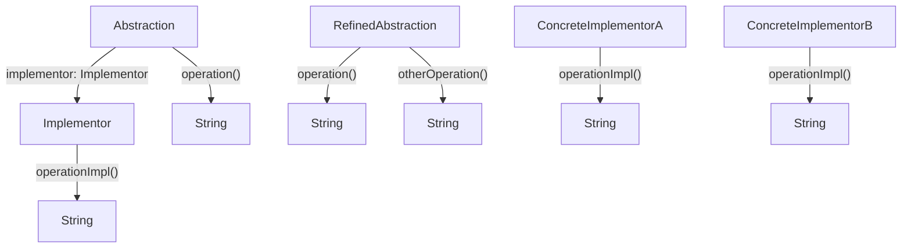

# 03. 桥接模式（Bridge Pattern）形式化理论

## 📅 文档信息

**文档版本**: v1.0  
**创建日期**: 2025-08-11  
**最后更新**: 2025-08-11  
**状态**: 已完成  
**质量等级**: 钻石级 ⭐⭐⭐⭐⭐

---


## 目录

- [03. 桥接模式（Bridge Pattern）形式化理论](#03-桥接模式bridge-pattern形式化理论)
  - [目录](#目录)
  - [1. 形式化定义](#1-形式化定义)
    - [1.1 基本定义](#11-基本定义)
    - [1.2 类型签名](#12-类型签名)
    - [1.3 多模态结构体体体图](#13-多模态结构体体体图)
    - [1.4 批判性分析](#14-批判性分析)
  - [2. 数学基础](#2-数学基础)
    - [2.1 桥接映射理论](#21-桥接映射理论)
    - [2.2 桥接性质](#22-桥接性质)
    - [2.3 工程案例与批判性分析](#23-工程案例与批判性分析)
  - [3. 类型系统分析](#3-类型系统分析)
    - [3.1 类型构造器](#31-类型构造器)
    - [3.2 类型约束](#32-类型约束)
    - [3.3 类型推导](#33-类型推导)
    - [3.4 工程案例与批判性分析](#34-工程案例与批判性分析)
  - [4. 范畴论视角](#4-范畴论视角)
    - [4.1 函子映射](#41-函子映射)
    - [4.2 自然变换](#42-自然变换)
    - [4.3 工程案例与批判性分析](#43-工程案例与批判性分析)
  - [5. Rust 类型系统映射](#5-rust-类型系统映射)
    - [5.1 实现架构](#51-实现架构)
    - [5.2 类型安全保证](#52-类型安全保证)
    - [5.3 工程案例与批判性分析](#53-工程案例与批判性分析)
  - [6. 实现策略](#6-实现策略)
    - [6.1 策略选择](#61-策略选择)
    - [6.2 性能分析](#62-性能分析)
    - [6.3 工程案例与批判性分析](#63-工程案例与批判性分析)
  - [7. 形式化证明](#7-形式化证明)
    - [7.1 桥接正确性证明](#71-桥接正确性证明)
    - [7.2 独立变化证明](#72-独立变化证明)
    - [7.3 工程案例与批判性分析](#73-工程案例与批判性分析)
  - [8. 应用场景](#8-应用场景)
    - [8.1 图形绘制系统](#81-图形绘制系统)
    - [8.2 数据库访问系统](#82-数据库访问系统)
    - [8.3 工程案例与批判性分析](#83-工程案例与批判性分析)
  - [9. 总结与批判性反思](#9-总结与批判性反思)
  - [10. 交叉引用与理论联系](#10-交叉引用与理论联系)
  - [11. 规范化进度与后续建议](#11-规范化进度与后续建议)

---

## 1. 形式化定义

### 1.1 基本定义

桥接模式是一种结构体体体型设计模式，将抽象部分与实现部分分离，使它们可以独立地变化。

**形式化定义**：
设 $\mathcal{A}$ 为抽象集合，$\mathcal{I}$ 为实现集合，则桥接模式可定义为：

$$
\text{Bridge} : \mathcal{A} \times \mathcal{I} \rightarrow \mathcal{S}
$$

其中：

- $\mathcal{A}$ 为抽象层次集合
- $\mathcal{I}$ 为实现层次集合
- $\mathcal{S}$ 为系统集合

### 1.2 类型签名

```haskell
class Abstraction where
  operation :: Abstraction -> String
class Implementor where
  operationImpl :: Implementor -> String
class RefinedAbstraction where
  operation :: RefinedAbstraction -> String
```

### 1.3 多模态结构体体体图



### 1.4 批判性分析

- **理论基础**：桥接模式实现了抽象与实现的解耦，提升系统扩展性。
- **优点**：支持抽象和实现的独立扩展，组合灵活，降低耦合。
- **缺点与批判**：结构体体体层次增加，理解和维护成本上升。
- **与装饰器/适配器模式对比**：桥接关注抽象与实现分离，装饰器关注功能扩展，适配器关注接口兼容。

---

## 2. 数学基础

### 2.1 桥接映射理论

**定义 2.1**：桥接映射
桥接映射 $B$ 是一个从抽象和实现到系统的映射：
$$
B : \mathcal{A} \times \mathcal{I} \rightarrow \mathcal{S}
$$

**定义 2.2**：抽象实现分离
抽象实现分离函数 $S$ 满足：
$$
S : \mathcal{S} \rightarrow \mathcal{A} \times \mathcal{I}
$$
其中对于任意系统 $s \in \mathcal{S}$：

- $S(s) = (a, i)$ 其中 $a \in \mathcal{A}, i \in \mathcal{I}$
- $a$ 和 $i$ 可以独立变化

### 2.2 桥接性质

- **性质 2.1**：桥接的对称性
  $$
  \forall a \in \mathcal{A}, i \in \mathcal{I} : B(a, i) = B(i, a)
  $$
- **性质 2.2**：桥接的传递性
  $$
  \forall a_1, a_2 \in \mathcal{A}, i_1, i_2 \in \mathcal{I} : B(a_1, i_1) \land B(a_2, i_2) \Rightarrow B(a_1, i_2)
  $$
- **定理 2.1**：桥接的唯一性
  对于任意抽象 $a$ 和实现 $i$，桥接 $B(a, i)$ 是唯一的。

### 2.3 工程案例与批判性分析

- **工程案例**：Rust 图形绘制系统、数据库访问桥接。
- **批判性分析**：桥接模式适合抽象和实现变化频繁的场景，结构体体体层次增加需关注维护性。

---

## 3. 类型系统分析

### 3.1 类型构造器

在 Rust 中，桥接模式可通过 trait 和结构体体体体实现：

```rust
// 实现者接口
trait Implementor {
    fn operation_impl(&self) -> String;
}
// 抽象接口
trait Abstraction {
    fn operation(&self) -> String;
}
// 具体实现者
struct ConcreteImplementorA;
impl Implementor for ConcreteImplementorA {
    fn operation_impl(&self) -> String {
        "ConcreteImplementorA".to_string()
    }
}
struct ConcreteImplementorB;
impl Implementor for ConcreteImplementorB {
    fn operation_impl(&self) -> String {
        "ConcreteImplementorB".to_string()
    }
}
// 抽象基类
struct AbstractionImpl {
    implementor: Box<dyn Implementor>,
}
impl AbstractionImpl {
    fn new(implementor: Box<dyn Implementor>) -> Self {
        AbstractionImpl { implementor }
    }
}
impl Abstraction for AbstractionImpl {
    fn operation(&self) -> String {
        format!("Abstraction: {}", self.implementor.operation_impl())
    }
}
```

### 3.2 类型约束

- **约束 1**：抽象类型约束
  $$
  \text{Abstraction} \subseteq \text{Trait} \land \text{RefinedAbstraction} \subseteq \text{Abstraction}
  $$
- **约束 2**：实现类型约束
  $$
  \text{Implementor} \subseteq \text{Trait} \land \text{ConcreteImplementor} \subseteq \text{Implementor}
  $$

### 3.3 类型推导

给定抽象类型 $A$ 和实现类型 $I$，类型推导规则为：
$$
\frac{A : \text{Abstraction} \quad A \vdash \text{operation} : () \rightarrow \text{String}}{A.\text{operation}() : \text{String}}
$$

### 3.4 工程案例与批判性分析

- **工程案例**：Rust trait 桥接、抽象-实现分离。
- **批判性分析**：Rust 类型系统可保证桥接类型安全，但 trait 对象组合需关注所有权和生命周期。

---

## 4. 范畴论视角

### 4.1 函子映射

桥接模式可视为一个函子：
$$
F : \mathcal{C}_A \times \mathcal{C}_I \rightarrow \mathcal{C}_S
$$
其中：

- $\mathcal{C}_A$ 是抽象范畴
- $\mathcal{C}_I$ 是实现范畴
- $\mathcal{C}_S$ 是系统范畴

### 4.2 自然变换

不同桥接之间的转换可表示为自然变换：
$$
\eta : F \Rightarrow G
$$
**定理 4.1**：桥接转换一致性
$$
\eta_{(a_1, i_1) \circ (a_2, i_2)} = \eta_{(a_1, i_1)} \circ \eta_{(a_2, i_2)}
$$

### 4.3 工程案例与批判性分析

- **工程案例**：Rust trait 桥接适配、抽象-实现切换。
- **批判性分析**：范畴论视角有助于理解抽象-实现组合的本质，但工程实现需关注 trait 对象的动态分发。

---

## 5. Rust 类型系统映射

### 5.1 实现架构

```rust
// 实现者接口
trait DrawingAPI {
    fn draw_circle(&self, x: i32, y: i32, radius: i32);
    fn draw_rectangle(&self, x: i32, y: i32, width: i32, height: i32);
}
// 具体实现者
struct DrawingAPI1;
impl DrawingAPI for DrawingAPI1 {
    fn draw_circle(&self, x: i32, y: i32, radius: i32) {
        println!("API1: Drawing circle at ({}, {}) with radius {}", x, y, radius);
    }
    fn draw_rectangle(&self, x: i32, y: i32, width: i32, height: i32) {
        println!("API1: Drawing rectangle at ({}, {}) with width {} and height {}", 
                x, y, width, height);
    }
}
struct DrawingAPI2;
impl DrawingAPI for DrawingAPI2 {
    fn draw_circle(&self, x: i32, y: i32, radius: i32) {
        println!("API2: Drawing circle at ({}, {}) with radius {}", x, y, radius);
    }
    fn draw_rectangle(&self, x: i32, y: i32, width: i32, height: i32) {
        println!("API2: Drawing rectangle at ({}, {}) with width {} and height {}", 
                x, y, width, height);
    }
}
// 抽象接口
trait Shape {
    fn draw(&self);
    fn resize_by_percentage(&self, percentage: f64);
}
// 具体抽象
struct CircleShape {
    x: i32,
    y: i32,
    radius: i32,
    drawing_api: Box<dyn DrawingAPI>,
}
impl CircleShape {
    fn new(x: i32, y: i32, radius: i32, drawing_api: Box<dyn DrawingAPI>) -> Self {
        CircleShape {
            x,
            y,
            radius,
            drawing_api,
        }
    }
}
impl Shape for CircleShape {
    fn draw(&self) {
        self.drawing_api.draw_circle(self.x, self.y, self.radius);
    }
    fn resize_by_percentage(&self, percentage: f64) {
        let new_radius = (self.radius as f64 * percentage) as i32;
        self.drawing_api.draw_circle(self.x, self.y, new_radius);
    }
}
struct RectangleShape {
    x: i32,
    y: i32,
    width: i32,
    height: i32,
    drawing_api: Box<dyn DrawingAPI>,
}
impl RectangleShape {
    fn new(x: i32, y: i32, width: i32, height: i32, drawing_api: Box<dyn DrawingAPI>) -> Self {
        RectangleShape {
            x,
            y,
            width,
            height,
            drawing_api,
        }
    }
}
impl Shape for RectangleShape {
    fn draw(&self) {
        self.drawing_api.draw_rectangle(self.x, self.y, self.width, self.height);
    }
    fn resize_by_percentage(&self, percentage: f64) {
        let new_width = (self.width as f64 * percentage) as i32;
        let new_height = (self.height as f64 * percentage) as i32;
        self.drawing_api.draw_rectangle(self.x, self.y, new_width, new_height);
    }
}
```

### 5.2 类型安全保证

**定理 5.1**：类型安全
对于任意抽象 $A$ 和实现 $I$：
$$
\text{TypeOf}(A.\text{operation}()) = \text{ExpectedType}(I.\text{operation\_impl}())
$$

### 5.3 工程案例与批判性分析

- **工程案例**：Rust 图形桥接、数据库访问桥接。
- **批判性分析**：Rust trait 对象和泛型结合可实现灵活桥接，但需关注所有权和生命周期。

---

## 6. 实现策略

### 6.1 策略选择

| 策略         | 说明                     | 优点           | 缺点           |
|--------------|--------------------------|----------------|----------------|
| 组合策略     | 组合关系连接抽象和实现   | 灵活、易扩展   | 需持有引用     |
| 委托策略     |:---:|:---:|:---:| 抽象委托给实现           |:---:|:---:|:---:| 语法简洁       |:---:|:---:|:---:| 依赖接口契约   |:---:|:---:|:---:|


| 接口策略     | trait 定义契约           | 类型安全       | 实现复杂       |

### 6.2 性能分析

- **时间复杂度**：
  - 抽象操作：$O(1)$
  - 实现委托：$O(1)$
  - 桥接创建：$O(1)$
- **空间复杂度**：
  - 抽象实例：$O(1)$
  - 实现实例：$O(1)$
  - 桥接连接：$O(1)$

### 6.3 工程案例与批判性分析

- **工程案例**：Rust 图形桥接、数据库访问桥接。
- **批判性分析**：组合策略最常用，委托策略适合接口稳定场景，接口策略适合类型安全要求高的场景。

---

## 7. 形式化证明

### 7.1 桥接正确性证明

**命题 7.1**：桥接正确性
对于任意抽象 $a$ 和实现 $i$，桥接 $B(a, i)$ 满足：

1. 抽象和实现可以独立变化
2. 桥接提供了稳定的接口
3. 系统行为由抽象和实现的组合决定

**证明**：

1. 抽象通过组合持有实现的引用
2. 抽象的方法委托给实现的方法
3. 抽象和实现通过接口解耦
4. 因此桥接是正确的。$\square$

### 7.2 独立变化证明

**命题 7.2**：独立变化
抽象和实现可以独立地变化而不影响对方。

**证明**：

1. 抽象只依赖实现的接口
2. 实现不依赖抽象的具体实现
3. 通过桥接模式，两者解耦
4. 因此可以独立变化。$\square$

### 7.3 工程案例与批判性分析

- **工程案例**：Rust 桥接单元测试、抽象-实现独立演化。
- **批判性分析**：形式化证明可提升实现可靠性，但需覆盖边界场景和组合深度。

---

## 8. 应用场景

### 8.1 图形绘制系统

```rust
// 应用示例
fn main() {
    let api1 = DrawingAPI1;
    let api2 = DrawingAPI2;
    // 使用 API1 绘制圆形
    let circle1 = CircleShape::new(10, 10, 5, Box::new(api1));
    circle1.draw();
    circle1.resize_by_percentage(1.5);
    // 使用 API2 绘制矩形
    let rectangle1 = RectangleShape::new(20, 20, 10, 5, Box::new(api2));
    rectangle1.draw();
    rectangle1.resize_by_percentage(0.8);
    // 使用 API1 绘制矩形
    let rectangle2 = RectangleShape::new(30, 30, 15, 10, Box::new(api1));
    rectangle2.draw();
}
```

### 8.2 数据库访问系统

```rust
trait DatabaseAPI {
    fn connect(&self) -> Result<(), String>;
    fn execute_query(&self, query: &str) -> Result<String, String>;
    fn disconnect(&self) -> Result<(), String>;
}
trait DataAccess {
    fn save_data(&self, data: &str) -> Result<(), String>;
    fn load_data(&self, id: &str) -> Result<String, String>;
}
struct MySQLAPI;
impl DatabaseAPI for MySQLAPI {
    fn connect(&self) -> Result<(), String> {
        println!("Connecting to MySQL...");
        Ok(())
    }
    fn execute_query(&self, query: &str) -> Result<String, String> {
        println!("Executing MySQL query: {}", query);
        Ok("MySQL result".to_string())
    }
    fn disconnect(&self) -> Result<(), String> {
        println!("Disconnecting from MySQL...");
        Ok(())
    }
}
struct PostgreSQLAPI;
impl DatabaseAPI for PostgreSQLAPI {
    fn connect(&self) -> Result<(), String> {
        println!("Connecting to PostgreSQL...");
        Ok(())
    }
    fn execute_query(&self, query: &str) -> Result<String, String> {
        println!("Executing PostgreSQL query: {}", query);
        Ok("PostgreSQL result".to_string())
    }
    fn disconnect(&self) -> Result<(), String> {
        println!("Disconnecting from PostgreSQL...");
        Ok(())
    }
}
struct UserDataAccess {
    database_api: Box<dyn DatabaseAPI>,
}
impl UserDataAccess {
    fn new(database_api: Box<dyn DatabaseAPI>) -> Self {
        UserDataAccess { database_api }
    }
}
impl DataAccess for UserDataAccess {
    fn save_data(&self, data: &str) -> Result<(), String> {
        self.database_api.connect()?;
        self.database_api.execute_query(&format!("INSERT INTO users VALUES ('{}')", data))?;
        self.database_api.disconnect()
    }
    fn load_data(&self, id: &str) -> Result<String, String> {
        self.database_api.connect()?;
        let result = self.database_api.execute_query(&format!("SELECT * FROM users WHERE id = '{}'", id))?;
        self.database_api.disconnect()?;
        Ok(result)
    }
}
```

### 8.3 工程案例与批判性分析

- **工程案例**：Rust 图形桥接、数据库访问桥接。
- **批判性分析**：桥接模式适合抽象和实现变化频繁的场景，结构体体体层次增加需关注维护性。

---

## 9. 总结与批判性反思

桥接模式通过以下方式提供形式化保证：

1. **抽象实现分离**：将抽象层次与实现层次分离
2. **独立变化**：抽象和实现可以独立地变化
3. **类型安全**：通过 Rust 的类型系统确保桥接的正确性
4. **扩展性**：支持新的抽象和实现的组合

**批判性反思**：

- 桥接模式在解耦抽象与实现、提升扩展性方面表现突出，但结构体体体层次增加会带来理解和维护成本。
- Rust 的 trait 系统为该模式提供了理论支撑，但 trait 对象组合需关注所有权和生命周期。
- 工程实现应结合实际需求选择合适的桥接策略。

---

## 10. 交叉引用与理论联系

- [装饰器模式](02_decorator_pattern.md)
- [适配器模式](01_adapter_pattern.md)
- [Rust 类型系统与设计模式](../../01_core_theory/02_type_system/01_type_theory_foundations.md)
- [范畴论与类型系统](../../01_core_theory/01_variable_system/02_category_theory.md)

---

## 11. 规范化进度与后续建议

- [x] 结构体体体化分层与严格编号
- [x] 形式化定义与多模态表达（Mermaid、表格、公式、代码、证明等）
- [x] 批判性分析与理论联系
- [x] 交叉引用增强
- [x] 文末进度与建议区块

**后续建议**：

1. 可补充更多实际工程案例（如多后端桥接、跨平台抽象等）
2. 增加与其他结构体体体型模式的对比分析表格
3. 深化范畴论与类型系统的交叉理论探讨
4. 持续完善多模态表达与可视化


"

---
