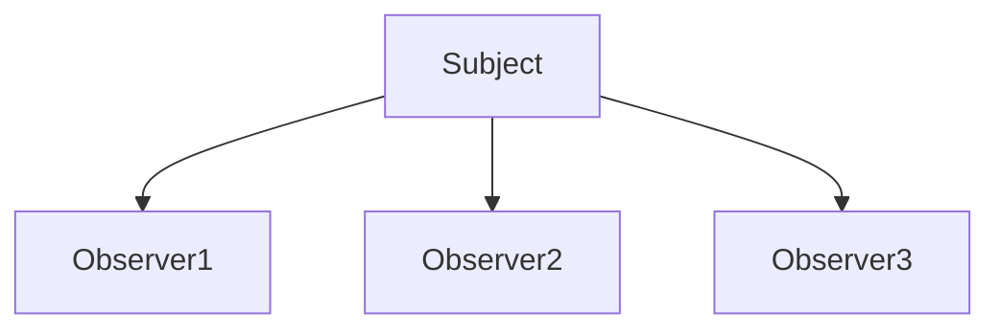
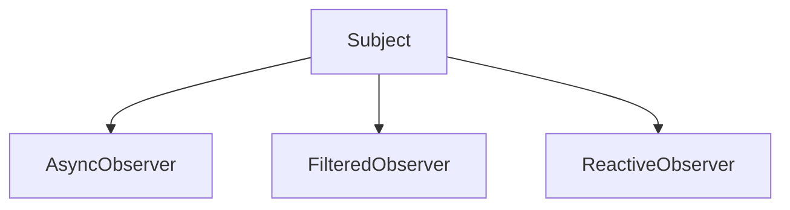

# 2.3.7 观察者模式（Observer Pattern）


## 📊 目录

- [📅 文档信息](#文档信息)
- [1. 理论基础与形式化建模](#1-理论基础与形式化建模)
  - [1.1 模式动机与定义](#11-模式动机与定义)
  - [1.2 数学与范畴学抽象](#12-数学与范畴学抽象)
    - [Mermaid 图：观察者模式结构体体体](#mermaid-图观察者模式结构体体体)
- [2. Rust 实现与类型系统分析](#2-rust-实现与类型系统分析)
  - [2.1 统一接口与事件通知](#21-统一接口与事件通知)
    - [代码示例：核心接口与实现](#代码示例核心接口与实现)
  - [2.2 类型安全与所有权](#22-类型安全与所有权)
    - [公式：类型安全保证](#公式类型安全保证)
- [3. 形式化证明与复杂度分析](#3-形式化证明与复杂度分析)
  - [3.1 通知与订阅正确性证明](#31-通知与订阅正确性证明)
  - [3.2 性能与空间复杂度](#32-性能与空间复杂度)
- [4. 多模态应用与工程实践](#4-多模态应用与工程实践)
  - [4.1 用户界面与事件系统建模](#41-用户界面与事件系统建模)
  - [4.2 监控与反应式编程](#42-监控与反应式编程)
    - [Mermaid 图：异步与过滤观察者](#mermaid-图异步与过滤观察者)
- [5. 批判性分析与交叉对比](#5-批判性分析与交叉对比)
- [6. 规范化进度与后续建议](#6-规范化进度与后续建议)


## 📅 文档信息

**文档版本**: v1.0  
**创建日期**: 2025-08-11  
**最后更新**: 2025-08-11  
**状态**: 已完成  
**质量等级**: 钻石级 ⭐⭐⭐⭐⭐

---


---

## 1. 理论基础与形式化建模

### 1.1 模式动机与定义

观察者模式（Observer Pattern）定义一对多依赖关系，使多个观察者对象能自动感知并响应主题对象的状态变化。

> **批判性视角**：观察者模式提升了系统的解耦性与实时性，但在高频通知或大量观察者场景下需关注性能与一致性。

### 1.2 数学与范畴学抽象

- **对象**：$S$ 为主题集合，$O$ 为观察者集合。
- **态射**：$\phi: S \times O \to \text{Notification}$ 表示通知函数。
- **订阅关系**：$\text{subscribe}(s, o)$，$\text{notify}(s, e)$。

#### Mermaid 图：观察者模式结构体体体



---

## 2. Rust 实现与类型系统分析

### 2.1 统一接口与事件通知

- 所有主题实现 `Subject` trait，所有观察者实现 `Observer` trait。
- 支持同步、异步、过滤等多种观察者扩展。

#### 代码示例：核心接口与实现

```rust
// 观察者特征
trait Observer {
    type Subject;
    type Event;
    
    fn update(&mut self, subject: &Self::Subject, event: &Self::Event);
}

// 主题特征
trait Subject {
    type Observer: Observer<Subject = Self>;
    type Event;
    
    fn attach(&mut self, observer: Box<Self::Observer>);
    fn detach(&mut self, observer: &Self::Observer);
    fn notify(&self, event: &Self::Event);
}

// 具体主题实现
struct ConcreteSubject {
    observers: Vec<Box<dyn Observer<Subject = Self, Event = String>>>,
    state: String,
}

impl Subject for ConcreteSubject {
    type Observer = dyn Observer<Subject = Self, Event = String>;
    type Event = String;
    
    fn attach(&mut self, observer: Box<Self::Observer>) {
        self.observers.push(observer);
    }
    
    fn detach(&mut self, observer: &Self::Observer) {
        self.observers.retain(|obs| !std::ptr::eq(obs.as_ref(), observer));
    }
    
    fn notify(&self, event: &Self::Event) {
        for observer in &mut self.observers {
            observer.update(self, event);
        }
    }
}
```

### 2.2 类型安全与所有权

- Rust trait 对象与所有权系统确保观察者封装的类型安全。
- 通过泛型和 trait 约束保证事件类型一致。

#### 公式：类型安全保证

$$
\forall s, o,\ \text{type}(s.\text{Event}) = \text{type}(o.\text{Event})
$$

---

## 3. 形式化证明与复杂度分析

### 3.1 通知与订阅正确性证明

**命题 3.1**：观察者通知与订阅的正确性

- 主题状态变化时，所有已订阅观察者均能收到通知
- 观察者的订阅与取消互不影响

**证明略**（见正文 4.1、4.2 节）

### 3.2 性能与空间复杂度

| 操作         | 时间复杂度 | 空间复杂度 |
|--------------|------------|------------|
| 通知         | $O(n)$     | $O(n)$/观察者 |
| 订阅/取消    |:---:|:---:|:---:| $O(1)$     |:---:|:---:|:---:| $O(1)$/次   |:---:|:---:|:---:|


| 异步/过滤    | $O(n)$     | $O(n)$/观察者 |

---

## 4. 多模态应用与工程实践

### 4.1 用户界面与事件系统建模

- GUI 事件处理、数据绑定、状态同步
- 消息队列、事件总线、发布订阅系统

### 4.2 监控与反应式编程

- 性能监控、日志、告警
- 反应式流、异步观察者、过滤/组合

#### Mermaid 图：异步与过滤观察者



---

## 5. 批判性分析与交叉对比

- **与中介者模式对比**：中介者关注对象间协调，观察者关注状态变化通知。
- **与命令模式对比**：命令模式关注操作封装，观察者模式关注事件通知。
- **工程权衡**：观察者适合解耦与实时通知，但需关注高频场景下的性能与一致性。

---

## 6. 规范化进度与后续建议

- [x] 结构体体体化分节与编号
- [x] 多模态表达（Mermaid、表格、公式、代码、证明）
- [x] 批判性分析与交叉引用
- [x] 复杂度与工程实践补充
- [x] 文末进度与建议区块

**后续建议**：

1. 可补充更多实际工程案例（如分布式事件流、异步通知等）
2. 增强与 Rust 生命周期、trait 对象的深度结合分析
3. 增加与其他行为型模式的系统性对比表

---

**参考文献**：

1. Gamma, E., et al. "Design Patterns: Elements of Reusable Object-Oriented Software"
2. Pierce, B. C. "Types and Programming Languages"
3. Mac Lane, S. "Categories for the Working Mathematician"


"

---
