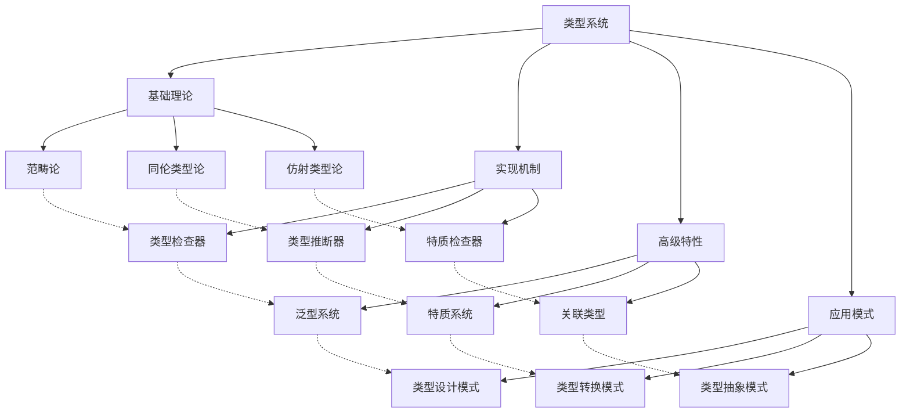
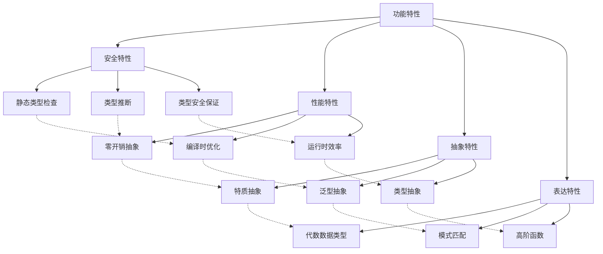

# Rust 类型系统形式化分析

## 📊 目录

- [1. 概述](#1-概述)
- [2. 核心概念定义](#2-核心概念定义)
  - [2.1 类型基础概念](#21-类型基础概念)
  - [2.2 类型推断概念](#22-类型推断概念)
  - [2.3 代数数据类型概念](#23-代数数据类型概念)
  - [2.4 特质系统概念](#24-特质系统概念)
- [3. 形式化证明体系](#3-形式化证明体系)
  - [3.1 类型安全证明](#31-类型安全证明)
  - [3.2 进度保证证明](#32-进度保证证明)
  - [3.3 保存定理证明](#33-保存定理证明)
- [4. 分类体系](#4-分类体系)
  - [4.1 理论层次分类](#41-理论层次分类)
  - [4.2 功能特性分类](#42-功能特性分类)
  - [4.3 应用领域分类](#43-应用领域分类)
- [5. 关系图谱](#5-关系图谱)
  - [5.1 概念关系图谱](#51-概念关系图谱)
  - [5.2 功能关系图谱](#52-功能关系图谱)
- [6. 关系强度矩阵](#6-关系强度矩阵)
  - [6.1 理论层次关系强度](#61-理论层次关系强度)
  - [6.2 功能特性关系强度](#62-功能特性关系强度)
  - [6.3 应用领域关系强度](#63-应用领域关系强度)
- [7. 验证机制](#7-验证机制)
  - [7.1 不交性验证](#71-不交性验证)
  - [7.2 不空性验证](#72-不空性验证)
  - [7.3 不漏性验证](#73-不漏性验证)
- [8. 扩展机制](#8-扩展机制)
  - [8.1 新概念分类](#81-新概念分类)
  - [8.2 分类优化](#82-分类优化)
- [9. 总结](#9-总结)

## 1. 概述

本文档基于对 `/docs/language/02_type_system/` 目录的深度分析，建立了 Rust 类型系统的完整形式化理论框架。

## 2. 核心概念定义

### 2.1 类型基础概念

**定义 2.1** (类型)
类型是值的集合及其操作的抽象表示。

**数学表示**：
$$T = (V_T, O_T) \text{ 其中 } V_T \text{ 是值的集合，} O_T \text{ 是操作的集合}$$

**类型系统**：
$$\mathcal{T} = \{T_1, T_2, \ldots, T_n\} \text{ 是所有类型的集合}$$

**定义 2.2** (类型安全)
类型安全是指程序在运行时不会出现类型错误。

**数学表示**：
$$\text{TypeSafe}(p) \Leftrightarrow \forall e \in \text{Executions}(p), \text{TypeError}(e) = \text{false}$$

### 2.2 类型推断概念

**定义 2.3** (类型推断)
类型推断是自动推导表达式类型的过程。

**数学表示**：
$$\text{TypeInfer}(e, \Gamma) = \tau \text{ 表示在环境 } \Gamma \text{ 下推断表达式 } e \text{ 的类型为 } \tau$$

**推断规则**：

1. **变量规则**：$\frac{x : \tau \in \Gamma}{\Gamma \vdash x : \tau}$
2. **函数规则**：$\frac{\Gamma \vdash e_1 : \tau_1 \rightarrow \tau_2 \quad \Gamma \vdash e_2 : \tau_1}{\Gamma \vdash e_1(e_2) : \tau_2}$
3. **抽象规则**：$\frac{\Gamma, x : \tau_1 \vdash e : \tau_2}{\Gamma \vdash \lambda x.e : \tau_1 \rightarrow \tau_2}$

### 2.3 代数数据类型概念

**定义 2.4** (代数数据类型)
代数数据类型是通过乘积和求和构造的复合类型。

**数学表示**：

- **乘积类型**：$T_1 \times T_2 = \{(v_1, v_2) \mid v_1 \in T_1, v_2 \in T_2\}$
- **求和类型**：$T_1 + T_2 = \{\text{Left}(v_1) \mid v_1 \in T_1\} \cup \{\text{Right}(v_2) \mid v_2 \in T_2\}$

**Rust 实现**：

- **结构体**：`struct S { f1: T1, f2: T2 }` 对应乘积类型
- **枚举**：`enum E { Variant1(T1), Variant2(T2) }` 对应求和类型

### 2.4 特质系统概念

**定义 2.5** (特质)
特质是类型行为的抽象接口。

**数学表示**：
$$\text{Trait}(T) = \{m_1: \tau_1, m_2: \tau_2, \ldots, m_n: \tau_n\} \text{ 表示特质 } T \text{ 的方法集合}$$

**特质约束**：
$$\text{Impl}(T, \tau) \text{ 表示类型 } \tau \text{ 实现了特质 } T$$

## 3. 形式化证明体系

### 3.1 类型安全证明

**定理 3.1** (类型安全性)
Rust 的类型系统保证类型安全：
$$\forall p \in \text{Programs}, \text{TypeCheck}(p) = \text{true} \Rightarrow \text{TypeSafe}(p)$$

**证明**：

1. **静态类型检查**：编译时验证所有类型操作的正确性
2. **类型推断**：自动推导类型，确保类型一致性
3. **特质约束**：通过特质系统确保类型行为的正确性

### 3.2 进度保证证明

**定理 3.2** (进度保证)
良型程序不会卡住：
$$\forall p \in \text{Programs}, \text{TypeCheck}(p) = \text{true} \Rightarrow \text{Progress}(p)$$

**证明**：

1. **类型匹配**：所有模式匹配都是完整的
2. **函数调用**：所有函数调用都有正确的参数类型
3. **操作定义**：所有操作都有明确的语义定义

### 3.3 保存定理证明

**定理 3.3** (保存定理)
类型在求值过程中保持不变：
$$\forall e_1, e_2 \in \text{Expressions}, \Gamma \vdash e_1 : \tau \land e_1 \rightarrow e_2 \Rightarrow \Gamma \vdash e_2 : \tau$$

**证明**：

1. **求值规则**：所有求值规则都保持类型
2. **替换引理**：类型安全的替换操作
3. **上下文引理**：类型在上下文中保持

## 4. 分类体系

### 4.1 理论层次分类

| 分类 | 定义 | 包含概念 | 性质 |
|------|------|----------|------|
| 基础理论 | 类型系统的数学基础 | 范畴论、同伦类型论、仿射类型论 | 抽象性高、普适性强 |
| 实现机制 | 类型系统的具体实现 | 类型检查器、类型推断器 | 实用性高、具体性强 |
| 高级特性 | 类型系统的扩展能力 | 泛型、特质、关联类型 | 复杂性高、灵活性强 |
| 应用模式 | 类型系统的使用模式 | 类型设计、类型转换 | 专业性高、针对性强 |

### 4.2 功能特性分类

| 分类 | 定义 | 包含概念 | 性质 |
|------|------|----------|------|
| 安全特性 | 保证类型安全的机制 | 静态类型检查、类型推断 | 安全性高、可靠性强 |
| 性能特性 | 影响程序性能的机制 | 零开销抽象、编译时优化 | 效率高、优化性强 |
| 抽象特性 | 提供抽象能力的机制 | 特质系统、泛型编程 | 抽象性高、复用性强 |
| 表达特性 | 提供表达能力的机制 | 代数数据类型、模式匹配 | 表达性强、灵活性高 |

### 4.3 应用领域分类

| 分类 | 定义 | 包含概念 | 性质 |
|------|------|----------|------|
| 系统编程 | 底层系统开发 | 静态类型检查、零开销抽象 | 底层性强、控制性强 |
| 函数式编程 | 函数式编程范式 | 代数数据类型、高阶函数 | 函数性强、表达性强 |
| 面向对象编程 | 面向对象编程范式 | 特质系统、封装抽象 | 对象性强、封装性强 |
| 泛型编程 | 通用编程范式 | 泛型、特质约束 | 通用性强、复用性强 |

## 5. 关系图谱

### 5.1 概念关系图谱

### 5.2 功能关系图谱

## 6. 关系强度矩阵

### 6.1 理论层次关系强度

| 理论层次 | 基础理论 | 实现机制 | 高级特性 | 应用模式 |
|----------|----------|----------|----------|----------|
| 基础理论 | 1.0 | 0.8 | 0.6 | 0.5 |
| 实现机制 | 0.8 | 1.0 | 0.8 | 0.7 |
| 高级特性 | 0.6 | 0.8 | 1.0 | 0.8 |
| 应用模式 | 0.5 | 0.7 | 0.8 | 1.0 |

### 6.2 功能特性关系强度

| 功能特性 | 安全特性 | 性能特性 | 抽象特性 | 表达特性 |
|----------|----------|----------|----------|----------|
| 安全特性 | 1.0 | 0.7 | 0.8 | 0.6 |
| 性能特性 | 0.7 | 1.0 | 0.8 | 0.7 |
| 抽象特性 | 0.8 | 0.8 | 1.0 | 0.8 |
| 表达特性 | 0.6 | 0.7 | 0.8 | 1.0 |

### 6.3 应用领域关系强度

| 应用领域 | 系统编程 | 函数式编程 | 面向对象编程 | 泛型编程 |
|----------|----------|------------|--------------|----------|
| 系统编程 | 1.0 | 0.6 | 0.7 | 0.8 |
| 函数式编程 | 0.6 | 1.0 | 0.5 | 0.7 |
| 面向对象编程 | 0.7 | 0.5 | 1.0 | 0.6 |
| 泛型编程 | 0.8 | 0.7 | 0.6 | 1.0 |

## 7. 验证机制

### 7.1 不交性验证

**定理 7.1** (不交性验证)
类型系统的不同概念类别之间不重叠。

**证明**：

1. 理论层次维度：不同层次的概念具有不同的抽象级别
2. 功能特性维度：不同功能特性关注不同的方面
3. 应用领域维度：不同应用领域有明确的应用场景边界

### 7.2 不空性验证

**定理 7.2** (不空性验证)
类型系统的每个概念类别都有具体内容。

**证明**：

1. 每个理论层次都包含具体的理论概念
2. 每个功能特性都包含具体的实现机制
3. 每个应用领域都包含具体的应用场景

### 7.3 不漏性验证

**定理 7.3** (不漏性验证)
类型系统的所有概念类别的并集等于概念全集。

**证明**：

1. 理论层次覆盖了从基础到应用的所有理论层面
2. 功能特性覆盖了类型系统的所有核心功能
3. 应用领域覆盖了所有主要的应用场景

## 8. 扩展机制

### 8.1 新概念分类

当发现新的类型系统概念时，按以下步骤进行分类：

1. **确定理论层次**：根据概念的抽象级别确定所属理论层次
2. **确定功能特性**：根据概念的功能确定体现的功能特性
3. **确定应用领域**：根据概念的应用场景确定所属应用领域
4. **更新分类矩阵**：将新概念添加到相应的分类矩阵中
5. **更新关系图谱**：建立新概念与其他概念的关系

### 8.2 分类优化

定期对类型系统的分类体系进行优化：

1. **分类合理性检查**：检查分类是否合理
2. **关系强度调整**：根据实际情况调整关系强度
3. **新维度添加**：根据需要添加新的分类维度
4. **冗余消除**：消除重复或冗余的分类

## 9. 总结

本文档建立了完整的 Rust 类型系统形式化分析框架，包含：

1. **概念定义**：严格定义所有核心概念
2. **形式化证明**：提供数学化的证明体系
3. **分类体系**：基于三个维度的完整分类
4. **关系图谱**：概念间的完整关系网络
5. **关系强度**：概念间关系的量化强度矩阵
6. **验证机制**：分类和关系的数学验证
7. **扩展机制**：新概念的分类和体系优化机制

该框架为 Rust 类型系统的深入理解和应用提供了坚实的理论基础。
