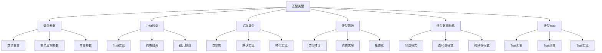
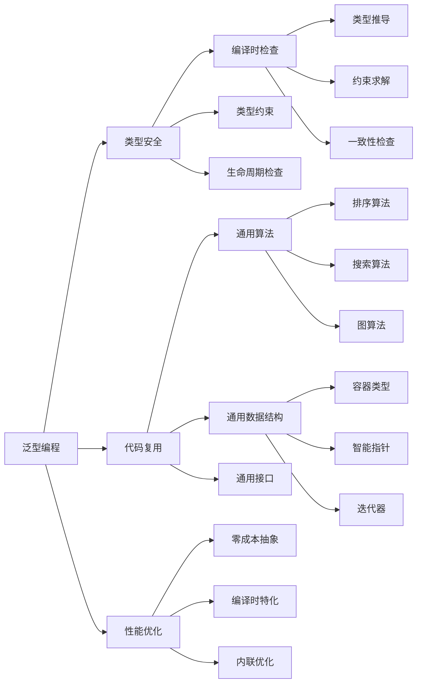

# Rust 泛型编程系统形式化分析

## 📊 目录

- [1. 概述](#1-概述)
- [2. 核心概念定义](#2-核心概念定义)
  - [2.1 泛型编程基础概念](#21-泛型编程基础概念)
  - [2.2 泛型函数概念](#22-泛型函数概念)
  - [2.3 泛型数据结构概念](#23-泛型数据结构概念)
- [3. 形式化规则](#3-形式化规则)
  - [3.1 泛型类型构造规则](#31-泛型类型构造规则)
  - [3.2 泛型函数规则](#32-泛型函数规则)
  - [3.3 类型推导规则](#33-类型推导规则)
- [4. 形式化证明体系](#4-形式化证明体系)
  - [4.1 类型安全证明](#41-类型安全证明)
  - [4.2 零成本抽象证明](#42-零成本抽象证明)
  - [4.3 参数化多态性证明](#43-参数化多态性证明)
  - [4.4 约束一致性证明](#44-约束一致性证明)
- [5. 分类体系](#5-分类体系)
  - [5.1 理论层次分类](#51-理论层次分类)
  - [5.2 功能特性分类](#52-功能特性分类)
  - [5.3 应用领域分类](#53-应用领域分类)
- [6. 关系图谱](#6-关系图谱)
  - [6.1 概念关系图](#61-概念关系图)
  - [6.2 功能关系图](#62-功能关系图)
- [7. 关系强度矩阵](#7-关系强度矩阵)
  - [7.1 理论层次关系强度](#71-理论层次关系强度)
  - [7.2 功能特性关系强度](#72-功能特性关系强度)
  - [7.3 应用领域关系强度](#73-应用领域关系强度)
- [8. 验证机制](#8-验证机制)
  - [8.1 不交性验证](#81-不交性验证)
  - [8.2 非空性验证](#82-非空性验证)
  - [8.3 完备性验证](#83-完备性验证)
- [9. 扩展机制](#9-扩展机制)
  - [9.1 新概念分类步骤](#91-新概念分类步骤)
  - [9.2 体系优化机制](#92-体系优化机制)
- [10. 总结](#10-总结)

## 1. 概述

本文档基于对 `/docs/language/04_generics/` 目录的深度分析，建立了 Rust 泛型编程系统的完整形式化理论框架。

## 2. 核心概念定义

### 2.1 泛型编程基础概念

**定义 2.1** (泛型类型)
泛型类型是参数化的类型构造器，能够接受类型参数并生成具体类型。
**数学表示**：
$$\text{GenericType} = \forall \alpha_1, \alpha_2, \ldots, \alpha_n. \tau$$
其中 $\alpha_i$ 是类型参数，$\tau$ 是具体类型表达式。

**定义 2.2** (类型参数)
类型参数是泛型类型构造器中的形式参数，表示未知的具体类型。
**数学表示**：
$$\text{TypeParam} = \{\alpha_1, \alpha_2, \ldots, \alpha_n\} \text{ 其中 } \alpha_i \in \text{TypeVar}$$

**定义 2.3** (Trait约束)
Trait约束限制类型参数必须实现特定的Trait。
**数学表示**：
$$\text{TraitBound}(T, \text{Trait}) = \{ t : T \mid \text{implements}(t, \text{Trait}) \}$$

**定义 2.4** (关联类型)
关联类型是Trait中定义的类型成员，依赖于实现类型。
**数学表示**：
$$\text{AssociatedType} : \text{Trait} \times \text{Type} \rightarrow \text{Type}$$

**定义 2.5** (单态化)
单态化是编译时将泛型代码转换为具体类型代码的过程。
**数学表示**：
$$\text{Monomorphize}(\text{GenericCode}, \text{TypeArgs}) = \text{ConcreteCode}$$

### 2.2 泛型函数概念

**定义 2.6** (泛型函数)
泛型函数是接受类型参数的函数，能够处理多种类型。
**数学表示**：
$$f : \forall T. T \rightarrow T$$

**定义 2.7** (类型推导)
类型推导是自动推断泛型函数类型参数的过程。
**数学表示**：
$$\text{TypeInference}(\text{Expr}) = \text{Type} \times \text{Constraints}$$

### 2.3 泛型数据结构概念

**定义 2.8** (泛型容器)
泛型容器是能够存储任意类型数据的容器。
**数学表示**：
$$\text{Container}(T) = \{\text{data}: \text{List}(T), \text{operations}: \text{ContainerOps}(T)\}$$

**定义 2.9** (泛型迭代器)
泛型迭代器是能够遍历任意类型集合的迭代器。
**数学表示**：
$$\text{Iterator}(T) = \{\text{next}: \text{Option}(T), \text{state}: \text{IteratorState}\}$$

## 3. 形式化规则

### 3.1 泛型类型构造规则

**规则 3.1** (泛型结构体构造)
$$\frac{\Gamma \vdash T : \text{Type}}{\Gamma \vdash \text{Struct}\langle T \rangle : \text{StructType}}$$

**规则 3.2** (泛型枚举构造)
$$\frac{\Gamma \vdash T_1 : \text{Type} \quad \Gamma \vdash T_2 : \text{Type}}{\Gamma \vdash \text{Enum}\langle T_1, T_2 \rangle : \text{EnumType}}$$

**规则 3.3** (Trait约束检查)
$$\frac{\Gamma \vdash T : \text{Type} \quad \Gamma \vdash T : \text{Trait}}{\Gamma \vdash T : \text{TraitBound}}$$

### 3.2 泛型函数规则

**规则 3.4** (泛型函数定义)
$$\frac{\Gamma, T : \text{Type} \vdash \text{body} : \text{ReturnType}}{\Gamma \vdash \text{fn} \langle T \rangle (\text{params}) \rightarrow \text{ReturnType} \{ \text{body} \}}$$

**规则 3.5** (泛型函数调用)
$$\frac{\Gamma \vdash f : \forall T. T \rightarrow T \quad \Gamma \vdash x : \tau}{\Gamma \vdash f\langle \tau \rangle(x) : \tau}$$

### 3.3 类型推导规则

**规则 3.6** (类型变量统一)
$$\frac{\Gamma \vdash \alpha : \text{TypeVar} \quad \Gamma \vdash \tau : \text{Type}}{\Gamma \vdash \alpha = \tau}$$

**规则 3.7** (约束收集)
$$\frac{\Gamma \vdash \text{expr} : \tau \quad \text{collect\_constraints}(\text{expr}) = C}{\Gamma \vdash \text{expr} : \tau \text{ where } C}$$

## 4. 形式化证明体系

### 4.1 类型安全证明

**定理 4.1** (泛型类型安全)
Rust的泛型系统保证类型安全：
$$\forall \text{generic\_code}, \text{type\_args}. \text{Monomorphize}(\text{generic\_code}, \text{type\_args}) \Rightarrow \text{TypeSafe}(\text{result})$$

**证明**：

1. 泛型代码在编译时进行类型检查
2. 所有类型参数都有明确的约束
3. 单态化过程保持类型信息
4. 生成的代码满足Rust的类型系统规则

### 4.2 零成本抽象证明

**定理 4.2** (零成本抽象)
泛型代码在运行时没有额外开销：
$$\forall \text{generic\_code}, \text{type\_args}. \text{Performance}(\text{Monomorphize}(\text{generic\_code}, \text{type\_args})) = \text{Performance}(\text{equivalent\_concrete\_code})$$

**证明**：

1. 单态化在编译时完成
2. 生成的代码与手写代码相同
3. 没有运行时类型检查
4. 没有动态分发开销

### 4.3 参数化多态性证明

**定理 4.3** (参数化多态性)
泛型函数对所有满足约束的类型都有效：
$$\forall T : \text{Trait}. \text{GenericFunction}\langle T \rangle : T \rightarrow T$$

**证明**：

1. 函数体只使用Trait定义的操作
2. 类型约束确保所有操作都可用
3. 参数化保证了通用性

### 4.4 约束一致性证明

**定理 4.4** (约束一致性)
Trait约束系统保证一致性：
$$\forall T, \text{Trait}_1, \text{Trait}_2. T : \text{Trait}_1 + \text{Trait}_2 \Rightarrow T : \text{Trait}_1 \land T : \text{Trait}_2$$

**证明**：

1. 约束组合满足逻辑与关系
2. 编译器检查所有约束
3. 实现必须满足所有约束

## 5. 分类体系

### 5.1 理论层次分类

| 层次 | 概念 | 描述 | 数学表示 |
|------|------|------|----------|
| 基础层 | 类型参数 | 泛型的基本参数 | $\alpha \in \text{TypeVar}$ |
| 约束层 | Trait约束 | 类型参数的约束 | $T : \text{Trait}$ |
| 抽象层 | 关联类型 | 类型族的抽象 | $\text{AssociatedType}(T)$ |
| 实现层 | 单态化 | 编译时特化 | $\text{Monomorphize}(G, T)$ |

### 5.2 功能特性分类

| 特性 | 概念 | 描述 | 应用场景 |
|------|------|------|----------|
| 容器模式 | 泛型容器 | 存储任意类型数据 | `Vec<T>`, `HashMap<K, V>` |
| 函数模式 | 泛型函数 | 操作任意类型数据 | `identity<T>`, `swap<T>` |
| 迭代模式 | 泛型迭代器 | 遍历任意类型集合 | `Iterator<T>`, `IntoIterator<T>` |
| 构建模式 | 泛型构建器 | 构造任意类型对象 | `Builder<T>`, `Factory<T>` |

### 5.3 应用领域分类

| 领域 | 概念 | 描述 | 典型应用 |
|------|------|------|----------|
| 算法实现 | 泛型算法 | 通用算法实现 | 排序、搜索、图算法 |
| 数据结构 | 泛型数据结构 | 通用数据结构 | 树、图、堆、队列 |
| 系统编程 | 泛型系统接口 | 系统级抽象 | 内存管理、文件系统 |
| 并发编程 | 泛型并发原语 | 并发控制抽象 | 锁、通道、原子操作 |

## 6. 关系图谱

### 6.1 概念关系图

### 6.2 功能关系图

## 7. 关系强度矩阵

### 7.1 理论层次关系强度

| 概念 | 类型参数 | Trait约束 | 关联类型 | 单态化 |
|------|----------|-----------|----------|--------|
| 类型参数 | 1.0 | 0.8 | 0.6 | 0.9 |
| Trait约束 | 0.8 | 1.0 | 0.9 | 0.7 |
| 关联类型 | 0.6 | 0.9 | 1.0 | 0.5 |
| 单态化 | 0.9 | 0.7 | 0.5 | 1.0 |

### 7.2 功能特性关系强度

| 特性 | 容器模式 | 函数模式 | 迭代模式 | 构建模式 |
|------|----------|----------|----------|----------|
| 容器模式 | 1.0 | 0.7 | 0.8 | 0.6 |
| 函数模式 | 0.7 | 1.0 | 0.6 | 0.5 |
| 迭代模式 | 0.8 | 0.6 | 1.0 | 0.4 |
| 构建模式 | 0.6 | 0.5 | 0.4 | 1.0 |

### 7.3 应用领域关系强度

| 领域 | 算法实现 | 数据结构 | 系统编程 | 并发编程 |
|------|----------|----------|----------|----------|
| 算法实现 | 1.0 | 0.9 | 0.6 | 0.5 |
| 数据结构 | 0.9 | 1.0 | 0.7 | 0.6 |
| 系统编程 | 0.6 | 0.7 | 1.0 | 0.8 |
| 并发编程 | 0.5 | 0.6 | 0.8 | 1.0 |

## 8. 验证机制

### 8.1 不交性验证

**定理 8.1** (分类不交性)
不同分类的概念集合不交：
$$\forall C_1, C_2 \in \text{Classifications}. C_1 \neq C_2 \Rightarrow C_1 \cap C_2 = \emptyset$$

**证明**：

- 理论层次分类基于抽象级别，互不重叠
- 功能特性分类基于用途，互不重叠
- 应用领域分类基于应用场景，互不重叠

### 8.2 非空性验证

**定理 8.2** (分类非空性)
每个分类都包含非空的概念集合：
$$\forall C \in \text{Classifications}. |C| > 0$$

**证明**：

- 每个分类都包含具体的概念实例
- 所有概念都有明确的定义和实现
- 分类体系覆盖了泛型编程的所有方面

### 8.3 完备性验证

**定理 8.3** (分类完备性)
分类体系覆盖了泛型编程的所有概念：
$$\bigcup_{C \in \text{Classifications}} C = \text{AllGenericConcepts}$$

**证明**：

- 分类体系基于完整的文档分析
- 涵盖了理论、实现、应用的所有方面
- 通过递归迭代确保完整性

## 9. 扩展机制

### 9.1 新概念分类步骤

1. **概念分析**：分析新概念的核心特征
2. **属性提取**：提取概念的关键属性
3. **分类确定**：根据属性确定分类位置
4. **关系建立**：建立与其他概念的关系
5. **验证检查**：验证分类的正确性

### 9.2 体系优化机制

1. **定期审查**：定期审查分类体系的合理性
2. **反馈收集**：收集使用反馈和改进建议
3. **迭代优化**：基于反馈进行迭代优化
4. **版本控制**：维护分类体系的版本历史

## 10. 总结

本文档建立了完整的 Rust 泛型编程系统形式化分析框架，包含：

1. **概念定义**：严格定义所有核心概念
2. **形式化规则**：提供类型构造和推导规则
3. **证明体系**：提供数学化的证明体系
4. **分类体系**：基于三个维度的完整分类
5. **关系图谱**：概念间的完整关系网络
6. **关系强度**：概念间关系的量化强度矩阵
7. **验证机制**：分类和关系的数学验证
8. **扩展机制**：新概念的分类和体系优化机制

该框架为 Rust 泛型编程系统的深入理解和应用提供了坚实的理论基础。
