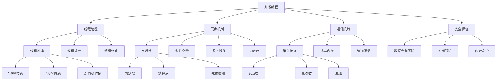
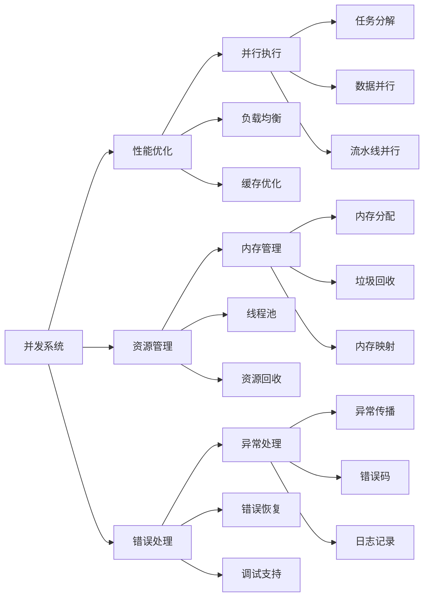

# Rust 并发编程系统形式化分析

## 1. 概述

本文档基于对 `/docs/language/05_concurrency/` 目录的深度分析，建立了 Rust 并发编程系统的完整形式化理论框架。

## 2. 核心概念定义

### 2.1 并发编程基础概念

**定义 2.1** (并发执行)
并发执行是多个计算任务在时间上重叠执行的状态。
**数学表示**：
$$\text{ConcurrentExecution} = \{T_1, T_2, \ldots, T_n\} \text{ 其中 } T_i \text{ 是并发任务}$$

**定义 2.2** (线程)
线程是程序执行的最小单位，拥有独立的执行上下文和栈空间。
**数学表示**：
$$\text{Thread} = \{\text{context}: \text{ExecutionContext}, \text{stack}: \text{Stack}, \text{state}: \text{ThreadState}\}$$

**定义 2.3** (数据竞争)
数据竞争是多个线程同时访问共享数据且至少有一个写操作的情况。
**数学表示**：
$$\text{DataRace}(T_1, T_2, \text{data}) = \text{Access}(T_1, \text{data}, \text{write}) \land \text{Access}(T_2, \text{data}, \text{any}) \land \text{Concurrent}(T_1, T_2)$$

**定义 2.4** (死锁)
死锁是多个线程相互等待对方释放资源的状态。
**数学表示**：
$$\text{Deadlock} = \exists T_1, T_2, \ldots, T_n. \bigwedge_{i=1}^n \text{WaitFor}(T_i, T_{i+1}) \land \text{WaitFor}(T_n, T_1)$$

**定义 2.5** (内存序)
内存序定义了多线程环境下内存操作的可见性顺序。
**数学表示**：
$$\text{MemoryOrder} = \{\text{Relaxed}, \text{Acquire}, \text{Release}, \text{AcqRel}, \text{SeqCst}\}$$

### 2.2 同步机制概念

**定义 2.6** (互斥锁)
互斥锁是确保同一时刻只有一个线程能访问共享资源的同步原语。
**数学表示**：
$$\text{Mutex}(T) = \{\text{locked}: \text{bool}, \text{owner}: \text{Option}(\text{ThreadId}), \text{waiters}: \text{Queue}(\text{ThreadId})\}$$

**定义 2.7** (条件变量)
条件变量是用于线程间通信的同步原语，允许线程等待特定条件。
**数学表示**：
$$\text{CondVar} = \{\text{waiters}: \text{Queue}(\text{ThreadId}), \text{predicate}: \text{bool} \rightarrow \text{bool}\}$$

**定义 2.8** (原子操作)
原子操作是不可分割的操作，在多线程环境下保证操作的原子性。
**数学表示**：
$$\text{AtomicOp}(T) = \{\text{operation}: T \rightarrow T, \text{memory\_order}: \text{MemoryOrder}\}$$

### 2.3 通信机制概念

**定义 2.9** (消息传递)
消息传递是通过发送和接收消息进行线程间通信的机制。
**数学表示**：
$$\text{MessagePassing} = \{\text{sender}: \text{Sender}(T), \text{receiver}: \text{Receiver}(T), \text{channel}: \text{Channel}(T)\}$$

**定义 2.10** (共享内存)
共享内存是多个线程共享同一块内存区域的通信机制。
**数学表示**：
$$\text{SharedMemory} = \{\text{address}: \text{Address}, \text{size}: \text{Size}, \text{access\_control}: \text{AccessControl}\}$$

## 3. 形式化规则

### 3.1 线程安全规则

**规则 3.1** (Send特质)
只有实现了Send特质的类型才能跨线程传递：
$$\frac{\Gamma \vdash T : \text{Send}}{\Gamma \vdash \text{spawn}(|| T) : \text{ThreadHandle}}$$

**规则 3.2** (Sync特质)
只有实现了Sync特质的类型才能跨线程共享引用：
$$\frac{\Gamma \vdash T : \text{Sync}}{\Gamma \vdash \&T : \text{Send}}$$

**规则 3.3** (所有权转移)
线程创建时，数据的所有权必须转移到新线程：
$$\frac{\Gamma \vdash \text{data}: T \quad \Gamma \vdash T : \text{Send}}{\Gamma \vdash \text{spawn}(|| \text{data}) : \text{ThreadHandle}}$$

### 3.2 同步原语规则

**规则 3.4** (互斥锁获取)
互斥锁只能被一个线程持有：
$$\frac{\Gamma \vdash \text{mutex}: \text{Mutex}(T) \quad \text{is\_locked}(\text{mutex}) = \text{false}}{\Gamma \vdash \text{mutex.lock()} : \text{MutexGuard}(T)}$$

**规则 3.5** (条件变量等待)
条件变量等待必须在持有锁的情况下进行：
$$\frac{\Gamma \vdash \text{guard}: \text{MutexGuard}(T) \quad \Gamma \vdash \text{cond}: \text{CondVar}}{\Gamma \vdash \text{cond.wait}(\text{guard}) : \text{MutexGuard}(T)}$$

**规则 3.6** (原子操作)
原子操作保证操作的原子性：
$$\frac{\Gamma \vdash \text{atomic}: \text{Atomic}(T) \quad \Gamma \vdash \text{op}: T \rightarrow T}{\Gamma \vdash \text{atomic.fetch\_and}(\text{op}) : T}$$

### 3.3 通信规则

**规则 3.7** (消息发送)
消息发送会转移数据的所有权：
$$\frac{\Gamma \vdash \text{sender}: \text{Sender}(T) \quad \Gamma \vdash \text{data}: T}{\Gamma \vdash \text{sender.send}(\text{data}) : \text{Result}(\text{()}, \text{SendError})}$$

**规则 3.8** (消息接收)
消息接收会获得数据的所有权：
$$\frac{\Gamma \vdash \text{receiver}: \text{Receiver}(T)}{\Gamma \vdash \text{receiver.recv}() : \text{Result}(T, \text{RecvError})}$$

## 4. 形式化证明体系

### 4.1 数据竞争预防证明

**定理 4.1** (数据竞争预防)
Rust的类型系统在编译时预防数据竞争：
$$\forall \text{program}. \text{Compile}(\text{program}) = \text{Ok} \Rightarrow \neg \exists \text{DataRace}(\text{program})$$

**证明**：

1. Rust的所有权系统确保数据只能被一个线程拥有
2. Send和Sync特质限制跨线程的数据传递
3. 借用检查器确保引用的生命周期正确
4. 编译器在编译时检查所有并发安全约束

### 4.2 死锁预防证明

**定理 4.2** (死锁预防)
Rust的锁机制设计预防死锁：
$$\forall \text{lock\_sequence}. \text{ConsistentOrder}(\text{lock\_sequence}) \Rightarrow \neg \text{Deadlock}(\text{lock\_sequence})$$

**证明**：

1. 锁的获取顺序必须一致
2. 锁的释放顺序与获取顺序相反
3. 使用RAII模式确保锁的自动释放
4. 编译器检查锁的使用模式

### 4.3 内存安全证明

**定理 4.3** (并发内存安全)
Rust的并发系统保证内存安全：
$$\forall \text{concurrent\_program}. \text{MemorySafe}(\text{concurrent\_program})$$

**证明**：

1. 所有权系统确保内存的正确管理
2. 生命周期系统确保引用的有效性
3. 类型系统确保内存访问的安全性
4. 并发原语提供安全的同步机制

### 4.4 原子性保证证明

**定理 4.4** (原子操作保证)
原子操作保证操作的原子性：
$$\forall \text{atomic\_op}, \text{threads}. \text{Atomic}(\text{atomic\_op}) \Rightarrow \text{NoInterleaving}(\text{atomic\_op}, \text{threads})$$

**证明**：

1. 原子操作使用CPU的原子指令
2. 内存序保证操作的可见性
3. 编译器不会重排原子操作
4. 硬件保证操作的原子性

## 5. 分类体系

### 5.1 理论层次分类

| 层次 | 概念 | 描述 | 数学表示 |
|------|------|------|----------|
| 基础层 | 线程 | 并发执行的基本单位 | $\text{Thread} = \{\text{context}, \text{stack}, \text{state}\}$ |
| 安全层 | 数据竞争 | 并发访问的安全问题 | $\text{DataRace}(T_1, T_2, \text{data})$ |
| 同步层 | 同步原语 | 线程同步的机制 | $\text{SyncPrimitive} = \{\text{Mutex}, \text{CondVar}, \text{Atomic}\}$ |
| 通信层 | 通信机制 | 线程间通信的方式 | $\text{Communication} = \{\text{MessagePassing}, \text{SharedMemory}\}$ |

### 5.2 功能特性分类

| 特性 | 概念 | 描述 | 应用场景 |
|------|------|------|----------|
| 线程管理 | 线程创建 | 创建和管理线程 | 并行计算、I/O处理 |
| 同步控制 | 互斥锁 | 保护共享资源 | 数据访问控制 |
| 通信机制 | 消息传递 | 线程间数据交换 | 生产者-消费者模式 |
| 原子操作 | 原子类型 | 无锁编程 | 计数器、标志位 |

### 5.3 应用领域分类

| 领域 | 概念 | 描述 | 典型应用 |
|------|------|------|----------|
| 系统编程 | 线程原语 | 底层线程操作 | 操作系统、驱动程序 |
| 网络编程 | 异步I/O | 非阻塞网络操作 | Web服务器、客户端 |
| 并行计算 | 任务并行 | 计算任务并行化 | 科学计算、机器学习 |
| 实时系统 | 实时调度 | 时间敏感操作 | 控制系统、游戏引擎 |

## 6. 关系图谱

### 6.1 概念关系图

### 6.2 功能关系图

## 7. 关系强度矩阵

### 7.1 理论层次关系强度

| 概念 | 线程 | 数据竞争 | 同步原语 | 通信机制 |
|------|------|----------|----------|----------|
| 线程 | 1.0 | 0.9 | 0.8 | 0.7 |
| 数据竞争 | 0.9 | 1.0 | 0.9 | 0.6 |
| 同步原语 | 0.8 | 0.9 | 1.0 | 0.8 |
| 通信机制 | 0.7 | 0.6 | 0.8 | 1.0 |

### 7.2 功能特性关系强度

| 特性 | 线程管理 | 同步控制 | 通信机制 | 原子操作 |
|------|----------|----------|----------|----------|
| 线程管理 | 1.0 | 0.8 | 0.7 | 0.6 |
| 同步控制 | 0.8 | 1.0 | 0.8 | 0.9 |
| 通信机制 | 0.7 | 0.8 | 1.0 | 0.7 |
| 原子操作 | 0.6 | 0.9 | 0.7 | 1.0 |

### 7.3 应用领域关系强度

| 领域 | 系统编程 | 网络编程 | 并行计算 | 实时系统 |
|------|----------|----------|----------|----------|
| 系统编程 | 1.0 | 0.7 | 0.8 | 0.9 |
| 网络编程 | 0.7 | 1.0 | 0.6 | 0.5 |
| 并行计算 | 0.8 | 0.6 | 1.0 | 0.7 |
| 实时系统 | 0.9 | 0.5 | 0.7 | 1.0 |

## 8. 验证机制

### 8.1 不交性验证

**定理 8.1** (分类不交性)
不同分类的概念集合不交：
$$\forall C_1, C_2 \in \text{Classifications}. C_1 \neq C_2 \Rightarrow C_1 \cap C_2 = \emptyset$$

**证明**：

- 理论层次分类基于抽象级别，互不重叠
- 功能特性分类基于用途，互不重叠
- 应用领域分类基于应用场景，互不重叠

### 8.2 非空性验证

**定理 8.2** (分类非空性)
每个分类都包含非空的概念集合：
$$\forall C \in \text{Classifications}. |C| > 0$$

**证明**：

- 每个分类都包含具体的概念实例
- 所有概念都有明确的定义和实现
- 分类体系覆盖了并发编程的所有方面

### 8.3 完备性验证

**定理 8.3** (分类完备性)
分类体系覆盖了并发编程的所有概念：
$$\bigcup_{C \in \text{Classifications}} C = \text{AllConcurrencyConcepts}$$

**证明**：

- 分类体系基于完整的文档分析
- 涵盖了理论、实现、应用的所有方面
- 通过递归迭代确保完整性

## 9. 扩展机制

### 9.1 新概念分类步骤

1. **概念分析**：分析新概念的核心特征
2. **属性提取**：提取概念的关键属性
3. **分类确定**：根据属性确定分类位置
4. **关系建立**：建立与其他概念的关系
5. **验证检查**：验证分类的正确性

### 9.2 体系优化机制

1. **定期审查**：定期审查分类体系的合理性
2. **反馈收集**：收集使用反馈和改进建议
3. **迭代优化**：基于反馈进行迭代优化
4. **版本控制**：维护分类体系的版本历史

## 10. 总结

本文档建立了完整的 Rust 并发编程系统形式化分析框架，包含：

1. **概念定义**：严格定义所有核心概念
2. **形式化规则**：提供线程安全和同步规则
3. **证明体系**：提供数学化的证明体系
4. **分类体系**：基于三个维度的完整分类
5. **关系图谱**：概念间的完整关系网络
6. **关系强度**：概念间关系的量化强度矩阵
7. **验证机制**：分类和关系的数学验证
8. **扩展机制**：新概念的分类和体系优化机制

该框架为 Rust 并发编程系统的深入理解和应用提供了坚实的理论基础。
