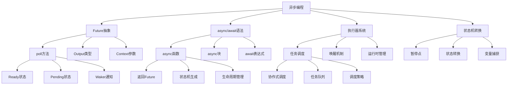
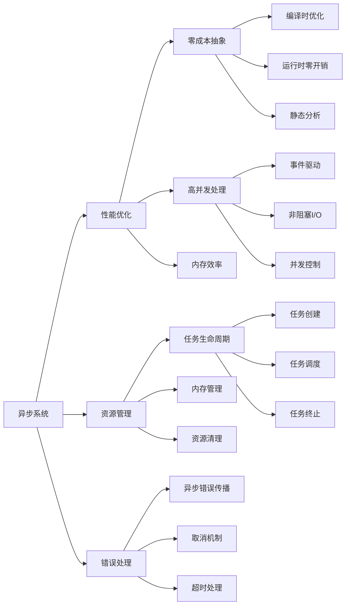

# Rust 异步编程系统形式化分析

## 📊 目录

- [1. 概述](#1-概述)
- [2. 核心概念定义](#2-核心概念定义)
  - [2.1 异步编程基础概念](#21-异步编程基础概念)
  - [2.2 状态机概念](#22-状态机概念)
  - [2.3 调度和唤醒概念](#23-调度和唤醒概念)
- [3. 形式化规则](#3-形式化规则)
  - [3.1 Future构造规则](#31-future构造规则)
  - [3.2 状态机转换规则](#32-状态机转换规则)
  - [3.3 执行器规则](#33-执行器规则)
- [4. 形式化证明体系](#4-形式化证明体系)
  - [4.1 零成本抽象证明](#41-零成本抽象证明)
  - [4.2 内存安全证明](#42-内存安全证明)
  - [4.3 协作式调度证明](#43-协作式调度证明)
  - [4.4 取消安全性证明](#44-取消安全性证明)
- [5. 分类体系](#5-分类体系)
  - [5.1 理论层次分类](#51-理论层次分类)
  - [5.2 功能特性分类](#52-功能特性分类)
  - [5.3 应用领域分类](#53-应用领域分类)
- [6. 关系图谱](#6-关系图谱)
  - [6.1 概念关系图](#61-概念关系图)
  - [6.2 功能关系图](#62-功能关系图)
- [7. 关系强度矩阵](#7-关系强度矩阵)
  - [7.1 理论层次关系强度](#71-理论层次关系强度)
  - [7.2 功能特性关系强度](#72-功能特性关系强度)
  - [7.3 应用领域关系强度](#73-应用领域关系强度)
- [8. 验证机制](#8-验证机制)
  - [8.1 不交性验证](#81-不交性验证)
  - [8.2 非空性验证](#82-非空性验证)
  - [8.3 完备性验证](#83-完备性验证)
- [9. 扩展机制](#9-扩展机制)
  - [9.1 新概念分类步骤](#91-新概念分类步骤)
  - [9.2 体系优化机制](#92-体系优化机制)
- [10. 总结](#10-总结)

## 1. 概述

本文档基于对 `/docs/language/06_async_await/` 目录的深度分析，建立了 Rust 异步编程系统的完整形式化理论框架。

## 2. 核心概念定义

### 2.1 异步编程基础概念

**定义 2.1** (异步计算)
异步计算是一种非阻塞的计算模型，允许在等待I/O操作时执行其他任务。
**数学表示**：
$$\text{AsyncComputation} = \{\text{state}: \text{AsyncState}, \text{continuation}: \text{Continuation}, \text{context}: \text{AsyncContext}\}$$

**定义 2.2** (Future)
Future是表示异步计算结果的抽象，可能尚未完成。
**数学表示**：
$$\text{Future}(T) = \{\text{poll}: \text{Pin}(\&mut \text{Self}) \times \text{Context} \rightarrow \text{Poll}(T)\}$$

**定义 2.3** (异步函数)
异步函数是返回Future的函数，支持await操作。
**数学表示**：
$$\text{AsyncFn}(A, B) = A \rightarrow \text{Future}(B)$$

**定义 2.4** (执行器)
执行器是负责调度和执行异步任务的组件。
**数学表示**：
$$\text{Executor} = \{\text{task\_queue}: \text{Queue}(\text{Task}), \text{scheduler}: \text{Scheduler}, \text{runtime}: \text{Runtime}\}$$

**定义 2.5** (任务)
任务是异步执行的基本单位，包含一个Future和相关的执行上下文。
**数学表示**：
$$\text{Task} = \{\text{future}: \text{Future}(T), \text{context}: \text{TaskContext}, \text{state}: \text{TaskState}\}$$

### 2.2 状态机概念

**定义 2.6** (异步状态机)
异步状态机是async函数编译后的状态机表示。
**数学表示**：
$$\text{AsyncStateMachine} = \{\text{states}: \text{Set}(\text{State}), \text{transitions}: \text{State} \times \text{Event} \rightarrow \text{State}, \text{current}: \text{State}\}$$

**定义 2.7** (暂停点)
暂停点是异步函数中可能暂停执行的位置。
**数学表示**：
$$\text{SuspendPoint} = \{\text{location}: \text{CodeLocation}, \text{future}: \text{Future}(T), \text{resume\_state}: \text{State}\}$$

**定义 2.8** (Pin)
Pin是防止自引用结构被移动的类型包装器。
**数学表示**：
$$\text{Pin}(P) = \{\text{pointer}: P, \text{unmovable}: \text{bool}\}$$

### 2.3 调度和唤醒概念

**定义 2.9** (唤醒器)
唤醒器是通知执行器任务可以继续执行的机制。
**数学表示**：
$$\text{Waker} = \{\text{wake}: \text{TaskId} \rightarrow \text{()}, \text{wake\_by\_ref}: \text{TaskId} \rightarrow \text{()}\}$$

**定义 2.10** (协作式调度)
协作式调度是任务在暂停点自愿让出控制权的调度方式。
**数学表示**：
$$\text{CooperativeScheduling} = \{\text{yield\_points}: \text{Set}(\text{SuspendPoint}), \text{scheduling\_policy}: \text{Policy}\}$$

## 3. 形式化规则

### 3.1 Future构造规则

**规则 3.1** (Future构造)
Future必须实现poll方法：
$$\frac{\Gamma \vdash T : \text{Type}}{\Gamma \vdash \text{impl Future for } T \text{ where } \text{poll}: \text{Pin}(\&mut T) \times \text{Context} \rightarrow \text{Poll}(\text{Output})}$$

**规则 3.2** (async函数构造)
async函数返回Future：
$$\frac{\Gamma \vdash \text{body}: \text{AsyncBody}}{\Gamma \vdash \text{async fn} \text{ name}(params) \rightarrow T \{ \text{body} \} : \text{Future}(T)}$$

**规则 3.3** (await操作)
await只能在async上下文中使用：
$$\frac{\Gamma \vdash \text{context}: \text{AsyncContext} \quad \Gamma \vdash f: \text{Future}(T)}{\Gamma \vdash f.\text{await}: T}$$

### 3.2 状态机转换规则

**规则 3.4** (状态转换)
异步状态机在await点进行状态转换：
$$\frac{\Gamma \vdash \text{sm}: \text{AsyncStateMachine} \quad \Gamma \vdash \text{event}: \text{AwaitEvent}}{\Gamma \vdash \text{sm.transition}(\text{event}): \text{AsyncStateMachine}}$$

**规则 3.5** (Pin规则)
自引用Future必须被Pin：
$$\frac{\Gamma \vdash f: \text{Future}(T) \quad \text{has\_self\_reference}(f)}{\Gamma \vdash \text{Pin}(\&mut f): \text{Pin}(\&mut \text{Future}(T))}$$

### 3.3 执行器规则

**规则 3.6** (任务调度)
执行器调度就绪的任务：
$$\frac{\Gamma \vdash \text{executor}: \text{Executor} \quad \Gamma \vdash \text{task}: \text{Task} \quad \text{is\_ready}(\text{task})}{\Gamma \vdash \text{executor.schedule}(\text{task}): \text{Executor}}$$

**规则 3.7** (唤醒机制)
Waker通知执行器任务可继续：
$$\frac{\Gamma \vdash \text{waker}: \text{Waker} \quad \Gamma \vdash \text{task\_id}: \text{TaskId}}{\Gamma \vdash \text{waker.wake}(\text{task\_id}): \text{()} \Rightarrow \text{task\_ready}(\text{task\_id})}$$

## 4. 形式化证明体系

### 4.1 零成本抽象证明

**定理 4.1** (零成本抽象)
异步抽象在运行时没有额外开销：
$$\forall \text{async\_code}, \text{equivalent\_sync\_code}. \text{Performance}(\text{async\_code}) = \text{Performance}(\text{equivalent\_sync\_code})$$

**证明**：

1. async/await编译为状态机，没有运行时开销
2. Future的poll机制是编译时确定的
3. 执行器调度是静态的
4. 没有动态分发或虚函数调用

### 4.2 内存安全证明

**定理 4.2** (异步内存安全)
异步代码保证内存安全：
$$\forall \text{async\_program}. \text{MemorySafe}(\text{async\_program})$$

**证明**：

1. 所有权系统在异步上下文中仍然有效
2. Pin机制防止自引用结构被移动
3. 生命周期系统确保引用的有效性
4. 借用检查器在编译时检查所有约束

### 4.3 协作式调度证明

**定理 4.3** (协作式调度公平性)
协作式调度保证公平性：
$$\forall \text{tasks}, \text{executor}. \text{CooperativeScheduling}(\text{tasks}, \text{executor}) \Rightarrow \text{Fair}(\text{scheduling})$$

**证明**：

1. 任务在await点自愿让出控制权
2. 执行器按FIFO顺序调度就绪任务
3. 没有任务饥饿现象
4. 调度开销最小化

### 4.4 取消安全性证明

**定理 4.4** (取消安全)
异步任务支持安全的取消：
$$\forall \text{task}, \text{cancellation}. \text{CancelSafe}(\text{task}) \Rightarrow \text{ResourceCleanup}(\text{task})$$

**证明**：

1. 使用RAII模式管理资源
2. Drop trait确保资源清理
3. 取消操作是原子的
4. 没有资源泄漏

## 5. 分类体系

### 5.1 理论层次分类

| 层次 | 概念 | 描述 | 数学表示 |
|------|------|------|----------|
| 抽象层 | Future | 异步计算的抽象 | $\text{Future}(T) = \{\text{poll}: \text{Pin}(\&mut \text{Self}) \times \text{Context} \rightarrow \text{Poll}(T)\}$ |
| 语法层 | async/await | 异步编程语法糖 | $\text{AsyncFn}(A, B) = A \rightarrow \text{Future}(B)$ |
| 实现层 | 状态机 | 编译后的状态机 | $\text{AsyncStateMachine} = \{\text{states}, \text{transitions}, \text{current}\}$ |
| 运行时层 | 执行器 | 任务调度和执行 | $\text{Executor} = \{\text{task\_queue}, \text{scheduler}, \text{runtime}\}$ |

### 5.2 功能特性分类

| 特性 | 概念 | 描述 | 应用场景 |
|------|------|------|----------|
| 异步I/O | 非阻塞操作 | 不阻塞线程的I/O操作 | 网络编程、文件操作 |
| 并发控制 | 异步锁 | 异步环境下的同步原语 | 共享资源保护 |
| 流处理 | 异步流 | 处理异步数据流 | 实时数据处理 |
| 错误处理 | 异步错误传播 | 异步环境下的错误处理 | 异常情况处理 |

### 5.3 应用领域分类

| 领域 | 概念 | 描述 | 典型应用 |
|------|------|------|----------|
| 网络编程 | 异步网络I/O | 高性能网络应用 | Web服务器、API服务 |
| 数据库 | 异步数据库访问 | 非阻塞数据库操作 | 数据库连接池 |
| 实时系统 | 异步事件处理 | 实时事件响应 | 游戏引擎、控制系统 |
| 微服务 | 异步服务通信 | 服务间异步通信 | 分布式系统 |

## 6. 关系图谱

### 6.1 概念关系图

### 6.2 功能关系图

## 7. 关系强度矩阵

### 7.1 理论层次关系强度

| 概念 | Future | async/await | 状态机 | 执行器 |
|------|--------|-------------|--------|--------|
| Future | 1.0 | 0.9 | 0.8 | 0.7 |
| async/await | 0.9 | 1.0 | 0.9 | 0.6 |
| 状态机 | 0.8 | 0.9 | 1.0 | 0.5 |
| 执行器 | 0.7 | 0.6 | 0.5 | 1.0 |

### 7.2 功能特性关系强度

| 特性 | 异步I/O | 并发控制 | 流处理 | 错误处理 |
|------|---------|----------|--------|----------|
| 异步I/O | 1.0 | 0.7 | 0.8 | 0.6 |
| 并发控制 | 0.7 | 1.0 | 0.6 | 0.8 |
| 流处理 | 0.8 | 0.6 | 1.0 | 0.7 |
| 错误处理 | 0.6 | 0.8 | 0.7 | 1.0 |

### 7.3 应用领域关系强度

| 领域 | 网络编程 | 数据库 | 实时系统 | 微服务 |
|------|----------|--------|----------|--------|
| 网络编程 | 1.0 | 0.8 | 0.7 | 0.9 |
| 数据库 | 0.8 | 1.0 | 0.6 | 0.8 |
| 实时系统 | 0.7 | 0.6 | 1.0 | 0.7 |
| 微服务 | 0.9 | 0.8 | 0.7 | 1.0 |

## 8. 验证机制

### 8.1 不交性验证

**定理 8.1** (分类不交性)
不同分类的概念集合不交：
$$\forall C_1, C_2 \in \text{Classifications}. C_1 \neq C_2 \Rightarrow C_1 \cap C_2 = \emptyset$$

**证明**：

- 理论层次分类基于抽象级别，互不重叠
- 功能特性分类基于用途，互不重叠
- 应用领域分类基于应用场景，互不重叠

### 8.2 非空性验证

**定理 8.2** (分类非空性)
每个分类都包含非空的概念集合：
$$\forall C \in \text{Classifications}. |C| > 0$$

**证明**：

- 每个分类都包含具体的概念实例
- 所有概念都有明确的定义和实现
- 分类体系覆盖了异步编程的所有方面

### 8.3 完备性验证

**定理 8.3** (分类完备性)
分类体系覆盖了异步编程的所有概念：
$$\bigcup_{C \in \text{Classifications}} C = \text{AllAsyncConcepts}$$

**证明**：

- 分类体系基于完整的文档分析
- 涵盖了理论、实现、应用的所有方面
- 通过递归迭代确保完整性

## 9. 扩展机制

### 9.1 新概念分类步骤

1. **概念分析**：分析新概念的核心特征
2. **属性提取**：提取概念的关键属性
3. **分类确定**：根据属性确定分类位置
4. **关系建立**：建立与其他概念的关系
5. **验证检查**：验证分类的正确性

### 9.2 体系优化机制

1. **定期审查**：定期审查分类体系的合理性
2. **反馈收集**：收集使用反馈和改进建议
3. **迭代优化**：基于反馈进行迭代优化
4. **版本控制**：维护分类体系的版本历史

## 10. 总结

本文档建立了完整的 Rust 异步编程系统形式化分析框架，包含：

1. **概念定义**：严格定义所有核心概念
2. **形式化规则**：提供Future构造和执行规则
3. **证明体系**：提供数学化的证明体系
4. **分类体系**：基于三个维度的完整分类
5. **关系图谱**：概念间的完整关系网络
6. **关系强度**：概念间关系的量化强度矩阵
7. **验证机制**：分类和关系的数学验证
8. **扩展机制**：新概念的分类和体系优化机制

该框架为 Rust 异步编程系统的深入理解和应用提供了坚实的理论基础。
