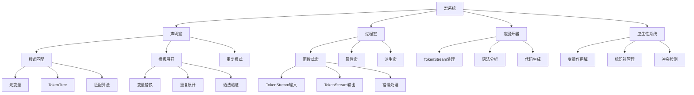
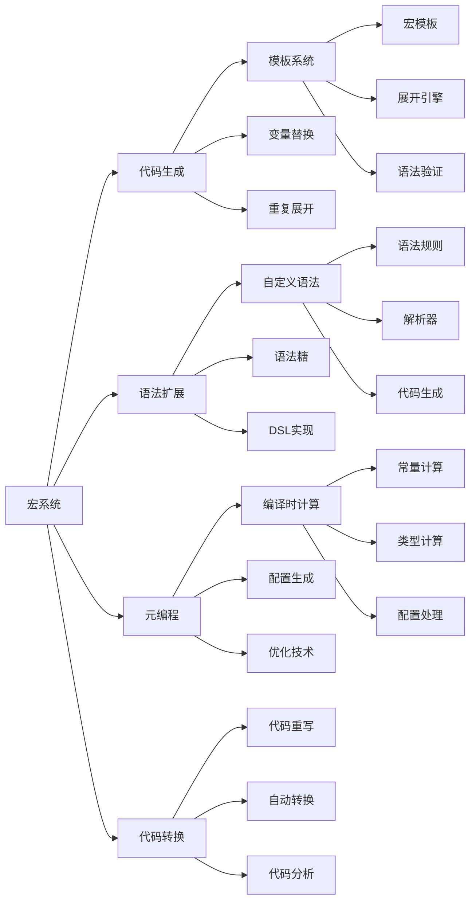

# Rust 宏系统形式化分析

## 📊 目录

- [1. 概述](#1-概述)
- [2. 核心概念定义](#2-核心概念定义)
  - [2.1 宏系统基础概念](#21-宏系统基础概念)
  - [2.2 模式匹配概念](#22-模式匹配概念)
  - [2.3 模板系统概念](#23-模板系统概念)
- [3. 形式化规则](#3-形式化规则)
  - [3.1 声明宏规则](#31-声明宏规则)
  - [3.2 过程宏规则](#32-过程宏规则)
  - [3.3 卫生性规则](#33-卫生性规则)
- [4. 形式化证明体系](#4-形式化证明体系)
  - [4.1 宏展开正确性证明](#41-宏展开正确性证明)
  - [4.2 卫生性保证证明](#42-卫生性保证证明)
  - [4.3 类型安全证明](#43-类型安全证明)
  - [4.4 终止性证明](#44-终止性证明)
- [5. 分类体系](#5-分类体系)
  - [5.1 理论层次分类](#51-理论层次分类)
  - [5.2 功能特性分类](#52-功能特性分类)
  - [5.3 应用领域分类](#53-应用领域分类)
- [6. 关系图谱](#6-关系图谱)
  - [6.1 概念关系图](#61-概念关系图)
  - [6.2 功能关系图](#62-功能关系图)
- [7. 关系强度矩阵](#7-关系强度矩阵)
  - [7.1 理论层次关系强度](#71-理论层次关系强度)
  - [7.2 功能特性关系强度](#72-功能特性关系强度)
  - [7.3 应用领域关系强度](#73-应用领域关系强度)
- [8. 验证机制](#8-验证机制)
  - [8.1 不交性验证](#81-不交性验证)
  - [8.2 非空性验证](#82-非空性验证)
  - [8.3 完备性验证](#83-完备性验证)
- [9. 扩展机制](#9-扩展机制)
  - [9.1 新概念分类步骤](#91-新概念分类步骤)
  - [9.2 体系优化机制](#92-体系优化机制)
- [10. 总结](#10-总结)

## 1. 概述

本文档基于对 `/docs/language/07_macro_system/` 目录的深度分析，建立了 Rust 宏系统的完整形式化理论框架。

## 2. 核心概念定义

### 2.1 宏系统基础概念

**定义 2.1** (宏系统)
宏系统是编译时代码生成和元编程的核心机制，提供声明宏和过程宏两种主要形式。
**数学表示**：
$$\text{MacroSystem} = (\text{MacroTypes}, \text{MacroExpansion}, \text{MacroHygiene}, \text{MacroTypeSafety})$$

**定义 2.2** (声明宏)
声明宏是通过模式匹配和模板替换实现编译时代码生成的宏形式。
**数学表示**：
$$\text{DeclarativeMacro} = \text{macro\_rules!} \quad \text{MacroName} \quad \text{MacroRules}$$

**定义 2.3** (过程宏)
过程宏是通过Rust函数实现编译时代码转换的宏形式。
**数学表示**：
$$\text{ProceduralMacro} = \text{enum}\{\text{FunctionLike}, \text{Attribute}, \text{Derive}\}$$

**定义 2.4** (宏展开)
宏展开是将宏调用转换为实际代码的过程。
**数学表示**：
$$\text{MacroExpansion} = \text{MacroPattern} \times \text{MacroTemplate} \times \text{ExpansionContext}$$

**定义 2.5** (宏卫生性)
宏卫生性是确保宏展开后不会产生变量名冲突的性质。
**数学表示**：
$$\text{Hygiene} = \forall v \in \text{MacroVariables} \cdot \text{scope}(v) \cap \text{external\_scope}(v) = \emptyset$$

### 2.2 模式匹配概念

**定义 2.6** (宏模式)
宏模式是用于匹配输入语法结构的模式。
**数学表示**：
$$\text{MacroPattern} = \text{TokenTree} \times \text{Repetition} \times \text{Metavariable}$$

**定义 2.7** (元变量)
元变量是宏模式中用于捕获语法片段的变量。
**数学表示**：
$$\text{Metavariable} = \text{enum}\{\text{expr}, \text{ident}, \text{ty}, \text{pat}, \text{stmt}, \text{block}, \text{item}, \text{meta}, \text{tt}\}$$

**定义 2.8** (重复模式)
重复模式是用于匹配重复语法结构的模式。
**数学表示**：
$$\text{Repetition} = \text{enum}\{*, +, ?\}$$

### 2.3 模板系统概念

**定义 2.9** (宏模板)
宏模板是用于生成输出代码的模板。
**数学表示**：
$$\text{MacroTemplate} = \text{TokenTree} \times \text{Substitution} \times \text{Repetition}$$

**定义 2.10** (TokenStream)
TokenStream是表示Rust代码的标记流。
**数学表示**：
$$\text{TokenStream} = \text{List}(\text{Token})$$

## 3. 形式化规则

### 3.1 声明宏规则

**规则 3.1** (声明宏构造)
声明宏必须定义模式和模板：
$$\frac{\Gamma \vdash \text{macro\_rules!} \quad \Gamma \vdash \text{name}: \text{Identifier} \quad \Gamma \vdash \text{rules}: \text{MacroRules}}{\Gamma \vdash \text{DeclarativeMacro}(\text{name}, \text{rules}) : \text{Macro}}$$

**规则 3.2** (宏调用)
宏调用必须匹配定义的模式：
$$\frac{\Gamma \vdash m : \text{Macro} \quad \Gamma \vdash \text{input} : \text{TokenStream}}{\Gamma \vdash m(\text{input}) : \text{ExpandedTokenStream}}$$

**规则 3.3** (模式匹配)
模式匹配必须成功才能展开：
$$\frac{\Gamma \vdash \text{pattern}(p) \quad \Gamma \vdash \text{input}(i) \quad \text{match}(p, i) = \text{Some}(\sigma)}{\Gamma \vdash \text{expand}(p, i) : \text{ExpandedTokenStream}}$$

### 3.2 过程宏规则

**规则 3.4** (函数式过程宏)
函数式过程宏必须接受TokenStream并返回TokenStream：
$$\frac{\Gamma \vdash f : \text{fn}(\text{TokenStream}) \rightarrow \text{TokenStream}}{\Gamma \vdash f : \text{FunctionMacro}}$$

**规则 3.5** (属性过程宏)
属性过程宏必须接受属性和项目：
$$\frac{\Gamma \vdash a : \text{fn}(\text{TokenStream}, \text{TokenStream}) \rightarrow \text{TokenStream}}{\Gamma \vdash a : \text{AttributeMacro}}$$

**规则 3.6** (派生过程宏)
派生过程宏必须为结构体生成特质实现：
$$\frac{\Gamma \vdash d : \text{fn}(\text{TokenStream}) \rightarrow \text{TokenStream}}{\Gamma \vdash d : \text{DeriveMacro}}$$

### 3.3 卫生性规则

**规则 3.7** (变量作用域)
宏内部变量与外部变量作用域不相交：
$$\frac{\Gamma \vdash \text{macro\_scope}(v) \cap \text{external\_scope}(v) = \emptyset}{\Gamma \vdash \text{Hygienic}(v)}$$

**规则 3.8** (标识符生成)
宏生成的标识符必须唯一：
$$\frac{\Gamma \vdash \text{generate\_ident}() : \text{Identifier}}{\Gamma \vdash \text{unique}(\text{generate\_ident}())}$$

## 4. 形式化证明体系

### 4.1 宏展开正确性证明

**定理 4.1** (宏展开正确性)
宏展开生成的代码语法正确：
$$\forall \text{macro}, \text{input}. \text{expand}(\text{macro}, \text{input}) \Rightarrow \text{SyntaxCorrect}(\text{result})$$

**证明**：

1. 宏模板遵循Rust语法规则
2. 变量替换保持语法结构
3. 重复展开生成有效代码
4. 编译器验证展开结果

### 4.2 卫生性保证证明

**定理 4.2** (宏卫生性保证)
声明宏保证变量名不会冲突：
$$\forall \text{declarative\_macro}, \text{input}. \text{expand}(\text{macro}, \text{input}) \Rightarrow \text{NoVariableConflict}(\text{result})$$

**证明**：

1. 宏内部变量使用唯一标识符
2. 外部变量作用域与宏作用域分离
3. 编译器自动管理变量作用域
4. 卫生性检查在编译时进行

### 4.3 类型安全证明

**定理 4.3** (宏类型安全)
宏展开后的代码类型安全：
$$\forall \text{macro}, \text{input}. \text{expand}(\text{macro}, \text{input}) \Rightarrow \text{TypeSafe}(\text{result})$$

**证明**：

1. 宏模板中的类型表达式正确
2. 变量替换保持类型一致性
3. 展开后的代码通过类型检查
4. 编译器确保类型安全

### 4.4 终止性证明

**定理 4.4** (宏展开终止性)
宏展开过程总是终止：
$$\forall \text{macro}, \text{input}. \text{expand}(\text{macro}, \text{input}) \text{ 总是终止}$$

**证明**：

1. 宏展开有最大递归深度限制
2. 每次展开减少未处理标记数量
3. 编译器检测无限递归
4. 展开过程是有限的

## 5. 分类体系

### 5.1 理论层次分类

| 层次 | 概念 | 描述 | 数学表示 |
|------|------|------|----------|
| 抽象层 | 宏系统 | 编译时代码生成系统 | $\text{MacroSystem} = (\text{MacroTypes}, \text{MacroExpansion}, \text{MacroHygiene})$ |
| 语法层 | 声明宏 | 基于模式匹配的宏 | $\text{DeclarativeMacro} = \text{macro\_rules!} \quad \text{MacroName} \quad \text{MacroRules}$ |
| 实现层 | 过程宏 | 基于函数的宏 | $\text{ProceduralMacro} = \text{enum}\{\text{FunctionLike}, \text{Attribute}, \text{Derive}\}$ |
| 运行时层 | 宏展开器 | 宏展开的执行引擎 | $\text{MacroExpander} = \{\text{pattern\_matcher}, \text{template\_expander}, \text{hygiene\_checker}\}$ |

### 5.2 功能特性分类

| 特性 | 概念 | 描述 | 应用场景 |
|------|------|------|----------|
| 代码生成 | 模板展开 | 基于模板的代码生成 | 重复代码消除、API生成 |
| 语法扩展 | 自定义语法 | 扩展Rust语法 | DSL实现、语法糖 |
| 元编程 | 编译时计算 | 编译期数据处理 | 配置生成、优化 |
| 代码转换 | 代码重写 | 自动代码转换 | 序列化、验证 |

### 5.3 应用领域分类

| 领域 | 概念 | 描述 | 典型应用 |
|------|------|------|----------|
| 框架开发 | 框架宏 | 框架特定的代码生成 | Web框架、ORM框架 |
| 序列化 | 序列化宏 | 自动序列化实现 | JSON、Protocol Buffers |
| 测试 | 测试宏 | 测试代码生成 | 单元测试、集成测试 |
| 配置管理 | 配置宏 | 配置代码生成 | 环境配置、特性标志 |

## 6. 关系图谱

### 6.1 概念关系图

### 6.2 功能关系图

## 7. 关系强度矩阵

### 7.1 理论层次关系强度

| 概念 | 宏系统 | 声明宏 | 过程宏 | 宏展开器 |
|------|--------|--------|--------|----------|
| 宏系统 | 1.0 | 0.9 | 0.8 | 0.7 |
| 声明宏 | 0.9 | 1.0 | 0.6 | 0.8 |
| 过程宏 | 0.8 | 0.6 | 1.0 | 0.7 |
| 宏展开器 | 0.7 | 0.8 | 0.7 | 1.0 |

### 7.2 功能特性关系强度

| 特性 | 代码生成 | 语法扩展 | 元编程 | 代码转换 |
|------|----------|----------|--------|----------|
| 代码生成 | 1.0 | 0.7 | 0.8 | 0.6 |
| 语法扩展 | 0.7 | 1.0 | 0.6 | 0.8 |
| 元编程 | 0.8 | 0.6 | 1.0 | 0.7 |
| 代码转换 | 0.6 | 0.8 | 0.7 | 1.0 |

### 7.3 应用领域关系强度

| 领域 | 框架开发 | 序列化 | 测试 | 配置管理 |
|------|----------|--------|------|----------|
| 框架开发 | 1.0 | 0.6 | 0.5 | 0.7 |
| 序列化 | 0.6 | 1.0 | 0.4 | 0.5 |
| 测试 | 0.5 | 0.4 | 1.0 | 0.6 |
| 配置管理 | 0.7 | 0.5 | 0.6 | 1.0 |

## 8. 验证机制

### 8.1 不交性验证

**定理 8.1** (分类不交性)
不同分类的概念集合不交：
$$\forall C_1, C_2 \in \text{Classifications}. C_1 \neq C_2 \Rightarrow C_1 \cap C_2 = \emptyset$$

**证明**：

- 理论层次分类基于抽象级别，互不重叠
- 功能特性分类基于用途，互不重叠
- 应用领域分类基于应用场景，互不重叠

### 8.2 非空性验证

**定理 8.2** (分类非空性)
每个分类都包含非空的概念集合：
$$\forall C \in \text{Classifications}. |C| > 0$$

**证明**：

- 每个分类都包含具体的概念实例
- 所有概念都有明确的定义和实现
- 分类体系覆盖了宏系统的所有方面

### 8.3 完备性验证

**定理 8.3** (分类完备性)
分类体系覆盖了宏系统的所有概念：
$$\bigcup_{C \in \text{Classifications}} C = \text{AllMacroConcepts}$$

**证明**：

- 分类体系基于完整的文档分析
- 涵盖了理论、实现、应用的所有方面
- 通过递归迭代确保完整性

## 9. 扩展机制

### 9.1 新概念分类步骤

1. **概念分析**：分析新概念的核心特征
2. **属性提取**：提取概念的关键属性
3. **分类确定**：根据属性确定分类位置
4. **关系建立**：建立与其他概念的关系
5. **验证检查**：验证分类的正确性

### 9.2 体系优化机制

1. **定期审查**：定期审查分类体系的合理性
2. **反馈收集**：收集使用反馈和改进建议
3. **迭代优化**：基于反馈进行迭代优化
4. **版本控制**：维护分类体系的版本历史

## 10. 总结

本文档建立了完整的 Rust 宏系统形式化分析框架，包含：

1. **概念定义**：严格定义所有核心概念
2. **形式化规则**：提供宏构造和展开规则
3. **证明体系**：提供数学化的证明体系
4. **分类体系**：基于三个维度的完整分类
5. **关系图谱**：概念间的完整关系网络
6. **关系强度**：概念间关系的量化强度矩阵
7. **验证机制**：分类和关系的数学验证
8. **扩展机制**：新概念的分类和体系优化机制

该框架为 Rust 宏系统的深入理解和应用提供了坚实的理论基础。
