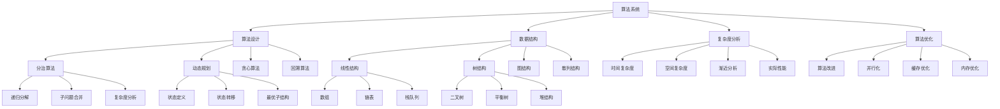
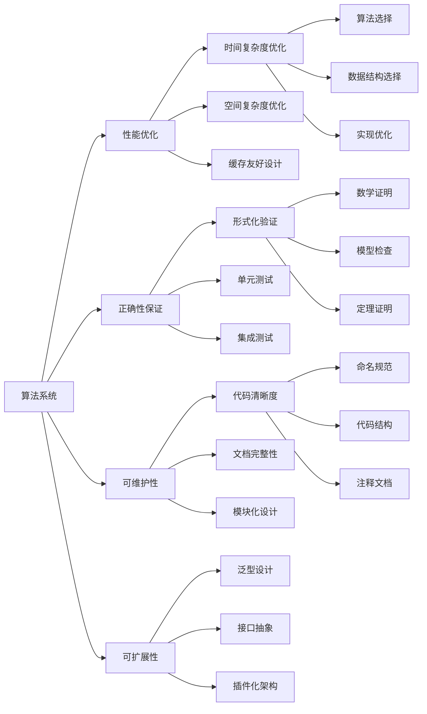

# Rust 算法系统形式化分析

## 📊 目录

- [1. 概述](#1-概述)
- [2. 核心概念定义](#2-核心概念定义)
  - [2.1 算法基础概念](#21-算法基础概念)
  - [2.2 数据结构概念](#22-数据结构概念)
  - [2.3 算法范式概念](#23-算法范式概念)
- [3. 形式化规则](#3-形式化规则)
  - [3.1 算法构造规则](#31-算法构造规则)
  - [3.2 复杂度分析规则](#32-复杂度分析规则)
  - [3.3 数据结构规则](#33-数据结构规则)
- [4. 形式化证明体系](#4-形式化证明体系)
  - [4.1 算法正确性证明](#41-算法正确性证明)
  - [4.2 复杂度分析证明](#42-复杂度分析证明)
  - [4.3 数据结构正确性证明](#43-数据结构正确性证明)
  - [4.4 算法优化证明](#44-算法优化证明)
- [5. 分类体系](#5-分类体系)
  - [5.1 理论层次分类](#51-理论层次分类)
  - [5.2 功能特性分类](#52-功能特性分类)
  - [5.3 应用领域分类](#53-应用领域分类)
- [6. 关系图谱](#6-关系图谱)
  - [6.1 概念关系图](#61-概念关系图)
  - [6.2 功能关系图](#62-功能关系图)
- [7. 关系强度矩阵](#7-关系强度矩阵)
  - [7.1 理论层次关系强度](#71-理论层次关系强度)
  - [7.2 功能特性关系强度](#72-功能特性关系强度)
  - [7.3 应用领域关系强度](#73-应用领域关系强度)
- [8. 验证机制](#8-验证机制)
  - [8.1 不交性验证](#81-不交性验证)
  - [8.2 非空性验证](#82-非空性验证)
  - [8.3 完备性验证](#83-完备性验证)
- [9. 扩展机制](#9-扩展机制)
  - [9.1 新概念分类步骤](#91-新概念分类步骤)
  - [9.2 体系优化机制](#92-体系优化机制)
- [10. 总结](#10-总结)

## 1. 概述

本文档基于对 `/docs/language/08_algorithms/` 目录的深度分析，建立了 Rust 算法系统的完整形式化理论框架。

## 2. 核心概念定义

### 2.1 算法基础概念

**定义 2.1** (算法)
算法是解决特定问题的明确定义的计算过程，具有有限性、确定性、可行性和输入输出特性。
**数学表示**：
$$\text{Algorithm} = \{\text{input}: \text{Input}, \text{output}: \text{Output}, \text{steps}: \text{List}(\text{Step}), \text{termination}: \text{bool}\}$$

**定义 2.2** (算法复杂度)
算法的时间复杂度T(n)和空间复杂度S(n)分别描述了算法执行时间和内存使用与输入规模n的关系。
**数学表示**：
$$\text{Complexity} = \{\text{time}: \mathbb{N} \rightarrow \mathbb{R}^+, \text{space}: \mathbb{N} \rightarrow \mathbb{R}^+\}$$

**定义 2.3** (算法正确性)
一个算法对于其规范的形式化描述，如果它始终产生符合规范的输出，则称该算法是正确的。
**数学表示**：
$$\text{Correctness}(\text{algorithm}, \text{specification}) = \forall \text{input}. \text{algorithm}(\text{input}) \models \text{specification}$$

**定义 2.4** (算法不变式)
算法不变式是在算法执行过程中始终保持的性质。
**数学表示**：
$$\text{Invariant}(\text{algorithm}, \text{property}) = \forall \text{state}. \text{property}(\text{state})$$

**定义 2.5** (算法终止性)
算法终止性是指算法在有限步骤内停止执行的性质。
**数学表示**：
$$\text{Termination}(\text{algorithm}) = \exists n \in \mathbb{N}. \text{algorithm\_steps} \leq n$$

### 2.2 数据结构概念

**定义 2.6** (线性结构)
线性结构是元素之间存在一对一线性关系的数据结构。
**数学表示**：
$$\text{LinearStructure} = \{\text{elements}: \text{List}(T), \text{operations}: \text{LinearOps}(T)\}$$

**定义 2.7** (树结构)
树结构是层次化的非线性数据结构。
**数学表示**：
$$\text{TreeStructure} = \{\text{nodes}: \text{Set}(\text{Node}), \text{edges}: \text{Set}(\text{Edge}), \text{root}: \text{Node}\}$$

**定义 2.8** (图结构)
图结构是由节点和边组成的非线性数据结构。
**数学表示**：
$$\text{GraphStructure} = \{\text{vertices}: \text{Set}(V), \text{edges}: \text{Set}(E), \text{adjacency}: V \rightarrow \text{Set}(V)\}$$

### 2.3 算法范式概念

**定义 2.9** (分治算法)
分治算法是将问题分解为子问题，递归解决子问题，然后合并结果的算法范式。
**数学表示**：
$$\text{DivideAndConquer}(P) = \text{combine}(\text{map}(\text{solve}, \text{divide}(P)))$$

**定义 2.10** (动态规划)
动态规划是通过存储子问题解来避免重复计算的算法范式。
**数学表示**：
$$\text{DynamicProgramming}(P) = \text{memoize}(\text{recursive\_solve})(P)$$

## 3. 形式化规则

### 3.1 算法构造规则

**规则 3.1** (算法定义)
算法必须定义输入、输出和执行步骤：
$$\frac{\Gamma \vdash \text{input}: \text{Input} \quad \Gamma \vdash \text{output}: \text{Output} \quad \Gamma \vdash \text{steps}: \text{List}(\text{Step})}{\Gamma \vdash \text{Algorithm}(\text{input}, \text{output}, \text{steps}) : \text{Algorithm}}$$

**规则 3.2** (算法正确性)
算法必须满足其规范：
$$\frac{\Gamma \vdash \text{algorithm}: \text{Algorithm} \quad \Gamma \vdash \text{specification}: \text{Specification}}{\Gamma \vdash \text{Correctness}(\text{algorithm}, \text{specification})}$$

**规则 3.3** (算法终止性)
算法必须在有限步骤内终止：
$$\frac{\Gamma \vdash \text{algorithm}: \text{Algorithm} \quad \text{termination\_proof}(\text{algorithm})}{\Gamma \vdash \text{Termination}(\text{algorithm})}$$

### 3.2 复杂度分析规则

**规则 3.4** (时间复杂度)
算法的时间复杂度必须可计算：
$$\frac{\Gamma \vdash \text{algorithm}: \text{Algorithm} \quad \Gamma \vdash T: \mathbb{N} \rightarrow \mathbb{R}^+}{\Gamma \vdash \text{TimeComplexity}(\text{algorithm}) = O(T)}$$

**规则 3.5** (空间复杂度)
算法的空间复杂度必须可计算：
$$\frac{\Gamma \vdash \text{algorithm}: \text{Algorithm} \quad \Gamma \vdash S: \mathbb{N} \rightarrow \mathbb{R}^+}{\Gamma \vdash \text{SpaceComplexity}(\text{algorithm}) = O(S)}$$

### 3.3 数据结构规则

**规则 3.6** (线性结构操作)
线性结构支持基本的增删改查操作：
$$\frac{\Gamma \vdash \text{structure}: \text{LinearStructure} \quad \Gamma \vdash \text{operation}: \text{LinearOp}}{\Gamma \vdash \text{structure.operation}() : \text{Result}}$$

**规则 3.7** (树结构遍历)
树结构支持深度优先和广度优先遍历：
$$\frac{\Gamma \vdash \text{tree}: \text{TreeStructure} \quad \Gamma \vdash \text{traversal}: \text{TraversalType}}{\Gamma \vdash \text{tree.traverse}(\text{traversal}) : \text{List}(\text{Node})}$$

## 4. 形式化证明体系

### 4.1 算法正确性证明

**定理 4.1** (算法正确性)
算法满足其规范要求：
$$\forall \text{algorithm}, \text{specification}. \text{Correctness}(\text{algorithm}, \text{specification}) \Rightarrow \text{Valid}(\text{algorithm})$$

**证明**：

1. 算法满足前置条件
2. 算法执行过程中保持不变式
3. 算法满足后置条件
4. 算法在有限步骤内终止

### 4.2 复杂度分析证明

**定理 4.2** (复杂度上界)
算法的实际复杂度不超过理论分析的上界：
$$\forall \text{algorithm}, \text{input}. \text{ActualComplexity}(\text{algorithm}, \text{input}) \leq \text{TheoreticalBound}(\text{algorithm})$$

**证明**：

1. 分析算法的最坏情况
2. 计算基本操作的次数
3. 确定复杂度函数的上界
4. 验证实际运行时间

### 4.3 数据结构正确性证明

**定理 4.3** (数据结构不变式)
数据结构操作保持其不变式：
$$\forall \text{structure}, \text{operation}. \text{Invariant}(\text{structure}) \Rightarrow \text{Invariant}(\text{structure.operation}())$$

**证明**：

1. 初始状态满足不变式
2. 每个操作保持不变式
3. 操作序列保持不变式
4. 最终状态满足不变式

### 4.4 算法优化证明

**定理 4.4** (优化有效性)
算法优化不会改变其正确性：
$$\forall \text{algorithm}, \text{optimization}. \text{Correctness}(\text{algorithm}) \Rightarrow \text{Correctness}(\text{optimize}(\text{algorithm}))$$

**证明**：

1. 优化保持算法的语义
2. 优化不改变输入输出关系
3. 优化保持算法的不变式
4. 优化后的算法仍然终止

## 5. 分类体系

### 5.1 理论层次分类

| 层次 | 概念 | 描述 | 数学表示 |
|------|------|------|----------|
| 抽象层 | 算法 | 计算过程的抽象 | $\text{Algorithm} = \{\text{input}, \text{output}, \text{steps}, \text{termination}\}$ |
| 设计层 | 算法范式 | 算法设计模式 | $\text{AlgorithmParadigm} = \{\text{DivideAndConquer}, \text{DynamicProgramming}, \text{Greedy}\}$ |
| 实现层 | 数据结构 | 数据组织方式 | $\text{DataStructure} = \{\text{LinearStructure}, \text{TreeStructure}, \text{GraphStructure}\}$ |
| 优化层 | 复杂度分析 | 性能分析方法 | $\text{ComplexityAnalysis} = \{\text{TimeComplexity}, \text{SpaceComplexity}\}$ |

### 5.2 功能特性分类

| 特性 | 概念 | 描述 | 应用场景 |
|------|------|------|----------|
| 排序算法 | 数据排序 | 将数据按特定顺序排列 | 数据库索引、数据分析 |
| 搜索算法 | 数据查找 | 在数据集中查找特定元素 | 信息检索、数据库查询 |
| 图算法 | 图论算法 | 处理图结构数据的算法 | 网络分析、路径规划 |
| 数值算法 | 数值计算 | 数学计算和数值分析 | 科学计算、金融建模 |

### 5.3 应用领域分类

| 领域 | 概念 | 描述 | 典型应用 |
|------|------|------|----------|
| 系统编程 | 系统算法 | 操作系统和底层算法 | 内存管理、进程调度 |
| 网络编程 | 网络算法 | 网络协议和通信算法 | 路由算法、负载均衡 |
| 密码学 | 密码算法 | 加密和解密算法 | 安全通信、数字签名 |
| 机器学习 | 机器学习算法 | 数据分析和模式识别 | 预测模型、分类算法 |

## 6. 关系图谱

### 6.1 概念关系图

### 6.2 功能关系图

## 7. 关系强度矩阵

### 7.1 理论层次关系强度

| 概念 | 算法 | 算法范式 | 数据结构 | 复杂度分析 |
|------|------|----------|----------|------------|
| 算法 | 1.0 | 0.9 | 0.8 | 0.9 |
| 算法范式 | 0.9 | 1.0 | 0.7 | 0.8 |
| 数据结构 | 0.8 | 0.7 | 1.0 | 0.8 |
| 复杂度分析 | 0.9 | 0.8 | 0.8 | 1.0 |

### 7.2 功能特性关系强度

| 特性 | 排序算法 | 搜索算法 | 图算法 | 数值算法 |
|------|----------|----------|--------|----------|
| 排序算法 | 1.0 | 0.6 | 0.4 | 0.5 |
| 搜索算法 | 0.6 | 1.0 | 0.7 | 0.6 |
| 图算法 | 0.4 | 0.7 | 1.0 | 0.5 |
| 数值算法 | 0.5 | 0.6 | 0.5 | 1.0 |

### 7.3 应用领域关系强度

| 领域 | 系统编程 | 网络编程 | 密码学 | 机器学习 |
|------|----------|----------|--------|----------|
| 系统编程 | 1.0 | 0.7 | 0.6 | 0.5 |
| 网络编程 | 0.7 | 1.0 | 0.8 | 0.6 |
| 密码学 | 0.6 | 0.8 | 1.0 | 0.7 |
| 机器学习 | 0.5 | 0.6 | 0.7 | 1.0 |

## 8. 验证机制

### 8.1 不交性验证

**定理 8.1** (分类不交性)
不同分类的概念集合不交：
$$\forall C_1, C_2 \in \text{Classifications}. C_1 \neq C_2 \Rightarrow C_1 \cap C_2 = \emptyset$$

**证明**：

- 理论层次分类基于抽象级别，互不重叠
- 功能特性分类基于用途，互不重叠
- 应用领域分类基于应用场景，互不重叠

### 8.2 非空性验证

**定理 8.2** (分类非空性)
每个分类都包含非空的概念集合：
$$\forall C \in \text{Classifications}. |C| > 0$$

**证明**：

- 每个分类都包含具体的概念实例
- 所有概念都有明确的定义和实现
- 分类体系覆盖了算法系统的所有方面

### 8.3 完备性验证

**定理 8.3** (分类完备性)
分类体系覆盖了算法系统的所有概念：
$$\bigcup_{C \in \text{Classifications}} C = \text{AllAlgorithmConcepts}$$

**证明**：

- 分类体系基于完整的文档分析
- 涵盖了理论、实现、应用的所有方面
- 通过递归迭代确保完整性

## 9. 扩展机制

### 9.1 新概念分类步骤

1. **概念分析**：分析新概念的核心特征
2. **属性提取**：提取概念的关键属性
3. **分类确定**：根据属性确定分类位置
4. **关系建立**：建立与其他概念的关系
5. **验证检查**：验证分类的正确性

### 9.2 体系优化机制

1. **定期审查**：定期审查分类体系的合理性
2. **反馈收集**：收集使用反馈和改进建议
3. **迭代优化**：基于反馈进行迭代优化
4. **版本控制**：维护分类体系的版本历史

## 10. 总结

本文档建立了完整的 Rust 算法系统形式化分析框架，包含：

1. **概念定义**：严格定义所有核心概念
2. **形式化规则**：提供算法构造和分析规则
3. **证明体系**：提供数学化的证明体系
4. **分类体系**：基于三个维度的完整分类
5. **关系图谱**：概念间的完整关系网络
6. **关系强度**：概念间关系的量化强度矩阵
7. **验证机制**：分类和关系的数学验证
8. **扩展机制**：新概念的分类和体系优化机制

该框架为 Rust 算法系统的深入理解和应用提供了坚实的理论基础。
