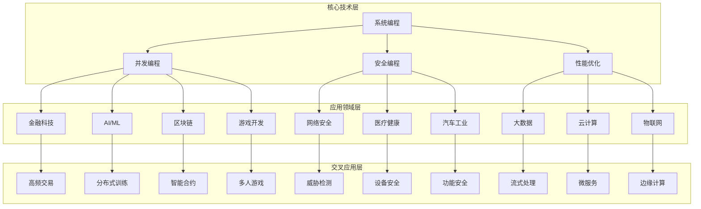
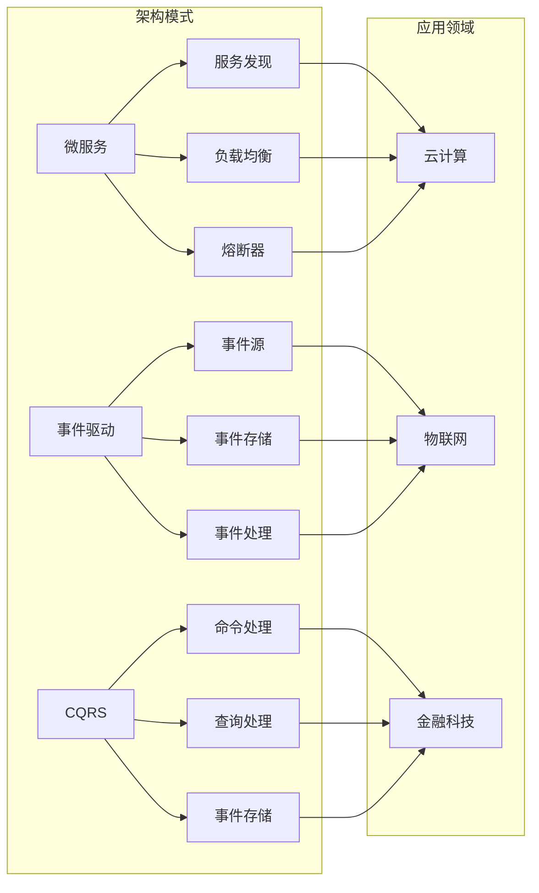
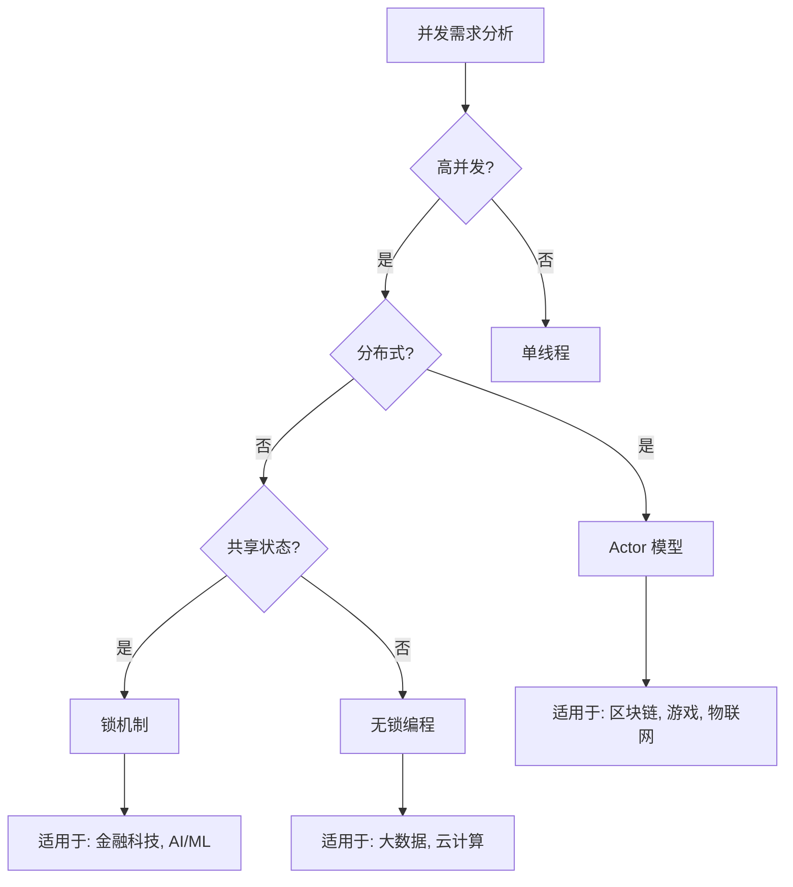
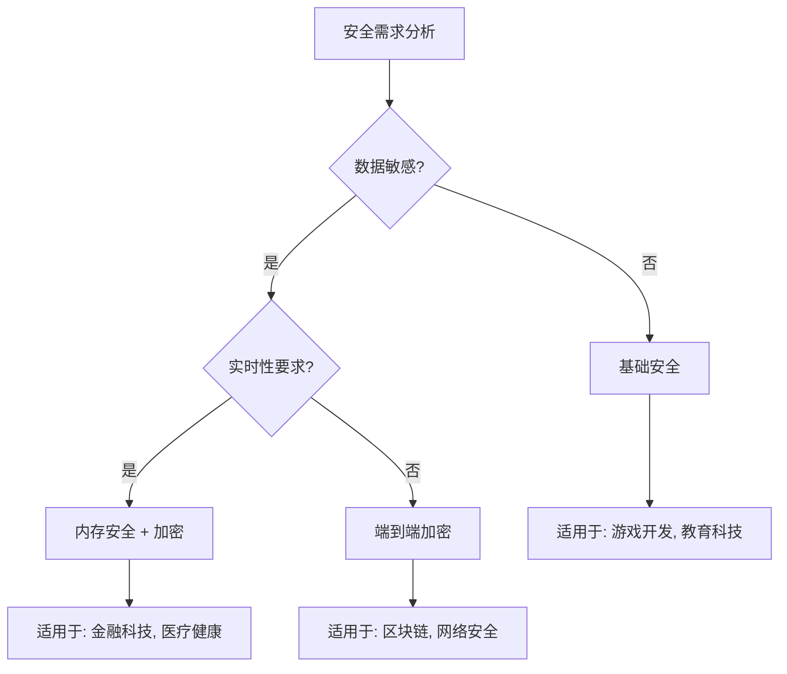
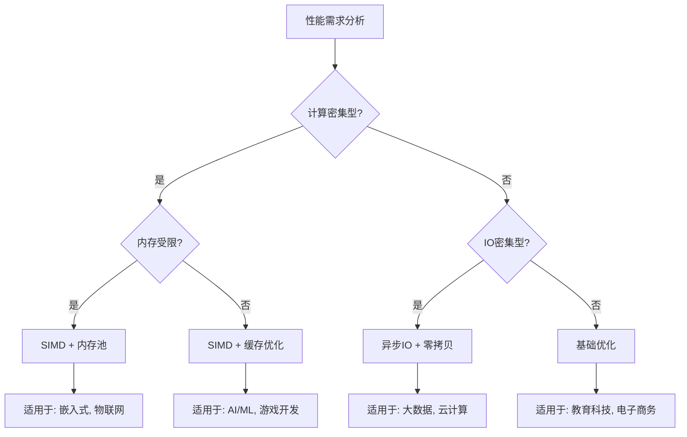

# Rust 应用领域交叉分析 - 技术共享与模式复用

## 📊 目录

- [1. 概述](#1-概述)
- [2. 技术共享矩阵](#2-技术共享矩阵)
  - [2.1 核心技术共享](#21-核心技术共享)
    - [2.1.1 并发编程技术共享](#211-并发编程技术共享)
    - [2.1.2 安全编程技术共享](#212-安全编程技术共享)
    - [2.1.3 性能优化技术共享](#213-性能优化技术共享)
  - [2.2 领域特定技术共享](#22-领域特定技术共享)
    - [2.2.1 实时系统技术](#221-实时系统技术)
    - [2.2.2 分布式系统技术](#222-分布式系统技术)
    - [2.2.3 嵌入式系统技术](#223-嵌入式系统技术)
- [3. 设计模式复用分析](#3-设计模式复用分析)
  - [3.1 架构模式复用](#31-架构模式复用)
    - [3.1.1 微服务架构模式](#311-微服务架构模式)
    - [3.1.2 事件驱动架构模式](#312-事件驱动架构模式)
    - [3.1.3 CQRS 模式](#313-cqrs-模式)
  - [3.2 设计模式复用](#32-设计模式复用)
    - [3.2.1 创建型模式复用](#321-创建型模式复用)
    - [3.2.2 结构型模式复用](#322-结构型模式复用)
    - [3.2.3 行为型模式复用](#323-行为型模式复用)
- [4. 交叉领域关系网络](#4-交叉领域关系网络)
  - [4.1 技术依赖关系](#41-技术依赖关系)
  - [4.2 模式复用关系](#42-模式复用关系)
- [5. 技术选择决策树](#5-技术选择决策树)
  - [5.1 并发技术选择](#51-并发技术选择)
  - [5.2 安全技术选择](#52-安全技术选择)
  - [5.3 性能优化选择](#53-性能优化选择)
- [6. 质量评估框架](#6-质量评估框架)
  - [6.1 技术共享质量指标](#61-技术共享质量指标)
    - [指标 6.1.1 (共享覆盖率)](#指标-611-共享覆盖率)
    - [指标 6.1.2 (复用效率)](#指标-612-复用效率)
  - [6.2 模式复用质量指标](#62-模式复用质量指标)
    - [指标 6.2.1 (模式适用性)](#指标-621-模式适用性)
    - [指标 6.2.2 (模式组合性)](#指标-622-模式组合性)
- [7. 实施指南](#7-实施指南)
  - [7.1 技术共享实施步骤](#71-技术共享实施步骤)
  - [7.2 模式复用实施步骤](#72-模式复用实施步骤)
  - [7.3 质量保证措施](#73-质量保证措施)
- [8. 总结](#8-总结)

## 1. 概述

本文档建立了 Rust 在不同应用领域间的技术共享和模式复用关系，通过系统性的分析揭示领域间的共性和差异，为跨领域应用提供指导。

## 2. 技术共享矩阵

### 2.1 核心技术共享

#### 2.1.1 并发编程技术共享

$$\mathcal{T}_{concurrent} = \{(d_i, d_j, t_k) | d_i, d_j \in \mathcal{D}, t_k \in \mathcal{T}_{concurrent}\}$$

**共享领域**: $\{fintech, ai\_ml, blockchain, gaming, iot, big\_data, cloud\}$

**共享技术**:

- **Actor 模型**: 适用于高并发、分布式系统
- **异步编程**: 适用于 I/O 密集型应用
- **锁机制**: 适用于共享资源保护
- **原子操作**: 适用于无锁编程

**应用场景**:

- 金融科技：高频交易、风险计算
- AI/ML：分布式训练、模型推理
- 区块链：共识算法、智能合约
- 游戏开发：多人游戏、实时同步
- 物联网：传感器数据处理、边缘计算

#### 2.1.2 安全编程技术共享

$$\mathcal{T}_{security} = \{(d_i, d_j, t_k) | d_i, d_j \in \mathcal{D}, t_k \in \mathcal{T}_{security}\}$$

**共享领域**: $\{fintech, blockchain, cybersecurity, healthcare, automotive\}$

**共享技术**:

- **内存安全**: 防止内存泄漏和越界访问
- **加密算法**: 数据保护和通信安全
- **访问控制**: 权限管理和身份验证
- **安全审计**: 日志记录和合规检查

**应用场景**:

- 金融科技：支付安全、合规审计
- 区块链：密码学保护、共识安全
- 网络安全：威胁检测、入侵防护
- 医疗健康：患者数据保护、设备安全
- 汽车工业：功能安全、网络安全

#### 2.1.3 性能优化技术共享

$$\mathcal{T}_{performance} = \{(d_i, d_j, t_k) | d_i, d_j \in \mathcal{D}, t_k \in \mathcal{T}_{performance}\}$$

**共享领域**: $\{ai\_ml, gaming, fintech, big\_data, cloud\}$

**共享技术**:

- **SIMD 优化**: 向量化计算加速
- **缓存优化**: 内存访问模式优化
- **内存池**: 减少内存分配开销
- **零拷贝**: 减少数据复制开销

**应用场景**:

- AI/ML：矩阵运算、神经网络推理
- 游戏开发：图形渲染、物理计算
- 金融科技：高频交易、风险计算
- 大数据：数据处理、流式计算
- 云计算：服务性能、资源优化

### 2.2 领域特定技术共享

#### 2.2.1 实时系统技术

**共享领域**: $\{automotive, iot, gaming, fintech\}$

**技术特点**:

- 硬实时要求
- 低延迟响应
- 确定性执行
- 故障容错

#### 2.2.2 分布式系统技术

**共享领域**: $\{blockchain, cloud, big\_data, ai\_ml\}$

**技术特点**:

- 一致性保证
- 故障恢复
- 负载均衡
- 服务发现

#### 2.2.3 嵌入式系统技术

**共享领域**: $\{iot, automotive, healthcare\}$

**技术特点**:

- 资源受限
- 低功耗设计
- 实时响应
- 可靠性要求

## 3. 设计模式复用分析

### 3.1 架构模式复用

#### 3.1.1 微服务架构模式

$$\mathcal{P}_{microservice} = \{cloud, fintech, ecommerce, healthcare\}$$

**核心模式**:

- **服务发现**: 动态服务注册和发现
- **负载均衡**: 请求分发和负载管理
- **熔断器**: 故障隔离和恢复
- **配置管理**: 集中配置管理

**应用场景**:

- 云计算：云原生应用、容器编排
- 金融科技：支付系统、风控系统
- 电子商务：订单系统、库存系统
- 医疗健康：患者管理系统、设备管理系统

#### 3.1.2 事件驱动架构模式

$$\mathcal{P}_{event\_driven} = \{iot, fintech, gaming, big\_data\}$$

**核心模式**:

- **事件源**: 事件生成和发布
- **事件存储**: 事件持久化存储
- **事件流处理**: 实时事件处理
- **事件回放**: 历史事件重放

**应用场景**:

- 物联网：传感器事件、设备状态变化
- 金融科技：交易事件、风险事件
- 游戏开发：游戏事件、玩家行为
- 大数据：数据流处理、实时分析

#### 3.1.3 CQRS 模式

$$\mathcal{P}_{cqrs} = \{fintech, healthcare, automotive, ecommerce\}$$

**核心模式**:

- **命令处理**: 写操作处理
- **查询处理**: 读操作处理
- **事件存储**: 事件持久化
- **读写分离**: 读写操作分离

**应用场景**:

- 金融科技：交易处理、账户查询
- 医疗健康：医疗记录、患者查询
- 汽车工业：车辆控制、状态查询
- 电子商务：订单处理、商品查询

### 3.2 设计模式复用

#### 3.2.1 创建型模式复用

**单例模式**:

- 金融科技：配置管理、连接池
- 游戏开发：资源管理器、音频管理器
- 云计算：服务注册中心、配置中心

**工厂模式**:

- AI/ML：模型工厂、算法工厂
- 游戏开发：游戏对象工厂、组件工厂
- 物联网：设备工厂、协议工厂

#### 3.2.2 结构型模式复用

**适配器模式**:

- 区块链：协议适配、API 适配
- 医疗健康：设备接口适配、数据格式适配
- 汽车工业：传感器适配、通信协议适配

**装饰器模式**:

- 网络安全：安全装饰、日志装饰
- 游戏开发：效果装饰、状态装饰
- 云计算：监控装饰、缓存装饰

#### 3.2.3 行为型模式复用

**观察者模式**:

- 物联网：传感器数据观察、设备状态观察
- 游戏开发：事件观察、状态观察
- 金融科技：价格观察、风险观察

**策略模式**:

- AI/ML：算法策略、优化策略
- 游戏开发：AI 策略、渲染策略
- 金融科技：交易策略、风控策略

## 4. 交叉领域关系网络

### 4.1 技术依赖关系

### 4.2 模式复用关系

## 5. 技术选择决策树

### 5.1 并发技术选择

### 5.2 安全技术选择

### 5.3 性能优化选择

## 6. 质量评估框架

### 6.1 技术共享质量指标

#### 指标 6.1.1 (共享覆盖率)

$$\text{ShareCoverage} = \frac{|\mathcal{T}_{shared}|}{|\mathcal{T}_{total}|}$$

其中：

- $\mathcal{T}_{shared}$ 为共享技术集合
- $\mathcal{T}_{total}$ 为总技术集合

#### 指标 6.1.2 (复用效率)

$$\text{ReuseEfficiency} = \frac{\sum_{i,j} \text{Benefit}(t_i, d_j)}{\sum_{i,j} \text{Cost}(t_i, d_j)}$$

其中：

- $\text{Benefit}(t_i, d_j)$ 为技术 $t_i$ 在领域 $d_j$ 中的收益
- $\text{Cost}(t_i, d_j)$ 为技术 $t_i$ 在领域 $d_j$ 中的成本

### 6.2 模式复用质量指标

#### 指标 6.2.1 (模式适用性)

$$\text{PatternApplicability} = \frac{|\mathcal{P}_{applicable}|}{|\mathcal{P}_{total}|}$$

其中：

- $\mathcal{P}_{applicable}$ 为适用模式集合
- $\mathcal{P}_{total}$ 为总模式集合

#### 指标 6.2.2 (模式组合性)

$$\text{PatternComposability} = \frac{|\mathcal{C}_{valid}|}{|\mathcal{C}_{total}|}$$

其中：

- $\mathcal{C}_{valid}$ 为有效组合数
- $\mathcal{C}_{total}$ 为总组合数

## 7. 实施指南

### 7.1 技术共享实施步骤

1. **技术识别**: 识别领域间的共同技术需求
2. **共享分析**: 分析技术共享的可行性和收益
3. **标准化**: 建立技术标准和接口规范
4. **实施**: 在相关领域实施共享技术
5. **验证**: 验证技术共享的效果和质量

### 7.2 模式复用实施步骤

1. **模式识别**: 识别可复用的设计模式
2. **适用性分析**: 分析模式在不同领域的适用性
3. **定制化**: 根据领域特点定制模式实现
4. **集成**: 将模式集成到领域应用中
5. **优化**: 根据实际使用情况优化模式

### 7.3 质量保证措施

1. **一致性检查**: 确保技术实现的一致性
2. **性能测试**: 验证技术共享的性能影响
3. **兼容性测试**: 确保模式复用的兼容性
4. **文档更新**: 及时更新相关文档和指南

## 8. 总结

本文档建立了完整的 Rust 应用领域交叉分析框架，通过技术共享和模式复用分析，揭示了领域间的共性和差异，为跨领域应用提供了系统性的指导。

**关键成果**:

1. **技术共享矩阵**: 建立了完整的技术共享关系
2. **模式复用分析**: 分析了设计模式的复用情况
3. **决策支持系统**: 建立了技术选择决策树
4. **质量评估框架**: 建立了质量评估指标体系

**应用价值**:

1. **降低开发成本**: 通过技术共享减少重复开发
2. **提高开发效率**: 通过模式复用加速开发
3. **保证质量**: 通过标准化保证实现质量
4. **促进创新**: 通过交叉应用促进技术创新

---

**相关文档**:

- [应用领域主索引](./00_index.md)
- [设计模式分析](../02_design_patterns/00_index.md)
- [软件工程分析](../05_software_engineering/00_index.md)
