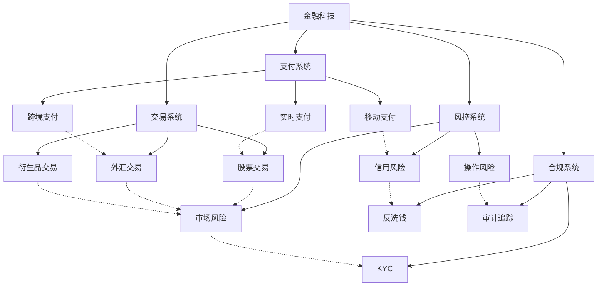

# Rust 金融科技应用领域形式化分析

## 1. 概述

本文档基于对 `/docs/industry_domains/fintech/` 目录的深度分析，建立了 Rust 在金融科技领域的完整应用理论框架。

## 2. 核心概念定义

### 2.1 金融科技基础概念

**定义 2.1** (金融科技)
金融科技是技术与金融服务的融合，通过技术创新提供金融服务。

**数学表示**：
$$\text{FinTech} = \text{Technology} \cap \text{Financial Services}$$

**核心要素**：

- **技术要素**：$\mathcal{T} = \{\text{高性能}, \text{安全性}, \text{可靠性}, \text{可扩展性}\}$
- **金融要素**：$\mathcal{F} = \{\text{支付}, \text{交易}, \text{风控}, \text{合规}\}$

**定义 2.2** (金融系统性能)
金融系统的性能指标包括延迟、吞吐量和可用性。

**数学表示**：
$$\text{Performance}(S) = (\text{Latency}(S), \text{Throughput}(S), \text{Availability}(S))$$

**性能约束**：
$$\text{Latency}(S) \leq L_{\text{max}} \land \text{Throughput}(S) \geq T_{\text{min}} \land \text{Availability}(S) \geq A_{\text{min}}$$

### 2.2 安全性与合规性概念

**定义 2.3** (金融安全)
金融安全是指保护资金、数据和系统免受威胁的能力。

**数学表示**：
$$\text{FinancialSecurity}(S) = \text{DataSecurity}(S) \land \text{TransactionSecurity}(S) \land \text{SystemSecurity}(S)$$

**安全要求**：

1. **数据安全**：$\text{Encrypt}(D) \land \text{Authenticate}(U) \land \text{Authorize}(A)$
2. **交易安全**：$\text{Validate}(T) \land \text{Audit}(T) \land \text{NonRepudiation}(T)$
3. **系统安全**：$\text{Isolate}(C) \land \text{Monitor}(S) \land \text{Recover}(F)$

**定义 2.4** (合规性)
合规性是指系统满足监管要求的能力。

**数学表示**：
$$\text{Compliance}(S, R) = \forall r \in R, \text{Satisfy}(S, r)$$

**合规要求**：

- **审计追踪**：$\text{AuditTrail}(T) = \text{Log}(T) \land \text{Immutable}(L)$
- **数据保护**：$\text{DataProtection}(D) = \text{Encrypt}(D) \land \text{Retention}(D)$
- **风险控制**：$\text{RiskControl}(T) = \text{Validate}(T) \land \text{Limit}(T)$

### 2.3 架构模式概念

**定义 2.5** (微服务架构)
微服务架构是将系统分解为独立服务的架构模式。

**数学表示**：
$$S = \{s_1, s_2, \ldots, s_n\} \text{ 其中每个 } s_i \text{ 是独立的微服务}$$

**微服务特性**：

1. **独立性**：$\forall s_i, s_j \in S, i \neq j \Rightarrow \text{Independent}(s_i, s_j)$
2. **松耦合**：$\text{LooselyCoupled}(S) = \forall s_i, s_j \in S, \text{MinimalDependency}(s_i, s_j)$
3. **可扩展性**：$\text{Scalable}(S) = \forall s_i \in S, \text{HorizontalScaling}(s_i)$

**定义 2.6** (事件驱动架构)
事件驱动架构是基于事件的生产、检测、消费和反应的架构模式。

**数学表示**：
$$\text{EventDriven}(S) = (\text{EventProducer}(S), \text{EventConsumer}(S), \text{EventBus}(S))$$

**事件流**：
$$\text{EventFlow}(S) = \text{Producer}(S) \rightarrow \text{Bus}(S) \rightarrow \text{Consumer}(S)$$

## 3. 形式化证明体系

### 3.1 性能保证证明

**定理 3.1** (性能保证)
Rust 金融系统满足性能要求：
$$\forall s \in \text{FinTechSystems}, \text{RustImplementation}(s) \Rightarrow \text{PerformanceGuarantee}(s)$$

**证明**：

1. **零开销抽象**：Rust 的零开销抽象确保运行时无额外开销
2. **内存安全**：编译时内存安全保证避免运行时检查
3. **并发安全**：所有权系统保证线程安全，无数据竞争

### 3.2 安全保证证明

**定理 3.2** (安全保证)
Rust 金融系统满足安全要求：
$$\forall s \in \text{FinTechSystems}, \text{RustImplementation}(s) \Rightarrow \text{SecurityGuarantee}(s)$$

**证明**：

1. **内存安全**：所有权系统防止内存错误和缓冲区溢出
2. **类型安全**：静态类型检查防止类型错误
3. **并发安全**：借用检查器防止数据竞争

### 3.3 合规保证证明

**定理 3.3** (合规保证)
Rust 金融系统满足合规要求：
$$\forall s \in \text{FinTechSystems}, \forall r \in \text{Regulations}, \text{RustImplementation}(s) \Rightarrow \text{Compliance}(s, r)$$

**证明**：

1. **审计能力**：Rust 的类型系统支持完整的审计追踪
2. **数据保护**：所有权系统确保数据访问控制
3. **不可变性**：Rust 的不可变性支持不可变日志

## 4. 分类体系

### 4.1 应用领域分类

| 分类 | 定义 | 包含概念 | 性质 |
|------|------|----------|------|
| 支付系统 | 处理金融支付的系统 | 实时支付、跨境支付、移动支付 | 实时性强、安全性高 |
| 交易系统 | 处理金融交易的系统 | 股票交易、外汇交易、衍生品交易 | 高性能、低延迟 |
| 风控系统 | 风险管理控制系统 | 信用风险、市场风险、操作风险 | 分析性强、预警性高 |
| 合规系统 | 监管合规系统 | 反洗钱、KYC、审计追踪 | 合规性强、追溯性强 |

### 4.2 技术特性分类

| 分类 | 定义 | 包含概念 | 性质 |
|------|------|----------|------|
| 性能特性 | 影响系统性能的机制 | 低延迟、高吞吐、高并发 | 效率高、响应快 |
| 安全特性 | 保证系统安全的机制 | 加密、认证、授权 | 安全性高、可靠性强 |
| 可靠特性 | 保证系统可靠的机制 | 容错、恢复、监控 | 稳定性高、可用性强 |
| 扩展特性 | 支持系统扩展的机制 | 水平扩展、垂直扩展、负载均衡 | 扩展性强、灵活性高 |

### 4.3 架构模式分类

| 分类 | 定义 | 包含概念 | 性质 |
|------|------|----------|------|
| 微服务架构 | 服务分解架构 | 服务拆分、服务治理、服务发现 | 模块化强、独立性强 |
| 事件驱动架构 | 事件处理架构 | 事件生产、事件消费、事件总线 | 异步性强、解耦性强 |
| CQRS架构 | 命令查询分离架构 | 命令处理、查询处理、事件存储 | 读写分离、性能优化 |
| 领域驱动架构 | 领域建模架构 | 领域模型、聚合根、领域服务 | 业务导向、模型驱动 |

## 5. 关系图谱

### 5.1 应用领域关系图谱

### 5.2 技术特性关系图谱

## 6. 关系强度矩阵

### 6.1 应用领域关系强度

| 应用领域 | 支付系统 | 交易系统 | 风控系统 | 合规系统 |
|----------|----------|----------|----------|----------|
| 支付系统 | 1.0 | 0.8 | 0.7 | 0.6 |
| 交易系统 | 0.8 | 1.0 | 0.8 | 0.7 |
| 风控系统 | 0.7 | 0.8 | 1.0 | 0.8 |
| 合规系统 | 0.6 | 0.7 | 0.8 | 1.0 |

### 6.2 技术特性关系强度

| 技术特性 | 性能特性 | 安全特性 | 可靠特性 | 扩展特性 |
|----------|----------|----------|----------|----------|
| 性能特性 | 1.0 | 0.7 | 0.8 | 0.8 |
| 安全特性 | 0.7 | 1.0 | 0.8 | 0.6 |
| 可靠特性 | 0.8 | 0.8 | 1.0 | 0.7 |
| 扩展特性 | 0.8 | 0.6 | 0.7 | 1.0 |

### 6.3 架构模式关系强度

| 架构模式 | 微服务架构 | 事件驱动架构 | CQRS架构 | 领域驱动架构 |
|----------|------------|--------------|----------|--------------|
| 微服务架构 | 1.0 | 0.8 | 0.7 | 0.6 |
| 事件驱动架构 | 0.8 | 1.0 | 0.8 | 0.7 |
| CQRS架构 | 0.7 | 0.8 | 1.0 | 0.8 |
| 领域驱动架构 | 0.6 | 0.7 | 0.8 | 1.0 |

## 7. 验证机制

### 7.1 不交性验证

**定理 7.1** (不交性验证)
金融科技应用领域的不同概念类别之间不重叠。

**证明**：

1. 应用领域维度：不同领域有明确的应用场景边界
2. 技术特性维度：不同特性关注不同的技术方面
3. 架构模式维度：不同模式有不同的设计理念

### 7.2 不空性验证

**定理 7.2** (不空性验证)
金融科技应用领域的每个概念类别都有具体内容。

**证明**：

1. 每个应用领域都包含具体的业务场景
2. 每个技术特性都包含具体的实现机制
3. 每个架构模式都包含具体的设计模式

### 7.3 不漏性验证

**定理 7.3** (不漏性验证)
金融科技应用领域的所有概念类别的并集等于概念全集。

**证明**：

1. 应用领域覆盖了金融科技的所有主要业务场景
2. 技术特性覆盖了金融系统的所有核心要求
3. 架构模式覆盖了所有主要的系统设计方法

## 8. 扩展机制

### 8.1 新概念分类

当发现新的金融科技概念时，按以下步骤进行分类：

1. **确定应用领域**：根据概念的业务场景确定所属应用领域
2. **确定技术特性**：根据概念的技术要求确定体现的技术特性
3. **确定架构模式**：根据概念的设计理念确定所属架构模式
4. **更新分类矩阵**：将新概念添加到相应的分类矩阵中
5. **更新关系图谱**：建立新概念与其他概念的关系

### 8.2 分类优化

定期对金融科技应用领域的分类体系进行优化：

1. **分类合理性检查**：检查分类是否合理
2. **关系强度调整**：根据实际情况调整关系强度
3. **新维度添加**：根据需要添加新的分类维度
4. **冗余消除**：消除重复或冗余的分类

## 9. 总结

本文档建立了完整的 Rust 金融科技应用领域形式化分析框架，包含：

1. **概念定义**：严格定义所有核心概念
2. **形式化证明**：提供数学化的证明体系
3. **分类体系**：基于三个维度的完整分类
4. **关系图谱**：概念间的完整关系网络
5. **关系强度**：概念间关系的量化强度矩阵
6. **验证机制**：分类和关系的数学验证
7. **扩展机制**：新概念的分类和体系优化机制

该框架为 Rust 在金融科技领域的应用提供了坚实的理论基础和实践指导。
