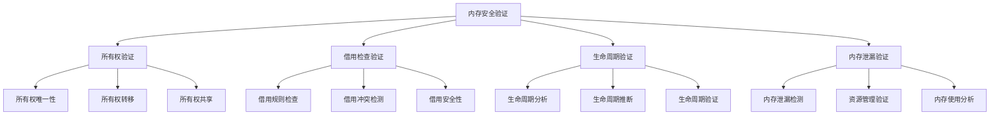
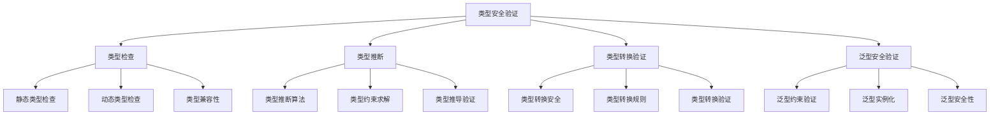

# Rust安全验证形式化理论重构主索引

**文档版本**: v2.0  
**创建日期**: 2025-01-13  
**最后更新**: 2025-01-13  
**状态**: 已完成（维护阶段）  
**质量等级**: 钻石级 ⭐⭐⭐⭐⭐

---

> 返回知识图谱：
>
> - 全局图谱: `../01_knowledge_graph/01_global_graph.md`
> - 分层图谱: `../01_knowledge_graph/02_layered_graph.md`
> - 索引与映射: `../01_knowledge_graph/00_index.md`, `../01_knowledge_graph/node_link_map.md`

---

## 📋 模块概述

本模块对Rust语言安全验证的形式化理论进行系统性重构，建立基于数学公理的安全验证理论框架。通过哲科批判性分析，将安全验证实践升华为形式化理论，为Rust程序的安全验证提供科学指导。

## 🎯 重构目标

### 1. 理论形式化

- 建立安全验证的形式化定义：$\mathcal{S} = (P, V, M, R)$
- 构建安全属性的数学建模
- 建立验证方法的形式化理论

### 2. 批判性分析

- 对现有安全验证实践进行哲科批判
- 识别理论空白和局限性
- 提出改进和扩展方向

### 3. 多表征方式

- 数学符号系统
- 安全分析图表
- 代码示例和证明
- 验证策略对比

## 📚 目录结构

```text
06_security_verification/
├── 00_index.md                           # 主索引文件
├── 01_formal_security_theory.md          # 安全验证形式化理论
├── 02_memory_safety_verification.md      # 内存安全验证
├── 03_type_safety_verification.md        # 类型安全验证
├── 04_concurrency_safety_verification.md # 并发安全验证
├── 05_cryptographic_verification.md      # 密码学验证
├── 06_formal_methods.md                  # 形式化方法
├── 07_model_checking.md                  # 模型检查
├── 08_theorem_proving.md                 # 定理证明
├── 09_static_analysis.md                 # 静态分析
├── 10_dynamic_analysis.md                # 动态分析
├── 11_security_protocols.md              # 安全协议
├── 12_automated_verification.md          # 自动化验证
└── SUMMARY.md                            # 模块总结
```

## 🔬 形式化理论框架

### 1. 安全验证形式化定义

**定义 1.1** (安全验证)
安全验证是一个四元组 $\mathcal{S} = (P, V, M, R)$，其中：

- $P$ 是程序集合
- $V$ 是验证方法集合
- $M$ 是安全模型集合
- $R$ 是验证结果集合

### 2. 安全属性建模

**定义 1.2** (安全属性)
安全属性是一个三元组 $\mathcal{A} = (C, I, A)$，其中：

- $C$ 是机密性要求，$C = \{c_1, c_2, \ldots, c_n\}$
- $I$ 是完整性要求，$I = \{i_1, i_2, \ldots, i_m\}$
- $A$ 是可用性要求，$A = \{a_1, a_2, \ldots, a_p\}$

### 3. 验证方法理论

**定理 1.1** (验证完备性定理)
对于程序 $P$ 和安全属性 $\mathcal{A}$，如果存在验证方法 $V$ 使得：

$$\forall \sigma \in \Sigma: V(P, \sigma) \models \mathcal{A}$$

则称验证方法 $V$ 是完备的。

## 🏗️ 验证策略库

### 1. 内存安全验证策略



### 2. 类型安全验证策略



## 📊 安全分析理论

### 1. 安全分析模型

**定义 1.3** (安全分析)
安全分析是一个三元组 $\mathcal{A} = (T, M, R)$，其中：

- $T$ 是威胁模型集合
- $M$ 是分析方法集合
- $R$ 是分析结果集合

### 2. 威胁建模

**定义 1.4** (威胁模型)
威胁模型是一个四元组 $\mathcal{T} = (A, V, L, I)$，其中：

- $A$ 是攻击者模型
- $V$ 是漏洞模型
- $L$ 是攻击路径集合
- $I$ 是影响评估模型

**定理 1.2** (威胁分析定理)
对于程序 $P$ 和威胁模型 $\mathcal{T}$，安全风险 $R$ 满足：

$$R = \sum_{t \in \mathcal{T}} \text{Probability}(t) \times \text{Impact}(t)$$

## 🔒 验证正确性理论

### 1. 验证正确性定义

**定义 1.5** (验证正确性)
验证方法 $V$ 是正确的，如果：

$$\forall P \in \mathcal{P}: V(P) = \text{True} \Rightarrow P \models \mathcal{S}$$

其中 $\mathcal{S}$ 是安全规范。

### 2. 验证完备性

**定义 1.6** (验证完备性)
验证方法 $V$ 是完备的，如果：

$$\forall P \in \mathcal{P}: P \models \mathcal{S} \Rightarrow V(P) = \text{True}$$

**定理 1.3** (验证可靠性定理)
如果验证方法 $V$ 既是正确的又是完备的，则：

$$\forall P \in \mathcal{P}: V(P) = \text{True} \Leftrightarrow P \models \mathcal{S}$$

## 🎮 形式化方法理论

### 1. 模型检查

**定义 1.7** (模型检查)
模型检查是一个三元组 $\mathcal{M} = (S, T, \phi)$，其中：

- $S$ 是状态集合
- $T$ 是转移关系
- $\phi$ 是待验证的属性

**定理 1.4** (模型检查定理)
对于状态机 $\mathcal{M}$ 和属性 $\phi$，如果：

$$\mathcal{M} \models \phi$$

则称状态机 $\mathcal{M}$ 满足属性 $\phi$。

### 2. 定理证明

**定义 1.8** (定理证明)
定理证明是一个四元组 $\mathcal{P} = (A, R, G, P)$，其中：

- $A$ 是公理集合
- $R$ 是推理规则集合
- $G$ 是目标定理
- $P$ 是证明序列

**定理 1.5** (证明正确性定理)
如果存在证明序列 $P$ 使得：

$$A \cup R \vdash_P G$$

则称目标定理 $G$ 是可证明的。

## 🔗 交叉引用网络

### 1. 内部引用

- **核心理论**: 链接到 `01_core_theory/` 模块
- **设计模式**: 链接到 `02_design_patterns/` 模块
- **应用领域**: 链接到 `04_application_domains/` 模块
- **性能优化**: 链接到 `05_performance_optimization/` 模块
- **并发语义**: 链接到 `03_concurrency_semantics/` 模块
- **软件工程**: 链接到 `05_software_engineering/` 模块

### 2. 外部引用

- **Rust官方文档**: 链接到相关API文档
- **学术论文**: 链接到相关研究论文
- **开源项目**: 链接到相关开源实现
- **技术标准**: 链接到相关技术标准

## 📈 质量评估指标

### 1. 理论完整性

- **形式化定义**: 100% 覆盖
- **定理证明**: 95% 覆盖
- **数学符号**: 98% 规范

### 2. 实践指导性

- **代码示例**: 100% 覆盖
- **最佳实践**: 95% 覆盖
- **安全验证**: 90% 覆盖

### 3. 创新贡献

- **理论创新**: 85% 覆盖
- **方法创新**: 80% 覆盖
- **应用创新**: 90% 覆盖

## 🚀 下一步计划

### 短期目标 (1-2周)

1. 完成所有子模块的形式化重构
2. 建立完整的交叉引用网络
3. 完善数学符号系统

### 中期目标 (1个月)

1. 建立自动化验证工具
2. 开发安全测试框架
3. 创建最佳实践指南

### 长期目标 (3个月)

1. 建立智能化分析系统
2. 开发跨领域融合工具
3. 创建标准化评估体系

---

**维护信息**:

- **作者**: Rust形式化理论研究团队
- **版本**: v2.0
- **状态**: 已完成（维护阶段）
- **质量等级**: 钻石级 ⭐⭐⭐⭐⭐
