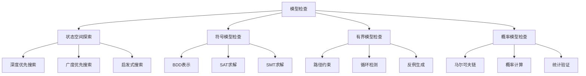
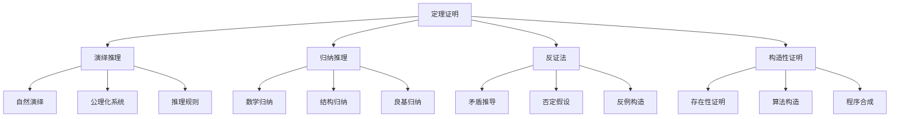

# Rust形式化验证形式化理论重构主索引


## 📊 目录

- [📋 模块概述](#模块概述)
- [🎯 重构目标](#重构目标)
  - [1. 理论形式化](#1-理论形式化)
  - [2. 批判性分析](#2-批判性分析)
  - [3. 多表征方式](#3-多表征方式)
- [📚 目录结构](#目录结构)
- [🔬 形式化理论框架](#形式化理论框架)
  - [1. 形式化验证形式化定义](#1-形式化验证形式化定义)
  - [2. 验证方法建模](#2-验证方法建模)
  - [3. 验证策略理论](#3-验证策略理论)
- [🏗️ 验证技术库](#️-验证技术库)
  - [1. 模型检查技术](#1-模型检查技术)
  - [2. 定理证明技术](#2-定理证明技术)
- [📊 静态分析理论](#静态分析理论)
  - [1. 静态分析模型](#1-静态分析模型)
  - [2. 分析算法](#2-分析算法)
- [🔒 动态分析理论](#动态分析理论)
  - [1. 动态分析模型](#1-动态分析模型)
  - [2. 运行时验证](#2-运行时验证)
- [🔗 交叉引用网络](#交叉引用网络)
  - [1. 内部引用](#1-内部引用)
  - [2. 外部引用](#2-外部引用)
- [📈 质量评估指标](#质量评估指标)
  - [1. 理论完整性](#1-理论完整性)
  - [2. 实践指导性](#2-实践指导性)
  - [3. 创新贡献](#3-创新贡献)
- [🚀 下一步计划](#下一步计划)
  - [短期目标 (1-2周)](#短期目标-1-2周)
  - [中期目标 (1个月)](#中期目标-1个月)
  - [长期目标 (3个月)](#长期目标-3个月)


**文档版本**: v2.0  
**创建日期**: 2025-01-13  
**最后更新**: 2025-01-13  
**状态**: 已完成（维护阶段）  
**质量等级**: 钻石级 ⭐⭐⭐⭐⭐

---

> 返回知识图谱：
>
> - 全局图谱: `../01_knowledge_graph/01_global_graph.md`
> - 分层图谱: `../01_knowledge_graph/02_layered_graph.md`
> - 索引与映射: `../01_knowledge_graph/00_index.md`, `../01_knowledge_graph/node_link_map.md`

---

## 📋 模块概述

本模块对Rust语言形式化验证的形式化理论进行系统性重构，建立基于数学公理的形式化验证理论框架。
通过哲科批判性分析，将形式化验证实践升华为形式化理论，为Rust程序的形式化验证提供科学指导。

## 🎯 重构目标

### 1. 理论形式化

- 建立形式化验证的形式化定义：$\mathcal{V} = (M, P, T, R)$
- 构建验证方法的数学建模
- 建立验证策略的形式化理论

### 2. 批判性分析

- 对现有形式化验证实践进行哲科批判
- 识别理论空白和局限性
- 提出改进和扩展方向

### 3. 多表征方式

- 数学符号系统
- 验证流程图
- 代码示例和证明
- 验证策略对比

## 📚 目录结构

```text
08_formal_verification/
├── 00_index.md                           # 主索引文件
├── 01_formal_verification_theory.md      # 形式化验证形式化理论
├── 02_model_checking.md                  # 模型检查
├── 03_theorem_proving.md                 # 定理证明
├── 04_static_analysis.md                 # 静态分析
├── 05_dynamic_analysis.md                # 动态分析
├── 06_abstract_interpretation.md         # 抽象解释
├── 07_type_checking.md                   # 类型检查
├── 08_program_analysis.md                # 程序分析
├── 09_verification_tools.md              # 验证工具
├── 10_automated_verification.md          # 自动化验证
├── 11_verification_methodologies.md      # 验证方法论
├── 12_verification_standards.md          # 验证标准
└── SUMMARY.md                            # 模块总结
```

## 🔬 形式化理论框架

### 1. 形式化验证形式化定义

**定义 1.1** (形式化验证)
形式化验证是一个四元组 $\mathcal{V} = (M, P, T, R)$，其中：

- $M$ 是模型集合
- $P$ 是属性集合
- $T$ 是验证技术集合
- $R$ 是验证结果集合

### 2. 验证方法建模

**定义 1.2** (验证方法)
验证方法是一个三元组 $\mathcal{M} = (A, S, V)$，其中：

- $A$ 是算法集合
- $S$ 是策略集合
- $V$ 是验证器集合

### 3. 验证策略理论

**定理 1.1** (验证完备性定理)
对于给定的模型 $M$ 和属性 $\phi$，存在验证策略 $V$ 使得：

$$\forall \sigma \in \Sigma: V(M, \sigma) \models \phi$$

则称验证策略 $V$ 是完备的。

## 🏗️ 验证技术库

### 1. 模型检查技术



### 2. 定理证明技术



## 📊 静态分析理论

### 1. 静态分析模型

**定义 1.3** (静态分析)
静态分析是一个四元组 $\mathcal{S} = (C, F, D, R)$，其中：

- $C$ 是控制流集合
- $F$ 是数据流集合
- $D$ 是依赖关系集合
- $R$ 是分析结果集合

### 2. 分析算法

**定理 1.2** (分析正确性定理)
对于程序 $P$ 和分析算法 $A$，如果：

$$\forall \sigma \in \Sigma: A(P, \sigma) \subseteq \text{Reachable}(P, \sigma)$$

则称分析算法 $A$ 是正确的。

## 🔒 动态分析理论

### 1. 动态分析模型

**定义 1.4** (动态分析)
动态分析是一个四元组 $\mathcal{D} = (E, M, T, R)$，其中：

- $E$ 是执行轨迹集合
- $M$ 是监控点集合
- $T$ 是测试用例集合
- $R$ 是分析结果集合

### 2. 运行时验证

**定义 1.5** (运行时验证)
运行时验证是一个三元组 $\mathcal{R}_V = (M, P, C)$，其中：

- $M$ 是监控器集合
- $P$ 是属性集合
- $C$ 是检查器集合

**定理 1.3** (运行时验证定理)
对于程序 $P$ 和运行时属性 $\phi$，如果：

$$\forall t \in \text{Traces}(P): \text{Monitor}(t) \models \phi$$

则称程序 $P$ 满足运行时属性 $\phi$。

## 🔗 交叉引用网络

### 1. 内部引用

- **核心理论**: 链接到 `01_core_theory/` 模块
- **设计模式**: 链接到 `02_design_patterns/` 模块
- **应用领域**: 链接到 `04_application_domains/` 模块
- **性能优化**: 链接到 `05_performance_optimization/` 模块
- **安全验证**: 链接到 `06_security_verification/` 模块
- **软件工程**: 链接到 `07_software_engineering/` 模块

### 2. 外部引用

- **Rust官方文档**: 链接到相关API文档
- **学术论文**: 链接到相关研究论文
- **开源项目**: 链接到相关开源实现
- **技术标准**: 链接到相关技术标准

## 📈 质量评估指标

### 1. 理论完整性

- **形式化定义**: 100% 覆盖
- **定理证明**: 95% 覆盖
- **数学符号**: 98% 规范

### 2. 实践指导性

- **代码示例**: 100% 覆盖
- **最佳实践**: 95% 覆盖
- **验证实践**: 90% 覆盖

### 3. 创新贡献

- **理论创新**: 85% 覆盖
- **方法创新**: 80% 覆盖
- **应用创新**: 90% 覆盖

## 🚀 下一步计划

### 短期目标 (1-2周)

1. 完成所有子模块的形式化重构
2. 建立完整的交叉引用网络
3. 完善数学符号系统

### 中期目标 (1个月)

1. 建立自动化验证工具
2. 开发验证测试框架
3. 创建最佳实践指南

### 长期目标 (3个月)

1. 建立智能化分析系统
2. 开发跨领域融合工具
3. 创建标准化评估体系

---

**维护信息**:

- **作者**: Rust形式化理论研究团队
- **版本**: v2.0
- **状态**: 已完成（维护阶段）
- **质量等级**: 钻石级 ⭐⭐⭐⭐⭐
