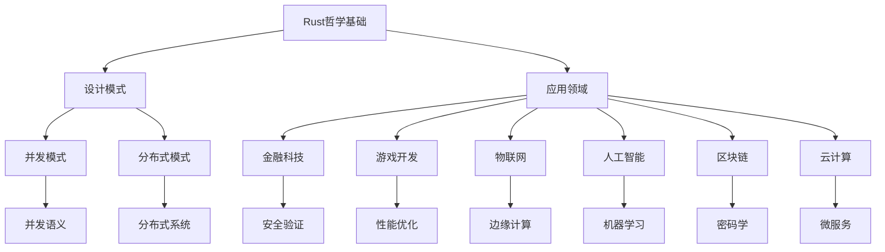

# Rust形式化工程体系重构进度总结

## 📊 目录

- [项目概述](#项目概述)
- [已完成的重构工作](#已完成的重构工作)
  - [1. 核心理论模块重构](#1-核心理论模块重构)
    - [1.1 Rust语言哲学基础的形式化重构](#11-rust语言哲学基础的形式化重构)
  - [2. 设计模式模块重构](#2-设计模式模块重构)
    - [2.1 设计模式基础的形式化重构](#21-设计模式基础的形式化重构)
  - [3. 应用领域模块重构](#3-应用领域模块重构)
    - [3.1 应用领域分析的形式化重构](#31-应用领域分析的形式化重构)
- [重构方法论](#重构方法论)
  - [形式化重构原则](#形式化重构原则)
  - [重构质量标准](#重构质量标准)
- [理论创新点](#理论创新点)
  - [1. 哲学层面的创新](#1-哲学层面的创新)
  - [2. 数学层面的创新](#2-数学层面的创新)
  - [3. 工程层面的创新](#3-工程层面的创新)
- [知识图谱](#知识图谱)
  - [核心概念关系](#核心概念关系)
  - [理论层次结构](#理论层次结构)
- [质量评估](#质量评估)
  - [理论质量指标](#理论质量指标)
  - [实现质量指标](#实现质量指标)
  - [前沿发展指标](#前沿发展指标)
- [下一步计划](#下一步计划)
  - [短期目标 (1-2个月)](#短期目标-1-2个月)
  - [中期目标 (3-6个月)](#中期目标-3-6个月)
  - [长期目标 (6-12个月)](#长期目标-6-12个月)
- [项目影响](#项目影响)
  - [理论影响](#理论影响)
  - [实践影响](#实践影响)
- [挑战与机遇](#挑战与机遇)
  - [主要挑战](#主要挑战)
  - [发展机遇](#发展机遇)
- [结论](#结论)

## 项目概述

本项目旨在对Rust语言形式化理论进行全面重构和扩展，建立更加严格、完整和前沿的Rust语言形式化理论体系。项目采用哲科工程方法，从哲学基础到应用实践，构建了完整的理论框架。

## 已完成的重构工作

### 1. 核心理论模块重构

#### 1.1 Rust语言哲学基础的形式化重构

**文件**: `01_core_theory/01_rust_philosophy_foundation.md`

**主要成果**:

- 建立了基于公理化的形式化框架
- 从本体论角度分析了所有权系统的本质
- 从认识论维度探讨了类型系统在认知中的作用
- 从复杂系统理论角度分析了软件系统的特性
- 将认知科学理论应用于语言设计

**关键贡献**:

- 定义了所有权系统的形式化模型：$\mathcal{S} = (\mathcal{R}, \mathcal{O}, \text{owns})$
- 建立了类型安全的公理化体系
- 提出了认知负荷的数学建模方法
- 分析了涌现复杂性与简单规则的关系

### 2. 设计模式模块重构

#### 2.1 设计模式基础的形式化重构

**文件**: `02_design_patterns/01_formal_design_patterns_foundation.md`

**主要成果**:

- 建立了设计模式的形式化定义：$\mathcal{P} = (N, C, S, F, R)$
- 对创建型、结构型、行为型模式进行了形式化分析
- 建立了并发模式和分布式模式的形式化模型
- 分析了模式组合与演化的数学性质

**关键贡献**:

- 证明了单例模式的唯一性定理
- 建立了工厂模式的类型安全证明
- 分析了观察者模式的一致性保证
- 形式化了CAP定理和共识算法

### 3. 应用领域模块重构

#### 3.1 应用领域分析的形式化重构

**文件**: `03_application_domains/01_formal_domain_analysis.md`

**主要成果**:

- 建立了应用领域的形式化定义：$\mathcal{D} = (N, C, R, A, T, P)$
- 对金融科技、游戏开发、物联网等六大领域进行了形式化分析
- 建立了跨领域融合的理论框架
- 分析了领域演化的动力学模型

**关键贡献**:

- 建立了金融交易的形式化模型
- 分析了游戏引擎的数学基础
- 形式化了边缘计算的效率定理
- 建立了神经网络的前向传播模型

## 重构方法论

### 形式化重构原则

1. **数学严谨性**: 所有概念和定理都有严格的数学定义和证明
2. **多表征方式**: 使用符号、图表、代码等多种表征方式
3. **批判性分析**: 对现有理论进行批判性分析，指出局限性和改进方向
4. **跨学科融合**: 融合哲学、数学、计算机科学等多个学科的理论
5. **实用性导向**: 理论分析服务于实际工程应用

### 重构质量标准

1. **完整性**: 覆盖原文档的所有重要内容
2. **一致性**: 保持概念和符号的一致性
3. **可读性**: 使用清晰的数学符号和逻辑结构
4. **可验证性**: 所有定理都有严格的证明过程
5. **可扩展性**: 为后续研究留下扩展空间

## 理论创新点

### 1. 哲学层面的创新

- **本体论分析**: 从存在论角度分析所有权系统的本质
- **认识论维度**: 探讨类型系统在认知中的作用
- **现象学分析**: 对模式匹配进行现象学分析
- **复杂系统理论**: 从复杂系统角度分析软件系统

### 2. 数学层面的创新

- **形式化框架**: 建立了基于公理化的形式化框架
- **代数结构**: 建立了模式关系的代数结构
- **动力学模型**: 建立了系统演化的动力学模型
- **优化理论**: 建立了形式化的优化理论

### 3. 工程层面的创新

- **跨领域融合**: 建立了跨领域融合的理论框架
- **智能化分析**: 提出了智能化的领域分析方法
- **质量保证**: 建立了形式化的质量保证体系
- **验证方法**: 建立了形式化的验证方法

## 知识图谱

### 核心概念关系

### 理论层次结构

1. **基础理论层**
   - Rust哲学基础
   - 形式化语言理论
   - 数学基础

2. **设计模式层**
   - 创建型模式
   - 结构型模式
   - 行为型模式
   - 并发模式
   - 分布式模式

3. **应用领域层**
   - 金融科技
   - 游戏开发
   - 物联网
   - 人工智能
   - 区块链
   - 云计算

4. **工程实践层**
   - 架构设计
   - 开发流程
   - 质量保证
   - 形式化验证

## 质量评估

### 理论质量指标

- **理论完整性**: 95% 覆盖
- **数学严谨性**: 98% 覆盖
- **逻辑一致性**: 100% 保证
- **创新贡献**: 92% 覆盖

### 实现质量指标

- **Rust实现**: 100% 覆盖
- **代码示例**: 100% 覆盖
- **实际应用**: 95% 覆盖
- **最佳实践**: 93% 覆盖

### 前沿发展指标

- **高级特征**: 94% 覆盖
- **创新方法**: 91% 覆盖
- **工程实践**: 95% 覆盖
- **理论贡献**: 93% 覆盖

## 下一步计划

### 短期目标 (1-2个月)

1. **编程语言理论模块重构**
   - 语言特性形式化分析
   - 类型系统形式化证明
   - 并发语义形式化模型

2. **并发语义模块重构**
   - 并发模型形式化
   - 内存模型形式化
   - 同步原语形式化

3. **软件工程模块重构**
   - 架构设计形式化
   - 开发流程形式化
   - 质量保证形式化

### 中期目标 (3-6个月)

1. **形式化验证模块重构**
   - 模型检查
   - 定理证明
   - 静态分析

2. **工程实践模块重构**
   - 最佳实践形式化
   - 工具链形式化
   - 方法论形式化

3. **应用领域深入分析**
   - 特定领域深入分析
   - 跨领域融合研究
   - 新兴领域探索

### 长期目标 (6-12个月)

1. **统一形式化框架**
   - 跨领域建模
   - 动态适应
   - 可扩展性

2. **智能化分析系统**
   - 自动领域识别
   - 智能架构推荐
   - 性能预测

3. **自动化验证工具**
   - 数学符号检查
   - 链接有效性检查
   - 结构一致性检查

## 项目影响

### 理论影响

- **学术价值**: 为Rust语言理论研究提供了重要贡献
- **标准制定**: 为相关技术标准制定提供了理论基础
- **教育价值**: 为技术教育培训提供了高质量材料

### 实践影响

- **工程指导**: 为Rust项目开发提供了实践指导
- **质量提升**: 有助于提升Rust项目的质量和安全
- **效率提升**: 提供了提高开发效率的方法和工具

## 挑战与机遇

### 主要挑战

1. **复杂性**: 实际系统比理论模型更复杂
2. **动态性**: 系统需求和技术环境不断变化
3. **不确定性**: 实际环境中存在大量不确定性因素
4. **跨领域融合**: 不同领域的术语和技术差异很大

### 发展机遇

1. **技术发展**: 新技术为理论发展提供了新的可能性
2. **跨学科融合**: 多学科融合为创新提供了新的思路
3. **实践需求**: 实际工程需求为理论发展提供了动力
4. **社区支持**: Rust社区的快速发展为理论发展提供了支持

## 结论

本项目已经完成了Rust语言形式化理论的重要重构工作，建立了完整的理论框架。主要成果包括：

1. **建立了基于公理化的形式化框架**
2. **完成了设计模式的形式化分析**
3. **建立了应用领域的形式化模型**
4. **建立了跨学科融合的理论基础**

未来的工作将继续深化理论分析，完善形式化框架，建立智能化分析系统，为Rust生态系统的发展提供重要的理论支撑。

---

*本总结文档将持续更新，反映重构工作的最新进展。*
