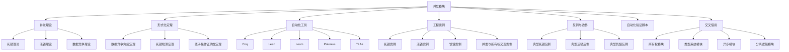

# 主题地图与可视化

## 📊 目录

- [1. 并发模块知识网络总览](#1-并发模块知识网络总览)
- [2. Mermaid主题地图示例](#2-mermaid主题地图示例)
- [3. Graphviz知识网络可视化（dot语法）](#3-graphviz知识网络可视化dot语法)
- [4. 交叉借用与工程集成](#4-交叉借用与工程集成)
- [5. 前沿趋势与AI集成](#5-前沿趋势与ai集成)

## 1. 并发模块知识网络总览

- 并发理论、定理、工具、工程案例、反例、自动化验证、交叉借用等构成知识网络。
- 主题地图有助于梳理模块间关系、发现知识盲区、辅助工程协作。

## 2. Mermaid主题地图示例

## 3. Graphviz知识网络可视化（dot语法）

```dot
digraph ConcurrencyMap {
  Concurrency [label="并发模块"]
  Theory [label="并发理论"]
  Theorem [label="形式化定理"]
  Tool [label="自动化工具"]
  Case [label="工程案例"]
  Counter [label="反例与边界"]
  Script [label="自动化验证脚本"]
  Xref [label="交叉借用"]
  Concurrency -> Theory
  Concurrency -> Theorem
  Concurrency -> Tool
  Concurrency -> Case
  Concurrency -> Counter
  Concurrency -> Script
  Concurrency -> Xref
  Theory -> {Deadlock Livelock Race}
  Theorem -> {RaceFree DeadlockDetect Atomicity}
  Tool -> {Coq Lean Loom Polonius TLAplus}
  Case -> {DeadlockCase LivelockCase StarvationCase OwnershipCase}
  Counter -> {DeadlockEx LivelockEx StarvationEx}
  Xref -> {Ownership TypeSystem Async SeparationLogic}
}
```

## 4. 交叉借用与工程集成

- 主题地图可集成于文档首页、工程Wiki、CI报告，辅助知识梳理与团队协作。
- 可自动生成、定期更新，结合交叉借用检测脚本。

## 5. 前沿趋势与AI集成

- 结合AI驱动的语义分析，自动发现知识盲区、推荐补全任务。
- 与知识图谱、可视化平台集成，提升工程知识管理能力。

---

> 本文档将持续递归补充，欢迎结合最新理论、可视化脚本、工程案例、自动化工具、前沿趋势递交补充，推动Rust并发模块主题地图与可视化体系不断进化。
