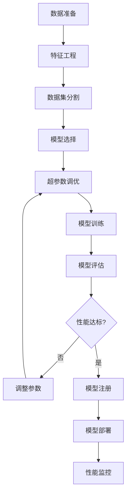
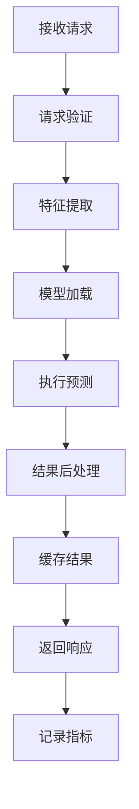
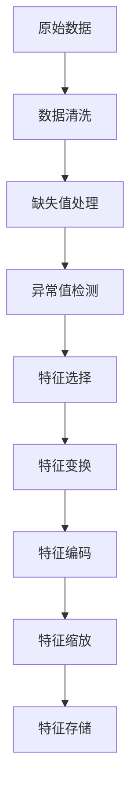

# AI/ML行业 - 业务建模详细指南

## 概述

本文档详细描述了AI/ML行业的业务建模，包括业务流程、数据建模、流程建模和概念建模。

## 1. 业务领域概念建模

### 1.1 核心业务概念

#### 数据集聚合根

```rust
#[derive(Debug, Clone)]
pub struct Dataset {
    pub id: DatasetId,
    pub name: String,
    pub description: String,
    pub version: String,
    pub schema: DataSchema,
    pub size_bytes: u64,
    pub record_count: u64,
    pub created_at: DateTime<Utc>,
    pub updated_at: DateTime<Utc>,
    pub status: DatasetStatus,
    pub metadata: DatasetMetadata,
}

#[derive(Debug, Clone)]
pub struct DataSchema {
    pub columns: Vec<ColumnDefinition>,
    pub primary_key: Option<String>,
    pub foreign_keys: Vec<ForeignKey>,
}

#[derive(Debug, Clone)]
pub struct ColumnDefinition {
    pub name: String,
    pub data_type: DataType,
    pub nullable: bool,
    pub default_value: Option<String>,
    pub description: String,
}

#[derive(Debug, Clone)]
pub struct DatasetMetadata {
    pub source: String,
    pub license: String,
    pub tags: Vec<String>,
    pub quality_score: f64,
    pub last_validation: Option<DateTime<Utc>>,
}

impl Dataset {
    pub fn is_ready_for_training(&self) -> bool {
        self.status == DatasetStatus::Validated && 
        self.record_count > 0 &&
        self.quality_score > 0.7
    }
    
    pub fn validate_schema(&self, data: &DataFrame) -> Result<ValidationResult, ValidationError> {
        let mut errors = Vec::new();
        
        for column in &self.schema.columns {
            if !data.has_column(&column.name) {
                errors.push(format!("Missing column: {}", column.name));
                continue;
            }
            
            let data_type = data.get_column_type(&column.name)?;
            if data_type != column.data_type {
                errors.push(format!(
                    "Column {} has type {:?}, expected {:?}",
                    column.name, data_type, column.data_type
                ));
            }
        }
        
        Ok(ValidationResult {
            is_valid: errors.is_empty(),
            errors,
            warnings: Vec::new(),
        })
    }
}
```

#### 特征集聚合根

```rust
#[derive(Debug, Clone)]
pub struct FeatureSet {
    pub id: FeatureSetId,
    pub name: String,
    pub description: String,
    pub dataset_id: DatasetId,
    pub features: Vec<Feature>,
    pub created_at: DateTime<Utc>,
    pub updated_at: DateTime<Utc>,
    pub version: String,
}

#[derive(Debug, Clone)]
pub struct Feature {
    pub id: FeatureId,
    pub name: String,
    pub feature_type: FeatureType,
    pub data_type: DataType,
    pub description: String,
    pub transformation: Option<Transformation>,
    pub statistics: FeatureStatistics,
}

#[derive(Debug, Clone)]
pub struct FeatureStatistics {
    pub mean: Option<f64>,
    pub std_dev: Option<f64>,
    pub min: Option<f64>,
    pub max: Option<f64>,
    pub null_count: u64,
    pub unique_count: u64,
}

#[derive(Debug, Clone)]
pub enum Transformation {
    Normalize { method: NormalizationMethod },
    Encode { method: EncodingMethod },
    Scale { min: f64, max: f64 },
    Log,
    Square,
    Custom { function: String },
}

impl FeatureSet {
    pub fn get_feature_names(&self) -> Vec<String> {
        self.features.iter().map(|f| f.name.clone()).collect()
    }
    
    pub fn get_numeric_features(&self) -> Vec<&Feature> {
        self.features.iter()
            .filter(|f| matches!(f.data_type, DataType::Float | DataType::Integer))
            .collect()
    }
    
    pub fn get_categorical_features(&self) -> Vec<&Feature> {
        self.features.iter()
            .filter(|f| matches!(f.data_type, DataType::String))
            .collect()
    }
    
    pub fn apply_transformations(&self, data: &DataFrame) -> Result<DataFrame, FeatureError> {
        let mut transformed_data = data.clone();
        
        for feature in &self.features {
            if let Some(transformation) = &feature.transformation {
                transformed_data = self.apply_transformation(&transformed_data, feature, transformation)?;
            }
        }
        
        Ok(transformed_data)
    }
    
    fn apply_transformation(
        &self,
        data: &DataFrame,
        feature: &Feature,
        transformation: &Transformation,
    ) -> Result<DataFrame, FeatureError> {
        match transformation {
            Transformation::Normalize { method } => {
                self.normalize_feature(data, &feature.name, method)
            }
            Transformation::Encode { method } => {
                self.encode_feature(data, &feature.name, method)
            }
            Transformation::Scale { min, max } => {
                self.scale_feature(data, &feature.name, *min, *max)
            }
            Transformation::Log => {
                self.log_transform_feature(data, &feature.name)
            }
            Transformation::Square => {
                self.square_transform_feature(data, &feature.name)
            }
            Transformation::Custom { function } => {
                self.custom_transform_feature(data, &feature.name, function)
            }
        }
    }
}
```

#### 模型聚合根

```rust
#[derive(Debug, Clone)]
pub struct Model {
    pub id: ModelId,
    pub name: String,
    pub model_type: ModelType,
    pub algorithm: Algorithm,
    pub hyperparameters: Hyperparameters,
    pub feature_set_id: FeatureSetId,
    pub metrics: ModelMetrics,
    pub version: String,
    pub created_at: DateTime<Utc>,
    pub updated_at: DateTime<Utc>,
    pub status: ModelStatus,
}

#[derive(Debug, Clone)]
pub struct Hyperparameters {
    pub learning_rate: Option<f64>,
    pub batch_size: Option<u32>,
    pub epochs: Option<u32>,
    pub hidden_layers: Option<Vec<u32>>,
    pub dropout_rate: Option<f64>,
    pub regularization: Option<f64>,
    pub custom_params: HashMap<String, String>,
}

#[derive(Debug, Clone)]
pub struct ModelMetrics {
    pub accuracy: Option<f64>,
    pub precision: Option<f64>,
    pub recall: Option<f64>,
    pub f1_score: Option<f64>,
    pub auc_roc: Option<f64>,
    pub mse: Option<f64>,
    pub mae: Option<f64>,
    pub custom_metrics: HashMap<String, f64>,
}

impl Model {
    pub fn is_ready_for_deployment(&self) -> bool {
        self.status == ModelStatus::Trained &&
        self.metrics.accuracy.unwrap_or(0.0) > 0.8
    }
    
    pub fn compare_with(&self, other: &Model) -> ModelComparison {
        let mut comparison = ModelComparison::new();
        
        // 比较准确率
        if let (Some(acc1), Some(acc2)) = (self.metrics.accuracy, other.metrics.accuracy) {
            comparison.add_metric("accuracy", acc1, acc2);
        }
        
        // 比较F1分数
        if let (Some(f1_1), Some(f1_2)) = (self.metrics.f1_score, other.metrics.f1_score) {
            comparison.add_metric("f1_score", f1_1, f1_2);
        }
        
        // 比较AUC-ROC
        if let (Some(auc1), Some(auc2)) = (self.metrics.auc_roc, other.metrics.auc_roc) {
            comparison.add_metric("auc_roc", auc1, auc2);
        }
        
        comparison
    }
    
    pub fn get_feature_importance(&self) -> Result<Vec<FeatureImportance>, ModelError> {
        // 实现特征重要性计算
        // 这里需要根据具体的模型类型来实现
        Ok(vec![])
    }
}
```

### 1.2 值对象

```rust
#[derive(Debug, Clone, PartialEq, Eq, Hash)]
pub struct DatasetId(String);

#[derive(Debug, Clone, PartialEq, Eq, Hash)]
pub struct FeatureSetId(String);

#[derive(Debug, Clone, PartialEq, Eq, Hash)]
pub struct FeatureId(String);

#[derive(Debug, Clone, PartialEq, Eq, Hash)]
pub struct ModelId(String);

#[derive(Debug, Clone)]
pub struct FeatureVector {
    pub values: Vec<f64>,
    pub feature_names: Vec<String>,
}

impl FeatureVector {
    pub fn new(values: Vec<f64>, feature_names: Vec<String>) -> Result<Self, FeatureError> {
        if values.len() != feature_names.len() {
            return Err(FeatureError::DimensionMismatch);
        }
        Ok(Self { values, feature_names })
    }
    
    pub fn get_feature(&self, name: &str) -> Option<f64> {
        self.feature_names.iter()
            .position(|n| n == name)
            .map(|i| self.values[i])
    }
    
    pub fn to_array(&self) -> Vec<f64> {
        self.values.clone()
    }
}

#[derive(Debug, Clone)]
pub struct PredictionValue {
    pub value: f64,
    pub confidence: f64,
    pub probabilities: Option<Vec<f64>>,
    pub classes: Option<Vec<String>>,
}

impl PredictionValue {
    pub fn classification(probabilities: Vec<f64>, classes: Vec<String>) -> Self {
        let max_prob_idx = probabilities.iter()
            .enumerate()
            .max_by(|(_, a), (_, b)| a.partial_cmp(b).unwrap())
            .map(|(i, _)| i)
            .unwrap_or(0);
        
        Self {
            value: max_prob_idx as f64,
            confidence: probabilities[max_prob_idx],
            probabilities: Some(probabilities),
            classes: Some(classes),
        }
    }
    
    pub fn regression(value: f64, confidence: f64) -> Self {
        Self {
            value,
            confidence,
            probabilities: None,
            classes: None,
        }
    }
}
```

## 2. 数据建模

### 2.1 数据库设计

#### 数据集相关表

```sql
-- 数据集表
CREATE TABLE datasets (
    id UUID PRIMARY KEY,
    name VARCHAR(100) NOT NULL,
    description TEXT,
    version VARCHAR(20) NOT NULL,
    schema JSONB NOT NULL,
    size_bytes BIGINT NOT NULL,
    record_count BIGINT NOT NULL,
    status VARCHAR(20) NOT NULL,
    metadata JSONB NOT NULL,
    created_at TIMESTAMP WITH TIME ZONE NOT NULL,
    updated_at TIMESTAMP WITH TIME ZONE NOT NULL
);

-- 数据集版本表
CREATE TABLE dataset_versions (
    id UUID PRIMARY KEY,
    dataset_id UUID NOT NULL,
    version VARCHAR(20) NOT NULL,
    schema_hash VARCHAR(64) NOT NULL,
    data_hash VARCHAR(64) NOT NULL,
    created_at TIMESTAMP WITH TIME ZONE NOT NULL,
    FOREIGN KEY (dataset_id) REFERENCES datasets(id),
    UNIQUE(dataset_id, version)
);

-- 数据集质量检查表
CREATE TABLE dataset_quality_checks (
    id UUID PRIMARY KEY,
    dataset_id UUID NOT NULL,
    check_type VARCHAR(50) NOT NULL,
    status VARCHAR(20) NOT NULL,
    score DECIMAL(5,4),
    details JSONB,
    created_at TIMESTAMP WITH TIME ZONE NOT NULL,
    FOREIGN KEY (dataset_id) REFERENCES datasets(id)
);
```

#### 特征集相关表

```sql
-- 特征集表
CREATE TABLE feature_sets (
    id UUID PRIMARY KEY,
    name VARCHAR(100) NOT NULL,
    description TEXT,
    dataset_id UUID NOT NULL,
    version VARCHAR(20) NOT NULL,
    created_at TIMESTAMP WITH TIME ZONE NOT NULL,
    updated_at TIMESTAMP WITH TIME ZONE NOT NULL,
    FOREIGN KEY (dataset_id) REFERENCES datasets(id)
);

-- 特征表
CREATE TABLE features (
    id UUID PRIMARY KEY,
    feature_set_id UUID NOT NULL,
    name VARCHAR(100) NOT NULL,
    feature_type VARCHAR(50) NOT NULL,
    data_type VARCHAR(50) NOT NULL,
    description TEXT,
    transformation JSONB,
    statistics JSONB,
    FOREIGN KEY (feature_set_id) REFERENCES feature_sets(id)
);

-- 特征存储表
CREATE TABLE feature_store (
    id UUID PRIMARY KEY,
    feature_set_id UUID NOT NULL,
    entity_id VARCHAR(100) NOT NULL,
    feature_values JSONB NOT NULL,
    timestamp TIMESTAMP WITH TIME ZONE NOT NULL,
    FOREIGN KEY (feature_set_id) REFERENCES feature_sets(id),
    UNIQUE(feature_set_id, entity_id, timestamp)
);
```

#### 模型相关表

```sql
-- 模型表
CREATE TABLE models (
    id UUID PRIMARY KEY,
    name VARCHAR(100) NOT NULL,
    model_type VARCHAR(50) NOT NULL,
    algorithm VARCHAR(50) NOT NULL,
    hyperparameters JSONB NOT NULL,
    feature_set_id UUID NOT NULL,
    metrics JSONB NOT NULL,
    version VARCHAR(20) NOT NULL,
    status VARCHAR(20) NOT NULL,
    created_at TIMESTAMP WITH TIME ZONE NOT NULL,
    updated_at TIMESTAMP WITH TIME ZONE NOT NULL,
    FOREIGN KEY (feature_set_id) REFERENCES feature_sets(id)
);

-- 模型版本表
CREATE TABLE model_versions (
    id UUID PRIMARY KEY,
    model_id UUID NOT NULL,
    version VARCHAR(20) NOT NULL,
    model_path VARCHAR(500) NOT NULL,
    metrics JSONB NOT NULL,
    created_at TIMESTAMP WITH TIME ZONE NOT NULL,
    FOREIGN KEY (model_id) REFERENCES models(id),
    UNIQUE(model_id, version)
);

-- 模型部署表
CREATE TABLE model_deployments (
    id UUID PRIMARY KEY,
    model_id UUID NOT NULL,
    deployment_name VARCHAR(100) NOT NULL,
    environment VARCHAR(50) NOT NULL,
    endpoint_url VARCHAR(500),
    status VARCHAR(20) NOT NULL,
    created_at TIMESTAMP WITH TIME ZONE NOT NULL,
    updated_at TIMESTAMP WITH TIME ZONE NOT NULL,
    FOREIGN KEY (model_id) REFERENCES models(id)
);
```

#### 预测记录表

```sql
-- 预测请求表
CREATE TABLE prediction_requests (
    id UUID PRIMARY KEY,
    model_id UUID NOT NULL,
    features JSONB NOT NULL,
    timestamp TIMESTAMP WITH TIME ZONE NOT NULL,
    metadata JSONB,
    FOREIGN KEY (model_id) REFERENCES models(id)
);

-- 预测结果表
CREATE TABLE predictions (
    id UUID PRIMARY KEY,
    request_id UUID NOT NULL,
    model_id UUID NOT NULL,
    prediction JSONB NOT NULL,
    confidence DECIMAL(5,4),
    processing_time_ms INTEGER NOT NULL,
    timestamp TIMESTAMP WITH TIME ZONE NOT NULL,
    FOREIGN KEY (request_id) REFERENCES prediction_requests(id),
    FOREIGN KEY (model_id) REFERENCES models(id)
);

-- 模型性能监控表
CREATE TABLE model_performance (
    id UUID PRIMARY KEY,
    model_id UUID NOT NULL,
    metric_name VARCHAR(50) NOT NULL,
    metric_value DECIMAL(10,6) NOT NULL,
    timestamp TIMESTAMP WITH TIME ZONE NOT NULL,
    FOREIGN KEY (model_id) REFERENCES models(id)
);
```

### 2.2 特征存储实现

```rust
pub struct RedisFeatureStore {
    client: redis::Client,
    connection: redis::Connection,
}

#[async_trait]
impl FeatureStore for RedisFeatureStore {
    async fn store_features(&self, features: FeatureSet) -> Result<FeatureSetId, FeatureError> {
        let feature_set_id = FeatureSetId::generate();
        let key = format!("features:{}", feature_set_id);
        
        let serialized = serde_json::to_string(&features)?;
        redis::cmd("SET").arg(&key).arg(serialized).execute(&mut self.connection);
        
        Ok(feature_set_id)
    }
    
    async fn serve_features(&self, request: FeatureRequest) -> Result<FeatureVector, FeatureError> {
        let mut feature_vector = FeatureVector {
            values: Vec::new(),
            feature_names: Vec::new(),
        };
        
        for feature_name in &request.feature_names {
            let key = format!("feature:{}:{}", request.entity_id, feature_name);
            if let Ok(value) = redis::cmd("GET").arg(&key).query::<f64>(&mut self.connection) {
                feature_vector.values.push(value);
                feature_vector.feature_names.push(feature_name.clone());
            }
        }
        
        Ok(feature_vector)
    }
    
    async fn batch_store_features(
        &self,
        entity_features: Vec<(String, FeatureVector)>,
    ) -> Result<(), FeatureError> {
        let mut pipeline = redis::pipe();
        
        for (entity_id, features) in entity_features {
            for (feature_name, value) in features.feature_names.iter().zip(features.values.iter()) {
                let key = format!("feature:{}:{}", entity_id, feature_name);
                pipeline.set(&key, value);
            }
        }
        
        pipeline.execute(&mut self.connection);
        Ok(())
    }
}
```

## 3. 流程建模

### 3.1 模型训练流程



### 3.2 推理服务流程



### 3.3 特征工程流程



### 3.4 流程实现

```rust
pub struct ModelTrainingWorkflow {
    data_service: Box<dyn DataService>,
    feature_service: Box<dyn FeatureService>,
    model_service: Box<dyn ModelService>,
    evaluation_service: Box<dyn EvaluationService>,
}

impl ModelTrainingWorkflow {
    pub async fn train_model(
        &self,
        config: TrainingConfig,
    ) -> Result<TrainedModel, WorkflowError> {
        // 1. 数据准备
        let dataset = self.data_service.load_dataset(&config.dataset_id).await?;
        let feature_set = self.feature_service.create_features(&dataset).await?;
        
        // 2. 数据分割
        let (train_data, test_data) = self.split_data(&dataset, config.test_size).await?;
        
        // 3. 特征工程
        let train_features = self.feature_service.engineer_features(&train_data, &feature_set).await?;
        let test_features = self.feature_service.engineer_features(&test_data, &feature_set).await?;
        
        // 4. 超参数优化
        let best_hyperparameters = self.optimize_hyperparameters(
            &train_features,
            &config.algorithm,
            &config.optimization_config,
        ).await?;
        
        // 5. 模型训练
        let model = self.model_service.create_model(
            &config.algorithm,
            &best_hyperparameters,
        )?;
        
        let trained_model = self.model_service.train_model(
            model,
            &train_features,
            config.epochs,
        ).await?;
        
        // 6. 模型评估
        let metrics = self.evaluation_service.evaluate_model(
            &trained_model,
            &test_features,
        ).await?;
        
        // 7. 检查性能
        if !self.is_performance_acceptable(&metrics, &config.performance_thresholds) {
            return Err(WorkflowError::PerformanceNotMet);
        }
        
        // 8. 保存模型
        let model_id = self.model_service.save_model(&trained_model, &metrics).await?;
        
        Ok(TrainedModel {
            model_id,
            metrics,
            hyperparameters: best_hyperparameters,
            feature_set_id: feature_set.id,
        })
    }
    
    async fn optimize_hyperparameters(
        &self,
        data: &DataFrame,
        algorithm: &Algorithm,
        config: &OptimizationConfig,
    ) -> Result<Hyperparameters, WorkflowError> {
        match config.method {
            OptimizationMethod::GridSearch => {
                self.grid_search_optimization(data, algorithm, &config.param_grid).await
            }
            OptimizationMethod::RandomSearch => {
                self.random_search_optimization(data, algorithm, &config.param_grid).await
            }
            OptimizationMethod::Bayesian => {
                self.bayesian_optimization(data, algorithm, &config.param_grid).await
            }
        }
    }
    
    async fn grid_search_optimization(
        &self,
        data: &DataFrame,
        algorithm: &Algorithm,
        param_grid: &HashMap<String, Vec<String>>,
    ) -> Result<Hyperparameters, WorkflowError> {
        let mut best_score = f64::NEG_INFINITY;
        let mut best_params = Hyperparameters::default();
        
        // 生成所有参数组合
        let combinations = self.generate_param_combinations(param_grid);
        
        for params in combinations {
            let model = self.model_service.create_model(algorithm, &params)?;
            let score = self.evaluation_service.cross_validate(model, data, 5).await?;
            
            if score > best_score {
                best_score = score;
                best_params = params;
            }
        }
        
        Ok(best_params)
    }
}
```

## 4. 模型服务

### 4.1 推理服务

```rust
pub struct InferenceService {
    model_loader: ModelLoader,
    feature_processor: FeatureProcessor,
    prediction_cache: PredictionCache,
    performance_monitor: PerformanceMonitor,
}

impl InferenceService {
    pub async fn predict(&self, request: PredictionRequest) -> Result<Prediction, InferenceError> {
        let start_time = Instant::now();
        
        // 1. 检查缓存
        if let Some(cached_prediction) = self.prediction_cache.get(&request).await {
            return Ok(cached_prediction);
        }
        
        // 2. 加载模型
        let model = self.model_loader.load_model(&request.model_id).await?;
        
        // 3. 特征预处理
        let processed_features = self.feature_processor.process(&request.features).await?;
        
        // 4. 执行预测
        let prediction_value = model.predict(&processed_features).await?;
        
        // 5. 后处理
        let prediction = self.post_process(prediction_value, &request).await?;
        
        // 6. 缓存结果
        self.prediction_cache.set(&request, &prediction).await;
        
        // 7. 记录性能指标
        let processing_time = start_time.elapsed();
        self.performance_monitor.record_metrics(&request, &prediction, processing_time).await;
        
        Ok(prediction)
    }
    
    async fn post_process(&self, prediction_value: PredictionValue, request: &PredictionRequest) -> Result<Prediction, InferenceError> {
        let prediction = Prediction {
            id: PredictionId::generate(),
            request_id: request.id.clone(),
            model_id: request.model_id.clone(),
            prediction: prediction_value,
            timestamp: Utc::now(),
            processing_time: Duration::from_millis(0), // 将在外部设置
        };
        
        Ok(prediction)
    }
}
```

### 4.2 模型监控

```rust
pub struct ModelMonitoringService {
    performance_repository: Box<dyn PerformanceRepository>,
    alert_service: Box<dyn AlertService>,
}

impl ModelMonitoringService {
    pub async fn monitor_model_performance(&self, model_id: &ModelId) -> Result<MonitoringResult, MonitoringError> {
        // 1. 收集性能指标
        let recent_metrics = self.performance_repository.get_recent_metrics(model_id, Duration::from_secs(3600)).await?;
        
        // 2. 计算统计信息
        let stats = self.calculate_statistics(&recent_metrics);
        
        // 3. 检测异常
        let anomalies = self.detect_anomalies(&recent_metrics, &stats);
        
        // 4. 检查数据漂移
        let drift_detected = self.detect_data_drift(model_id).await?;
        
        // 5. 生成告警
        for anomaly in &anomalies {
            self.alert_service.send_anomaly_alert(model_id, anomaly).await?;
        }
        
        if drift_detected {
            self.alert_service.send_drift_alert(model_id).await?;
        }
        
        Ok(MonitoringResult {
            model_id: model_id.clone(),
            statistics: stats,
            anomalies,
            data_drift_detected: drift_detected,
            timestamp: Utc::now(),
        })
    }
    
    fn calculate_statistics(&self, metrics: &[ModelMetric]) -> MetricStatistics {
        let latencies: Vec<f64> = metrics.iter().map(|m| m.latency_ms as f64).collect();
        let accuracies: Vec<f64> = metrics.iter().filter_map(|m| m.accuracy).collect();
        
        MetricStatistics {
            avg_latency: latencies.iter().sum::<f64>() / latencies.len() as f64,
            p95_latency: self.percentile(&latencies, 0.95),
            avg_accuracy: accuracies.iter().sum::<f64>() / accuracies.len() as f64,
            request_count: metrics.len() as u32,
        }
    }
    
    fn detect_anomalies(&self, metrics: &[ModelMetric], stats: &MetricStatistics) -> Vec<Anomaly> {
        let mut anomalies = Vec::new();
        
        for metric in metrics {
            // 检测延迟异常
            if metric.latency_ms as f64 > stats.p95_latency * 2.0 {
                anomalies.push(Anomaly {
                    metric_type: "latency".to_string(),
                    value: metric.latency_ms as f64,
                    threshold: stats.p95_latency * 2.0,
                    severity: AnomalySeverity::High,
                });
            }
            
            // 检测准确率异常
            if let Some(accuracy) = metric.accuracy {
                if accuracy < stats.avg_accuracy - 0.1 {
                    anomalies.push(Anomaly {
                        metric_type: "accuracy".to_string(),
                        value: accuracy,
                        threshold: stats.avg_accuracy - 0.1,
                        severity: AnomalySeverity::Medium,
                    });
                }
            }
        }
        
        anomalies
    }
}
```

## 5. 事件系统

### 5.1 事件定义

```rust
#[derive(Debug, Clone, Serialize, Deserialize)]
pub enum AIEvent {
    DatasetCreated(DatasetCreatedEvent),
    FeatureSetCreated(FeatureSetCreatedEvent),
    ModelTrained(ModelTrainedEvent),
    ModelDeployed(ModelDeployedEvent),
    PredictionMade(PredictionEvent),
    ModelPerformanceDegraded(PerformanceEvent),
    DataDriftDetected(DriftEvent),
}

#[derive(Debug, Clone, Serialize, Deserialize)]
pub struct ModelTrainedEvent {
    pub model_id: ModelId,
    pub algorithm: Algorithm,
    pub metrics: ModelMetrics,
    pub training_duration: Duration,
    pub timestamp: DateTime<Utc>,
}

#[derive(Debug, Clone, Serialize, Deserialize)]
pub struct PredictionEvent {
    pub model_id: ModelId,
    pub request_id: RequestId,
    pub prediction: PredictionValue,
    pub processing_time: Duration,
    pub timestamp: DateTime<Utc>,
}

#[derive(Debug, Clone, Serialize, Deserialize)]
pub struct DriftEvent {
    pub model_id: ModelId,
    pub drift_score: f64,
    pub affected_features: Vec<String>,
    pub timestamp: DateTime<Utc>,
}
```

### 5.2 事件处理器

```rust
pub struct ModelLifecycleEventHandler {
    model_registry: Box<dyn ModelRegistry>,
    deployment_service: Box<dyn DeploymentService>,
    monitoring_service: Box<dyn MonitoringService>,
}

#[async_trait]
impl EventHandler for ModelLifecycleEventHandler {
    async fn handle(&self, event: &AIEvent) -> Result<(), EventError> {
        match event {
            AIEvent::ModelTrained(training_event) => {
                self.handle_model_trained(training_event).await?;
            }
            AIEvent::ModelDeployed(deployment_event) => {
                self.handle_model_deployed(deployment_event).await?;
            }
            AIEvent::ModelPerformanceDegraded(performance_event) => {
                self.handle_performance_degraded(performance_event).await?;
            }
            _ => {}
        }
        Ok(())
    }
}

impl ModelLifecycleEventHandler {
    async fn handle_model_trained(&self, event: &ModelTrainedEvent) -> Result<(), EventError> {
        // 注册新模型版本
        self.model_registry.register_model_version(&event.model_id, &event.metrics).await?;
        
        // 检查是否需要自动部署
        if self.should_auto_deploy(&event.metrics).await? {
            self.deployment_service.deploy_model(&event.model_id).await?;
        }
        
        // 启动性能监控
        self.monitoring_service.start_monitoring(&event.model_id).await?;
        
        Ok(())
    }
    
    async fn handle_model_deployed(&self, event: &ModelDeployedEvent) -> Result<(), EventError> {
        // 更新部署状态
        self.deployment_service.update_deployment_status(&event.model_id, "active").await?;
        
        // 发送部署通知
        self.notification_service.send_deployment_notification(event).await?;
        
        Ok(())
    }
    
    async fn handle_performance_degraded(&self, event: &PerformanceEvent) -> Result<(), EventError> {
        // 触发模型回滚
        if event.severity == PerformanceSeverity::Critical {
            self.deployment_service.rollback_model(&event.model_id).await?;
        }
        
        // 发送性能告警
        self.alert_service.send_performance_alert(event).await?;
        
        // 触发重新训练
        if event.should_retrain {
            self.training_service.schedule_retraining(&event.model_id).await?;
        }
        
        Ok(())
    }
}
```

## 总结

AI/ML行业的业务建模需要特别关注：

1. **业务概念建模**: 明确定义数据集、特征集、模型等核心概念
2. **数据建模**: 设计支持大规模数据和特征存储的数据结构
3. **流程建模**: 详细描述训练、推理、监控等ML流程
4. **模型管理**: 实现模型版本控制和生命周期管理
5. **事件系统**: 支持MLOps和自动化流程

通过这种详细的业务建模，可以构建出高效、可靠的AI/ML系统。
