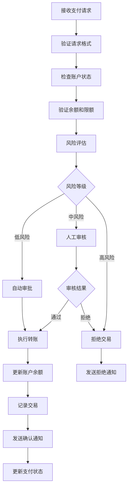
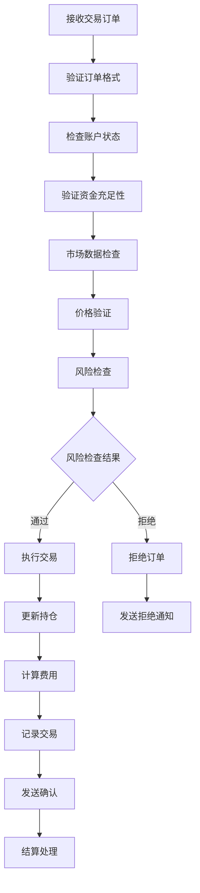
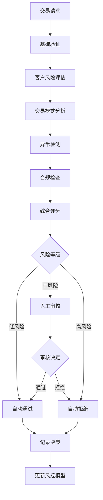

# 金融科技行业 - 业务建模详细指南

## 概述

本文档详细描述了金融科技行业的业务建模，包括业务流程、数据建模、流程建模和概念建模。

## 1. 业务领域概念建模

### 1.1 核心业务概念

#### 账户聚合根

```rust
#[derive(Debug, Clone)]
pub struct Account {
    pub id: AccountId,
    pub customer_id: CustomerId,
    pub account_type: AccountType,
    pub balance: Money,
    pub status: AccountStatus,
    pub currency: Currency,
    pub created_at: DateTime<Utc>,
    pub updated_at: DateTime<Utc>,
    pub transactions: Vec<Transaction>,
    pub limits: AccountLimits,
}

#[derive(Debug, Clone)]
pub struct AccountLimits {
    pub daily_transfer_limit: Money,
    pub monthly_transfer_limit: Money,
    pub single_transaction_limit: Money,
    pub overdraft_limit: Money,
}

impl Account {
    pub fn can_transfer(&self, amount: &Money) -> bool {
        if self.status != AccountStatus::Active {
            return false;
        }
        
        if amount.amount > self.limits.single_transaction_limit.amount {
            return false;
        }
        
        if self.balance.amount + self.limits.overdraft_limit.amount < amount.amount {
            return false;
        }
        
        true
    }
    
    pub fn transfer(&mut self, amount: &Money) -> Result<(), AccountError> {
        if !self.can_transfer(amount) {
            return Err(AccountError::TransferNotAllowed);
        }
        
        self.balance.amount -= amount.amount;
        self.updated_at = Utc::now();
        
        Ok(())
    }
}
```

#### 支付聚合根

```rust
#[derive(Debug, Clone)]
pub struct Payment {
    pub id: PaymentId,
    pub from_account: AccountId,
    pub to_account: AccountId,
    pub amount: Money,
    pub payment_method: PaymentMethod,
    pub status: PaymentStatus,
    pub created_at: DateTime<Utc>,
    pub processed_at: Option<DateTime<Utc>>,
    pub failed_at: Option<DateTime<Utc>>,
    pub failure_reason: Option<String>,
    pub metadata: PaymentMetadata,
}

#[derive(Debug, Clone)]
pub struct PaymentMetadata {
    pub description: Option<String>,
    pub reference: Option<String>,
    pub category: PaymentCategory,
    pub tags: Vec<String>,
}

impl Payment {
    pub fn new(
        from_account: AccountId,
        to_account: AccountId,
        amount: Money,
        payment_method: PaymentMethod,
    ) -> Self {
        Self {
            id: PaymentId::generate(),
            from_account,
            to_account,
            amount,
            payment_method,
            status: PaymentStatus::Pending,
            created_at: Utc::now(),
            processed_at: None,
            failed_at: None,
            failure_reason: None,
            metadata: PaymentMetadata::default(),
        }
    }
    
    pub fn process(&mut self) -> Result<(), PaymentError> {
        if self.status != PaymentStatus::Pending {
            return Err(PaymentError::InvalidStatus);
        }
        
        self.status = PaymentStatus::Processing;
        Ok(())
    }
    
    pub fn complete(&mut self) {
        self.status = PaymentStatus::Completed;
        self.processed_at = Some(Utc::now());
    }
    
    pub fn fail(&mut self, reason: String) {
        self.status = PaymentStatus::Failed;
        self.failed_at = Some(Utc::now());
        self.failure_reason = Some(reason);
    }
}
```

#### 交易聚合根

```rust
#[derive(Debug, Clone)]
pub struct Trade {
    pub id: TradeId,
    pub account_id: AccountId,
    pub instrument: Instrument,
    pub side: TradeSide,
    pub quantity: Decimal,
    pub price: Money,
    pub status: TradeStatus,
    pub order_type: OrderType,
    pub created_at: DateTime<Utc>,
    pub executed_at: Option<DateTime<Utc>>,
    pub settlement_date: Option<DateTime<Utc>>,
    pub fees: Vec<Fee>,
}

#[derive(Debug, Clone)]
pub struct Instrument {
    pub symbol: String,
    pub name: String,
    pub instrument_type: InstrumentType,
    pub currency: Currency,
    pub exchange: String,
    pub isin: Option<String>,
}

#[derive(Debug, Clone)]
pub struct Fee {
    pub fee_type: FeeType,
    pub amount: Money,
    pub description: String,
}

impl Trade {
    pub fn calculate_total_value(&self) -> Money {
        let trade_value = self.quantity * self.price.amount;
        let total_fees: Decimal = self.fees.iter()
            .map(|fee| fee.amount.amount)
            .sum();
        
        Money {
            amount: trade_value + total_fees,
            currency: self.price.currency,
        }
    }
    
    pub fn can_execute(&self, current_price: &Money) -> bool {
        match self.order_type {
            OrderType::Market => true,
            OrderType::Limit => {
                match self.side {
                    TradeSide::Buy => current_price.amount <= self.price.amount,
                    TradeSide::Sell => current_price.amount >= self.price.amount,
                }
            }
        }
    }
}
```

### 1.2 值对象

```rust
#[derive(Debug, Clone, PartialEq, Eq, Hash)]
pub struct Money {
    pub amount: Decimal,
    pub currency: Currency,
}

impl Money {
    pub fn new(amount: Decimal, currency: Currency) -> Self {
        Self { amount, currency }
    }
    
    pub fn add(&self, other: &Money) -> Result<Money, MoneyError> {
        if self.currency != other.currency {
            return Err(MoneyError::CurrencyMismatch);
        }
        
        Ok(Money {
            amount: self.amount + other.amount,
            currency: self.currency.clone(),
        })
    }
    
    pub fn subtract(&self, other: &Money) -> Result<Money, MoneyError> {
        if self.currency != other.currency {
            return Err(MoneyError::CurrencyMismatch);
        }
        
        Ok(Money {
            amount: self.amount - other.amount,
            currency: self.currency.clone(),
        })
    }
}

#[derive(Debug, Clone, PartialEq, Eq, Hash)]
pub struct AccountId(String);

impl AccountId {
    pub fn new(id: String) -> Self {
        Self(id)
    }
    
    pub fn generate() -> Self {
        Self(uuid::Uuid::new_v4().to_string())
    }
}

#[derive(Debug, Clone, PartialEq, Eq, Hash)]
pub struct PaymentId(String);

impl PaymentId {
    pub fn generate() -> Self {
        Self(uuid::Uuid::new_v4().to_string())
    }
}

#[derive(Debug, Clone, PartialEq, Eq, Hash)]
pub struct TradeId(String);

impl TradeId {
    pub fn generate() -> Self {
        Self(uuid::Uuid::new_v4().to_string())
    }
}
```

### 1.3 领域服务

```rust
pub struct RiskAssessmentService {
    risk_rules: Vec<Box<dyn RiskRule>>,
    risk_repository: Box<dyn RiskRepository>,
}

impl RiskAssessmentService {
    pub async fn assess_payment_risk(
        &self,
        payment: &Payment,
        customer: &Customer,
    ) -> Result<RiskAssessment, RiskError> {
        let mut risk_score = 0.0;
        let mut risk_factors = Vec::new();
        
        for rule in &self.risk_rules {
            let (score, factors) = rule.evaluate(payment, customer).await?;
            risk_score += score;
            risk_factors.extend(factors);
        }
        
        let risk_level = self.calculate_risk_level(risk_score);
        
        Ok(RiskAssessment {
            risk_score,
            risk_level,
            risk_factors,
            timestamp: Utc::now(),
        })
    }
    
    fn calculate_risk_level(&self, score: f64) -> RiskLevel {
        match score {
            s if s < 0.3 => RiskLevel::Low,
            s if s < 0.7 => RiskLevel::Medium,
            _ => RiskLevel::High,
        }
    }
}

pub struct ComplianceService {
    compliance_rules: Vec<Box<dyn ComplianceRule>>,
    audit_logger: Box<dyn AuditLogger>,
}

impl ComplianceService {
    pub async fn check_compliance(
        &self,
        transaction: &Transaction,
        customer: &Customer,
    ) -> Result<ComplianceResult, ComplianceError> {
        let mut violations = Vec::new();
        
        for rule in &self.compliance_rules {
            if let Some(violation) = rule.check(transaction, customer).await? {
                violations.push(violation);
            }
        }
        
        let is_compliant = violations.is_empty();
        
        // 记录审计日志
        self.audit_logger.log_compliance_check(transaction, &violations).await?;
        
        Ok(ComplianceResult {
            is_compliant,
            violations,
            timestamp: Utc::now(),
        })
    }
}
```

## 2. 数据建模

### 2.1 数据库设计

#### 账户相关表

```sql
-- 客户表
CREATE TABLE customers (
    id UUID PRIMARY KEY,
    customer_number VARCHAR(50) UNIQUE NOT NULL,
    first_name VARCHAR(100) NOT NULL,
    last_name VARCHAR(100) NOT NULL,
    email VARCHAR(255) UNIQUE NOT NULL,
    phone VARCHAR(20),
    date_of_birth DATE NOT NULL,
    nationality VARCHAR(3) NOT NULL,
    kyc_status VARCHAR(20) NOT NULL DEFAULT 'pending',
    risk_level VARCHAR(20) NOT NULL DEFAULT 'medium',
    created_at TIMESTAMP WITH TIME ZONE NOT NULL,
    updated_at TIMESTAMP WITH TIME ZONE NOT NULL,
    version INTEGER NOT NULL DEFAULT 1
);

-- 账户表
CREATE TABLE accounts (
    id UUID PRIMARY KEY,
    account_number VARCHAR(50) UNIQUE NOT NULL,
    customer_id UUID NOT NULL,
    account_type VARCHAR(50) NOT NULL,
    balance_amount DECIMAL(20,8) NOT NULL,
    balance_currency VARCHAR(3) NOT NULL,
    status VARCHAR(20) NOT NULL,
    daily_transfer_limit DECIMAL(20,8) NOT NULL,
    monthly_transfer_limit DECIMAL(20,8) NOT NULL,
    single_transaction_limit DECIMAL(20,8) NOT NULL,
    overdraft_limit DECIMAL(20,8) NOT NULL DEFAULT 0,
    created_at TIMESTAMP WITH TIME ZONE NOT NULL,
    updated_at TIMESTAMP WITH TIME ZONE NOT NULL,
    version INTEGER NOT NULL DEFAULT 1,
    FOREIGN KEY (customer_id) REFERENCES customers(id)
);

-- 账户余额历史表
CREATE TABLE account_balance_history (
    id UUID PRIMARY KEY,
    account_id UUID NOT NULL,
    balance_amount DECIMAL(20,8) NOT NULL,
    balance_currency VARCHAR(3) NOT NULL,
    change_amount DECIMAL(20,8) NOT NULL,
    change_reason VARCHAR(100) NOT NULL,
    transaction_id UUID,
    recorded_at TIMESTAMP WITH TIME ZONE NOT NULL,
    FOREIGN KEY (account_id) REFERENCES accounts(id),
    FOREIGN KEY (transaction_id) REFERENCES transactions(id)
);
```

#### 支付相关表

```sql
-- 支付表
CREATE TABLE payments (
    id UUID PRIMARY KEY,
    payment_reference VARCHAR(100) UNIQUE NOT NULL,
    from_account_id UUID NOT NULL,
    to_account_id UUID NOT NULL,
    amount DECIMAL(20,8) NOT NULL,
    currency VARCHAR(3) NOT NULL,
    payment_method VARCHAR(50) NOT NULL,
    status VARCHAR(20) NOT NULL,
    description TEXT,
    reference VARCHAR(100),
    category VARCHAR(50),
    tags JSONB,
    created_at TIMESTAMP WITH TIME ZONE NOT NULL,
    processed_at TIMESTAMP WITH TIME ZONE,
    failed_at TIMESTAMP WITH TIME ZONE,
    failure_reason TEXT,
    version INTEGER NOT NULL DEFAULT 1,
    FOREIGN KEY (from_account_id) REFERENCES accounts(id),
    FOREIGN KEY (to_account_id) REFERENCES accounts(id)
);

-- 支付路由表
CREATE TABLE payment_routes (
    id UUID PRIMARY KEY,
    payment_id UUID NOT NULL,
    route_type VARCHAR(50) NOT NULL,
    provider VARCHAR(100) NOT NULL,
    route_config JSONB NOT NULL,
    status VARCHAR(20) NOT NULL,
    created_at TIMESTAMP WITH TIME ZONE NOT NULL,
    processed_at TIMESTAMP WITH TIME ZONE,
    FOREIGN KEY (payment_id) REFERENCES payments(id)
);
```

#### 交易相关表

```sql
-- 交易表
CREATE TABLE transactions (
    id UUID PRIMARY KEY,
    transaction_reference VARCHAR(100) UNIQUE NOT NULL,
    account_id UUID NOT NULL,
    transaction_type VARCHAR(50) NOT NULL,
    amount DECIMAL(20,8) NOT NULL,
    currency VARCHAR(3) NOT NULL,
    balance_before DECIMAL(20,8) NOT NULL,
    balance_after DECIMAL(20,8) NOT NULL,
    description TEXT,
    metadata JSONB,
    created_at TIMESTAMP WITH TIME ZONE NOT NULL,
    FOREIGN KEY (account_id) REFERENCES accounts(id)
);

-- 交易表（投资交易）
CREATE TABLE trades (
    id UUID PRIMARY KEY,
    trade_reference VARCHAR(100) UNIQUE NOT NULL,
    account_id UUID NOT NULL,
    instrument_symbol VARCHAR(20) NOT NULL,
    instrument_name VARCHAR(100) NOT NULL,
    instrument_type VARCHAR(50) NOT NULL,
    side VARCHAR(10) NOT NULL,
    quantity DECIMAL(20,8) NOT NULL,
    price_amount DECIMAL(20,8) NOT NULL,
    price_currency VARCHAR(3) NOT NULL,
    order_type VARCHAR(20) NOT NULL,
    status VARCHAR(20) NOT NULL,
    created_at TIMESTAMP WITH TIME ZONE NOT NULL,
    executed_at TIMESTAMP WITH TIME ZONE,
    settlement_date DATE,
    version INTEGER NOT NULL DEFAULT 1,
    FOREIGN KEY (account_id) REFERENCES accounts(id)
);

-- 交易费用表
CREATE TABLE trade_fees (
    id UUID PRIMARY KEY,
    trade_id UUID NOT NULL,
    fee_type VARCHAR(50) NOT NULL,
    amount DECIMAL(20,8) NOT NULL,
    currency VARCHAR(3) NOT NULL,
    description TEXT,
    FOREIGN KEY (trade_id) REFERENCES trades(id)
);
```

### 2.2 仓储实现

```rust
pub struct PostgresAccountRepository {
    pool: PgPool,
}

#[async_trait]
impl AccountRepository for PostgresAccountRepository {
    async fn save(&self, account: &Account) -> Result<(), RepositoryError> {
        let query = sqlx::query!(
            r#"
            INSERT INTO accounts (
                id, account_number, customer_id, account_type, balance_amount, 
                balance_currency, status, daily_transfer_limit, monthly_transfer_limit,
                single_transaction_limit, overdraft_limit, created_at, updated_at, version
            ) VALUES ($1, $2, $3, $4, $5, $6, $7, $8, $9, $10, $11, $12, $13, $14)
            ON CONFLICT (id) DO UPDATE SET
                balance_amount = $5,
                balance_currency = $6,
                status = $7,
                updated_at = $13,
                version = accounts.version + 1
            "#,
            account.id.to_string(),
            account.account_number,
            account.customer_id.to_string(),
            account.account_type.to_string(),
            account.balance.amount,
            account.balance.currency.to_string(),
            account.status.to_string(),
            account.limits.daily_transfer_limit.amount,
            account.limits.monthly_transfer_limit.amount,
            account.limits.single_transaction_limit.amount,
            account.limits.overdraft_limit.amount,
            account.created_at,
            account.updated_at,
            account.version
        );
        
        query.execute(&self.pool).await?;
        Ok(())
    }
    
    async fn find_by_id(&self, id: &AccountId) -> Result<Option<Account>, RepositoryError> {
        let row = sqlx::query!(
            r#"
            SELECT * FROM accounts WHERE id = $1
            "#,
            id.to_string()
        )
        .fetch_optional(&self.pool)
        .await?;
        
        if let Some(row) = row {
            let account = Account {
                id: AccountId::new(row.id),
                account_number: row.account_number,
                customer_id: CustomerId::new(row.customer_id),
                account_type: AccountType::from_str(&row.account_type)?,
                balance: Money::new(row.balance_amount, Currency::from_str(&row.balance_currency)?),
                status: AccountStatus::from_str(&row.status)?,
                limits: AccountLimits {
                    daily_transfer_limit: Money::new(row.daily_transfer_limit, Currency::from_str(&row.balance_currency)?),
                    monthly_transfer_limit: Money::new(row.monthly_transfer_limit, Currency::from_str(&row.balance_currency)?),
                    single_transaction_limit: Money::new(row.single_transaction_limit, Currency::from_str(&row.balance_currency)?),
                    overdraft_limit: Money::new(row.overdraft_limit, Currency::from_str(&row.balance_currency)?),
                },
                created_at: row.created_at,
                updated_at: row.updated_at,
                version: row.version,
                transactions: Vec::new(), // 需要单独加载
            };
            Ok(Some(account))
        } else {
            Ok(None)
        }
    }
    
    async fn find_by_customer_id(&self, customer_id: &CustomerId) -> Result<Vec<Account>, RepositoryError> {
        let rows = sqlx::query!(
            r#"
            SELECT * FROM accounts WHERE customer_id = $1
            "#,
            customer_id.to_string()
        )
        .fetch_all(&self.pool)
        .await?;
        
        let accounts = rows.into_iter()
            .map(|row| {
                Account {
                    id: AccountId::new(row.id),
                    account_number: row.account_number,
                    customer_id: CustomerId::new(row.customer_id),
                    account_type: AccountType::from_str(&row.account_type)?,
                    balance: Money::new(row.balance_amount, Currency::from_str(&row.balance_currency)?),
                    status: AccountStatus::from_str(&row.status)?,
                    limits: AccountLimits {
                        daily_transfer_limit: Money::new(row.daily_transfer_limit, Currency::from_str(&row.balance_currency)?),
                        monthly_transfer_limit: Money::new(row.monthly_transfer_limit, Currency::from_str(&row.balance_currency)?),
                        single_transaction_limit: Money::new(row.single_transaction_limit, Currency::from_str(&row.balance_currency)?),
                        overdraft_limit: Money::new(row.overdraft_limit, Currency::from_str(&row.balance_currency)?),
                    },
                    created_at: row.created_at,
                    updated_at: row.updated_at,
                    version: row.version,
                    transactions: Vec::new(),
                }
            })
            .collect::<Result<Vec<Account>, RepositoryError>>()?;
        
        Ok(accounts)
    }
}
```

## 3. 流程建模

### 3.1 支付处理流程



### 3.2 交易执行流程



### 3.3 风控流程



### 3.4 流程实现

```rust
pub struct PaymentProcessingWorkflow {
    account_service: Box<dyn AccountService>,
    risk_service: Box<dyn RiskService>,
    compliance_service: Box<dyn ComplianceService>,
    notification_service: Box<dyn NotificationService>,
    audit_logger: Box<dyn AuditLogger>,
}

impl PaymentProcessingWorkflow {
    pub async fn process_payment(
        &self,
        request: PaymentRequest,
    ) -> Result<PaymentResult, WorkflowError> {
        let start_time = Instant::now();
        
        // 1. 验证请求
        let validated_request = self.validate_request(&request).await?;
        
        // 2. 检查账户状态
        let from_account = self.account_service.get_account(&validated_request.from_account).await?;
        let to_account = self.account_service.get_account(&validated_request.to_account).await?;
        
        if !from_account.can_transfer(&validated_request.amount) {
            return Err(WorkflowError::InsufficientFunds);
        }
        
        // 3. 风险评估
        let risk_assessment = self.risk_service.assess_payment_risk(
            &validated_request,
            &from_account,
        ).await?;
        
        // 4. 根据风险等级决定处理方式
        let payment_result = match risk_assessment.risk_level {
            RiskLevel::Low => {
                self.process_low_risk_payment(validated_request, from_account, to_account).await?
            }
            RiskLevel::Medium => {
                self.process_medium_risk_payment(validated_request, from_account, to_account).await?
            }
            RiskLevel::High => {
                return Err(WorkflowError::HighRiskTransaction);
            }
        };
        
        // 5. 记录审计日志
        self.audit_logger.log_payment_processing(
            &request,
            &payment_result,
            start_time.elapsed(),
        ).await?;
        
        // 6. 发送通知
        self.notification_service.send_payment_notification(&payment_result).await?;
        
        Ok(payment_result)
    }
    
    async fn process_low_risk_payment(
        &self,
        request: PaymentRequest,
        mut from_account: Account,
        mut to_account: Account,
    ) -> Result<PaymentResult, WorkflowError> {
        // 自动处理低风险支付
        from_account.transfer(&request.amount)?;
        to_account.receive(&request.amount)?;
        
        // 保存账户状态
        self.account_service.save_account(&from_account).await?;
        self.account_service.save_account(&to_account).await?;
        
        // 创建支付记录
        let payment = Payment::new(
            from_account.id.clone(),
            to_account.id.clone(),
            request.amount,
            request.payment_method,
        );
        
        let payment_id = self.payment_service.save_payment(&payment).await?;
        
        Ok(PaymentResult {
            payment_id,
            status: PaymentStatus::Completed,
            processing_time: Duration::from_millis(100),
        })
    }
    
    async fn process_medium_risk_payment(
        &self,
        request: PaymentRequest,
        from_account: Account,
        to_account: Account,
    ) -> Result<PaymentResult, WorkflowError> {
        // 创建待审核的支付
        let payment = Payment::new(
            from_account.id.clone(),
            to_account.id.clone(),
            request.amount,
            request.payment_method,
        );
        
        let payment_id = self.payment_service.save_payment(&payment).await?;
        
        // 发送人工审核通知
        self.notification_service.send_manual_review_notification(&payment_id).await?;
        
        Ok(PaymentResult {
            payment_id,
            status: PaymentStatus::PendingReview,
            processing_time: Duration::from_millis(50),
        })
    }
}
```

## 4. 业务规则引擎

### 4.1 规则定义

```rust
pub trait BusinessRule {
    async fn evaluate(&self, context: &RuleContext) -> Result<RuleResult, RuleError>;
    fn priority(&self) -> u32;
    fn name(&self) -> &str;
}

pub struct TransferLimitRule {
    max_daily_transfer: Money,
    max_monthly_transfer: Money,
}

#[async_trait]
impl BusinessRule for TransferLimitRule {
    async fn evaluate(&self, context: &RuleContext) -> Result<RuleResult, RuleError> {
        let account = &context.account;
        let transfer_amount = &context.transfer_amount;
        
        // 检查日限额
        let daily_transfers = self.get_daily_transfers(account.id).await?;
        let daily_total: Money = daily_transfers.iter()
            .map(|t| &t.amount)
            .fold(Money::new(Decimal::ZERO, transfer_amount.currency.clone()), |acc, x| acc.add(x).unwrap());
        
        if daily_total.add(transfer_amount)?.amount > self.max_daily_transfer.amount {
            return Ok(RuleResult::Violation {
                rule_name: self.name().to_string(),
                message: "Daily transfer limit exceeded".to_string(),
                severity: ViolationSeverity::High,
            });
        }
        
        // 检查月限额
        let monthly_transfers = self.get_monthly_transfers(account.id).await?;
        let monthly_total: Money = monthly_transfers.iter()
            .map(|t| &t.amount)
            .fold(Money::new(Decimal::ZERO, transfer_amount.currency.clone()), |acc, x| acc.add(x).unwrap());
        
        if monthly_total.add(transfer_amount)?.amount > self.max_monthly_transfer.amount {
            return Ok(RuleResult::Violation {
                rule_name: self.name().to_string(),
                message: "Monthly transfer limit exceeded".to_string(),
                severity: ViolationSeverity::High,
            });
        }
        
        Ok(RuleResult::Compliant)
    }
    
    fn priority(&self) -> u32 {
        100
    }
    
    fn name(&self) -> &str {
        "TransferLimitRule"
    }
}

pub struct SuspiciousActivityRule {
    threshold_amount: Money,
    time_window: Duration,
}

#[async_trait]
impl BusinessRule for SuspiciousActivityRule {
    async fn evaluate(&self, context: &RuleContext) -> Result<RuleResult, RuleError> {
        let account = &context.account;
        let transfer_amount = &context.transfer_amount;
        
        // 检查大额转账
        if transfer_amount.amount > self.threshold_amount.amount {
            // 检查最近的活动
            let recent_activity = self.get_recent_activity(account.id, self.time_window).await?;
            
            if recent_activity.len() > 5 {
                return Ok(RuleResult::Violation {
                    rule_name: self.name().to_string(),
                    message: "Suspicious activity detected: too many transactions in short time".to_string(),
                    severity: ViolationSeverity::Medium,
                });
            }
        }
        
        Ok(RuleResult::Compliant)
    }
    
    fn priority(&self) -> u32 {
        200
    }
    
    fn name(&self) -> &str {
        "SuspiciousActivityRule"
    }
}
```

### 4.2 规则引擎

```rust
pub struct BusinessRuleEngine {
    rules: Vec<Box<dyn BusinessRule>>,
}

impl BusinessRuleEngine {
    pub fn new() -> Self {
        Self { rules: Vec::new() }
    }
    
    pub fn add_rule(&mut self, rule: Box<dyn BusinessRule>) {
        self.rules.push(rule);
        // 按优先级排序
        self.rules.sort_by(|a, b| a.priority().cmp(&b.priority()));
    }
    
    pub async fn evaluate_rules(&self, context: &RuleContext) -> Result<RuleEvaluationResult, RuleError> {
        let mut violations = Vec::new();
        
        for rule in &self.rules {
            let result = rule.evaluate(context).await?;
            
            match result {
                RuleResult::Compliant => continue,
                RuleResult::Violation { rule_name, message, severity } => {
                    violations.push(Violation {
                        rule_name,
                        message,
                        severity,
                    });
                    
                    // 如果是高严重性违规，立即停止
                    if severity == ViolationSeverity::High {
                        break;
                    }
                }
            }
        }
        
        Ok(RuleEvaluationResult {
            is_compliant: violations.is_empty(),
            violations,
        })
    }
}
```

## 5. 事件溯源

### 5.1 事件定义

```rust
#[derive(Debug, Clone, Serialize, Deserialize)]
pub enum FinancialEvent {
    AccountCreated(AccountCreatedEvent),
    PaymentInitiated(PaymentInitiatedEvent),
    PaymentProcessed(PaymentProcessedEvent),
    PaymentFailed(PaymentFailedEvent),
    TradeExecuted(TradeExecutedEvent),
    RiskAssessmentCompleted(RiskAssessmentEvent),
    ComplianceViolationDetected(ComplianceViolationEvent),
}

#[derive(Debug, Clone, Serialize, Deserialize)]
pub struct AccountCreatedEvent {
    pub account_id: AccountId,
    pub customer_id: CustomerId,
    pub account_type: AccountType,
    pub initial_balance: Money,
    pub timestamp: DateTime<Utc>,
    pub metadata: HashMap<String, String>,
}

#[derive(Debug, Clone, Serialize, Deserialize)]
pub struct PaymentProcessedEvent {
    pub payment_id: PaymentId,
    pub from_account: AccountId,
    pub to_account: AccountId,
    pub amount: Money,
    pub processing_time: Duration,
    pub timestamp: DateTime<Utc>,
    pub metadata: HashMap<String, String>,
}

#[derive(Debug, Clone, Serialize, Deserialize)]
pub struct RiskAssessmentEvent {
    pub transaction_id: String,
    pub risk_score: f64,
    pub risk_level: RiskLevel,
    pub risk_factors: Vec<String>,
    pub timestamp: DateTime<Utc>,
}
```

### 5.2 事件存储

```rust
pub struct EventStore {
    event_repository: Box<dyn EventRepository>,
    event_publisher: Box<dyn EventPublisher>,
}

impl EventStore {
    pub async fn append_events(
        &self,
        aggregate_id: &str,
        events: Vec<FinancialEvent>,
        expected_version: u64,
    ) -> Result<(), EventStoreError> {
        // 检查版本冲突
        let current_version = self.event_repository.get_current_version(aggregate_id).await?;
        if current_version != expected_version {
            return Err(EventStoreError::ConcurrencyConflict);
        }
        
        // 存储事件
        for (index, event) in events.iter().enumerate() {
            let event_number = expected_version + index as u64 + 1;
            self.event_repository.store_event(aggregate_id, event_number, event).await?;
        }
        
        // 发布事件
        for event in events {
            self.event_publisher.publish(&event).await?;
        }
        
        Ok(())
    }
    
    pub async fn get_events(
        &self,
        aggregate_id: &str,
        from_version: u64,
    ) -> Result<Vec<FinancialEvent>, EventStoreError> {
        self.event_repository.get_events(aggregate_id, from_version).await
    }
}
```

## 总结

金融科技行业的业务建模需要特别关注：

1. **业务概念建模**: 明确定义账户、支付、交易等核心概念
2. **数据建模**: 设计符合金融业务特点的数据结构
3. **流程建模**: 详细描述支付、交易、风控等业务流程
4. **规则引擎**: 实现灵活的业务规则管理
5. **事件溯源**: 保证数据一致性和审计追踪

通过这种详细的业务建模，可以构建出符合金融行业要求的可靠系统。
