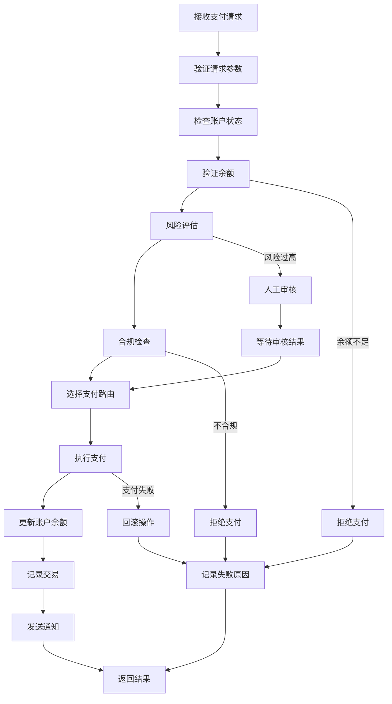
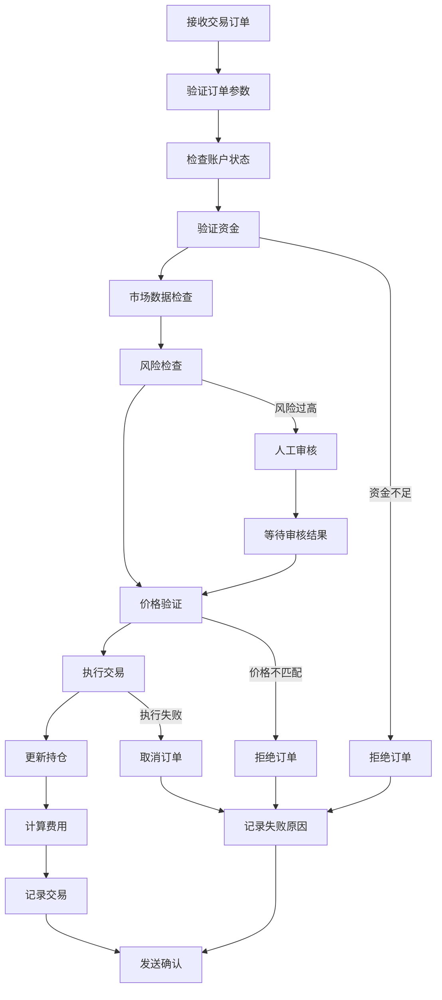
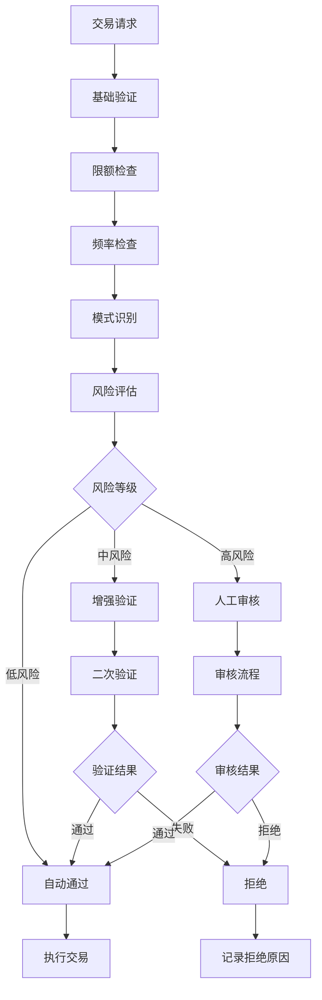

# 金融科技行业 - 业务建模详解

## 概述

本文档详细描述了金融科技行业的业务建模，包括业务流程、数据建模、流程建模和概念建模，为Rust架构设计提供业务基础。

## 1. 业务概念建模

### 1.1 核心业务概念

#### 账户聚合根

```rust
#[derive(Debug, Clone)]
pub struct Account {
    pub id: AccountId,
    pub customer_id: CustomerId,
    pub account_type: AccountType,
    pub balance: Money,
    pub status: AccountStatus,
    pub currency: Currency,
    pub created_at: DateTime<Utc>,
    pub updated_at: DateTime<Utc>,
    pub transactions: Vec<Transaction>,
}

impl Account {
    pub fn new(customer_id: CustomerId, account_type: AccountType, currency: Currency) -> Self {
        Self {
            id: AccountId::generate(),
            customer_id,
            account_type,
            balance: Money::zero(currency),
            status: AccountStatus::Active,
            currency,
            created_at: Utc::now(),
            updated_at: Utc::now(),
            transactions: Vec::new(),
        }
    }
    
    pub fn can_withdraw(&self, amount: &Money) -> bool {
        self.status == AccountStatus::Active && 
        self.balance.currency == amount.currency &&
        self.balance.amount >= amount.amount
    }
    
    pub fn withdraw(&mut self, amount: Money) -> Result<(), AccountError> {
        if !self.can_withdraw(&amount) {
            return Err(AccountError::InsufficientFunds);
        }
        
        self.balance.amount -= amount.amount;
        self.updated_at = Utc::now();
        Ok(())
    }
    
    pub fn deposit(&mut self, amount: Money) -> Result<(), AccountError> {
        if self.balance.currency != amount.currency {
            return Err(AccountError::CurrencyMismatch);
        }
        
        self.balance.amount += amount.amount;
        self.updated_at = Utc::now();
        Ok(())
    }
}
```

#### 支付聚合根

```rust
#[derive(Debug, Clone)]
pub struct Payment {
    pub id: PaymentId,
    pub from_account: AccountId,
    pub to_account: AccountId,
    pub amount: Money,
    pub payment_method: PaymentMethod,
    pub status: PaymentStatus,
    pub created_at: DateTime<Utc>,
    pub processed_at: Option<DateTime<Utc>>,
    pub failed_at: Option<DateTime<Utc>>,
    pub failure_reason: Option<String>,
    pub metadata: PaymentMetadata,
}

#[derive(Debug, Clone)]
pub struct PaymentMetadata {
    pub description: Option<String>,
    pub reference: Option<String>,
    pub category: PaymentCategory,
    pub tags: Vec<String>,
    pub custom_fields: HashMap<String, String>,
}

impl Payment {
    pub fn new(
        from_account: AccountId,
        to_account: AccountId,
        amount: Money,
        payment_method: PaymentMethod,
    ) -> Self {
        Self {
            id: PaymentId::generate(),
            from_account,
            to_account,
            amount,
            payment_method,
            status: PaymentStatus::Pending,
            created_at: Utc::now(),
            processed_at: None,
            failed_at: None,
            failure_reason: None,
            metadata: PaymentMetadata::default(),
        }
    }
    
    pub fn process(&mut self) -> Result<(), PaymentError> {
        if self.status != PaymentStatus::Pending {
            return Err(PaymentError::InvalidStatus);
        }
        
        self.status = PaymentStatus::Processing;
        Ok(())
    }
    
    pub fn complete(&mut self) {
        self.status = PaymentStatus::Completed;
        self.processed_at = Some(Utc::now());
    }
    
    pub fn fail(&mut self, reason: String) {
        self.status = PaymentStatus::Failed;
        self.failed_at = Some(Utc::now());
        self.failure_reason = Some(reason);
    }
}
```

#### 交易聚合根

```rust
#[derive(Debug, Clone)]
pub struct Trade {
    pub id: TradeId,
    pub account_id: AccountId,
    pub instrument: Instrument,
    pub side: TradeSide,
    pub quantity: Decimal,
    pub price: Money,
    pub status: TradeStatus,
    pub order_type: OrderType,
    pub created_at: DateTime<Utc>,
    pub executed_at: Option<DateTime<Utc>>,
    pub cancelled_at: Option<DateTime<Utc>>,
    pub fees: Vec<Fee>,
}

#[derive(Debug, Clone)]
pub struct Fee {
    pub fee_type: FeeType,
    pub amount: Money,
    pub description: String,
}

impl Trade {
    pub fn new(
        account_id: AccountId,
        instrument: Instrument,
        side: TradeSide,
        quantity: Decimal,
        price: Money,
        order_type: OrderType,
    ) -> Self {
        Self {
            id: TradeId::generate(),
            account_id,
            instrument,
            side,
            quantity,
            price,
            status: TradeStatus::Pending,
            order_type,
            created_at: Utc::now(),
            executed_at: None,
            cancelled_at: None,
            fees: Vec::new(),
        }
    }
    
    pub fn execute(&mut self, execution_price: Money, execution_time: DateTime<Utc>) {
        self.status = TradeStatus::Executed;
        self.price = execution_price;
        self.executed_at = Some(execution_time);
    }
    
    pub fn cancel(&mut self) -> Result<(), TradeError> {
        if self.status != TradeStatus::Pending {
            return Err(TradeError::CannotCancel);
        }
        
        self.status = TradeStatus::Cancelled;
        self.cancelled_at = Some(Utc::now());
        Ok(())
    }
    
    pub fn add_fee(&mut self, fee: Fee) {
        self.fees.push(fee);
    }
}
```

### 1.2 值对象

```rust
#[derive(Debug, Clone, PartialEq, Eq, Hash)]
pub struct Money {
    pub amount: Decimal,
    pub currency: Currency,
}

impl Money {
    pub fn new(amount: Decimal, currency: Currency) -> Self {
        Self { amount, currency }
    }
    
    pub fn zero(currency: Currency) -> Self {
        Self::new(Decimal::ZERO, currency)
    }
    
    pub fn add(&self, other: &Money) -> Result<Money, MoneyError> {
        if self.currency != other.currency {
            return Err(MoneyError::CurrencyMismatch);
        }
        Ok(Money::new(self.amount + other.amount, self.currency.clone()))
    }
    
    pub fn subtract(&self, other: &Money) -> Result<Money, MoneyError> {
        if self.currency != other.currency {
            return Err(MoneyError::CurrencyMismatch);
        }
        Ok(Money::new(self.amount - other.amount, self.currency.clone()))
    }
}

#[derive(Debug, Clone, PartialEq, Eq, Hash)]
pub struct AccountId(String);

impl AccountId {
    pub fn new(id: String) -> Self {
        Self(id)
    }
    
    pub fn generate() -> Self {
        Self(uuid::Uuid::new_v4().to_string())
    }
    
    pub fn as_str(&self) -> &str {
        &self.0
    }
}

#[derive(Debug, Clone, PartialEq, Eq, Hash)]
pub struct PaymentId(String);

impl PaymentId {
    pub fn generate() -> Self {
        Self(uuid::Uuid::new_v4().to_string())
    }
}

#[derive(Debug, Clone, PartialEq, Eq, Hash)]
pub struct TradeId(String);

impl TradeId {
    pub fn generate() -> Self {
        Self(uuid::Uuid::new_v4().to_string())
    }
}
```

### 1.3 枚举类型

```rust
#[derive(Debug, Clone, PartialEq, Eq)]
pub enum AccountType {
    Checking,
    Savings,
    Credit,
    Investment,
    Business,
}

#[derive(Debug, Clone, PartialEq, Eq)]
pub enum AccountStatus {
    Active,
    Suspended,
    Closed,
    Frozen,
}

#[derive(Debug, Clone, PartialEq, Eq)]
pub enum PaymentMethod {
    BankTransfer,
    CreditCard,
    DebitCard,
    DigitalWallet,
    Cryptocurrency,
}

#[derive(Debug, Clone, PartialEq, Eq)]
pub enum PaymentStatus {
    Pending,
    Processing,
    Completed,
    Failed,
    Cancelled,
}

#[derive(Debug, Clone, PartialEq, Eq)]
pub enum TradeSide {
    Buy,
    Sell,
}

#[derive(Debug, Clone, PartialEq, Eq)]
pub enum TradeStatus {
    Pending,
    Executed,
    Cancelled,
    Rejected,
}

#[derive(Debug, Clone, PartialEq, Eq)]
pub enum OrderType {
    Market,
    Limit,
    Stop,
    StopLimit,
}
```

## 2. 数据建模

### 2.1 数据库设计

#### 账户表设计

```sql
-- 账户表
CREATE TABLE accounts (
    id UUID PRIMARY KEY,
    customer_id UUID NOT NULL,
    account_type VARCHAR(50) NOT NULL,
    balance_amount DECIMAL(20,8) NOT NULL,
    balance_currency VARCHAR(3) NOT NULL,
    status VARCHAR(20) NOT NULL,
    created_at TIMESTAMP WITH TIME ZONE NOT NULL,
    updated_at TIMESTAMP WITH TIME ZONE NOT NULL,
    version INTEGER NOT NULL DEFAULT 1,
    
    CONSTRAINT fk_accounts_customer FOREIGN KEY (customer_id) REFERENCES customers(id),
    CONSTRAINT chk_account_type CHECK (account_type IN ('checking', 'savings', 'credit', 'investment', 'business')),
    CONSTRAINT chk_account_status CHECK (status IN ('active', 'suspended', 'closed', 'frozen')),
    CONSTRAINT chk_balance_positive CHECK (balance_amount >= 0)
);

-- 账户索引
CREATE INDEX idx_accounts_customer_id ON accounts(customer_id);
CREATE INDEX idx_accounts_status ON accounts(status);
CREATE INDEX idx_accounts_created_at ON accounts(created_at);

-- 账户审计表
CREATE TABLE account_audit_logs (
    id UUID PRIMARY KEY,
    account_id UUID NOT NULL,
    action VARCHAR(50) NOT NULL,
    old_values JSONB,
    new_values JSONB,
    user_id UUID,
    ip_address INET,
    created_at TIMESTAMP WITH TIME ZONE NOT NULL,
    
    CONSTRAINT fk_account_audit_account FOREIGN KEY (account_id) REFERENCES accounts(id)
);
```

#### 支付表设计

```sql
-- 支付表
CREATE TABLE payments (
    id UUID PRIMARY KEY,
    from_account_id UUID NOT NULL,
    to_account_id UUID NOT NULL,
    amount DECIMAL(20,8) NOT NULL,
    currency VARCHAR(3) NOT NULL,
    payment_method VARCHAR(50) NOT NULL,
    status VARCHAR(20) NOT NULL,
    created_at TIMESTAMP WITH TIME ZONE NOT NULL,
    processed_at TIMESTAMP WITH TIME ZONE,
    failed_at TIMESTAMP WITH TIME ZONE,
    failure_reason TEXT,
    description TEXT,
    reference VARCHAR(100),
    category VARCHAR(50),
    tags TEXT[],
    custom_fields JSONB,
    version INTEGER NOT NULL DEFAULT 1,
    
    CONSTRAINT fk_payments_from_account FOREIGN KEY (from_account_id) REFERENCES accounts(id),
    CONSTRAINT fk_payments_to_account FOREIGN KEY (to_account_id) REFERENCES accounts(id),
    CONSTRAINT chk_payment_method CHECK (payment_method IN ('bank_transfer', 'credit_card', 'debit_card', 'digital_wallet', 'cryptocurrency')),
    CONSTRAINT chk_payment_status CHECK (status IN ('pending', 'processing', 'completed', 'failed', 'cancelled')),
    CONSTRAINT chk_payment_amount_positive CHECK (amount > 0)
);

-- 支付索引
CREATE INDEX idx_payments_from_account ON payments(from_account_id);
CREATE INDEX idx_payments_to_account ON payments(to_account_id);
CREATE INDEX idx_payments_status ON payments(status);
CREATE INDEX idx_payments_created_at ON payments(created_at);
CREATE INDEX idx_payments_reference ON payments(reference);

-- 支付路由表
CREATE TABLE payment_routes (
    id UUID PRIMARY KEY,
    payment_id UUID NOT NULL,
    route_type VARCHAR(50) NOT NULL,
    provider VARCHAR(100) NOT NULL,
    route_data JSONB NOT NULL,
    created_at TIMESTAMP WITH TIME ZONE NOT NULL,
    
    CONSTRAINT fk_payment_routes_payment FOREIGN KEY (payment_id) REFERENCES payments(id)
);
```

#### 交易表设计

```sql
-- 交易表
CREATE TABLE trades (
    id UUID PRIMARY KEY,
    account_id UUID NOT NULL,
    instrument_symbol VARCHAR(20) NOT NULL,
    instrument_type VARCHAR(50) NOT NULL,
    side VARCHAR(10) NOT NULL,
    quantity DECIMAL(20,8) NOT NULL,
    price_amount DECIMAL(20,8) NOT NULL,
    price_currency VARCHAR(3) NOT NULL,
    status VARCHAR(20) NOT NULL,
    order_type VARCHAR(20) NOT NULL,
    created_at TIMESTAMP WITH TIME ZONE NOT NULL,
    executed_at TIMESTAMP WITH TIME ZONE,
    cancelled_at TIMESTAMP WITH TIME ZONE,
    version INTEGER NOT NULL DEFAULT 1,
    
    CONSTRAINT fk_trades_account FOREIGN KEY (account_id) REFERENCES accounts(id),
    CONSTRAINT chk_trade_side CHECK (side IN ('buy', 'sell')),
    CONSTRAINT chk_trade_status CHECK (status IN ('pending', 'executed', 'cancelled', 'rejected')),
    CONSTRAINT chk_trade_order_type CHECK (order_type IN ('market', 'limit', 'stop', 'stop_limit')),
    CONSTRAINT chk_trade_quantity_positive CHECK (quantity > 0),
    CONSTRAINT chk_trade_price_positive CHECK (price_amount > 0)
);

-- 交易索引
CREATE INDEX idx_trades_account_id ON trades(account_id);
CREATE INDEX idx_trades_instrument_symbol ON trades(instrument_symbol);
CREATE INDEX idx_trades_status ON trades(status);
CREATE INDEX idx_trades_created_at ON trades(created_at);

-- 交易费用表
CREATE TABLE trade_fees (
    id UUID PRIMARY KEY,
    trade_id UUID NOT NULL,
    fee_type VARCHAR(50) NOT NULL,
    amount DECIMAL(20,8) NOT NULL,
    currency VARCHAR(3) NOT NULL,
    description TEXT,
    created_at TIMESTAMP WITH TIME ZONE NOT NULL,
    
    CONSTRAINT fk_trade_fees_trade FOREIGN KEY (trade_id) REFERENCES trades(id)
);
```

### 2.2 仓储模式实现

```rust
pub trait AccountRepository {
    async fn save(&self, account: &Account) -> Result<(), RepositoryError>;
    async fn find_by_id(&self, id: &AccountId) -> Result<Option<Account>, RepositoryError>;
    async fn find_by_customer_id(&self, customer_id: &CustomerId) -> Result<Vec<Account>, RepositoryError>;
    async fn find_by_status(&self, status: &AccountStatus) -> Result<Vec<Account>, RepositoryError>;
    async fn update_balance(&self, account_id: &AccountId, new_balance: &Money) -> Result<(), RepositoryError>;
}

pub struct PostgresAccountRepository {
    pool: PgPool,
}

#[async_trait]
impl AccountRepository for PostgresAccountRepository {
    async fn save(&self, account: &Account) -> Result<(), RepositoryError> {
        sqlx::query!(
            r#"
            INSERT INTO accounts (id, customer_id, account_type, balance_amount, balance_currency, status, created_at, updated_at, version)
            VALUES ($1, $2, $3, $4, $5, $6, $7, $8, $9)
            ON CONFLICT (id) DO UPDATE SET
                balance_amount = $4,
                balance_currency = $5,
                status = $6,
                updated_at = $8,
                version = accounts.version + 1
            "#,
            account.id.as_str(),
            account.customer_id.as_str(),
            account.account_type.to_string(),
            account.balance.amount,
            account.balance.currency.to_string(),
            account.status.to_string(),
            account.created_at,
            account.updated_at,
            1
        )
        .execute(&self.pool)
        .await?;
        
        Ok(())
    }
    
    async fn find_by_id(&self, id: &AccountId) -> Result<Option<Account>, RepositoryError> {
        let row = sqlx::query!(
            r#"
            SELECT id, customer_id, account_type, balance_amount, balance_currency, status, created_at, updated_at
            FROM accounts
            WHERE id = $1
            "#,
            id.as_str()
        )
        .fetch_optional(&self.pool)
        .await?;
        
        if let Some(row) = row {
            let account = Account {
                id: AccountId::new(row.id),
                customer_id: CustomerId::new(row.customer_id),
                account_type: AccountType::from_str(&row.account_type)?,
                balance: Money::new(row.balance_amount, Currency::from_str(&row.balance_currency)?),
                status: AccountStatus::from_str(&row.status)?,
                currency: Currency::from_str(&row.balance_currency)?,
                created_at: row.created_at,
                updated_at: row.updated_at,
                transactions: Vec::new(), // 需要单独查询
            };
            Ok(Some(account))
        } else {
            Ok(None)
        }
    }
    
    async fn find_by_customer_id(&self, customer_id: &CustomerId) -> Result<Vec<Account>, RepositoryError> {
        let rows = sqlx::query!(
            r#"
            SELECT id, customer_id, account_type, balance_amount, balance_currency, status, created_at, updated_at
            FROM accounts
            WHERE customer_id = $1
            ORDER BY created_at DESC
            "#,
            customer_id.as_str()
        )
        .fetch_all(&self.pool)
        .await?;
        
        let accounts: Result<Vec<Account>, RepositoryError> = rows
            .into_iter()
            .map(|row| {
                Ok(Account {
                    id: AccountId::new(row.id),
                    customer_id: CustomerId::new(row.customer_id),
                    account_type: AccountType::from_str(&row.account_type)?,
                    balance: Money::new(row.balance_amount, Currency::from_str(&row.balance_currency)?),
                    status: AccountStatus::from_str(&row.status)?,
                    currency: Currency::from_str(&row.balance_currency)?,
                    created_at: row.created_at,
                    updated_at: row.updated_at,
                    transactions: Vec::new(),
                })
            })
            .collect();
        
        accounts
    }
}
```

## 3. 流程建模

### 3.1 支付处理流程



### 3.2 交易执行流程



### 3.3 风险控制流程



## 4. 业务流程建模

### 4.1 客户开户流程

```rust
pub struct AccountOpeningWorkflow {
    customer_repository: Box<dyn CustomerRepository>,
    account_repository: Box<dyn AccountRepository>,
    kyc_service: Box<dyn KYCService>,
    risk_service: Box<dyn RiskService>,
    notification_service: Box<dyn NotificationService>,
}

impl AccountOpeningWorkflow {
    pub async fn open_account(&self, request: AccountOpeningRequest) -> Result<AccountId, WorkflowError> {
        // 1. 验证客户信息
        let customer = self.customer_repository.find_by_id(&request.customer_id).await?
            .ok_or(WorkflowError::CustomerNotFound)?;
        
        // 2. KYC验证
        let kyc_result = self.kyc_service.verify(&customer).await?;
        if !kyc_result.is_approved() {
            return Err(WorkflowError::KYCRejected(kyc_result.reason()));
        }
        
        // 3. 风险评估
        let risk_assessment = self.risk_service.assess_customer(&customer).await?;
        if risk_assessment.risk_level() == RiskLevel::High {
            return Err(WorkflowError::HighRiskCustomer);
        }
        
        // 4. 创建账户
        let account = Account::new(
            request.customer_id,
            request.account_type,
            request.currency,
        );
        
        // 5. 保存账户
        self.account_repository.save(&account).await?;
        
        // 6. 发送欢迎通知
        self.notification_service.send_welcome_email(&customer, &account).await?;
        
        Ok(account.id)
    }
}

#[derive(Debug, Clone)]
pub struct AccountOpeningRequest {
    pub customer_id: CustomerId,
    pub account_type: AccountType,
    pub currency: Currency,
    pub initial_deposit: Option<Money>,
}
```

### 4.2 支付处理流程

```rust
pub struct PaymentProcessingWorkflow {
    account_repository: Box<dyn AccountRepository>,
    payment_repository: Box<dyn PaymentRepository>,
    risk_service: Box<dyn RiskService>,
    compliance_service: Box<dyn ComplianceService>,
    routing_service: Box<dyn PaymentRoutingService>,
    notification_service: Box<dyn NotificationService>,
}

impl PaymentProcessingWorkflow {
    pub async fn process_payment(&self, request: PaymentRequest) -> Result<PaymentId, WorkflowError> {
        // 1. 验证支付请求
        self.validate_payment_request(&request).await?;
        
        // 2. 检查源账户
        let from_account = self.account_repository.find_by_id(&request.from_account).await?
            .ok_or(WorkflowError::AccountNotFound)?;
        
        if !from_account.can_withdraw(&request.amount) {
            return Err(WorkflowError::InsufficientFunds);
        }
        
        // 3. 风险评估
        let risk_assessment = self.risk_service.assess_payment(&request).await?;
        if risk_assessment.risk_level() == RiskLevel::High {
            return Err(WorkflowError::HighRiskPayment);
        }
        
        // 4. 合规检查
        let compliance_result = self.compliance_service.check_payment(&request).await?;
        if !compliance_result.is_compliant() {
            return Err(WorkflowError::ComplianceViolation(compliance_result.reason()));
        }
        
        // 5. 创建支付记录
        let mut payment = Payment::new(
            request.from_account,
            request.to_account,
            request.amount,
            request.payment_method,
        );
        
        // 6. 选择支付路由
        let route = self.routing_service.select_route(&payment).await?;
        
        // 7. 执行支付
        payment.process()?;
        self.payment_repository.save(&payment).await?;
        
        // 8. 执行资金转移
        self.execute_fund_transfer(&payment, &route).await?;
        
        // 9. 完成支付
        payment.complete();
        self.payment_repository.save(&payment).await?;
        
        // 10. 发送通知
        self.notification_service.send_payment_confirmation(&payment).await?;
        
        Ok(payment.id)
    }
    
    async fn execute_fund_transfer(&self, payment: &Payment, route: &PaymentRoute) -> Result<(), WorkflowError> {
        // 扣除源账户余额
        let mut from_account = self.account_repository.find_by_id(&payment.from_account).await?
            .ok_or(WorkflowError::AccountNotFound)?;
        
        from_account.withdraw(payment.amount.clone())?;
        self.account_repository.save(&from_account).await?;
        
        // 增加目标账户余额
        let mut to_account = self.account_repository.find_by_id(&payment.to_account).await?
            .ok_or(WorkflowError::AccountNotFound)?;
        
        to_account.deposit(payment.amount.clone())?;
        self.account_repository.save(&to_account).await?;
        
        Ok(())
    }
}
```

### 4.3 交易执行流程

```rust
pub struct TradeExecutionWorkflow {
    account_repository: Box<dyn AccountRepository>,
    trade_repository: Box<dyn TradeRepository>,
    market_data_service: Box<dyn MarketDataService>,
    risk_service: Box<dyn RiskService>,
    execution_service: Box<dyn ExecutionService>,
    notification_service: Box<dyn NotificationService>,
}

impl TradeExecutionWorkflow {
    pub async fn execute_trade(&self, request: TradeRequest) -> Result<TradeId, WorkflowError> {
        // 1. 验证交易请求
        self.validate_trade_request(&request).await?;
        
        // 2. 检查账户状态
        let account = self.account_repository.find_by_id(&request.account_id).await?
            .ok_or(WorkflowError::AccountNotFound)?;
        
        if account.status != AccountStatus::Active {
            return Err(WorkflowError::AccountInactive);
        }
        
        // 3. 获取市场数据
        let market_data = self.market_data_service.get_quote(&request.instrument).await?;
        
        // 4. 价格验证
        if !self.validate_price(&request, &market_data).await? {
            return Err(WorkflowError::PriceMismatch);
        }
        
        // 5. 风险评估
        let risk_assessment = self.risk_service.assess_trade(&request).await?;
        if risk_assessment.risk_level() == RiskLevel::High {
            return Err(WorkflowError::HighRiskTrade);
        }
        
        // 6. 创建交易记录
        let mut trade = Trade::new(
            request.account_id,
            request.instrument,
            request.side,
            request.quantity,
            request.price,
            request.order_type,
        );
        
        // 7. 执行交易
        let execution_result = self.execution_service.execute(&trade).await?;
        
        if execution_result.is_successful() {
            trade.execute(execution_result.price(), execution_result.timestamp());
            
            // 8. 计算费用
            let fees = self.calculate_fees(&trade).await?;
            for fee in fees {
                trade.add_fee(fee);
            }
            
            // 9. 保存交易
            self.trade_repository.save(&trade).await?;
            
            // 10. 发送确认
            self.notification_service.send_trade_confirmation(&trade).await?;
            
            Ok(trade.id)
        } else {
            trade.cancel()?;
            self.trade_repository.save(&trade).await?;
            Err(WorkflowError::ExecutionFailed(execution_result.error()))
        }
    }
}
```

## 5. 业务规则引擎

### 5.1 规则定义

```rust
pub trait BusinessRule {
    fn evaluate(&self, context: &BusinessContext) -> Result<RuleResult, RuleError>;
    fn priority(&self) -> u32;
    fn name(&self) -> &str;
}

pub struct MinimumBalanceRule {
    minimum_balance: Money,
}

impl BusinessRule for MinimumBalanceRule {
    fn evaluate(&self, context: &BusinessContext) -> Result<RuleResult, RuleError> {
        if let Some(account) = &context.account {
            if account.balance.amount < self.minimum_balance.amount {
                Ok(RuleResult::Violation(format!(
                    "Account balance {} is below minimum required {}",
                    account.balance.amount,
                    self.minimum_balance.amount
                )))
            } else {
                Ok(RuleResult::Compliant)
            }
        } else {
            Err(RuleError::MissingContext("account"))
        }
    }
    
    fn priority(&self) -> u32 { 100 }
    fn name(&self) -> &str { "minimum_balance" }
}

pub struct DailyTransactionLimitRule {
    limit: Money,
}

impl BusinessRule for DailyTransactionLimitRule {
    fn evaluate(&self, context: &BusinessContext) -> Result<RuleResult, RuleError> {
        if let Some(daily_total) = &context.daily_transaction_total {
            if daily_total.amount > self.limit.amount {
                Ok(RuleResult::Violation(format!(
                    "Daily transaction total {} exceeds limit {}",
                    daily_total.amount,
                    self.limit.amount
                )))
            } else {
                Ok(RuleResult::Compliant)
            }
        } else {
            Ok(RuleResult::Compliant) // 如果没有数据，假设合规
        }
    }
    
    fn priority(&self) -> u32 { 200 }
    fn name(&self) -> &str { "daily_transaction_limit" }
}
```

### 5.2 规则引擎

```rust
pub struct BusinessRuleEngine {
    rules: Vec<Box<dyn BusinessRule>>,
}

impl BusinessRuleEngine {
    pub fn new() -> Self {
        Self { rules: Vec::new() }
    }
    
    pub fn add_rule(&mut self, rule: Box<dyn BusinessRule>) {
        self.rules.push(rule);
        // 按优先级排序
        self.rules.sort_by(|a, b| a.priority().cmp(&b.priority()));
    }
    
    pub fn evaluate(&self, context: &BusinessContext) -> Result<Vec<RuleResult>, RuleError> {
        let mut results = Vec::new();
        
        for rule in &self.rules {
            let result = rule.evaluate(context)?;
            results.push(result);
            
            // 如果发现违规，可以决定是否继续检查其他规则
            if let RuleResult::Violation(_) = &result {
                // 可以根据业务需求决定是否继续
                // break;
            }
        }
        
        Ok(results)
    }
}

#[derive(Debug, Clone)]
pub struct BusinessContext {
    pub account: Option<Account>,
    pub payment: Option<Payment>,
    pub trade: Option<Trade>,
    pub customer: Option<Customer>,
    pub daily_transaction_total: Option<Money>,
    pub monthly_transaction_total: Option<Money>,
}

#[derive(Debug, Clone)]
pub enum RuleResult {
    Compliant,
    Violation(String),
    Warning(String),
}
```

## 总结

金融科技行业的业务建模需要特别关注：

1. **精确性**: 所有金额计算必须精确，避免浮点数误差
2. **一致性**: 确保数据一致性，特别是在并发操作中
3. **可追溯性**: 所有操作都要有完整的审计日志
4. **合规性**: 严格遵循金融监管要求
5. **安全性**: 保护敏感金融数据

通过这种详细的业务建模，可以为Rust架构设计提供坚实的业务基础，确保系统能够准确、安全、高效地处理金融业务。
