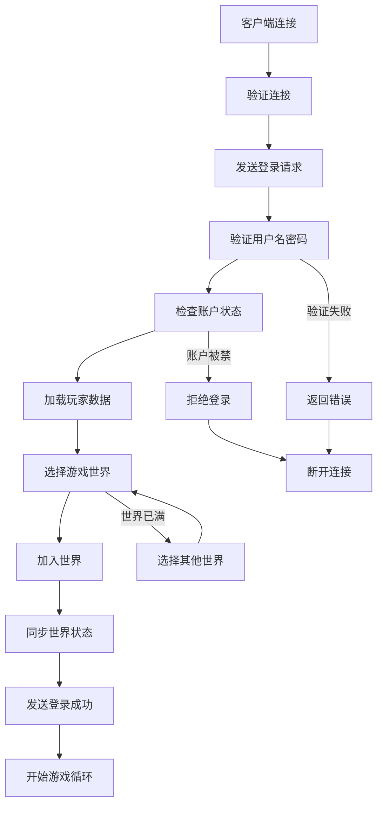
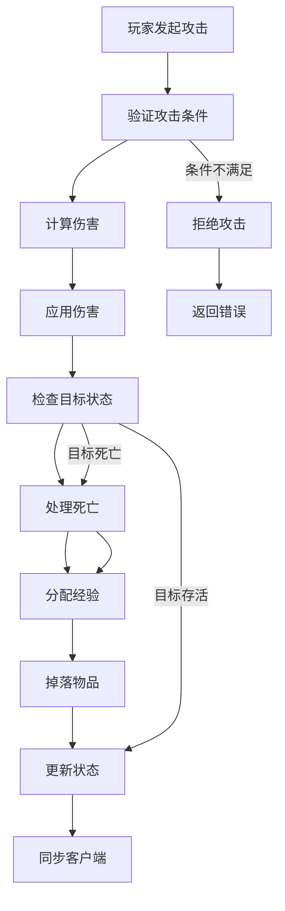
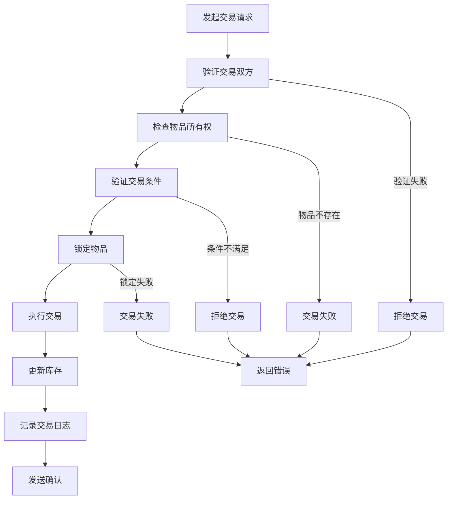

# 游戏开发行业 - 业务建模详解

## 概述

本文档详细描述了游戏开发行业的业务建模，包括业务流程、数据建模、流程建模和概念建模，为Rust游戏架构设计提供业务基础。

## 1. 业务概念建模

### 1.1 核心游戏概念

#### 游戏世界聚合根
```rust
#[derive(Debug, Clone)]
pub struct GameWorld {
    pub id: WorldId,
    pub name: String,
    pub world_type: WorldType,
    pub max_players: u32,
    pub current_players: u32,
    pub status: WorldStatus,
    pub created_at: DateTime<Utc>,
    pub entities: HashMap<EntityId, Entity>,
    pub physics_world: PhysicsWorld,
    pub game_rules: GameRules,
}

impl GameWorld {
    pub fn new(name: String, world_type: WorldType, max_players: u32) -> Self {
        Self {
            id: WorldId::generate(),
            name,
            world_type,
            max_players,
            current_players: 0,
            status: WorldStatus::Active,
            created_at: Utc::now(),
            entities: HashMap::new(),
            physics_world: PhysicsWorld::new(),
            game_rules: GameRules::default(),
        }
    }
    
    pub fn add_player(&mut self, player: Player) -> Result<(), WorldError> {
        if self.current_players >= self.max_players {
            return Err(WorldError::WorldFull);
        }
        
        let entity = Entity::from_player(player);
        self.entities.insert(entity.id.clone(), entity);
        self.current_players += 1;
        Ok(())
    }
    
    pub fn remove_player(&mut self, player_id: &PlayerId) -> Result<(), WorldError> {
        if let Some(entity) = self.entities.remove(&EntityId::from_player_id(player_id)) {
            self.current_players -= 1;
            Ok(())
        } else {
            Err(WorldError::PlayerNotFound)
        }
    }
    
    pub fn update(&mut self, delta_time: f32) {
        // 更新物理世界
        self.physics_world.step(delta_time);
        
        // 更新所有实体
        for entity in self.entities.values_mut() {
            entity.update(delta_time);
        }
        
        // 检查碰撞
        self.check_collisions();
        
        // 应用游戏规则
        self.game_rules.apply(self);
    }
    
    fn check_collisions(&mut self) {
        // 简化的碰撞检测
        let entities: Vec<_> = self.entities.values().collect();
        for i in 0..entities.len() {
            for j in (i + 1)..entities.len() {
                if entities[i].collides_with(entities[j]) {
                    self.handle_collision(entities[i], entities[j]);
                }
            }
        }
    }
}
```

#### 玩家聚合根
```rust
#[derive(Debug, Clone)]
pub struct Player {
    pub id: PlayerId,
    pub username: String,
    pub level: u32,
    pub experience: u32,
    pub health: f32,
    pub max_health: f32,
    pub mana: f32,
    pub max_mana: f32,
    pub position: Vector3<f32>,
    pub velocity: Vector3<f32>,
    pub inventory: Inventory,
    pub skills: Vec<Skill>,
    pub stats: PlayerStats,
    pub created_at: DateTime<Utc>,
    pub last_login: DateTime<Utc>,
}

#[derive(Debug, Clone)]
pub struct PlayerStats {
    pub strength: u32,
    pub dexterity: u32,
    pub intelligence: u32,
    pub vitality: u32,
    pub armor: u32,
    pub magic_resistance: u32,
}

impl Player {
    pub fn new(username: String) -> Self {
        Self {
            id: PlayerId::generate(),
            username,
            level: 1,
            experience: 0,
            health: 100.0,
            max_health: 100.0,
            mana: 50.0,
            max_mana: 50.0,
            position: Vector3::new(0.0, 0.0, 0.0),
            velocity: Vector3::new(0.0, 0.0, 0.0),
            inventory: Inventory::new(),
            skills: Vec::new(),
            stats: PlayerStats::default(),
            created_at: Utc::now(),
            last_login: Utc::now(),
        }
    }
    
    pub fn gain_experience(&mut self, amount: u32) {
        self.experience += amount;
        
        // 检查升级
        let required_exp = self.calculate_required_experience();
        if self.experience >= required_exp {
            self.level_up();
        }
    }
    
    pub fn level_up(&mut self) {
        self.level += 1;
        self.experience -= self.calculate_required_experience();
        
        // 增加属性
        self.stats.strength += 2;
        self.stats.dexterity += 2;
        self.stats.intelligence += 2;
        self.stats.vitality += 2;
        
        // 增加生命值和魔法值
        self.max_health += 10.0;
        self.max_mana += 5.0;
        self.health = self.max_health;
        self.mana = self.max_mana;
    }
    
    pub fn take_damage(&mut self, damage: f32) {
        let actual_damage = damage * (1.0 - self.stats.armor as f32 / 100.0);
        self.health = (self.health - actual_damage).max(0.0);
    }
    
    pub fn heal(&mut self, amount: f32) {
        self.health = (self.health + amount).min(self.max_health);
    }
    
    pub fn use_mana(&mut self, amount: f32) -> bool {
        if self.mana >= amount {
            self.mana -= amount;
            true
        } else {
            false
        }
    }
    
    fn calculate_required_experience(&self) -> u32 {
        self.level * 100 + (self.level - 1) * 50
    }
}
```

#### 物品系统
```rust
#[derive(Debug, Clone)]
pub struct Item {
    pub id: ItemId,
    pub name: String,
    pub item_type: ItemType,
    pub rarity: Rarity,
    pub level_requirement: u32,
    pub stats: ItemStats,
    pub effects: Vec<ItemEffect>,
    pub stackable: bool,
    pub max_stack: u32,
    pub description: String,
}

#[derive(Debug, Clone)]
pub struct ItemStats {
    pub damage: Option<u32>,
    pub armor: Option<u32>,
    pub magic_damage: Option<u32>,
    pub magic_resistance: Option<u32>,
    pub health_bonus: Option<u32>,
    pub mana_bonus: Option<u32>,
}

#[derive(Debug, Clone)]
pub struct ItemEffect {
    pub effect_type: EffectType,
    pub value: f32,
    pub duration: Option<Duration>,
}

#[derive(Debug, Clone)]
pub struct Inventory {
    pub slots: Vec<Option<InventorySlot>>,
    pub max_slots: usize,
    pub gold: u32,
}

#[derive(Debug, Clone)]
pub struct InventorySlot {
    pub item: Item,
    pub quantity: u32,
    pub durability: Option<f32>,
}

impl Inventory {
    pub fn new() -> Self {
        Self {
            slots: vec![None; 20], // 默认20个槽位
            max_slots: 20,
            gold: 0,
        }
    }
    
    pub fn add_item(&mut self, item: Item, quantity: u32) -> Result<(), InventoryError> {
        if item.stackable {
            // 尝试堆叠到现有槽位
            for slot in &mut self.slots {
                if let Some(existing_slot) = slot {
                    if existing_slot.item.id == item.id && existing_slot.quantity < item.max_stack {
                        let space_left = item.max_stack - existing_slot.quantity;
                        let to_add = quantity.min(space_left);
                        existing_slot.quantity += to_add;
                        
                        if to_add < quantity {
                            return self.add_item(item, quantity - to_add);
                        } else {
                            return Ok(());
                        }
                    }
                }
            }
        }
        
        // 寻找空槽位
        for slot in &mut self.slots {
            if slot.is_none() {
                *slot = Some(InventorySlot {
                    item,
                    quantity,
                    durability: Some(100.0),
                });
                return Ok(());
            }
        }
        
        Err(InventoryError::NoSpace)
    }
    
    pub fn remove_item(&mut self, slot_index: usize, quantity: u32) -> Result<(), InventoryError> {
        if slot_index >= self.slots.len() {
            return Err(InventoryError::InvalidSlot);
        }
        
        if let Some(slot) = &mut self.slots[slot_index] {
            if slot.quantity >= quantity {
                slot.quantity -= quantity;
                if slot.quantity == 0 {
                    self.slots[slot_index] = None;
                }
                Ok(())
            } else {
                Err(InventoryError::InsufficientQuantity)
            }
        } else {
            Err(InventoryError::EmptySlot)
        }
    }
}
```

### 1.2 值对象

```rust
#[derive(Debug, Clone, PartialEq, Eq, Hash)]
pub struct WorldId(String);

impl WorldId {
    pub fn generate() -> Self {
        Self(uuid::Uuid::new_v4().to_string())
    }
}

#[derive(Debug, Clone, PartialEq, Eq, Hash)]
pub struct PlayerId(String);

impl PlayerId {
    pub fn generate() -> Self {
        Self(uuid::Uuid::new_v4().to_string())
    }
}

#[derive(Debug, Clone, PartialEq, Eq, Hash)]
pub struct ItemId(String);

impl ItemId {
    pub fn generate() -> Self {
        Self(uuid::Uuid::new_v4().to_string())
    }
}

#[derive(Debug, Clone, PartialEq, Eq)]
pub enum WorldType {
    PvE,
    PvP,
    Mixed,
    Dungeon,
    Raid,
}

#[derive(Debug, Clone, PartialEq, Eq)]
pub enum WorldStatus {
    Active,
    Maintenance,
    Full,
    Closed,
}

#[derive(Debug, Clone, PartialEq, Eq)]
pub enum ItemType {
    Weapon,
    Armor,
    Consumable,
    Material,
    Quest,
    Currency,
}

#[derive(Debug, Clone, PartialEq, Eq)]
pub enum Rarity {
    Common,
    Uncommon,
    Rare,
    Epic,
    Legendary,
}

#[derive(Debug, Clone, PartialEq, Eq)]
pub enum EffectType {
    Damage,
    Heal,
    Buff,
    Debuff,
    Teleport,
}
```

## 2. 数据建模

### 2.1 数据库设计

#### 游戏世界表
```sql
-- 游戏世界表
CREATE TABLE game_worlds (
    id UUID PRIMARY KEY,
    name VARCHAR(100) NOT NULL,
    world_type VARCHAR(20) NOT NULL,
    max_players INTEGER NOT NULL,
    current_players INTEGER NOT NULL DEFAULT 0,
    status VARCHAR(20) NOT NULL DEFAULT 'active',
    created_at TIMESTAMP WITH TIME ZONE NOT NULL,
    updated_at TIMESTAMP WITH TIME ZONE NOT NULL,
    
    CONSTRAINT chk_world_type CHECK (world_type IN ('pve', 'pvp', 'mixed', 'dungeon', 'raid')),
    CONSTRAINT chk_world_status CHECK (status IN ('active', 'maintenance', 'full', 'closed')),
    CONSTRAINT chk_max_players CHECK (max_players > 0),
    CONSTRAINT chk_current_players CHECK (current_players >= 0 AND current_players <= max_players)
);

-- 世界配置表
CREATE TABLE world_configs (
    id UUID PRIMARY KEY,
    world_id UUID NOT NULL,
    config_key VARCHAR(100) NOT NULL,
    config_value JSONB NOT NULL,
    created_at TIMESTAMP WITH TIME ZONE NOT NULL,
    
    CONSTRAINT fk_world_configs_world FOREIGN KEY (world_id) REFERENCES game_worlds(id),
    UNIQUE(world_id, config_key)
);
```

#### 玩家表
```sql
-- 玩家表
CREATE TABLE players (
    id UUID PRIMARY KEY,
    username VARCHAR(50) NOT NULL UNIQUE,
    level INTEGER NOT NULL DEFAULT 1,
    experience INTEGER NOT NULL DEFAULT 0,
    health DECIMAL(10,2) NOT NULL DEFAULT 100.0,
    max_health DECIMAL(10,2) NOT NULL DEFAULT 100.0,
    mana DECIMAL(10,2) NOT NULL DEFAULT 50.0,
    max_mana DECIMAL(10,2) NOT NULL DEFAULT 50.0,
    position_x DECIMAL(10,2) NOT NULL DEFAULT 0.0,
    position_y DECIMAL(10,2) NOT NULL DEFAULT 0.0,
    position_z DECIMAL(10,2) NOT NULL DEFAULT 0.0,
    velocity_x DECIMAL(10,2) NOT NULL DEFAULT 0.0,
    velocity_y DECIMAL(10,2) NOT NULL DEFAULT 0.0,
    velocity_z DECIMAL(10,2) NOT NULL DEFAULT 0.0,
    strength INTEGER NOT NULL DEFAULT 10,
    dexterity INTEGER NOT NULL DEFAULT 10,
    intelligence INTEGER NOT NULL DEFAULT 10,
    vitality INTEGER NOT NULL DEFAULT 10,
    armor INTEGER NOT NULL DEFAULT 0,
    magic_resistance INTEGER NOT NULL DEFAULT 0,
    gold INTEGER NOT NULL DEFAULT 0,
    created_at TIMESTAMP WITH TIME ZONE NOT NULL,
    last_login TIMESTAMP WITH TIME ZONE NOT NULL,
    updated_at TIMESTAMP WITH TIME ZONE NOT NULL,
    
    CONSTRAINT chk_player_level CHECK (level >= 1),
    CONSTRAINT chk_player_experience CHECK (experience >= 0),
    CONSTRAINT chk_player_health CHECK (health >= 0 AND health <= max_health),
    CONSTRAINT chk_player_mana CHECK (mana >= 0 AND mana <= max_mana)
);

-- 玩家技能表
CREATE TABLE player_skills (
    id UUID PRIMARY KEY,
    player_id UUID NOT NULL,
    skill_id UUID NOT NULL,
    level INTEGER NOT NULL DEFAULT 1,
    experience INTEGER NOT NULL DEFAULT 0,
    created_at TIMESTAMP WITH TIME ZONE NOT NULL,
    
    CONSTRAINT fk_player_skills_player FOREIGN KEY (player_id) REFERENCES players(id),
    CONSTRAINT fk_player_skills_skill FOREIGN KEY (skill_id) REFERENCES skills(id),
    UNIQUE(player_id, skill_id)
);
```

#### 物品表
```sql
-- 物品定义表
CREATE TABLE items (
    id UUID PRIMARY KEY,
    name VARCHAR(100) NOT NULL,
    item_type VARCHAR(20) NOT NULL,
    rarity VARCHAR(20) NOT NULL,
    level_requirement INTEGER NOT NULL DEFAULT 1,
    damage INTEGER,
    armor INTEGER,
    magic_damage INTEGER,
    magic_resistance INTEGER,
    health_bonus INTEGER,
    mana_bonus INTEGER,
    stackable BOOLEAN NOT NULL DEFAULT false,
    max_stack INTEGER NOT NULL DEFAULT 1,
    description TEXT,
    created_at TIMESTAMP WITH TIME ZONE NOT NULL,
    
    CONSTRAINT chk_item_type CHECK (item_type IN ('weapon', 'armor', 'consumable', 'material', 'quest', 'currency')),
    CONSTRAINT chk_item_rarity CHECK (rarity IN ('common', 'uncommon', 'rare', 'epic', 'legendary')),
    CONSTRAINT chk_item_level_requirement CHECK (level_requirement >= 1),
    CONSTRAINT chk_item_max_stack CHECK (max_stack >= 1)
);

-- 玩家物品表
CREATE TABLE player_items (
    id UUID PRIMARY KEY,
    player_id UUID NOT NULL,
    item_id UUID NOT NULL,
    slot_index INTEGER NOT NULL,
    quantity INTEGER NOT NULL DEFAULT 1,
    durability DECIMAL(5,2),
    created_at TIMESTAMP WITH TIME ZONE NOT NULL,
    updated_at TIMESTAMP WITH TIME ZONE NOT NULL,
    
    CONSTRAINT fk_player_items_player FOREIGN KEY (player_id) REFERENCES players(id),
    CONSTRAINT fk_player_items_item FOREIGN KEY (item_id) REFERENCES items(id),
    CONSTRAINT chk_player_items_quantity CHECK (quantity > 0),
    CONSTRAINT chk_player_items_durability CHECK (durability IS NULL OR (durability >= 0 AND durability <= 100)),
    UNIQUE(player_id, slot_index)
);
```

### 2.2 仓储模式实现

```rust
pub trait PlayerRepository {
    async fn save(&self, player: &Player) -> Result<(), RepositoryError>;
    async fn find_by_id(&self, id: &PlayerId) -> Result<Option<Player>, RepositoryError>;
    async fn find_by_username(&self, username: &str) -> Result<Option<Player>, RepositoryError>;
    async fn find_online_players(&self) -> Result<Vec<Player>, RepositoryError>;
    async fn update_position(&self, player_id: &PlayerId, position: Vector3<f32>) -> Result<(), RepositoryError>;
}

pub struct PostgresPlayerRepository {
    pool: PgPool,
}

#[async_trait]
impl PlayerRepository for PostgresPlayerRepository {
    async fn save(&self, player: &Player) -> Result<(), RepositoryError> {
        sqlx::query!(
            r#"
            INSERT INTO players (
                id, username, level, experience, health, max_health, mana, max_mana,
                position_x, position_y, position_z, velocity_x, velocity_y, velocity_z,
                strength, dexterity, intelligence, vitality, armor, magic_resistance, gold,
                created_at, last_login, updated_at
            )
            VALUES ($1, $2, $3, $4, $5, $6, $7, $8, $9, $10, $11, $12, $13, $14, $15, $16, $17, $18, $19, $20, $21, $22, $23, $24)
            ON CONFLICT (id) DO UPDATE SET
                level = $3, experience = $4, health = $5, max_health = $6, mana = $7, max_mana = $8,
                position_x = $9, position_y = $10, position_z = $11, velocity_x = $12, velocity_y = $13, velocity_z = $14,
                strength = $15, dexterity = $16, intelligence = $17, vitality = $18, armor = $19, magic_resistance = $20, gold = $21,
                last_login = $23, updated_at = $24
            "#,
            player.id.as_str(),
            player.username,
            player.level as i32,
            player.experience as i32,
            player.health,
            player.max_health,
            player.mana,
            player.max_mana,
            player.position.x,
            player.position.y,
            player.position.z,
            player.velocity.x,
            player.velocity.y,
            player.velocity.z,
            player.stats.strength as i32,
            player.stats.dexterity as i32,
            player.stats.intelligence as i32,
            player.stats.vitality as i32,
            player.stats.armor as i32,
            player.stats.magic_resistance as i32,
            player.inventory.gold as i32,
            player.created_at,
            player.last_login,
            Utc::now()
        )
        .execute(&self.pool)
        .await?;
        
        Ok(())
    }
    
    async fn find_by_id(&self, id: &PlayerId) -> Result<Option<Player>, RepositoryError> {
        let row = sqlx::query!(
            r#"
            SELECT * FROM players WHERE id = $1
            "#,
            id.as_str()
        )
        .fetch_optional(&self.pool)
        .await?;
        
        if let Some(row) = row {
            let player = Player {
                id: PlayerId::new(row.id),
                username: row.username,
                level: row.level as u32,
                experience: row.experience as u32,
                health: row.health,
                max_health: row.max_health,
                mana: row.mana,
                max_mana: row.max_mana,
                position: Vector3::new(row.position_x, row.position_y, row.position_z),
                velocity: Vector3::new(row.velocity_x, row.velocity_y, row.velocity_z),
                inventory: Inventory::new(), // 需要单独加载
                skills: Vec::new(), // 需要单独加载
                stats: PlayerStats {
                    strength: row.strength as u32,
                    dexterity: row.dexterity as u32,
                    intelligence: row.intelligence as u32,
                    vitality: row.vitality as u32,
                    armor: row.armor as u32,
                    magic_resistance: row.magic_resistance as u32,
                },
                created_at: row.created_at,
                last_login: row.last_login,
            };
            Ok(Some(player))
        } else {
            Ok(None)
        }
    }
}
```

## 3. 流程建模

### 3.1 玩家登录流程



### 3.2 战斗流程



### 3.3 物品交易流程



## 4. 业务流程建模

### 4.1 游戏会话管理

```rust
pub struct GameSessionManager {
    sessions: HashMap<SessionId, GameSession>,
    player_repository: Box<dyn PlayerRepository>,
    world_repository: Box<dyn WorldRepository>,
    notification_service: Box<dyn NotificationService>,
}

impl GameSessionManager {
    pub async fn create_session(&mut self, player_id: PlayerId, world_id: WorldId) -> Result<SessionId, SessionError> {
        // 1. 加载玩家数据
        let player = self.player_repository.find_by_id(&player_id).await?
            .ok_or(SessionError::PlayerNotFound)?;
        
        // 2. 加载世界数据
        let world = self.world_repository.find_by_id(&world_id).await?
            .ok_or(SessionError::WorldNotFound)?;
        
        // 3. 检查世界容量
        if world.current_players >= world.max_players {
            return Err(SessionError::WorldFull);
        }
        
        // 4. 创建会话
        let session_id = SessionId::generate();
        let session = GameSession::new(session_id.clone(), player, world);
        
        // 5. 保存会话
        self.sessions.insert(session_id.clone(), session);
        
        // 6. 通知其他玩家
        self.notification_service.notify_player_joined(&world_id, &player).await?;
        
        Ok(session_id)
    }
    
    pub async fn end_session(&mut self, session_id: &SessionId) -> Result<(), SessionError> {
        if let Some(session) = self.sessions.remove(session_id) {
            // 1. 保存玩家数据
            self.player_repository.save(&session.player).await?;
            
            // 2. 从世界中移除玩家
            self.world_repository.remove_player(&session.world_id, &session.player.id).await?;
            
            // 3. 通知其他玩家
            self.notification_service.notify_player_left(&session.world_id, &session.player).await?;
            
            Ok(())
        } else {
            Err(SessionError::SessionNotFound)
        }
    }
    
    pub async fn update_session(&mut self, session_id: &SessionId, update: SessionUpdate) -> Result<(), SessionError> {
        if let Some(session) = self.sessions.get_mut(session_id) {
            match update {
                SessionUpdate::Position(position) => {
                    session.player.position = position;
                }
                SessionUpdate::Action(action) => {
                    self.handle_player_action(session, action).await?;
                }
                SessionUpdate::Chat(message) => {
                    self.notification_service.broadcast_chat(&session.world_id, &session.player, &message).await?;
                }
            }
            Ok(())
        } else {
            Err(SessionError::SessionNotFound)
        }
    }
    
    async fn handle_player_action(&self, session: &mut GameSession, action: PlayerAction) -> Result<(), SessionError> {
        match action {
            PlayerAction::Move(direction) => {
                session.player.move_in_direction(direction);
            }
            PlayerAction::Attack(target_id) => {
                self.handle_attack(session, target_id).await?;
            }
            PlayerAction::UseSkill(skill_id, target_id) => {
                self.handle_skill_use(session, skill_id, target_id).await?;
            }
            PlayerAction::UseItem(item_id) => {
                self.handle_item_use(session, item_id).await?;
            }
        }
        Ok(())
    }
}
```

### 4.2 战斗系统

```rust
pub struct CombatSystem {
    damage_calculator: Box<dyn DamageCalculator>,
    effect_processor: Box<dyn EffectProcessor>,
    loot_system: Box<dyn LootSystem>,
}

impl CombatSystem {
    pub async fn process_attack(&self, attacker: &Player, target: &mut Player) -> CombatResult {
        // 1. 计算命中
        let hit_chance = self.calculate_hit_chance(attacker, target);
        if !self.roll_hit(hit_chance) {
            return CombatResult::Miss;
        }
        
        // 2. 计算伤害
        let damage = self.damage_calculator.calculate_damage(attacker, target).await;
        
        // 3. 应用伤害
        target.take_damage(damage);
        
        // 4. 检查暴击
        let is_critical = self.roll_critical(attacker);
        let final_damage = if is_critical {
            damage * 1.5
        } else {
            damage
        };
        
        // 5. 处理目标死亡
        if target.health <= 0.0 {
            self.handle_death(attacker, target).await;
            return CombatResult::Kill(final_damage, is_critical);
        }
        
        CombatResult::Hit(final_damage, is_critical)
    }
    
    pub async fn process_skill(&self, caster: &Player, target: &mut Player, skill: &Skill) -> SkillResult {
        // 1. 检查魔法值
        if !caster.use_mana(skill.mana_cost) {
            return SkillResult::InsufficientMana;
        }
        
        // 2. 检查技能冷却
        if !skill.is_ready() {
            return SkillResult::OnCooldown;
        }
        
        // 3. 应用技能效果
        let effects = skill.get_effects();
        for effect in effects {
            self.effect_processor.apply_effect(target, effect).await;
        }
        
        // 4. 更新技能冷却
        skill.start_cooldown();
        
        SkillResult::Success
    }
    
    async fn handle_death(&self, killer: &Player, victim: &Player) {
        // 1. 分配经验
        let experience_gain = self.calculate_experience_gain(killer, victim);
        killer.gain_experience(experience_gain);
        
        // 2. 处理掉落
        let loot = self.loot_system.generate_loot(victim).await;
        // 将掉落物品添加到世界或直接给击杀者
        
        // 3. 处理死亡惩罚
        victim.handle_death_penalty();
        
        // 4. 发送死亡通知
        // self.notification_service.notify_death(victim, killer).await;
    }
    
    fn calculate_hit_chance(&self, attacker: &Player, target: &Player) -> f32 {
        let base_chance = 0.8;
        let accuracy_bonus = attacker.stats.dexterity as f32 / 100.0;
        let evasion_bonus = target.stats.dexterity as f32 / 100.0;
        
        (base_chance + accuracy_bonus - evasion_bonus).clamp(0.1, 0.95)
    }
    
    fn roll_hit(&self, chance: f32) -> bool {
        rand::random::<f32>() < chance
    }
    
    fn roll_critical(&self, attacker: &Player) -> bool {
        let crit_chance = attacker.stats.dexterity as f32 / 1000.0;
        rand::random::<f32>() < crit_chance
    }
}
```

### 4.3 物品系统

```rust
pub struct ItemSystem {
    item_repository: Box<dyn ItemRepository>,
    crafting_system: Box<dyn CraftingSystem>,
    trading_system: Box<dyn TradingSystem>,
}

impl ItemSystem {
    pub async fn use_item(&self, player: &mut Player, item_id: &ItemId) -> ItemUseResult {
        // 1. 查找物品
        let item = player.inventory.find_item(item_id)
            .ok_or(ItemUseError::ItemNotFound)?;
        
        // 2. 检查使用条件
        if !self.can_use_item(player, &item) {
            return Err(ItemUseError::CannotUse);
        }
        
        // 3. 应用物品效果
        for effect in &item.effects {
            self.apply_item_effect(player, effect).await?;
        }
        
        // 4. 消耗物品
        if item.item_type == ItemType::Consumable {
            player.inventory.remove_item_by_id(item_id, 1)?;
        }
        
        Ok(ItemUseResult::Success)
    }
    
    pub async fn craft_item(&self, player: &mut Player, recipe_id: &RecipeId) -> CraftingResult {
        // 1. 获取配方
        let recipe = self.crafting_system.get_recipe(recipe_id)
            .ok_or(CraftingError::RecipeNotFound)?;
        
        // 2. 检查材料
        if !self.has_materials(player, &recipe.materials) {
            return Err(CraftingError::InsufficientMaterials);
        }
        
        // 3. 检查技能等级
        if !self.has_required_skill(player, &recipe) {
            return Err(CraftingError::InsufficientSkill);
        }
        
        // 4. 消耗材料
        for material in &recipe.materials {
            player.inventory.remove_item_by_id(&material.item_id, material.quantity)?;
        }
        
        // 5. 创建物品
        let crafted_item = self.crafting_system.craft_item(recipe).await?;
        
        // 6. 添加到库存
        player.inventory.add_item(crafted_item, 1)?;
        
        // 7. 增加技能经验
        player.gain_crafting_experience(&recipe.skill_type, recipe.experience_gain);
        
        Ok(CraftingResult::Success(crafted_item))
    }
    
    pub async fn trade_items(&self, player1: &mut Player, player2: &mut Player, trade: TradeOffer) -> TradeResult {
        // 1. 验证交易
        if !self.validate_trade(player1, player2, &trade) {
            return Err(TradeError::InvalidTrade);
        }
        
        // 2. 锁定物品
        self.lock_trade_items(player1, player2, &trade).await?;
        
        // 3. 执行交易
        self.execute_trade(player1, player2, &trade).await?;
        
        // 4. 解锁物品
        self.unlock_trade_items(player1, player2, &trade).await?;
        
        Ok(TradeResult::Success)
    }
    
    fn can_use_item(&self, player: &Player, item: &Item) -> bool {
        // 检查等级要求
        if player.level < item.level_requirement {
            return false;
        }
        
        // 检查职业要求
        if let Some(class_requirement) = &item.class_requirement {
            if player.class != *class_requirement {
                return false;
            }
        }
        
        true
    }
    
    async fn apply_item_effect(&self, player: &mut Player, effect: &ItemEffect) -> Result<(), ItemUseError> {
        match effect.effect_type {
            EffectType::Heal => {
                player.heal(effect.value);
            }
            EffectType::Damage => {
                // 对目标造成伤害，这里简化处理
            }
            EffectType::Buff => {
                // 添加增益效果
                player.add_buff(effect.clone());
            }
            EffectType::Debuff => {
                // 添加减益效果
                player.add_debuff(effect.clone());
            }
            EffectType::Teleport => {
                // 传送效果
                player.position = Vector3::new(effect.value, 0.0, 0.0);
            }
        }
        Ok(())
    }
}
```

## 5. 游戏规则引擎

### 5.1 规则定义

```rust
pub trait GameRule {
    fn evaluate(&self, context: &GameContext) -> Result<RuleResult, RuleError>;
    fn priority(&self) -> u32;
    fn name(&self) -> &str;
}

pub struct LevelRequirementRule;

impl GameRule for LevelRequirementRule {
    fn evaluate(&self, context: &GameContext) -> Result<RuleResult, RuleError> {
        if let Some(item) = &context.item {
            if let Some(player) = &context.player {
                if player.level >= item.level_requirement {
                    Ok(RuleResult::Compliant)
                } else {
                    Ok(RuleResult::Violation(format!(
                        "Player level {} is below required level {}",
                        player.level,
                        item.level_requirement
                    )))
                }
            } else {
                Err(RuleError::MissingContext("player"))
            }
        } else {
            Ok(RuleResult::Compliant) // 没有物品要求
        }
    }
    
    fn priority(&self) -> u32 { 100 }
    fn name(&self) -> &str { "level_requirement" }
}

pub struct InventorySpaceRule;

impl GameRule for InventorySpaceRule {
    fn evaluate(&self, context: &GameContext) -> Result<RuleResult, RuleError> {
        if let Some(player) = &context.player {
            if let Some(item) = &context.item {
                if player.inventory.has_space_for(item) {
                    Ok(RuleResult::Compliant)
                } else {
                    Ok(RuleResult::Violation("Insufficient inventory space".to_string()))
                }
            } else {
                Ok(RuleResult::Compliant)
            }
        } else {
            Err(RuleError::MissingContext("player"))
        }
    }
    
    fn priority(&self) -> u32 { 200 }
    fn name(&self) -> &str { "inventory_space" }
}
```

### 5.2 规则引擎

```rust
pub struct GameRuleEngine {
    rules: Vec<Box<dyn GameRule>>,
}

impl GameRuleEngine {
    pub fn new() -> Self {
        Self { rules: Vec::new() }
    }
    
    pub fn add_rule(&mut self, rule: Box<dyn GameRule>) {
        self.rules.push(rule);
        // 按优先级排序
        self.rules.sort_by(|a, b| a.priority().cmp(&b.priority()));
    }
    
    pub fn evaluate(&self, context: &GameContext) -> Result<Vec<RuleResult>, RuleError> {
        let mut results = Vec::new();
        
        for rule in &self.rules {
            let result = rule.evaluate(context)?;
            results.push(result);
            
            // 如果发现违规，可以决定是否继续检查其他规则
            if let RuleResult::Violation(_) = &result {
                // 可以根据游戏需求决定是否继续
                // break;
            }
        }
        
        Ok(results)
    }
}

#[derive(Debug, Clone)]
pub struct GameContext {
    pub player: Option<Player>,
    pub item: Option<Item>,
    pub world: Option<GameWorld>,
    pub action: Option<PlayerAction>,
}

#[derive(Debug, Clone)]
pub enum RuleResult {
    Compliant,
    Violation(String),
    Warning(String),
}
```

## 总结

游戏开发行业的业务建模需要特别关注：

1. **实时性**: 所有操作都需要在毫秒级响应
2. **一致性**: 确保游戏状态在所有客户端保持一致
3. **可扩展性**: 支持大量并发玩家
4. **平衡性**: 游戏机制需要平衡和公平
5. **娱乐性**: 确保游戏体验流畅有趣

通过这种详细的业务建模，可以为Rust游戏架构设计提供坚实的业务基础，确保游戏系统能够稳定、高效地运行。 