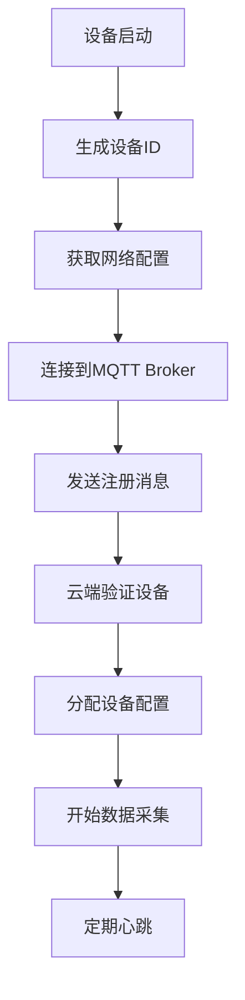
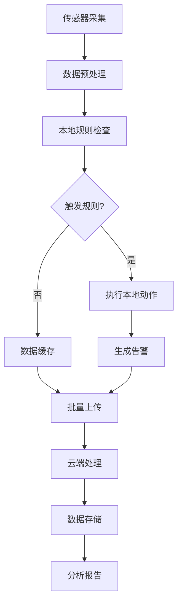

# 物联网 (IoT) - Rust架构指南

## 概述

物联网行业需要处理大量设备连接、实时数据采集、边缘计算和云端协同。Rust的内存安全、并发性能和低资源消耗特性使其成为IoT系统的理想选择。

## 核心挑战

- **设备管理**: 大规模设备连接和管理
- **数据采集**: 实时数据流处理和存储
- **边缘计算**: 本地数据处理和决策
- **网络通信**: 多种协议支持(MQTT, CoAP, HTTP)
- **资源约束**: 低功耗、低内存设备
- **安全性**: 设备认证、数据加密、安全更新

## 技术栈选型

### 核心框架

```toml
[dependencies]
# 异步运行时
tokio = { version = "1.35", features = ["full"] }
async-std = "1.35"

# 网络通信
tokio-mqtt = "0.8"
rumqttc = "0.24"
coap = "0.3"
reqwest = { version = "0.11", features = ["json"] }

# 序列化
serde = { version = "1.0", features = ["derive"] }
serde_json = "1.0"
bincode = "1.3"

# 数据库
sqlx = { version = "0.7", features = ["sqlite", "runtime-tokio-rustls"] }
rusqlite = "0.29"
sled = "0.34"

# 加密和安全
ring = "0.17"
rustls = "0.21"
webpki-roots = "0.25"

# 配置管理
config = "0.14"
toml = "0.8"

# 日志
tracing = "0.1"
tracing-subscriber = "0.3"
log = "0.4"
```

### 行业特定库

```toml
[dependencies]
# 硬件抽象
embedded-hal = "0.2"
cortex-m = "0.7"
cortex-m-rt = "0.7"

# 传感器支持
embedded-sensors = "0.1"
dht-sensor = "0.1"

# 时间处理
chrono = { version = "0.4", features = ["serde"] }
time = "0.3"

# 消息队列
lapin = "2.3"
redis = { version = "0.24", features = ["tokio-comp"] }

# 缓存
moka = "0.12"
```

## 架构模式

### 1. 分层架构

```text
┌─────────────────────────────────────────────────────────────┐
│                    应用层 (Application Layer)                │
│  ┌─────────────┐ ┌─────────────┐ ┌─────────────┐           │
│  │ 设备管理    │ │ 数据处理    │ │ 规则引擎    │           │
│  └─────────────┘ └─────────────┘ └─────────────┘           │
└─────────────────────────────────────────────────────────────┘
┌─────────────────────────────────────────────────────────────┐
│                    服务层 (Service Layer)                   │
│  ┌─────────────┐ ┌─────────────┐ ┌─────────────┐           │
│  │ 通信服务    │ │ 存储服务    │ │ 安全服务    │           │
│  └─────────────┘ └─────────────┘ └─────────────┘           │
└─────────────────────────────────────────────────────────────┘
┌─────────────────────────────────────────────────────────────┐
│                    协议层 (Protocol Layer)                  │
│  ┌─────────────┐ ┌─────────────┐ ┌─────────────┐           │
│  │    MQTT     │ │    CoAP     │ │    HTTP     │           │
│  └─────────────┘ └─────────────┘ └─────────────┘           │
└─────────────────────────────────────────────────────────────┘
┌─────────────────────────────────────────────────────────────┐
│                    硬件层 (Hardware Layer)                  │
│  ┌─────────────┐ ┌─────────────┐ ┌─────────────┐           │
│  │   传感器    │ │   执行器    │ │   通信模块  │           │
│  └─────────────┘ └─────────────┘ └─────────────┘           │
└─────────────────────────────────────────────────────────────┘
```

### 2. 边缘计算架构

```rust
// 边缘节点
pub struct EdgeNode {
    device_manager: DeviceManager,
    data_processor: DataProcessor,
    rule_engine: RuleEngine,
    communication_manager: CommunicationManager,
    local_storage: LocalStorage,
}

impl EdgeNode {
    pub async fn run(&mut self) -> Result<(), EdgeError> {
        loop {
            // 1. 收集设备数据
            let device_data = self.device_manager.collect_data().await?;
            
            // 2. 本地数据处理
            let processed_data = self.data_processor.process(device_data).await?;
            
            // 3. 规则引擎执行
            let actions = self.rule_engine.evaluate(&processed_data).await?;
            
            // 4. 执行本地动作
            self.execute_actions(actions).await?;
            
            // 5. 上传重要数据到云端
            self.upload_to_cloud(processed_data).await?;
            
            // 6. 接收云端指令
            self.receive_cloud_commands().await?;
            
            tokio::time::sleep(Duration::from_secs(1)).await;
        }
    }
}

// 云端服务
pub struct CloudService {
    device_registry: DeviceRegistry,
    data_ingestion: DataIngestion,
    analytics_engine: AnalyticsEngine,
    command_dispatcher: CommandDispatcher,
}

impl CloudService {
    pub async fn run(&mut self) -> Result<(), CloudError> {
        // 1. 接收边缘节点数据
        self.data_ingestion.receive_data().await?;
        
        // 2. 设备状态管理
        self.device_registry.update_status().await?;
        
        // 3. 数据分析
        self.analytics_engine.analyze().await?;
        
        // 4. 发送控制指令
        self.command_dispatcher.dispatch().await?;
        
        Ok(())
    }
}
```

### 3. 事件驱动架构

```rust
// 事件定义
#[derive(Debug, Clone, Serialize, Deserialize)]
pub enum IoTEvent {
    DeviceConnected(DeviceConnectedEvent),
    DeviceDisconnected(DeviceDisconnectedEvent),
    SensorDataReceived(SensorDataEvent),
    AlertTriggered(AlertEvent),
    CommandExecuted(CommandEvent),
}

// 事件处理器
pub trait EventHandler {
    async fn handle(&self, event: &IoTEvent) -> Result<(), EventError>;
}

// 事件总线
pub struct EventBus {
    handlers: HashMap<TypeId, Vec<Box<dyn EventHandler>>>,
}

impl EventBus {
    pub fn new() -> Self {
        Self {
            handlers: HashMap::new(),
        }
    }
    
    pub fn subscribe<T: 'static>(&mut self, handler: Box<dyn EventHandler>) {
        let type_id = TypeId::of::<T>();
        self.handlers.entry(type_id).or_insert_with(Vec::new).push(handler);
    }
    
    pub async fn publish(&self, event: &IoTEvent) -> Result<(), EventError> {
        let type_id = TypeId::of::<IoTEvent>();
        if let Some(handlers) = self.handlers.get(&type_id) {
            for handler in handlers {
                handler.handle(event).await?;
            }
        }
        Ok(())
    }
}
```

## 业务领域建模

### 核心领域概念

```rust
// 设备聚合根
#[derive(Debug, Clone)]
pub struct Device {
    pub id: DeviceId,
    pub name: String,
    pub device_type: DeviceType,
    pub location: Location,
    pub status: DeviceStatus,
    pub capabilities: Vec<Capability>,
    pub configuration: DeviceConfiguration,
    pub last_seen: DateTime<Utc>,
}

// 传感器数据
#[derive(Debug, Clone)]
pub struct SensorData {
    pub id: SensorDataId,
    pub device_id: DeviceId,
    pub sensor_type: SensorType,
    pub value: f64,
    pub unit: String,
    pub timestamp: DateTime<Utc>,
    pub quality: DataQuality,
}

// 规则定义
#[derive(Debug, Clone)]
pub struct Rule {
    pub id: RuleId,
    pub name: String,
    pub conditions: Vec<Condition>,
    pub actions: Vec<Action>,
    pub priority: u32,
    pub enabled: bool,
    pub created_at: DateTime<Utc>,
}

// 告警
#[derive(Debug, Clone)]
pub struct Alert {
    pub id: AlertId,
    pub device_id: DeviceId,
    pub alert_type: AlertType,
    pub severity: AlertSeverity,
    pub message: String,
    pub timestamp: DateTime<Utc>,
    pub acknowledged: bool,
    pub resolved: bool,
}
```

### 值对象

```rust
#[derive(Debug, Clone, PartialEq, Eq, Hash)]
pub struct DeviceId(String);

#[derive(Debug, Clone, PartialEq, Eq, Hash)]
pub struct SensorDataId(String);

#[derive(Debug, Clone, PartialEq, Eq, Hash)]
pub struct RuleId(String);

#[derive(Debug, Clone, PartialEq, Eq, Hash)]
pub struct AlertId(String);

#[derive(Debug, Clone)]
pub struct Location {
    pub latitude: f64,
    pub longitude: f64,
    pub altitude: Option<f64>,
}

#[derive(Debug, Clone)]
pub struct DeviceConfiguration {
    pub sampling_rate: Duration,
    pub threshold_values: HashMap<String, f64>,
    pub communication_interval: Duration,
}
```

## 数据建模

### 数据库设计

```sql
-- 设备表
CREATE TABLE devices (
    id VARCHAR(50) PRIMARY KEY,
    name VARCHAR(100) NOT NULL,
    device_type VARCHAR(50) NOT NULL,
    latitude DECIMAL(10, 8),
    longitude DECIMAL(11, 8),
    altitude DECIMAL(8, 2),
    status VARCHAR(20) NOT NULL,
    capabilities JSON,
    configuration JSON,
    last_seen TIMESTAMP WITH TIME ZONE,
    created_at TIMESTAMP WITH TIME ZONE NOT NULL,
    updated_at TIMESTAMP WITH TIME ZONE NOT NULL
);

-- 传感器数据表
CREATE TABLE sensor_data (
    id VARCHAR(50) PRIMARY KEY,
    device_id VARCHAR(50) NOT NULL,
    sensor_type VARCHAR(50) NOT NULL,
    value DECIMAL(15, 6) NOT NULL,
    unit VARCHAR(20) NOT NULL,
    timestamp TIMESTAMP WITH TIME ZONE NOT NULL,
    quality VARCHAR(20) NOT NULL,
    created_at TIMESTAMP WITH TIME ZONE NOT NULL,
    FOREIGN KEY (device_id) REFERENCES devices(id)
);

-- 规则表
CREATE TABLE rules (
    id VARCHAR(50) PRIMARY KEY,
    name VARCHAR(100) NOT NULL,
    conditions JSON NOT NULL,
    actions JSON NOT NULL,
    priority INTEGER NOT NULL DEFAULT 0,
    enabled BOOLEAN NOT NULL DEFAULT true,
    created_at TIMESTAMP WITH TIME ZONE NOT NULL,
    updated_at TIMESTAMP WITH TIME ZONE NOT NULL
);

-- 告警表
CREATE TABLE alerts (
    id VARCHAR(50) PRIMARY KEY,
    device_id VARCHAR(50) NOT NULL,
    alert_type VARCHAR(50) NOT NULL,
    severity VARCHAR(20) NOT NULL,
    message TEXT NOT NULL,
    timestamp TIMESTAMP WITH TIME ZONE NOT NULL,
    acknowledged BOOLEAN NOT NULL DEFAULT false,
    resolved BOOLEAN NOT NULL DEFAULT false,
    created_at TIMESTAMP WITH TIME ZONE NOT NULL,
    FOREIGN KEY (device_id) REFERENCES devices(id)
);
```

### 时间序列数据存储

```rust
// 时间序列数据库接口
pub trait TimeSeriesDB {
    async fn insert_data(&self, data: &SensorData) -> Result<(), DBError>;
    async fn query_data(
        &self,
        device_id: &DeviceId,
        sensor_type: &SensorType,
        start_time: DateTime<Utc>,
        end_time: DateTime<Utc>,
    ) -> Result<Vec<SensorData>, DBError>;
    async fn aggregate_data(
        &self,
        device_id: &DeviceId,
        sensor_type: &SensorType,
        aggregation: AggregationType,
        interval: Duration,
        start_time: DateTime<Utc>,
        end_time: DateTime<Utc>,
    ) -> Result<Vec<AggregatedData>, DBError>;
}

// InfluxDB实现
pub struct InfluxDB {
    client: influxdb::Client,
    database: String,
}

#[async_trait]
impl TimeSeriesDB for InfluxDB {
    async fn insert_data(&self, data: &SensorData) -> Result<(), DBError> {
        let point = influxdb::Point::new("sensor_data")
            .tag("device_id", data.device_id.to_string())
            .tag("sensor_type", data.sensor_type.to_string())
            .field("value", data.value)
            .field("unit", data.unit.clone())
            .field("quality", data.quality.to_string())
            .timestamp(data.timestamp.timestamp_nanos());
        
        self.client.query(&influxdb::Query::write_query(
            influxdb::Type::Write,
            &self.database,
            point,
        )).await?;
        
        Ok(())
    }
    
    async fn query_data(
        &self,
        device_id: &DeviceId,
        sensor_type: &SensorType,
        start_time: DateTime<Utc>,
        end_time: DateTime<Utc>,
    ) -> Result<Vec<SensorData>, DBError> {
        let query = format!(
            "SELECT * FROM sensor_data WHERE device_id = '{}' AND sensor_type = '{}' AND time >= {} AND time <= {}",
            device_id, sensor_type, start_time.timestamp_nanos(), end_time.timestamp_nanos()
        );
        
        let result = self.client.query(&influxdb::Query::raw_read_query(query)).await?;
        // 解析结果...
        Ok(vec![])
    }
}
```

## 流程建模

### 设备注册流程



### 数据处理流程



## 组件建模

### 设备管理器

```rust
pub struct DeviceManager {
    devices: HashMap<DeviceId, Device>,
    device_repository: Box<dyn DeviceRepository>,
    communication_manager: Box<dyn CommunicationManager>,
    event_bus: Arc<EventBus>,
}

impl DeviceManager {
    pub async fn register_device(&mut self, device_info: DeviceInfo) -> Result<DeviceId, DeviceError> {
        let device_id = DeviceId::generate();
        let device = Device {
            id: device_id.clone(),
            name: device_info.name,
            device_type: device_info.device_type,
            location: device_info.location,
            status: DeviceStatus::Online,
            capabilities: device_info.capabilities,
            configuration: device_info.configuration,
            last_seen: Utc::now(),
        };
        
        self.device_repository.save(&device).await?;
        self.devices.insert(device_id.clone(), device.clone());
        
        // 发布设备连接事件
        let event = IoTEvent::DeviceConnected(DeviceConnectedEvent {
            device_id: device_id.clone(),
            timestamp: Utc::now(),
        });
        self.event_bus.publish(&event).await?;
        
        Ok(device_id)
    }
    
    pub async fn update_device_status(&mut self, device_id: &DeviceId, status: DeviceStatus) -> Result<(), DeviceError> {
        if let Some(device) = self.devices.get_mut(device_id) {
            device.status = status;
            device.last_seen = Utc::now();
            self.device_repository.save(device).await?;
        }
        Ok(())
    }
    
    pub async fn collect_data(&self) -> Result<Vec<SensorData>, DeviceError> {
        let mut all_data = Vec::new();
        
        for device in self.devices.values() {
            if device.status == DeviceStatus::Online {
                let device_data = self.communication_manager.read_sensors(device).await?;
                all_data.extend(device_data);
            }
        }
        
        Ok(all_data)
    }
}
```

### 数据处理引擎

```rust
pub struct DataProcessor {
    filters: Vec<Box<dyn DataFilter>>,
    transformers: Vec<Box<dyn DataTransformer>>,
    validators: Vec<Box<dyn DataValidator>>,
    storage: Box<dyn TimeSeriesDB>,
}

impl DataProcessor {
    pub async fn process(&self, raw_data: Vec<SensorData>) -> Result<Vec<SensorData>, ProcessingError> {
        let mut processed_data = raw_data;
        
        // 1. 数据过滤
        for filter in &self.filters {
            processed_data = filter.filter(processed_data).await?;
        }
        
        // 2. 数据转换
        for transformer in &self.transformers {
            processed_data = transformer.transform(processed_data).await?;
        }
        
        // 3. 数据验证
        for validator in &self.validators {
            processed_data = validator.validate(processed_data).await?;
        }
        
        // 4. 数据存储
        for data in &processed_data {
            self.storage.insert_data(data).await?;
        }
        
        Ok(processed_data)
    }
}

// 数据过滤器
pub trait DataFilter {
    async fn filter(&self, data: Vec<SensorData>) -> Result<Vec<SensorData>, ProcessingError>;
}

// 异常值过滤器
pub struct OutlierFilter {
    threshold: f64,
}

#[async_trait]
impl DataFilter for OutlierFilter {
    async fn filter(&self, data: Vec<SensorData>) -> Result<Vec<SensorData>, ProcessingError> {
        let filtered: Vec<SensorData> = data
            .into_iter()
            .filter(|d| d.value.abs() <= self.threshold)
            .collect();
        Ok(filtered)
    }
}
```

### 规则引擎

```rust
pub struct RuleEngine {
    rules: Vec<Rule>,
    rule_repository: Box<dyn RuleRepository>,
    action_executor: Box<dyn ActionExecutor>,
}

impl RuleEngine {
    pub async fn evaluate(&self, data: &[SensorData]) -> Result<Vec<Action>, RuleError> {
        let mut actions = Vec::new();
        
        for rule in &self.rules {
            if !rule.enabled {
                continue;
            }
            
            if self.evaluate_conditions(rule, data).await? {
                actions.extend(rule.actions.clone());
            }
        }
        
        // 按优先级排序
        actions.sort_by(|a, b| b.priority.cmp(&a.priority));
        
        Ok(actions)
    }
    
    async fn evaluate_conditions(&self, rule: &Rule, data: &[SensorData]) -> Result<bool, RuleError> {
        for condition in &rule.conditions {
            if !self.evaluate_condition(condition, data).await? {
                return Ok(false);
            }
        }
        Ok(true)
    }
    
    async fn evaluate_condition(&self, condition: &Condition, data: &[SensorData]) -> Result<bool, RuleError> {
        match condition {
            Condition::Threshold { sensor_type, operator, value } => {
                if let Some(sensor_data) = data.iter().find(|d| d.sensor_type == *sensor_type) {
                    match operator {
                        Operator::GreaterThan => Ok(sensor_data.value > *value),
                        Operator::LessThan => Ok(sensor_data.value < *value),
                        Operator::Equals => Ok(sensor_data.value == *value),
                    }
                } else {
                    Ok(false)
                }
            }
            Condition::TimeRange { start, end } => {
                let now = Utc::now();
                Ok(now >= *start && now <= *end)
            }
        }
    }
    
    pub async fn execute_actions(&self, actions: Vec<Action>) -> Result<(), RuleError> {
        for action in actions {
            self.action_executor.execute(action).await?;
        }
        Ok(())
    }
}
```

## 通信协议

### MQTT客户端

```rust
pub struct MQTTClient {
    client: rumqttc::AsyncClient,
    event_loop: rumqttc::EventLoop,
    config: MQTTConfig,
}

impl MQTTClient {
    pub async fn new(config: MQTTConfig) -> Result<Self, MQTTError> {
        let (client, event_loop) = rumqttc::AsyncClient::new(
            rumqttc::Config::default()
                .broker(&config.broker)
                .port(config.port)
                .client_id(&config.client_id)
                .credentials(&config.username, &config.password),
            100,
        );
        
        Ok(Self {
            client,
            event_loop,
            config,
        })
    }
    
    pub async fn connect(&mut self) -> Result<(), MQTTError> {
        self.client.connect().await?;
        
        // 订阅主题
        for topic in &self.config.subscribe_topics {
            self.client.subscribe(topic, rumqttc::QoS::AtLeastOnce).await?;
        }
        
        Ok(())
    }
    
    pub async fn publish(&mut self, topic: &str, payload: &[u8]) -> Result<(), MQTTError> {
        self.client.publish(topic, rumqttc::QoS::AtLeastOnce, false, payload).await?;
        Ok(())
    }
    
    pub async fn receive_messages(&mut self) -> Result<Vec<Message>, MQTTError> {
        let mut messages = Vec::new();
        
        loop {
            match self.event_loop.poll().await {
                Ok(rumqttc::Event::Incoming(rumqttc::Packet::Publish(publish))) => {
                    messages.push(Message {
                        topic: publish.topic,
                        payload: publish.payload.to_vec(),
                    });
                }
                Ok(_) => continue,
                Err(e) => return Err(MQTTError::ConnectionError(e)),
            }
            
            if messages.len() >= 10 {
                break;
            }
        }
        
        Ok(messages)
    }
}
```

### CoAP客户端

```rust
pub struct CoAPClient {
    client: coap::CoAPClient,
    config: CoAPConfig,
}

impl CoAPClient {
    pub fn new(config: CoAPConfig) -> Self {
        let client = coap::CoAPClient::new().unwrap();
        
        Self {
            client,
            config,
        }
    }
    
    pub async fn get(&self, path: &str) -> Result<Vec<u8>, CoAPError> {
        let request = coap::CoAPRequest::new();
        request.set_method(coap::Method::Get);
        request.set_path(path);
        
        let response = self.client.send(&request).await?;
        Ok(response.message.payload)
    }
    
    pub async fn post(&self, path: &str, payload: &[u8]) -> Result<Vec<u8>, CoAPError> {
        let mut request = coap::CoAPRequest::new();
        request.set_method(coap::Method::Post);
        request.set_path(path);
        request.message.payload = payload.to_vec();
        
        let response = self.client.send(&request).await?;
        Ok(response.message.payload)
    }
}
```

## 安全机制

### 设备认证

```rust
pub struct DeviceAuthenticator {
    certificate_store: CertificateStore,
    token_validator: TokenValidator,
}

impl DeviceAuthenticator {
    pub async fn authenticate_device(&self, credentials: &DeviceCredentials) -> Result<DeviceToken, AuthError> {
        // 1. 验证设备证书
        let certificate = self.certificate_store.get_certificate(&credentials.device_id).await?;
        self.verify_certificate(&certificate, &credentials.signature)?;
        
        // 2. 生成访问令牌
        let token = self.generate_token(&credentials.device_id).await?;
        
        Ok(token)
    }
    
    pub async fn validate_token(&self, token: &DeviceToken) -> Result<bool, AuthError> {
        self.token_validator.validate(token).await
    }
    
    fn verify_certificate(&self, certificate: &Certificate, signature: &[u8]) -> Result<(), AuthError> {
        // 证书验证逻辑
        Ok(())
    }
    
    async fn generate_token(&self, device_id: &DeviceId) -> Result<DeviceToken, AuthError> {
        // 令牌生成逻辑
        Ok(DeviceToken::new(device_id))
    }
}
```

### 数据加密

```rust
pub struct DataEncryptor {
    encryption_key: Vec<u8>,
}

impl DataEncryptor {
    pub fn new(key: Vec<u8>) -> Self {
        Self {
            encryption_key: key,
        }
    }
    
    pub fn encrypt(&self, data: &[u8]) -> Result<Vec<u8>, EncryptionError> {
        use ring::aead;
        
        let key = aead::UnboundKey::new(&aead::AES_256_GCM, &self.encryption_key)?;
        let nonce = aead::Nonce::assume_unique_for_key([0u8; 12]);
        let aad = aead::Aad::empty();
        
        let mut ciphertext = data.to_vec();
        let tag = aead::seal_in_place_separate_tag(&key, nonce, aad, &mut ciphertext)?;
        
        ciphertext.extend_from_slice(tag.as_ref());
        Ok(ciphertext)
    }
    
    pub fn decrypt(&self, ciphertext: &[u8]) -> Result<Vec<u8>, EncryptionError> {
        use ring::aead;
        
        let key = aead::UnboundKey::new(&aead::AES_256_GCM, &self.encryption_key)?;
        let nonce = aead::Nonce::assume_unique_for_key([0u8; 12]);
        let aad = aead::Aad::empty();
        
        let mut plaintext = ciphertext.to_vec();
        let plaintext_len = aead::open_in_place(&key, nonce, aad, &mut plaintext)?;
        
        plaintext.truncate(plaintext_len);
        Ok(plaintext)
    }
}
```

## 性能优化

### 数据压缩

```rust
use flate2::write::GzEncoder;
use flate2::Compression;

pub struct DataCompressor;

impl DataCompressor {
    pub fn compress(&self, data: &[u8]) -> Result<Vec<u8>, CompressionError> {
        let mut encoder = GzEncoder::new(Vec::new(), Compression::default());
        encoder.write_all(data)?;
        Ok(encoder.finish()?)
    }
    
    pub fn decompress(&self, compressed_data: &[u8]) -> Result<Vec<u8>, CompressionError> {
        use flate2::read::GzDecoder;
        use std::io::Read;
        
        let mut decoder = GzDecoder::new(compressed_data);
        let mut decompressed = Vec::new();
        decoder.read_to_end(&mut decompressed)?;
        Ok(decompressed)
    }
}
```

### 批量处理

```rust
pub struct BatchProcessor {
    batch_size: usize,
    batch_timeout: Duration,
    current_batch: Vec<SensorData>,
    last_flush: Instant,
}

impl BatchProcessor {
    pub fn new(batch_size: usize, batch_timeout: Duration) -> Self {
        Self {
            batch_size,
            batch_timeout,
            current_batch: Vec::new(),
            last_flush: Instant::now(),
        }
    }
    
    pub async fn add_data(&mut self, data: SensorData) -> Result<Option<Vec<SensorData>>, ProcessingError> {
        self.current_batch.push(data);
        
        // 检查是否需要刷新批次
        if self.current_batch.len() >= self.batch_size || 
           self.last_flush.elapsed() >= self.batch_timeout {
            let batch = std::mem::take(&mut self.current_batch);
            self.last_flush = Instant::now();
            Ok(Some(batch))
        } else {
            Ok(None)
        }
    }
}
```

## 测试策略

### 单元测试

```rust
#[cfg(test)]
mod tests {
    use super::*;
    
    #[tokio::test]
    async fn test_device_registration() {
        let mut device_manager = create_test_device_manager().await;
        
        let device_info = DeviceInfo {
            name: "Test Device".to_string(),
            device_type: DeviceType::Sensor,
            location: Location::new(0.0, 0.0),
            capabilities: vec![Capability::Temperature],
            configuration: DeviceConfiguration::default(),
        };
        
        let device_id = device_manager.register_device(device_info).await.unwrap();
        assert!(device_manager.devices.contains_key(&device_id));
    }
    
    #[tokio::test]
    async fn test_data_processing() {
        let processor = create_test_data_processor().await;
        
        let raw_data = vec![
            SensorData::new(DeviceId::new(), SensorType::Temperature, 25.5, "°C"),
            SensorData::new(DeviceId::new(), SensorType::Humidity, 60.0, "%"),
        ];
        
        let processed = processor.process(raw_data).await.unwrap();
        assert_eq!(processed.len(), 2);
    }
}
```

### 集成测试

```rust
#[cfg(test)]
mod integration_tests {
    use super::*;
    
    #[tokio::test]
    async fn test_end_to_end_data_flow() {
        // 设置测试环境
        let mut edge_node = create_test_edge_node().await;
        let cloud_service = create_test_cloud_service().await;
        
        // 模拟设备数据
        let test_data = create_test_sensor_data();
        
        // 执行端到端测试
        edge_node.process_data(test_data).await.unwrap();
        
        // 验证数据到达云端
        let cloud_data = cloud_service.get_latest_data().await.unwrap();
        assert!(!cloud_data.is_empty());
    }
}
```

## 部署和运维

### 容器化部署

```dockerfile
# Dockerfile for IoT Edge Node
FROM rust:1.75 as builder
WORKDIR /app
COPY . .
RUN cargo build --release

FROM debian:bullseye-slim
RUN apt-get update && apt-get install -y \
    ca-certificates \
    && rm -rf /var/lib/apt/lists/*
    
WORKDIR /app
COPY --from=builder /app/target/release/iot-edge-node .
COPY config/ config/

EXPOSE 8080
CMD ["./iot-edge-node"]
```

### 配置管理

```toml
# config.toml
[device]
id = "edge-node-001"
name = "Edge Node 1"
location = { latitude = 40.7128, longitude = -74.0060 }

[communication]
mqtt_broker = "mqtt.example.com"
mqtt_port = 1883
mqtt_client_id = "edge-node-001"
mqtt_username = "edge_user"
mqtt_password = "edge_pass"

[storage]
database_url = "sqlite:///data/iot.db"
time_series_db = "influxdb://localhost:8086/iot"

[security]
certificate_path = "/etc/ssl/certs/device.crt"
private_key_path = "/etc/ssl/private/device.key"
encryption_key = "your-encryption-key"

[processing]
batch_size = 100
batch_timeout_seconds = 60
sampling_rate_seconds = 1
```

## 总结

物联网行业的Rust架构需要特别关注：

1. **设备管理**: 大规模设备连接、状态监控、配置管理
2. **数据处理**: 实时流处理、边缘计算、数据压缩
3. **通信协议**: MQTT、CoAP、HTTP多协议支持
4. **安全性**: 设备认证、数据加密、安全更新
5. **性能优化**: 低资源消耗、批量处理、缓存策略

通过遵循这些设计原则和最佳实践，可以构建出高效、安全、可靠的物联网系统。
