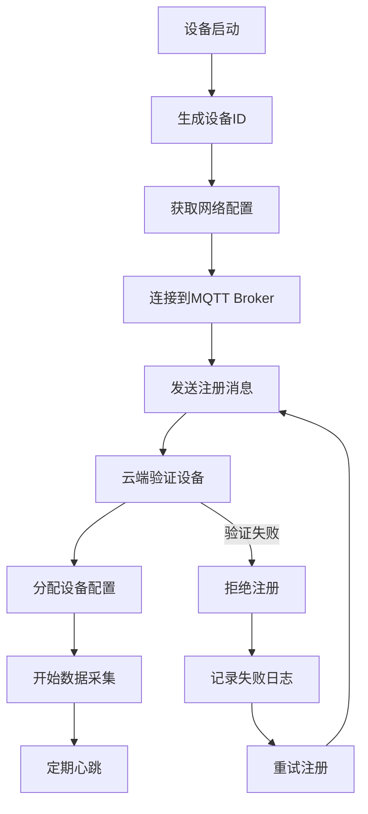
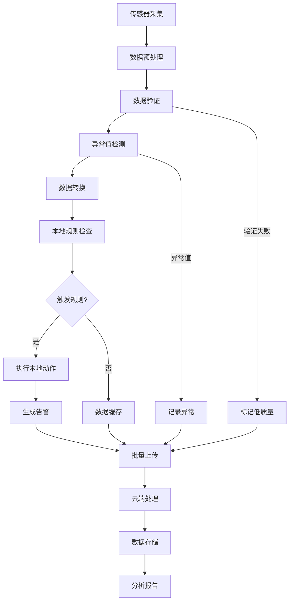
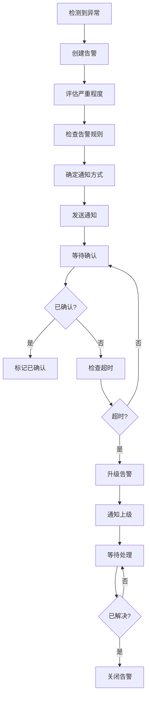

# 物联网行业 - 业务建模详解

## 概述

本文档详细描述了物联网行业的业务建模，包括业务流程、数据建模、流程建模和概念建模，为Rust IoT架构设计提供业务基础。

## 1. 业务概念建模

### 1.1 核心业务概念

#### 设备聚合根

```rust
#[derive(Debug, Clone)]
pub struct Device {
    pub id: DeviceId,
    pub name: String,
    pub device_type: DeviceType,
    pub model: String,
    pub manufacturer: String,
    pub serial_number: String,
    pub firmware_version: String,
    pub hardware_version: String,
    pub location: Location,
    pub status: DeviceStatus,
    pub capabilities: Vec<Capability>,
    pub configuration: DeviceConfiguration,
    pub last_seen: DateTime<Utc>,
    pub created_at: DateTime<Utc>,
    pub updated_at: DateTime<Utc>,
}

#[derive(Debug, Clone)]
pub struct Location {
    pub latitude: f64,
    pub longitude: f64,
    pub altitude: Option<f64>,
    pub address: Option<String>,
    pub zone: Option<String>,
}

#[derive(Debug, Clone)]
pub struct DeviceConfiguration {
    pub sampling_rate: Duration,
    pub reporting_interval: Duration,
    pub threshold_values: HashMap<String, f64>,
    pub alarm_settings: AlarmSettings,
    pub communication_settings: CommunicationSettings,
}

#[derive(Debug, Clone)]
pub struct AlarmSettings {
    pub enabled: bool,
    pub thresholds: HashMap<String, AlarmThreshold>,
    pub notification_channels: Vec<NotificationChannel>,
}

#[derive(Debug, Clone)]
pub struct AlarmThreshold {
    pub min_value: Option<f64>,
    pub max_value: Option<f64>,
    pub severity: AlarmSeverity,
    pub enabled: bool,
}

impl Device {
    pub fn new(
        name: String,
        device_type: DeviceType,
        model: String,
        manufacturer: String,
        serial_number: String,
        location: Location,
    ) -> Self {
        Self {
            id: DeviceId::generate(),
            name,
            device_type,
            model,
            manufacturer,
            serial_number,
            firmware_version: "1.0.0".to_string(),
            hardware_version: "1.0".to_string(),
            location,
            status: DeviceStatus::Offline,
            capabilities: Vec::new(),
            configuration: DeviceConfiguration::default(),
            last_seen: Utc::now(),
            created_at: Utc::now(),
            updated_at: Utc::now(),
        }
    }
    
    pub fn update_status(&mut self, status: DeviceStatus) {
        self.status = status;
        self.updated_at = Utc::now();
    }
    
    pub fn update_location(&mut self, location: Location) {
        self.location = location;
        self.updated_at = Utc::now();
    }
    
    pub fn update_firmware(&mut self, version: String) {
        self.firmware_version = version;
        self.updated_at = Utc::now();
    }
    
    pub fn is_online(&self) -> bool {
        self.status == DeviceStatus::Online
    }
    
    pub fn is_healthy(&self) -> bool {
        self.status == DeviceStatus::Online && 
        self.last_seen > Utc::now() - Duration::from_secs(300) // 5分钟内活跃
    }
    
    pub fn add_capability(&mut self, capability: Capability) {
        if !self.capabilities.iter().any(|c| c.name == capability.name) {
            self.capabilities.push(capability);
            self.updated_at = Utc::now();
        }
    }
}
```

#### 传感器数据聚合根

```rust
#[derive(Debug, Clone)]
pub struct SensorData {
    pub id: SensorDataId,
    pub device_id: DeviceId,
    pub sensor_type: SensorType,
    pub value: f64,
    pub unit: String,
    pub timestamp: DateTime<Utc>,
    pub quality: DataQuality,
    pub metadata: SensorMetadata,
}

#[derive(Debug, Clone)]
pub struct SensorMetadata {
    pub accuracy: Option<f64>,
    pub precision: Option<u32>,
    pub calibration_date: Option<DateTime<Utc>>,
    pub environmental_conditions: HashMap<String, f64>,
    pub processing_steps: Vec<String>,
}

impl SensorData {
    pub fn new(
        device_id: DeviceId,
        sensor_type: SensorType,
        value: f64,
        unit: String,
    ) -> Self {
        Self {
            id: SensorDataId::generate(),
            device_id,
            sensor_type,
            value,
            unit,
            timestamp: Utc::now(),
            quality: DataQuality::Good,
            metadata: SensorMetadata::default(),
        }
    }
    
    pub fn is_valid(&self) -> bool {
        self.quality != DataQuality::Invalid && 
        !self.value.is_nan() && 
        !self.value.is_infinite()
    }
    
    pub fn is_outlier(&self, threshold: f64) -> bool {
        self.value.abs() > threshold
    }
    
    pub fn add_environmental_condition(&mut self, key: String, value: f64) {
        self.metadata.environmental_conditions.insert(key, value);
    }
    
    pub fn add_processing_step(&mut self, step: String) {
        self.metadata.processing_steps.push(step);
    }
}
```

#### 告警聚合根

```rust
#[derive(Debug, Clone)]
pub struct Alert {
    pub id: AlertId,
    pub device_id: DeviceId,
    pub alert_type: AlertType,
    pub severity: AlertSeverity,
    pub message: String,
    pub timestamp: DateTime<Utc>,
    pub acknowledged: bool,
    pub acknowledged_by: Option<UserId>,
    pub acknowledged_at: Option<DateTime<Utc>>,
    pub resolved: bool,
    pub resolved_at: Option<DateTime<Utc>>,
    pub resolution_notes: Option<String>,
    pub metadata: AlertMetadata,
}

#[derive(Debug, Clone)]
pub struct AlertMetadata {
    pub sensor_data: Option<SensorData>,
    pub threshold_values: HashMap<String, f64>,
    pub context_data: HashMap<String, String>,
    pub escalation_level: u32,
}

impl Alert {
    pub fn new(
        device_id: DeviceId,
        alert_type: AlertType,
        severity: AlertSeverity,
        message: String,
    ) -> Self {
        Self {
            id: AlertId::generate(),
            device_id,
            alert_type,
            severity,
            message,
            timestamp: Utc::now(),
            acknowledged: false,
            acknowledged_by: None,
            acknowledged_at: None,
            resolved: false,
            resolved_at: None,
            resolution_notes: None,
            metadata: AlertMetadata::default(),
        }
    }
    
    pub fn acknowledge(&mut self, user_id: UserId) {
        self.acknowledged = true;
        self.acknowledged_by = Some(user_id);
        self.acknowledged_at = Some(Utc::now());
    }
    
    pub fn resolve(&mut self, notes: Option<String>) {
        self.resolved = true;
        self.resolved_at = Some(Utc::now());
        self.resolution_notes = notes;
    }
    
    pub fn is_active(&self) -> bool {
        !self.resolved
    }
    
    pub fn requires_escalation(&self) -> bool {
        self.severity == AlertSeverity::Critical && 
        !self.acknowledged && 
        self.timestamp < Utc::now() - Duration::from_secs(300) // 5分钟未处理
    }
}
```

### 1.2 值对象

```rust
#[derive(Debug, Clone, PartialEq, Eq, Hash)]
pub struct DeviceId(String);

impl DeviceId {
    pub fn new(id: String) -> Self {
        Self(id)
    }
    
    pub fn generate() -> Self {
        Self(uuid::Uuid::new_v4().to_string())
    }
    
    pub fn as_str(&self) -> &str {
        &self.0
    }
}

#[derive(Debug, Clone, PartialEq, Eq, Hash)]
pub struct SensorDataId(String);

impl SensorDataId {
    pub fn generate() -> Self {
        Self(uuid::Uuid::new_v4().to_string())
    }
}

#[derive(Debug, Clone, PartialEq, Eq, Hash)]
pub struct AlertId(String);

impl AlertId {
    pub fn generate() -> Self {
        Self(uuid::Uuid::new_v4().to_string())
    }
}

#[derive(Debug, Clone, PartialEq, Eq)]
pub enum DeviceType {
    Sensor,
    Actuator,
    Gateway,
    Controller,
    Camera,
    Display,
}

#[derive(Debug, Clone, PartialEq, Eq)]
pub enum DeviceStatus {
    Online,
    Offline,
    Maintenance,
    Error,
    Disabled,
}

#[derive(Debug, Clone, PartialEq, Eq)]
pub enum SensorType {
    Temperature,
    Humidity,
    Pressure,
    Light,
    Motion,
    Sound,
    Gas,
    Vibration,
    Custom(String),
}

#[derive(Debug, Clone, PartialEq, Eq)]
pub enum DataQuality {
    Excellent,
    Good,
    Fair,
    Poor,
    Invalid,
}

#[derive(Debug, Clone, PartialEq, Eq)]
pub enum AlertType {
    ThresholdExceeded,
    DeviceOffline,
    DataAnomaly,
    MaintenanceRequired,
    SecurityBreach,
    Custom(String),
}

#[derive(Debug, Clone, PartialEq, Eq)]
pub enum AlertSeverity {
    Info,
    Warning,
    Error,
    Critical,
}
```

## 2. 数据建模

### 2.1 数据库设计

#### 设备表

```sql
-- 设备表
CREATE TABLE devices (
    id UUID PRIMARY KEY,
    name VARCHAR(100) NOT NULL,
    device_type VARCHAR(50) NOT NULL,
    model VARCHAR(100) NOT NULL,
    manufacturer VARCHAR(100) NOT NULL,
    serial_number VARCHAR(100) NOT NULL UNIQUE,
    firmware_version VARCHAR(20) NOT NULL,
    hardware_version VARCHAR(20) NOT NULL,
    latitude DECIMAL(10, 8),
    longitude DECIMAL(11, 8),
    altitude DECIMAL(8, 2),
    address TEXT,
    zone VARCHAR(100),
    status VARCHAR(20) NOT NULL DEFAULT 'offline',
    sampling_rate_seconds INTEGER NOT NULL DEFAULT 60,
    reporting_interval_seconds INTEGER NOT NULL DEFAULT 300,
    threshold_values JSONB,
    alarm_settings JSONB,
    communication_settings JSONB,
    last_seen TIMESTAMP WITH TIME ZONE,
    created_at TIMESTAMP WITH TIME ZONE NOT NULL,
    updated_at TIMESTAMP WITH TIME ZONE NOT NULL,
    
    CONSTRAINT chk_device_type CHECK (device_type IN ('sensor', 'actuator', 'gateway', 'controller', 'camera', 'display')),
    CONSTRAINT chk_device_status CHECK (status IN ('online', 'offline', 'maintenance', 'error', 'disabled')),
    CONSTRAINT chk_sampling_rate CHECK (sampling_rate_seconds > 0),
    CONSTRAINT chk_reporting_interval CHECK (reporting_interval_seconds > 0)
);

-- 设备能力表
CREATE TABLE device_capabilities (
    id UUID PRIMARY KEY,
    device_id UUID NOT NULL,
    capability_name VARCHAR(100) NOT NULL,
    capability_type VARCHAR(50) NOT NULL,
    parameters JSONB,
    created_at TIMESTAMP WITH TIME ZONE NOT NULL,
    
    CONSTRAINT fk_device_capabilities_device FOREIGN KEY (device_id) REFERENCES devices(id),
    UNIQUE(device_id, capability_name)
);

-- 设备索引
CREATE INDEX idx_devices_status ON devices(status);
CREATE INDEX idx_devices_type ON devices(device_type);
CREATE INDEX idx_devices_location ON devices(latitude, longitude);
CREATE INDEX idx_devices_last_seen ON devices(last_seen);
```

#### 传感器数据表

```sql
-- 传感器数据表
CREATE TABLE sensor_data (
    id UUID PRIMARY KEY,
    device_id UUID NOT NULL,
    sensor_type VARCHAR(50) NOT NULL,
    value DECIMAL(15, 6) NOT NULL,
    unit VARCHAR(20) NOT NULL,
    timestamp TIMESTAMP WITH TIME ZONE NOT NULL,
    quality VARCHAR(20) NOT NULL DEFAULT 'good',
    accuracy DECIMAL(10, 6),
    precision INTEGER,
    calibration_date TIMESTAMP WITH TIME ZONE,
    environmental_conditions JSONB,
    processing_steps TEXT[],
    created_at TIMESTAMP WITH TIME ZONE NOT NULL,
    
    CONSTRAINT fk_sensor_data_device FOREIGN KEY (device_id) REFERENCES devices(id),
    CONSTRAINT chk_sensor_quality CHECK (quality IN ('excellent', 'good', 'fair', 'poor', 'invalid'))
);

-- 传感器数据索引
CREATE INDEX idx_sensor_data_device_id ON sensor_data(device_id);
CREATE INDEX idx_sensor_data_timestamp ON sensor_data(timestamp);
CREATE INDEX idx_sensor_data_sensor_type ON sensor_data(sensor_type);
CREATE INDEX idx_sensor_data_quality ON sensor_data(quality);

-- 时间序列分区表（按月分区）
CREATE TABLE sensor_data_partitioned (
    LIKE sensor_data INCLUDING ALL
) PARTITION BY RANGE (timestamp);

-- 创建分区
CREATE TABLE sensor_data_2024_01 PARTITION OF sensor_data_partitioned
    FOR VALUES FROM ('2024-01-01') TO ('2024-02-01');

CREATE TABLE sensor_data_2024_02 PARTITION OF sensor_data_partitioned
    FOR VALUES FROM ('2024-02-01') TO ('2024-03-01');
```

#### 告警表

```sql
-- 告警表
CREATE TABLE alerts (
    id UUID PRIMARY KEY,
    device_id UUID NOT NULL,
    alert_type VARCHAR(50) NOT NULL,
    severity VARCHAR(20) NOT NULL,
    message TEXT NOT NULL,
    timestamp TIMESTAMP WITH TIME ZONE NOT NULL,
    acknowledged BOOLEAN NOT NULL DEFAULT false,
    acknowledged_by UUID,
    acknowledged_at TIMESTAMP WITH TIME ZONE,
    resolved BOOLEAN NOT NULL DEFAULT false,
    resolved_at TIMESTAMP WITH TIME ZONE,
    resolution_notes TEXT,
    sensor_data_id UUID,
    threshold_values JSONB,
    context_data JSONB,
    escalation_level INTEGER NOT NULL DEFAULT 0,
    created_at TIMESTAMP WITH TIME ZONE NOT NULL,
    
    CONSTRAINT fk_alerts_device FOREIGN KEY (device_id) REFERENCES devices(id),
    CONSTRAINT fk_alerts_sensor_data FOREIGN KEY (sensor_data_id) REFERENCES sensor_data(id),
    CONSTRAINT chk_alert_severity CHECK (severity IN ('info', 'warning', 'error', 'critical')),
    CONSTRAINT chk_escalation_level CHECK (escalation_level >= 0 AND escalation_level <= 5)
);

-- 告警索引
CREATE INDEX idx_alerts_device_id ON alerts(device_id);
CREATE INDEX idx_alerts_timestamp ON alerts(timestamp);
CREATE INDEX idx_alerts_severity ON alerts(severity);
CREATE INDEX idx_alerts_acknowledged ON alerts(acknowledged);
CREATE INDEX idx_alerts_resolved ON alerts(resolved);
CREATE INDEX idx_alerts_active ON alerts(acknowledged, resolved) WHERE NOT resolved;
```

### 2.2 仓储模式实现

```rust
pub trait DeviceRepository {
    async fn save(&self, device: &Device) -> Result<(), RepositoryError>;
    async fn find_by_id(&self, id: &DeviceId) -> Result<Option<Device>, RepositoryError>;
    async fn find_by_status(&self, status: &DeviceStatus) -> Result<Vec<Device>, RepositoryError>;
    async fn find_by_type(&self, device_type: &DeviceType) -> Result<Vec<Device>, RepositoryError>;
    async fn find_nearby(&self, location: &Location, radius_km: f64) -> Result<Vec<Device>, RepositoryError>;
    async fn update_status(&self, device_id: &DeviceId, status: DeviceStatus) -> Result<(), RepositoryError>;
}

pub struct PostgresDeviceRepository {
    pool: PgPool,
}

#[async_trait]
impl DeviceRepository for PostgresDeviceRepository {
    async fn save(&self, device: &Device) -> Result<(), RepositoryError> {
        sqlx::query!(
            r#"
            INSERT INTO devices (
                id, name, device_type, model, manufacturer, serial_number,
                firmware_version, hardware_version, latitude, longitude, altitude,
                address, zone, status, sampling_rate_seconds, reporting_interval_seconds,
                threshold_values, alarm_settings, communication_settings,
                last_seen, created_at, updated_at
            )
            VALUES ($1, $2, $3, $4, $5, $6, $7, $8, $9, $10, $11, $12, $13, $14, $15, $16, $17, $18, $19, $20, $21, $22)
            ON CONFLICT (id) DO UPDATE SET
                name = $2, device_type = $3, model = $4, manufacturer = $5,
                firmware_version = $7, hardware_version = $8, latitude = $9, longitude = $10,
                altitude = $11, address = $12, zone = $13, status = $14,
                sampling_rate_seconds = $15, reporting_interval_seconds = $16,
                threshold_values = $17, alarm_settings = $18, communication_settings = $19,
                last_seen = $20, updated_at = $22
            "#,
            device.id.as_str(),
            device.name,
            device.device_type.to_string(),
            device.model,
            device.manufacturer,
            device.serial_number,
            device.firmware_version,
            device.hardware_version,
            device.location.latitude,
            device.location.longitude,
            device.location.altitude,
            device.location.address,
            device.location.zone,
            device.status.to_string(),
            device.configuration.sampling_rate.as_secs() as i32,
            device.configuration.reporting_interval.as_secs() as i32,
            serde_json::to_value(&device.configuration.threshold_values)?,
            serde_json::to_value(&device.configuration.alarm_settings)?,
            serde_json::to_value(&device.configuration.communication_settings)?,
            device.last_seen,
            device.created_at,
            device.updated_at
        )
        .execute(&self.pool)
        .await?;
        
        Ok(())
    }
    
    async fn find_by_id(&self, id: &DeviceId) -> Result<Option<Device>, RepositoryError> {
        let row = sqlx::query!(
            r#"
            SELECT * FROM devices WHERE id = $1
            "#,
            id.as_str()
        )
        .fetch_optional(&self.pool)
        .await?;
        
        if let Some(row) = row {
            let device = Device {
                id: DeviceId::new(row.id),
                name: row.name,
                device_type: DeviceType::from_str(&row.device_type)?,
                model: row.model,
                manufacturer: row.manufacturer,
                serial_number: row.serial_number,
                firmware_version: row.firmware_version,
                hardware_version: row.hardware_version,
                location: Location {
                    latitude: row.latitude.unwrap_or(0.0),
                    longitude: row.longitude.unwrap_or(0.0),
                    altitude: row.altitude,
                    address: row.address,
                    zone: row.zone,
                },
                status: DeviceStatus::from_str(&row.status)?,
                capabilities: Vec::new(), // 需要单独加载
                configuration: DeviceConfiguration::default(), // 需要从JSON加载
                last_seen: row.last_seen,
                created_at: row.created_at,
                updated_at: row.updated_at,
            };
            Ok(Some(device))
        } else {
            Ok(None)
        }
    }
    
    async fn find_nearby(&self, location: &Location, radius_km: f64) -> Result<Vec<Device>, RepositoryError> {
        // 使用PostGIS扩展进行地理查询
        let rows = sqlx::query!(
            r#"
            SELECT *, 
                   ST_Distance(
                       ST_MakePoint(longitude, latitude)::geography,
                       ST_MakePoint($1, $2)::geography
                   ) as distance
            FROM devices
            WHERE ST_DWithin(
                ST_MakePoint(longitude, latitude)::geography,
                ST_MakePoint($1, $2)::geography,
                $3 * 1000
            )
            ORDER BY distance
            "#,
            location.longitude,
            location.latitude,
            radius_km
        )
        .fetch_all(&self.pool)
        .await?;
        
        let devices: Result<Vec<Device>, RepositoryError> = rows
            .into_iter()
            .map(|row| {
                Ok(Device {
                    id: DeviceId::new(row.id),
                    name: row.name,
                    device_type: DeviceType::from_str(&row.device_type)?,
                    model: row.model,
                    manufacturer: row.manufacturer,
                    serial_number: row.serial_number,
                    firmware_version: row.firmware_version,
                    hardware_version: row.hardware_version,
                    location: Location {
                        latitude: row.latitude.unwrap_or(0.0),
                        longitude: row.longitude.unwrap_or(0.0),
                        altitude: row.altitude,
                        address: row.address,
                        zone: row.zone,
                    },
                    status: DeviceStatus::from_str(&row.status)?,
                    capabilities: Vec::new(),
                    configuration: DeviceConfiguration::default(),
                    last_seen: row.last_seen,
                    created_at: row.created_at,
                    updated_at: row.updated_at,
                })
            })
            .collect();
        
        devices
    }
}
```

## 3. 流程建模

### 3.1 设备注册流程



### 3.2 数据处理流程



### 3.3 告警处理流程



## 4. 业务流程建模

### 4.1 设备管理流程

```rust
pub struct DeviceManagementWorkflow {
    device_repository: Box<dyn DeviceRepository>,
    device_registry: Box<dyn DeviceRegistry>,
    configuration_service: Box<dyn ConfigurationService>,
    notification_service: Box<dyn NotificationService>,
}

impl DeviceManagementWorkflow {
    pub async fn register_device(&self, request: DeviceRegistrationRequest) -> Result<DeviceId, WorkflowError> {
        // 1. 验证设备信息
        self.validate_device_info(&request).await?;
        
        // 2. 检查设备是否已存在
        if self.device_repository.find_by_serial_number(&request.serial_number).await?.is_some() {
            return Err(WorkflowError::DeviceAlreadyExists);
        }
        
        // 3. 创建设备
        let device = Device::new(
            request.name,
            request.device_type,
            request.model,
            request.manufacturer,
            request.serial_number,
            request.location,
        );
        
        // 4. 分配默认配置
        let configuration = self.configuration_service.get_default_config(&request.device_type).await?;
        device.configuration = configuration;
        
        // 5. 保存设备
        self.device_repository.save(&device).await?;
        
        // 6. 注册到设备注册表
        self.device_registry.register(&device).await?;
        
        // 7. 发送注册成功通知
        self.notification_service.send_registration_confirmation(&device).await?;
        
        Ok(device.id)
    }
    
    pub async fn update_device_configuration(&self, device_id: &DeviceId, config: DeviceConfiguration) -> Result<(), WorkflowError> {
        // 1. 获取设备
        let mut device = self.device_repository.find_by_id(device_id).await?
            .ok_or(WorkflowError::DeviceNotFound)?;
        
        // 2. 验证配置
        self.validate_configuration(&config).await?;
        
        // 3. 更新配置
        device.configuration = config;
        device.updated_at = Utc::now();
        
        // 4. 保存设备
        self.device_repository.save(&device).await?;
        
        // 5. 推送配置到设备
        self.configuration_service.push_configuration(&device).await?;
        
        // 6. 记录配置变更
        self.log_configuration_change(&device).await?;
        
        Ok(())
    }
    
    pub async fn decommission_device(&self, device_id: &DeviceId, reason: String) -> Result<(), WorkflowError> {
        // 1. 获取设备
        let mut device = self.device_repository.find_by_id(device_id).await?
            .ok_or(WorkflowError::DeviceNotFound)?;
        
        // 2. 更新设备状态
        device.update_status(DeviceStatus::Disabled);
        
        // 3. 保存设备
        self.device_repository.save(&device).await?;
        
        // 4. 从注册表移除
        self.device_registry.unregister(&device.id).await?;
        
        // 5. 发送停用通知
        self.notification_service.send_decommission_notification(&device, &reason).await?;
        
        // 6. 记录停用日志
        self.log_device_decommission(&device, &reason).await?;
        
        Ok(())
    }
}
```

### 4.2 数据处理流程

```rust
pub struct DataProcessingWorkflow {
    data_processor: Box<dyn DataProcessor>,
    data_validator: Box<dyn DataValidator>,
    anomaly_detector: Box<dyn AnomalyDetector>,
    rule_engine: Box<dyn RuleEngine>,
    storage_service: Box<dyn StorageService>,
}

impl DataProcessingWorkflow {
    pub async fn process_sensor_data(&self, raw_data: Vec<SensorData>) -> Result<Vec<ProcessedData>, WorkflowError> {
        let mut processed_data = Vec::new();
        
        for data in raw_data {
            // 1. 数据验证
            if !self.data_validator.validate(&data).await? {
                data.quality = DataQuality::Invalid;
                processed_data.push(ProcessedData::Invalid(data));
                continue;
            }
            
            // 2. 异常值检测
            if self.anomaly_detector.is_anomaly(&data).await? {
                data.quality = DataQuality::Poor;
                data.add_processing_step("anomaly_detected".to_string());
            }
            
            // 3. 数据转换
            let transformed_data = self.data_processor.transform(data).await?;
            
            // 4. 规则检查
            let rule_results = self.rule_engine.evaluate(&transformed_data).await?;
            
            // 5. 处理规则结果
            for result in rule_results {
                match result {
                    RuleResult::Action(action) => {
                        self.execute_action(action).await?;
                    }
                    RuleResult::Alert(alert) => {
                        self.create_alert(alert).await?;
                    }
                    RuleResult::None => {}
                }
            }
            
            processed_data.push(ProcessedData::Valid(transformed_data));
        }
        
        // 6. 批量存储
        self.storage_service.store_batch(&processed_data).await?;
        
        Ok(processed_data)
    }
    
    async fn execute_action(&self, action: Action) -> Result<(), WorkflowError> {
        match action {
            Action::Actuate(actuator_id, command) => {
                self.actuate_device(actuator_id, command).await?;
            }
            Action::Notification(notification) => {
                self.send_notification(notification).await?;
            }
            Action::Log(log_entry) => {
                self.log_event(log_entry).await?;
            }
        }
        Ok(())
    }
    
    async fn create_alert(&self, alert_request: AlertRequest) -> Result<(), WorkflowError> {
        let alert = Alert::new(
            alert_request.device_id,
            alert_request.alert_type,
            alert_request.severity,
            alert_request.message,
        );
        
        // 设置告警元数据
        alert.metadata.sensor_data = alert_request.sensor_data;
        alert.metadata.threshold_values = alert_request.threshold_values;
        alert.metadata.context_data = alert_request.context_data;
        
        // 保存告警
        self.alert_repository.save(&alert).await?;
        
        // 发送通知
        self.notification_service.send_alert_notification(&alert).await?;
        
        Ok(())
    }
}
```

### 4.3 告警管理流程

```rust
pub struct AlertManagementWorkflow {
    alert_repository: Box<dyn AlertRepository>,
    notification_service: Box<dyn NotificationService>,
    escalation_service: Box<dyn EscalationService>,
    resolution_service: Box<dyn ResolutionService>,
}

impl AlertManagementWorkflow {
    pub async fn handle_alert(&self, alert: Alert) -> Result<(), WorkflowError> {
        // 1. 保存告警
        self.alert_repository.save(&alert).await?;
        
        // 2. 确定通知策略
        let notification_strategy = self.determine_notification_strategy(&alert).await?;
        
        // 3. 发送初始通知
        self.notification_service.send_alert_notification(&alert, &notification_strategy).await?;
        
        // 4. 启动超时监控
        self.start_timeout_monitoring(&alert).await?;
        
        Ok(())
    }
    
    pub async fn acknowledge_alert(&self, alert_id: &AlertId, user_id: UserId) -> Result<(), WorkflowError> {
        // 1. 获取告警
        let mut alert = self.alert_repository.find_by_id(alert_id).await?
            .ok_or(WorkflowError::AlertNotFound)?;
        
        // 2. 确认告警
        alert.acknowledge(user_id);
        
        // 3. 保存告警
        self.alert_repository.save(&alert).await?;
        
        // 4. 停止超时监控
        self.stop_timeout_monitoring(alert_id).await?;
        
        // 5. 发送确认通知
        self.notification_service.send_acknowledgment_notification(&alert).await?;
        
        Ok(())
    }
    
    pub async fn resolve_alert(&self, alert_id: &AlertId, resolution_notes: Option<String>) -> Result<(), WorkflowError> {
        // 1. 获取告警
        let mut alert = self.alert_repository.find_by_id(alert_id).await?
            .ok_or(WorkflowError::AlertNotFound)?;
        
        // 2. 解决告警
        alert.resolve(resolution_notes);
        
        // 3. 保存告警
        self.alert_repository.save(&alert).await?;
        
        // 4. 发送解决通知
        self.notification_service.send_resolution_notification(&alert).await?;
        
        // 5. 记录解决日志
        self.log_alert_resolution(&alert).await?;
        
        Ok(())
    }
    
    pub async fn escalate_alert(&self, alert_id: &AlertId) -> Result<(), WorkflowError> {
        // 1. 获取告警
        let mut alert = self.alert_repository.find_by_id(alert_id).await?
            .ok_or(WorkflowError::AlertNotFound)?;
        
        // 2. 检查是否可以升级
        if alert.metadata.escalation_level >= 5 {
            return Err(WorkflowError::MaxEscalationReached);
        }
        
        // 3. 升级告警
        alert.metadata.escalation_level += 1;
        
        // 4. 保存告警
        self.alert_repository.save(&alert).await?;
        
        // 5. 发送升级通知
        self.escalation_service.escalate_alert(&alert).await?;
        
        Ok(())
    }
    
    async fn determine_notification_strategy(&self, alert: &Alert) -> Result<NotificationStrategy, WorkflowError> {
        match alert.severity {
            AlertSeverity::Info => Ok(NotificationStrategy::Email),
            AlertSeverity::Warning => Ok(NotificationStrategy::Email | NotificationStrategy::SMS),
            AlertSeverity::Error => Ok(NotificationStrategy::Email | NotificationStrategy::SMS | NotificationStrategy::Push),
            AlertSeverity::Critical => Ok(NotificationStrategy::All),
        }
    }
    
    async fn start_timeout_monitoring(&self, alert: &Alert) -> Result<(), WorkflowError> {
        let timeout_duration = match alert.severity {
            AlertSeverity::Info => Duration::from_secs(3600), // 1小时
            AlertSeverity::Warning => Duration::from_secs(1800), // 30分钟
            AlertSeverity::Error => Duration::from_secs(900), // 15分钟
            AlertSeverity::Critical => Duration::from_secs(300), // 5分钟
        };
        
        let alert_id = alert.id.clone();
        let escalation_service = self.escalation_service.clone();
        
        tokio::spawn(async move {
            tokio::time::sleep(timeout_duration).await;
            if let Err(e) = escalation_service.check_escalation(&alert_id).await {
                eprintln!("Escalation check failed: {}", e);
            }
        });
        
        Ok(())
    }
}
```

## 5. 业务规则引擎

### 5.1 规则定义

```rust
pub trait IoTBusinessRule {
    fn evaluate(&self, context: &IoTContext) -> Result<RuleResult, RuleError>;
    fn priority(&self) -> u32;
    fn name(&self) -> &str;
}

pub struct ThresholdRule {
    sensor_type: SensorType,
    min_value: Option<f64>,
    max_value: Option<f64>,
    severity: AlertSeverity,
}

impl IoTBusinessRule for ThresholdRule {
    fn evaluate(&self, context: &IoTContext) -> Result<RuleResult, RuleError> {
        if let Some(sensor_data) = &context.sensor_data {
            if sensor_data.sensor_type == self.sensor_type {
                let value = sensor_data.value;
                
                if let Some(min) = self.min_value {
                    if value < min {
                        return Ok(RuleResult::Alert(AlertRequest {
                            device_id: sensor_data.device_id.clone(),
                            alert_type: AlertType::ThresholdExceeded,
                            severity: self.severity.clone(),
                            message: format!("Value {} is below minimum threshold {}", value, min),
                            sensor_data: Some(sensor_data.clone()),
                            threshold_values: HashMap::new(),
                            context_data: HashMap::new(),
                        }));
                    }
                }
                
                if let Some(max) = self.max_value {
                    if value > max {
                        return Ok(RuleResult::Alert(AlertRequest {
                            device_id: sensor_data.device_id.clone(),
                            alert_type: AlertType::ThresholdExceeded,
                            severity: self.severity.clone(),
                            message: format!("Value {} is above maximum threshold {}", value, max),
                            sensor_data: Some(sensor_data.clone()),
                            threshold_values: HashMap::new(),
                            context_data: HashMap::new(),
                        }));
                    }
                }
            }
        }
        
        Ok(RuleResult::None)
    }
    
    fn priority(&self) -> u32 { 100 }
    fn name(&self) -> &str { "threshold" }
}

pub struct DeviceOfflineRule {
    timeout_duration: Duration,
}

impl IoTBusinessRule for DeviceOfflineRule {
    fn evaluate(&self, context: &IoTContext) -> Result<RuleResult, RuleError> {
        if let Some(device) = &context.device {
            let time_since_last_seen = Utc::now() - device.last_seen;
            
            if time_since_last_seen > self.timeout_duration {
                return Ok(RuleResult::Alert(AlertRequest {
                    device_id: device.id.clone(),
                    alert_type: AlertType::DeviceOffline,
                    severity: AlertSeverity::Warning,
                    message: format!("Device has been offline for {} seconds", time_since_last_seen.as_secs()),
                    sensor_data: None,
                    threshold_values: HashMap::new(),
                    context_data: HashMap::new(),
                }));
            }
        }
        
        Ok(RuleResult::None)
    }
    
    fn priority(&self) -> u32 { 200 }
    fn name(&self) -> &str { "device_offline" }
}
```

### 5.2 规则引擎

```rust
pub struct IoTRuleEngine {
    rules: Vec<Box<dyn IoTBusinessRule>>,
}

impl IoTRuleEngine {
    pub fn new() -> Self {
        Self { rules: Vec::new() }
    }
    
    pub fn add_rule(&mut self, rule: Box<dyn IoTBusinessRule>) {
        self.rules.push(rule);
        // 按优先级排序
        self.rules.sort_by(|a, b| a.priority().cmp(&b.priority()));
    }
    
    pub async fn evaluate(&self, context: &IoTContext) -> Result<Vec<RuleResult>, RuleError> {
        let mut results = Vec::new();
        
        for rule in &self.rules {
            let result = rule.evaluate(context)?;
            results.push(result);
            
            // 如果发现告警，可以决定是否继续检查其他规则
            if let RuleResult::Alert(_) = &result {
                // 可以根据业务需求决定是否继续
                // break;
            }
        }
        
        Ok(results)
    }
}

#[derive(Debug, Clone)]
pub struct IoTContext {
    pub device: Option<Device>,
    pub sensor_data: Option<SensorData>,
    pub alert: Option<Alert>,
    pub timestamp: DateTime<Utc>,
}

#[derive(Debug, Clone)]
pub enum RuleResult {
    None,
    Alert(AlertRequest),
    Action(Action),
    Warning(String),
}

#[derive(Debug, Clone)]
pub struct AlertRequest {
    pub device_id: DeviceId,
    pub alert_type: AlertType,
    pub severity: AlertSeverity,
    pub message: String,
    pub sensor_data: Option<SensorData>,
    pub threshold_values: HashMap<String, f64>,
    pub context_data: HashMap<String, String>,
}

#[derive(Debug, Clone)]
pub enum Action {
    Actuate(DeviceId, ActuatorCommand),
    Notification(Notification),
    Log(LogEntry),
}
```

## 总结

物联网行业的业务建模需要特别关注：

1. **实时性**: 设备数据需要实时处理和响应
2. **可靠性**: 确保数据传输和处理的可靠性
3. **可扩展性**: 支持大量设备并发连接
4. **安全性**: 保护设备和数据安全
5. **可维护性**: 支持远程设备管理和维护

通过这种详细的业务建模，可以为Rust IoT架构设计提供坚实的业务基础，确保物联网系统能够稳定、高效地运行。
