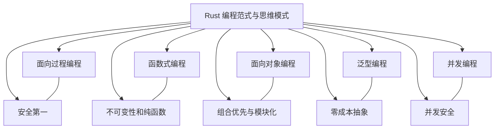

# Rust和C++在复制、克隆和移动语义方面有着不同的实现和概念

C++和Rust都是高性能的编程语言，它们在很多方面有相似之处，例如都支持底层内存控制和强类型系统。
然而，它们在语义上存在一些关键的区别：

1. **内存管理**：Rust通过所有权系统来确保内存安全，避免了运行时的垃圾回收开销。
 C++则依赖智能指针（如`std::shared_ptr`和`std::unique_ptr`）来管理内存，提供了手动管理的灵活性和安全性。

2. **并发处理**：Rust的并发模型通过生命周期、所有权和借用来保证线程安全，几乎消除了数据竞争。
 C++提供了丰富的线程库和互斥锁等同步原语，但需要开发者小心管理，以防死锁和竞态条件。

3. **语法**：Rust的语法比C++更简洁、易读，其设计理念是使代码尽可能地易于阅读和理解，而C++的语法更接近底层，对于需要直接操作内存的情况更为方便。

4. **内存安全**：Rust通过所有权系统和生命周期检查来确保内存安全，有助于防止常见的内存相关错误，如悬挂指针和双重释放。
 相比之下，C++没有内置的内存安全机制，需要程序员手动管理内存，这可能导致内存泄漏、野指针等问题。

5. **不可变性**：Rust默认情况下变量是不可变的，这意味着一旦声明就不能被修改，这与C++中的默认可变性行为不同。

6. **编译时与运行时开销**：Rust倾向于在编译时完成尽可能多的检查和优化，减少了运行时的开销，但可能带来更长的编译时间。
 C++虽然也能进行深度编译时优化，但其灵活性意味着更多的运行时决策，可能影响性能。

7. **设计理念**：C++是一种面向对象的编程语言，提供了丰富的类库和复杂的模板系统。
 而Rust的设计理念更注重安全性和并发性，通过所有权系统和生命周期检查来防止内存泄漏和数据竞争。

8. **并发模型**：Rust提供了一种新的并发模型，称为“所有权和生命周期检查的并发模型”，通过借用检查器来防止数据竞争，简化了并发编程。
 C++支持多线程编程，但需要开发者手动处理线程的创建、同步和通信等问题。

这些区别反映了两种语言在设计哲学、内存管理、并发处理等方面的不同取向。

Rust 和 C++ 都是系统编程语言，它们提供了不同的机制来处理资源的所有权和生命周期。
Rust 的所有权和借用规则，以及 C++ 的复制语义和移动语义，都是设计用来确保内存安全和高效的资源管理。
下面是两种语言中这些概念的对比：

## C++ 中的复制语义和移动语义

1. **复制语义**：在 C++ 中，复制语义是通过复制构造函数实现的。当对象被复制时，它的所有成员变量都会被复制到新对象中。
 这适用于大多数基本数据类型和没有动态分配内存的类。复制语义可能导致性能问题，尤其是当对象较大或包含指针时。

2. **移动语义**：C++11 引入了右值引用（`&&`），允许移动构造函数和移动赋值运算符来优化资源的转移。
 移动语义允许将资源从一个对象转移到另一个对象，而不需要复制，本质是转移变量指向的内存地址或者是地址的复制，而不是内存内容的复制。
 这通常用于避免不必要的复制，特别是在涉及到动态内存分配的资源时。

3. **智能指针**：C++ 使用智能指针（如 `std::unique_ptr` 和 `std::shared_ptr`）来管理动态分配的内存。
 这些智能指针通过引用计数或独占所有权来确保资源的正确释放。

## Rust 中的所有权和移动语义

1. **所有权**：Rust 中的所有权系统确保每个值在任何时候都有一个变量被称为其所有者，或者没有所有者。
 当所有者超出作用域时，该值将被自动丢弃，其内存被释放。

2. **移动语义**：在 Rust 中，当一个值被移动到另一个变量或函数时，它的所有权也随之转移。
 这意味着原始变量不能再使用，因为它不再拥有该值的所有权。

3. **克隆**：Rust 中的 `Clone` trait 允许值被复制。但是，与 C++ 不同，Rust 的克隆是显式的，并且可能不是所有类型都实现了 `Clone` trait。
 对于包含动态内存分配的类型，克隆可能会涉及深拷贝，这可能是昂贵的操作。

4. **借用**：Rust 通过借用机制来允许在不转移所有权的情况下使用值。借用分为可变借用和不可变借用，它们有严格的规则来防止数据竞争和确保内存安全。

5. **智能指针**：Rust 也有智能指针，如 `Box<T>`、`Rc<T>` 和 `Arc<T>`，用于管理堆上分配的内存。
 `Box<T>` 拥有独占访问权，而 `Rc<T>` 和 `Arc<T>` 允许多个所有者通过引用计数共享所有权。

## C++中的Copy、Clone、Moving语义

1. **Copy（拷贝）**：传统的拷贝操作，通过拷贝构造函数和拷贝赋值操作符进行。
 复制对象的整个状态，包括所有资源，这可能涉及昂贵的内存分配和复制操作。

2. **Move（移动）**：C++11引入的Move语义，通过转移资源的所有权而非复制资源内容，减少了处理大对象时的开销。
 移动操作允许资源（如动态内存、文件句柄等）从一个对象转移到另一个对象，源对象通常会被置于可销毁但未定义的状态。

3. **std::move**：一个工具，可以将左值引用转换为右值引用，使得可以使用移动构造函数或移动赋值操作符来避免不必要的拷贝操作。
 `std::move`本身不移动任何东西，而是告诉编译器该值应该被看作右值，从而允许使用移动构造函数或移动赋值操作符。

4. **右值引用**：C++11引入，允许对右值（临时对象或即将销毁的对象）进行操作，通常与移动语义一起使用。

## Rust中的Copy、Clone、Moving语义

1. **Copy**：当Rust中的类型实现了`Copy` trait，赋值操作会进行复制，类似于C++中的拷贝操作。
 基本类型如整数、浮点数和字符默认实现了`Copy` trait。`Copy` trait要求类型也实现`Clone` trait。

2. **Clone**：Rust中的`Clone` trait允许显式地复制一个值。
 如果一个类型实现了`Clone`，可以通过调用`clone()`方法来创建该值的一个完全独立的副本。这与C++中的深拷贝类似。

3. **Move**：在Rust中，如果没有实现`Copy`或`Clone` trait，赋值操作会移动值。
 移动后，原始变量不再可用，所有权转移到新变量。Rust的移动语义是隐式的，不需要使用类似`std::move`的工具。

4. **Drop**：Rust中的`Drop` trait用于自定义对象销毁时的清理逻辑，如释放内存。
 如果类型实现了`Copy`，它就不能实现`Drop`，因为`Copy`类型应该是可以简单复制的，而`Drop`类型则需要清理资源。

5. **闭包捕获**：Rust中的闭包可以捕获外部变量，根据捕获方式的不同，闭包可以是`FnOnce`、`FnMut`或`Fn`。
 如果闭包通过移动捕获了一个变量，那么这个变量将不再可用。

## 对比

- **内存安全**：Rust 的所有权和借用规则在编译时强制执行，提供了内存安全的保证，而 C++ 需要程序员手动管理资源，容易出错。
- **性能**：Rust 的移动语义通常不需要显式地实现，编译器会自动处理，而 C++ 的移动语义需要程序员明确使用移动构造函数或移动赋值运算符。
- **易用性**：Rust 的所有权模型虽然在一开始可能难以理解，但提供了更少的运行时错误和更好的安全性。
 C++ 提供了更多的灵活性，但需要更多的注意力来避免错误。
- **资源管理**：Rust 的 `Drop` trait 用于自定义对象销毁时的行为，类似于 C++ 的析构函数，但 Rust 确保了 `Drop` 会被调用，而 C++ 中的析构函数调用依赖于对象的作用域。

两种语言都提供了强大的工具来管理资源，但它们的方法和哲学有所不同。
Rust 的方法更倾向于编译时的安全性和自动化，而 C++ 提供了更多的手动控制和灵活性。
两种语言在这些概念上的主要区别在于Rust的所有权模型，它要求程序员显式地考虑值的所有权和生命周期，而C++则依赖于拷贝构造函数和赋值操作符的重载来处理资源的复制和移动。
Rust的`Copy`和`Clone` trait提供了一种明确的方式来处理值的复制，而C++的移动语义则更多地依赖于临时对象和`std::move`的使用。

C++和Rust两种语言都拥有移动语义（Move Semantics），但它们的实现和使用方式存在一些差异。

### C++中的Move语义

C++11引入了移动语义，这是一种机制，允许资源（如动态内存、文件句柄等）从一个对象转移到另一个对象，这意味着资源的所有权转移，而非内容复制。
移动语义通过减少不必要的资源复制，提高了程序的效率。
在C++中，移动构造函数和移动赋值操作符允许对象接管资源的所有权，而不是复制它们。

- **std::move**：C++标准库中的一个函数，它将左值引用转换为右值引用，从而允许使用移动构造函数或移动赋值操作符。
 `std::move`本身不移动任何东西，而是告诉编译器该值应该被当作右值处理。
- **右值引用**：C++11引入的类型，用于匹配右值，允许对临时对象进行操作，通常与移动语义一起使用。
- **完美转发**：C++11的另一个特性，通过`std::forward`实现，允许在模板函数中保持参数的左值/右值属性，以实现移动语义或拷贝语义。

C++11 引入了右值引用（也称为 rvalue reference），这是一种特殊的引用类型，用来引用即将被销毁或者不再使用的右值（rvalues）。
右值通常是指那些不是持久存储的对象，比如临时对象、被移动的对象、或者通过特定的语法创建的无名对象。
右值引用允许开发者安全、高效地转移资源，比如动态内存，而不需要复制它们。

#### 定义

右值引用使用双写的 `&&` 符号来定义，例如 `int&&`。它只能绑定到右值上，不能绑定到左值（lvalues），左值是持久存储的对象，比如变量或者对象的成员。

### 联系和解释

1. **移动语义（Move Semantics）**：
   - 右值引用是实现移动语义的关键。移动构造函数和移动赋值运算符接受一个右值引用作为参数，允许将资源从源对象转移到目标对象，而不需要复制。
   - 例如，对于 `std::vector`，移动构造函数可以高效地转移底层数组的所有权，而不是复制整个数组。

2. **完美转发（Perfect Forwarding）**：
   - 模板函数或模板类可以使用右值引用来转发参数，保持参数的值类别（左值或右值）。这允许库作者编写可以接受任意类型参数的通用代码。

3. **std::move**：
   - `std::move` 是一个将左值转换为对应类型右值引用的类型转换操作符。它用来显式地表明某个对象应该被移动而不是被复制。

4. **资源管理**：
   - 在资源管理方面，右值引用允许智能指针（如 `std::unique_ptr`）安全地转移所有权，而不需要复制底层资源。

5. **C++11 特性的支持**：
   - 右值引用是 C++11 特性的一部分，与基于范围的 for 循环、lambda 表达式、auto 类型推导等特性一起，提高了 C++ 语言的表达能力和性能。

6. **临时对象的处理**：
   - 右值引用允许编译器和程序员更有效地处理临时对象，通过移动它们而不是复制，可以减少不必要的资源消耗。

7. **语义清晰**：
   - 使用右值引用可以使得代码的意图更加清晰，即开发者明确表示某个对象应该被移动而不是被复制。

8. **与左值引用的区别**：
   - 左值引用（`&`）可以绑定到左值上，用于访问对象的身份和持久状态。右值引用（`&&`）只能绑定到右值上，用于访问对象的资源，且通常用于资源的转移。

右值引用是 C++11 中一个非常重要的特性，它改变了资源管理和对象生命周期的处理方式，使得 C++ 能够更高效地处理资源密集型任务。

### Rust中的Move语义

Rust的移动语义是该语言所有权系统的一部分。
当一个变量被赋值给另一个变量时，如果没有实现`Copy` trait，所有权将从原变量转移到新变量，原变量将不能再被使用。

- **所有权转移**：在Rust中，基本类型的赋值操作是按位复制的，而复合类型的赋值则涉及所有权的转移。
 一旦所有权被转移，原变量就不能再被访问。
- **Copy trait**：Rust中的一个标记trait，如果一个类型实现了`Copy` trait，那么在赋值时，它的值将被复制而不是移动。
 Rust的基本类型（如整数和浮点数）默认实现了`Copy` trait。
- **Clone trait**：如果一个类型没有实现`Copy` trait，通常需要实现`Clone` trait来提供一个显式的复制操作。

### Rust中的Copy语义

Rust的Copy语义是该语言所有权系统的一部分。
当一个变量被赋值给另一个变量时，如果没有实现`Copy` trait，所有权将从原变量转移到新变量，原变量将不能再被使用。

两种语言的移动语义都旨在提高资源利用效率和程序性能，但Rust的移动语义是其所有权系统的一部分，
而C++的移动语义更多是作为一种优化手段。
Rust的移动语义在编译时期就通过所有权检查确保了安全性，而C++则依赖于程序员显式地使用`std::move`来触发移动语义。
Rust的移动语义是编程语言前置模型，完全由编译器在编译时期检查，在运行时没有开销。

## 类型系统中的变体性：C++ 与 Rust 对比

### 一、基本概念定义

#### 可变性 (Mutability)

**定义**：指一个值是否可以被修改的属性。

#### 协变 (Covariance)

**定义**：如果类型 A 是类型 B 的子类型，那么复合类型 `F<A>` 也是 `F<B>` 的子类型，这种关系称为协变。

#### 逆变 (Contravariance)

**定义**：如果类型 A 是类型 B 的子类型，那么复合类型 `F<B>` 是 `F<A>` 的子类型（方向相反），这种关系称为逆变。

#### 不变性 (Invariance)

**定义**：如果类型 A 是类型 B 的子类型，但 `F<A>` 和 `F<B>` 之间没有子类型关系，这种关系称为不变性。

## 二、C++ 中的变体性

### 1. 可变性

**概念解释**：

- C++ 中通过 `const` 关键字控制可变性
- 默认情况下变量是可变的，除非声明为 `const`
- 可以使用 `mutable` 关键字在 `const` 方法中修改成员变量

**示例**：

```cpp
// 可变变量
int x = 5;
x = 10; // 可以修改

// 不可变变量
const int y = 5;
// y = 10; // 错误：不能修改 const 变量

// 在 const 方法中修改成员变量
class Example {
private:
    mutable int counter = 0;
public:
    void increment() const {
        counter++; // 即使在 const 方法中也可以修改 mutable 成员
    }
};
```

### 2. 协变

**概念解释**：

- C++ 支持指针和引用的协变
- 主要体现在继承关系中的指针和引用转换
- 虚函数返回类型可以是协变的

**示例**：

```cpp
class Base {};
class Derived : public Base {};

void example() {
    Derived d;
    // 协变：派生类指针可以隐式转换为基类指针
    Base* b = &d; // 合法
    
    // 协变：派生类引用可以隐式转换为基类引用
    Base& br = d; // 合法
}

// 虚函数返回类型的协变
class Animal {
public:
    virtual Animal* clone() { return new Animal(); }
};

class Dog : public Animal {
public:
    // 返回类型从 Animal* 协变为 Dog*
    Dog* clone() override { return new Dog(); }
};
```

### 3. 逆变

**概念解释**：

- C++ 不直接支持函数参数的逆变
- C++20 引入了概念(Concepts)，提供了一些逆变特性
- 在函数指针赋值中有限支持逆变

**示例**：

```cpp
class Base {};
class Derived : public Base {};

// 函数类型
using BaseFunc = void (*)(Base*);
using DerivedFunc = void (*)(Derived*);

void takeBase(Base* b) { /* ... */ }
void takeDerived(Derived* d) { /* ... */ }

void example() {
    // 在 C++ 中，这种赋值通常不允许
    // BaseFunc bf = takeDerived; // 错误
    
    // 但可以通过显式转换或函数适配器实现类似效果
    BaseFunc bf = [](Base* b) { 
        // 这里需要动态类型检查，不安全
        if (Derived* d = dynamic_cast<Derived*>(b))
            takeDerived(d);
    };
}
```

### 4. 不变性

**概念解释**：

- C++ 模板参数默认是不变的
- 指针到指针的转换通常是不变的（除了继承关系）

**示例**：

```cpp
template<typename T>
class Container {
    T* data;
    // ...
};

void example() {
    Container<Derived> cd;
    // 下面的赋值在 C++ 中不允许，因为模板参数是不变的
    // Container<Base> cb = cd; // 错误
    
    // 指针到指针的转换也是不变的
    int* pi = new int(5);
    // double* pd = pi; // 错误：不同类型的指针之间不能转换
}
```

## 三、Rust 中的变体性

### 1. rust可变性

**概念解释**：

- Rust 默认所有变量都是不可变的
- 使用 `mut` 关键字声明可变变量
- 区分可变引用 `&mut T` 和不可变引用 `&T`

**示例**：

```rust
// 不可变变量（默认）
let x = 5;
// x = 10; // 错误：不能修改不可变变量

// 可变变量
let mut y = 5;
y = 10; // 正确：可以修改可变变量

// 不可变引用
let r = &x;
// *r = 10; // 错误：不能通过不可变引用修改值

// 可变引用
let mr = &mut y;
*mr = 10; // 正确：可以通过可变引用修改值
```

### 2. rust协变

**概念解释**：

- Rust 中不可变引用 `&T` 对于 T 是协变的
- 生命周期也遵循协变关系
- `Box<T>`, `Vec<T>` 等对于 T 也是协变的

**示例**：

```rust
trait Animal {}
struct Dog {}
impl Animal for Dog {}

fn main() {
    let dog = Dog {};
    
    // 协变：可以将 &Dog 转换为 &dyn Animal
    let animal_ref: &dyn Animal = &dog;
    
    // 生命周期的协变
    let long_lived = String::from("长生命周期");
    {
        // 'static 生命周期比任何局部生命周期都长
        let static_str: &'static str = "静态字符串";
        // 协变允许将长生命周期引用赋值给短生命周期引用
        let any_str: &str = static_str;
        
        process_str(static_str); // 可以使用静态生命周期
    }
}

fn process_str<'a>(s: &'a str) {
    println!("{}", s);
}
```

### 3. rust逆变

**概念解释**：

- Rust 中函数参数位置是逆变的
- 如果 'a: 'b（'a 比 'b 活得长），则 fn(&'b T) 可以用在需要 fn(&'a T) 的地方

**示例**：

```rust
fn use_any_str<'a>(s: &'a str) {
    println!("{}", s);
}

fn main() {
    // 函数类型中参数位置的逆变
    let func_for_any: fn(&str) = use_any_str;
    
    // 可以将接受任何生命周期引用的函数赋值给需要接受'static引用的函数变量
    let func_for_static: fn(&'static str) = use_any_str;
    
    // 调用函数
    func_for_static("静态字符串");
}
```

### 4. rust不变性

**概念解释**：

- Rust 中可变引用 `&mut T` 对于 T 是不变的
- `Cell<T>`, `RefCell<T>` 等内部可变性类型对于 T 也是不变的

**示例**：

```rust
use std::cell::Cell;

fn main() {
    // 可变引用的不变性
    let mut x = 5;
    let mut y = 10;
    
    let ref_x = &mut x;
    // 下面的代码会编译错误，因为可变引用是不变的
    // let same_type_ref: &mut i32 = &mut y; // 在这个作用域内不允许
    
    *ref_x = 15;
    
    // Cell 的不变性
    let cell_i32 = Cell::new(5);
    // 下面的代码会编译错误，因为 Cell<T> 是不变的
    // let _: Cell<i64> = cell_i32;
}
```

## 四、C++ 与 Rust 对比

### 1. 可变性对比

| 特性 | C++ | Rust |
|:----:|:----|:----|
| 默认可变性 | 可变 | 不可变 |
| 不可变声明 | `const` | 默认 |
| 可变声明 | 默认 | `mut` |
| 内部可变性 | `mutable` | `Cell`, `RefCell`, `UnsafeCell` |
| 引用可变性 | `const T&` vs `T&` | `&T` vs `&mut T` |
| 编译时检查 | 部分检查 | 严格检查 |

**主要区别**：

- C++ 默认可变，Rust 默认不可变，体现了设计理念的不同
- Rust 的可变性检查更严格，尤其是借用检查器的存在
- Rust 明确区分可变引用和不可变引用，并强制唯一性

### 2. 协变对比

| 特性 | C++ | Rust |
|:----:|:----|:----|
| 指针/引用协变 | 支持（继承关系） | 支持（trait 对象） |
| 生命周期协变 | 无显式概念 | 完全支持 |
| 容器协变 | 不支持 | 部分支持（如 `Box<T>`, `Vec<T>`） |
| 虚函数返回值 | 支持协变 | 支持协变（trait 方法） |

**主要区别**：

- C++ 的协变主要体现在继承体系中
- Rust 没有继承，但通过 trait 对象实现类似机制
- Rust 显式处理生命周期协变，这在 C++ 中没有对应概念

### 3. 逆变对比

| 特性 | C++ | Rust |
|:----:|:----|:----|
| 函数参数逆变 | 不直接支持 | 支持 |
| 函数指针赋值 | 有限支持 | 完全支持 |
| 生命周期逆变 | 无显式概念 | 支持 |
| 安全性 | 需手动检查 | 编译时保证 |

**主要区别**：

- C++ 对逆变支持有限，通常需要手动类型转换
- Rust 在函数类型中完全支持逆变，尤其是生命周期
- Rust 的逆变规则由编译器强制执行，保证安全

### 4. 不变性对比

| 特性 | C++ | Rust |
|:----:|:----|:----|
| 模板参数 | 不变 | 根据上下文不同 |
| 可变引用 | 无直接对应 | 不变 |
| 内部可变类型 | 无直接对应 | 不变 |
| 类型安全 | 部分保证 | 完全保证 |

**主要区别**：

- C++ 模板参数默认不变，但缺乏细粒度控制
- Rust 明确区分不同类型的变体性
- Rust 的不变性规则更严格，尤其是可变引用

## 五、应用场景对比

### C++ 应用场景

1. **面向对象编程**：

   ```cpp
   class Shape {
   public:
       virtual void draw() const = 0;
       virtual Shape* clone() const = 0;
   };

   class Circle : public Shape {
   public:
       void draw() const override { /* ... */ }
       Circle* clone() const override { return new Circle(*this); } // 协变返回类型
   };

   void processShape(const Shape& shape) {
       shape.draw();
   }

   int main() {
       Circle circle;
       processShape(circle); // 协变：Circle& -> Shape&
   }
   ```

2. **STL 容器与算法**：

   ```cpp
   #include <vector>
   #include <algorithm>

   class Base {};
   class Derived : public Base {};

   int main() {
       std::vector<Derived*> derivedPtrs;
       // 不能直接将 vector<Derived*> 赋值给 vector<Base*>
       // std::vector<Base*> basePtrs = derivedPtrs; // 错误
       
       // 但可以通过算法转换
       std::vector<Base*> basePtrs;
       std::transform(derivedPtrs.begin(), derivedPtrs.end(), 
                     std::back_inserter(basePtrs),
                     [](Derived* d) { return static_cast<Base*>(d); });
   }
   ```

3. **智能指针**：

   ```cpp
   #include <memory>

   class Base {};
   class Derived : public Base {};

   int main() {
       std::shared_ptr<Derived> derivedPtr = std::make_shared<Derived>();
       std::shared_ptr<Base> basePtr = derivedPtr; // 协变：shared_ptr<Derived> -> shared_ptr<Base>
       
       // 但 unique_ptr 需要显式转换
       std::unique_ptr<Derived> uniqueDerived = std::make_unique<Derived>();
       std::unique_ptr<Base> uniqueBase = std::move(uniqueDerived); // 需要移动语义
   }
   ```

### Rust 应用场景

1. **Trait 对象**：

   ```rust
   trait Draw {
       fn draw(&self);
   }

   struct Circle {}
   impl Draw for Circle {
       fn draw(&self) { /* ... */ }
   }

   fn process_drawable(drawable: &dyn Draw) {
       drawable.draw();
   }

   fn main() {
       let circle = Circle {};
       process_drawable(&circle); // 协变：&Circle -> &dyn Draw
   }
   ```

2. **生命周期管理**：

   ```rust
   struct Container<'a> {
       data: &'a str,
   }

   fn process<'a>(container: Container<'a>) {
       println!("处理: {}", container.data);
   }

   fn main() {
       let static_str: &'static str = "静态字符串";
       let container = Container { data: static_str };
       
       // 协变：Container<'static> 可以在需要 Container<'a> 的地方使用
       process(container);
   }
   ```

3. **函数类型和闭包**：

   ```rust
   fn process_any_str<'a>(s: &'a str) {
       println!("{}", s);
   }

   fn main() {
       // 函数参数的逆变
       let func: fn(&'static str) = process_any_str;
       
       // 闭包捕获和生命周期
       let owned_string = String::from("Hello");
       let closure = |s: &str| {
           println!("{} {}", owned_string, s);
       };
       
       // 可以将接受任何生命周期的闭包用在需要接受静态生命周期的地方
       takes_fn_for_static(closure);
   }

   fn takes_fn_for_static<F>(f: F) where F: Fn(&'static str) {
       f("静态字符串");
   }
   ```

4. **内存安全保证**：

   ```rust
   fn main() {
       let mut data = vec![1, 2, 3];
       
       // 可变引用的不变性防止数据竞争
       let ref1 = &mut data;
       // let ref2 = &mut data; // 错误：不能同时有两个可变引用
       
       ref1.push(4);
       
       // 内部可变性
       use std::cell::RefCell;
       let cell = RefCell::new(5);
       
       // RefCell 允许在运行时检查借用规则
       let borrow1 = cell.borrow();
       // let borrow_mut = cell.borrow_mut(); // 运行时会 panic
       
       println!("值: {}", *borrow1);
   }
   ```

## 六、总结

### C++ 变体性特点

- 主要通过继承关系实现协变
- 对逆变支持有限，通常需要手动转换
- 类型安全依赖程序员的谨慎
- 灵活但容易出错

### Rust 变体性特点

- 通过类型系统和生命周期参数实现细粒度变体性控制
- 编译时强制执行变体性规则，保证内存安全
- 明确区分不同引用类型的变体性
- 更严格但更安全

### 核心差异

1. **设计理念**：C++ 注重灵活性和向后兼容，Rust 注重安全性和正确性
2. **类型检查**：C++ 部分在运行时检查，Rust 主要在编译时检查
3. **内存模型**：C++ 允许多种内存管理方式共存，Rust 强制所有权和借用规则
4. **变体性应用**：C++ 主要用于继承体系，Rust 用于生命周期和 trait 对象

两种语言的变体性系统反映了它们的核心设计理念：C++ 提供更大的灵活性但需要程序员更谨慎，而 Rust 通过严格的编译时检查提供更强的安全保证。

下面详细探讨下 Rust 支持的各种编程范式和思维模式，解释其设计理念及使用时对应的思维方式。

---

## 1. Rust 支持的编程范式

Rust 是一门多范式语言，综合了多种编程风格，不同范式可以混合使用，由此提高了语言的表达力和灵活性。主要包括以下几种：

### 1.1 面向过程编程

- **特点**：  
  传统的命令式编程范式，强调对过程（函数）的调用和数据的状态变化。  
- **Rust 中的体现**：  
  Rust 提供了清晰的函数定义、模块系统和强类型检查，使得程序流程清晰、易于维护和调试。

### 1.2 函数式编程

- **特点**：  
  强调不可变性、纯函数、以及将计算视为函数组合与数据流转换。  
- **Rust 中的体现**：  
  - **不可变数据**：默认变量不可变（`let` 绑定为不可变），鼓励数据的不变性。  
  - **高阶函数与闭包**：支持闭包、迭代器以及大量组合函数（map, filter, fold等），让代码更简洁。  
  - **模式匹配**：通过 `match` 和解构，方便对数据结构进行函数式操作。

### 1.3 面向对象编程（OOP）

- **特点**：  
  通过封装、继承、和多态实现数据与行为的封装和抽象。  
- **Rust 中的体现**：  
  - **Trait**：不直接提供传统的类继承，但通过 Trait 定义接口，允许多态行为。  
  - **结构体与实现块**：使用结构体搭配 `impl` 块，在类的语义上封装数据和行为；  
  - **组合优先**：强调组合（composition over inheritance）的设计思想，利用 trait 和泛型实现灵活的代码复用。

### 1.4 泛型编程

- **特点**：  
  使用类型参数写出通用代码，提高代码复用性并保证类型安全。  
- **Rust 中的体现**：  
  - **泛型类型与函数**：允许通过泛型参数定义灵活而类型安全的代码。  
  - **Trait Bound**：通过 trait 限定确保泛型类型满足接口要求；  
  - **单态化**：编译时对泛型代码进行实例化（Monomorphization），在不牺牲性能的情况下做到零成本抽象。

### 1.5 并发编程

- **特点**：  
  通过安全、高效的方式实现多线程和异步编程，避免常见的并发错误。  
- **Rust 中的体现**：  
  - **所有权与借用系统**：保证多线程中数据不会发生竞争条件；  
  - **消息传递和同步机制**：例如 channels、Mutex 以及其他并发原语；  
  - **异步编程**：支持 async/await，将异步变成一种直观、安全的编码模式。

---

## 2. Rust 的思维模式

Rust 的设计不仅仅在语法和机制上支持多种范式，同时也在思维模式上塑造了一系列独特的编码理念：

### 2.1 安全第一

- **静态安全检查**：所有权、借用、生命周期的检查在编译阶段保证了内存安全和数据一致性，促使开发者在代码设计时尽量考虑资源的使用和释放。  
- **明确责任**：变量的所有权清晰、资源管理明确，避免了许多隐式错误的发生。

### 2.2 零成本抽象

- **性能与抽象并重**：通过编译器的单态化和内联机制，Rust 能够在保持高层抽象的同时不引入额外的运行时开销。这鼓励开发者在设计时不牺牲代码可读性以换取性能。

### 2.3 函数式思维

- **不可变性和纯函数**：默认鼓励不可变绑定和对状态最小化变化，促使程序设计更接近数学模型，逻辑清晰。  
- **组合与表达**：丰富的模式匹配和闭包支持推动了函数组合的思维方式，让程序的业务流程更具声明性。

### 2.4 组合优先与模块化

- **模块化编程**：Rust 提供了模块系统以及细粒度的权限控制（如 `pub` 关键字），使得程序结构清晰、职责分离。  
- **组合重用**：通过 trait、泛型等机制，提倡使用组合而非继承来构建复杂系统，降低耦合度，提高扩展性和可维护性。

### 2.5 并发安全

- **数据隔离与所有权传递**：内建的所有权机制迫使开发者考虑并发情况下的数据传递和共享问题，提前避免数据竞争。  
- **异步和并发原语**：Rust 的并发模型鼓励你在设计时区分共享状态和数据传递，借助语言本身的特性写出安全且高效的并发代码。

---

## 3. 思维导图

下面提供一个 Mermaid 格式的思维导图，展示 Rust 支持的编程范式及其思维模式之间的联系：



---

## 4. 总结

- **多范式支持**：  
  Rust 在同一门语言中支持面向过程、函数式、面向对象和泛型编程，提供了灵活而高效的工具，使开发者能够根据具体场景选择最佳的编程方式。

- **独特思维模式**：  
  Rust 强调安全、明确与零成本抽象，鼓励不可变性、组合优先的设计理念，塑造出内存安全、并发安全以及模块化的系统编程方式。

- **融合优势**：  
  这种多范式、多思维模式的融合，使 Rust 成为一门既能处理底层系统编程，也能满足高层抽象需求的现代编程语言，帮助开发者写出高效、健壮且可维护的代码。

通过理解 Rust 的多范式支持与思维模式，开发者可以在项目中更好地应用这些理念，构建出既安全又高性能的系统。
