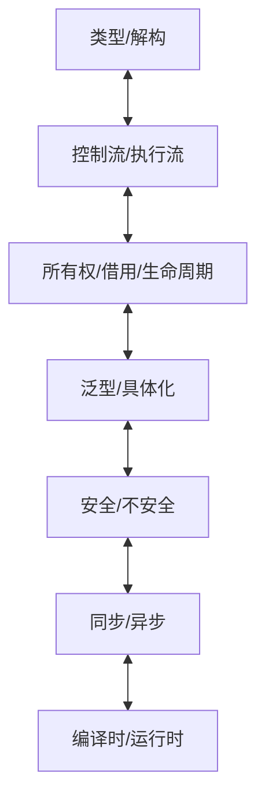

# 08 设计哲学与对称性

## 08.1 Rust中的对称性原则

### 08.1.1 类型与解构的对称性

- 构造与解构互为对偶，模式匹配与结构体/枚举构造一一对应。

### 08.1.2 控制流与执行流的对称性

- 函数调用/返回、异常传播、?操作符等形成对称结构。

### 08.1.3 所有权、借用、生命周期的对称性

- 资源获取/释放、借用/归还、生命周期起止均体现对称思想。

## 08.2 Rust设计中的更多对称性

| 对称性类型 | 具体表现 |
|:----:|:----|
| 泛型/具体化 | 泛型定义与单态化实例互为对偶 |
| 特性/实现 | trait接口与impl实现对偶 |
| 静态/动态分发 | 编译时/运行时多态对偶 |
| 同步/异步 | 时间维度上的对称 |
| 安全/不安全 | unsafe边界明确对称 |
| 编译时/运行时检查 | 类型系统与Option/Result等机制对偶 |

## 08.3 对称性破坏与设计权衡

### 08.3.1 所有权转移的单向性

- move语义不可逆，保障唯一性。

### 08.3.2 可变/不可变借用的非对称

- 可变借用排他、不可变借用共享，体现安全需求。

### 08.3.3 错误处理与Drop的非对称

- ?操作符、Drop特性等均为有意的对称性破坏。

### 08.3.4 异步/等待的时间非对称

- .await点为时间轴断点，异步推理复杂。

## 08.4 对称性视角下的软件设计

- 抽象层次、系统复杂度、程序验证、设计模式均可用对称性分析。
- 对称性破坏往往是系统复杂度与错误源头。
- 设计时应权衡对称性与工程目标。

## 08.5 工程启示与语言设计建议

- 保持核心机制对称性，降低认知负担。
- 有目的地破坏对称性以实现安全/性能等目标。
- 明确暴露对称性破坏点，便于验证与维护。
- 类型系统与编译器应强制关键对称约束。

[返回目录](./_index.md)
