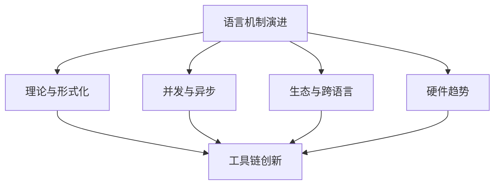

# 11 未来展望与前沿趋势

## 11.1 语言机制与人体工程学的持续演进

- 简化生命周期标注、改进错误信息、提升人体工程学（如更友好的async/await、Pin、FFI等）
- 探索更细粒度的可变性控制（如字段级可变性）、更灵活的借用规则、自动内部可变性推导
- 未来可能出现的语法/机制示例：

```rust
struct PartialMut {
    immutable: String,
    @mut mutable: Vec<i32>, // 假设语法：标记特定字段可变
}
```

## 11.2 理论基础与形式化验证前沿

- RustBelt、分离逻辑等理论持续完善，扩展到trait、生命周期、unsafe等复杂特性
- 发展统一类型系统形式化、可组合性证明、实用静态分析与半自动验证工具
- 未来工具链趋势：更强静态分析、并发调试器、FFI安全桥接、可视化工具

## 11.3 并发、异步与高性能系统支持

- 更易用高性能并发原语、Actor模型等高级抽象、异步生态标准化、异步trait与调试工具完善
- 针对无锁编程、死锁检测、异步状态管理的语言与库层创新

## 11.4 生态系统与跨语言影响

- Rust机制影响C++/Swift/Carbon/Val等新兴语言，推动所有权/可变性模型普及
- FFI安全、C/C++库包装、动态语言接口、工具链适配等生态挑战
- 社区最佳实践、学习曲线、知识传递与标准化持续优化

## 11.5 硬件趋势与系统级创新

- 适应异构计算、非易失性内存、硬件事务内存、能力安全架构（如CHERI）
- 未来可能出现的硬件特定同步原语、持久内存API、原生安全机制

## 11.6 主要挑战与未解难题

- 理论与实践鸿沟、形式化模型的表达局限、复杂场景（异步/自引用/高阶函数/unsafe）难以严密建模
- 编译时间、调试难度、工具链支持、生态适应性、学习曲线

## 11.7 结论与展望

- Rust所有权/可变性/生命周期机制将持续演进，理论与工程创新并进，推动系统编程范式变革
- 未来将更好地平衡安全、性能、表达力与易用性，成为构建下一代高可靠软件的基石



[返回目录](./_index.md)
