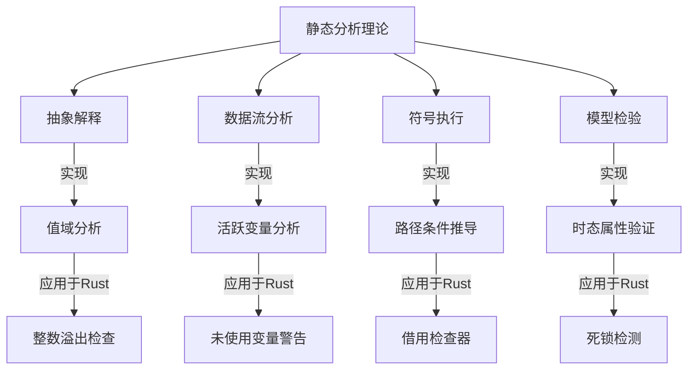
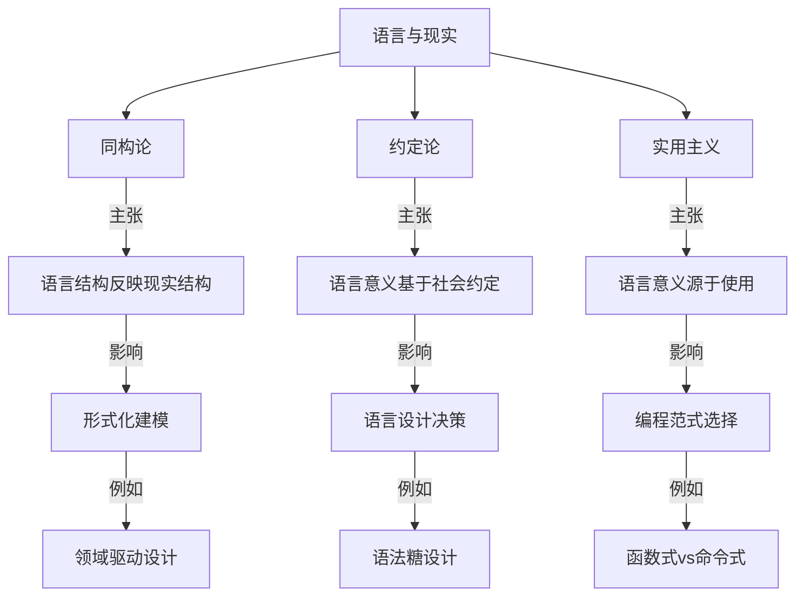
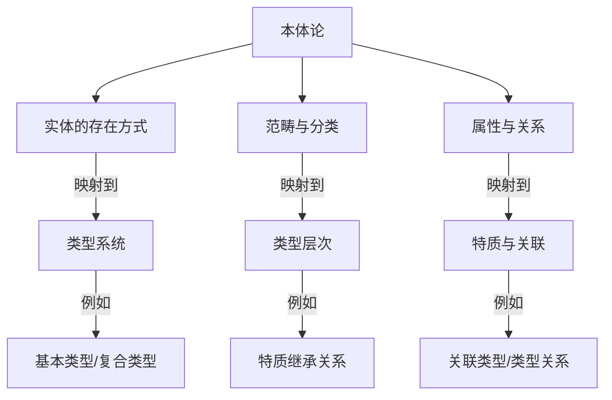
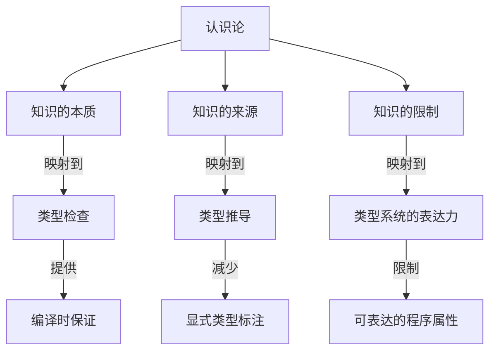

# 形式语言与计算机科学

## 形式语言与计算机科学的深层融合

### 形式语言与程序分析

#### 1. 静态分析的理论基础



静态分析技术在Rust中的应用：

```rust
// 抽象解释：编译器使用抽象域分析值的可能范围
fn abs_interpret_example(x: u32) -> u32 {
    // 编译器可以判断x+1可能溢出
    let y = x + 1; // 可能触发编译器警告
    y
}

// 数据流分析：编译器追踪变量的定义和使用
fn data_flow_example() {
    let x = 10;
    // 编译器可以检测到x未被使用
    // 会生成警告：unused variable `x`
    
    let mut y = 5;
    y = 20;
    // 编译器可以检测到y的第一次赋值被覆盖
    // 可能生成警告：value assigned to `y` is never read
}

// 符号执行：编译器模拟执行路径以验证属性
fn symbolic_exec_example(x: i32) -> bool {
    let y = if x > 0 { x } else { -x };
    // 编译器通过符号执行可以证明y始终非负
    y >= 0 // 这个条件总是为真
}

// 模型检验：验证并发系统的属性
use std::sync::{Arc, Mutex};
use std::thread;

fn model_checking_example() {
    let data = Arc::new(Mutex::new(0));
    
    let data1 = Arc::clone(&data);
    let t1 = thread::spawn(move || {
        let mut d = data1.lock().unwrap();
        *d += 1;
    });
    
    let data2 = Arc::clone(&data);
    let t2 = thread::spawn(move || {
        let mut d = data2.lock().unwrap();
        *d += 1;
    });
    
    t1.join().unwrap();
    t2.join().unwrap();
    
    // 理论上，编译器或分析工具可以验证这里不存在数据竞争
    assert_eq!(*data.lock().unwrap(), 2);
}
```

#### 2. 程序逻辑与验证条件生成

```rust
// 假设的程序验证扩展语法

// 前置条件、后置条件和不变量
#[requires(n >= 0)]
#[ensures(result == n * (n + 1) / 2)]
fn sum_up_to(n: i32) -> i32 {
    let mut sum = 0;
    let mut i = 0;
    
    #[invariant(sum == i * (i + 1) / 2)]
    #[invariant(0 <= i && i <= n)]
    while i <= n {
        sum += i;
        i += 1;
    }
    
    sum
}

// 验证条件生成过程
// 1. 入口处验证前置条件: n >= 0
// 2. 循环入口处验证初始状态满足不变量: 
//    - 0 == 0 * (0 + 1) / 2 (成立)
//    - 0 <= 0 && 0 <= n (成立，因为n >= 0)
// 3. 循环体验证保持不变量:
//    - 假设 sum == i * (i + 1) / 2 且 0 <= i && i <= n
//    - 执行 sum += i; i += 1;
//    - 验证 sum == i * (i + 1) / 2 且 0 <= i && i <= n 仍然成立
// 4. 循环结束时验证后置条件:
//    - 循环结束条件: i > n
//    - 结合不变量: sum == i * (i + 1) / 2 且 i == n + 1
//    - 推导: sum == (n + 1) * (n + 2) / 2 - (n + 1) == n * (n + 1) / 2
```

### 形式语言与类型系统的高级应用

#### 1. 高级类型系统特性

```rust
// 高级类型系统特性及其应用

// 1. 高阶类型多态 (Higher-Kinded Types)
// 目前Rust不直接支持，但可以通过特质关联类型模拟
trait HigherKinded {
    type Applied<T>;
}

struct OptionHKT;
impl HigherKinded for OptionHKT {
    type Applied<T> = Option<T>;
}

struct VecHKT;
impl HigherKinded for VecHKT {
    type Applied<T> = Vec<T>;
}

// 2. 类型级编程 (Type-Level Programming)
// 使用特质和关联类型进行编译时计算
trait Nat {
    const VALUE: usize;
}

struct Zero;
impl Nat for Zero {
    const VALUE: usize = 0;
}

struct Succ<N: Nat>;
impl<N: Nat> Nat for Succ<N> {
    const VALUE: usize = N::VALUE + 1;
}

// 类型级加法
trait Add<B> {
    type Sum;
}

impl<B: Nat> Add<B> for Zero {
    type Sum = B;
}

impl<N: Nat, B: Nat> Add<B> for Succ<N>
where
    N: Add<B>,
{
    type Sum = Succ<N::Sum>;
}

// 3. 会话类型 (Session Types)
// 使用类型系统确保通信协议的正确性
struct Send<T, Cont>(PhantomData<(T, Cont)>);
struct Recv<T, Cont>(PhantomData<(T, Cont)>);
struct End;

// 客户端协议：发送请求，接收响应，结束
type ClientProtocol = Send<Request, Recv<Response, End>>;

// 服务器协议：接收请求，发送响应，结束
type ServerProtocol = Recv<Request, Send<Response, End>>;

// 4. 效果系统 (Effect Systems)
// 在类型级别跟踪函数的副作用
trait Pure<Output> {
    fn run(self) -> Output;
}

trait IOEffect<Output> {
    fn run(self) -> Output;
}

trait StateEffect<S, Output> {
    fn run(self, state: S) -> (Output, S);
}

// 纯函数
fn pure_fn(x: i32) -> impl Pure<i32> {
    struct PureFn(i32);
    impl Pure<i32> for PureFn {
        fn run(self) -> i32 {
            self.0 * 2
        }
    }
    PureFn(x)
}

// IO函数
fn io_fn() -> impl IOEffect<String> {
    struct IoFn;
    impl IOEffect<String> for IoFn {
        fn run(self) -> String {
            std::fs::read_to_string("file.txt").unwrap_or_default()
        }
    }
    IoFn
}
```

#### 2. 类型驱动开发与形式化设计

```rust
// 类型驱动开发：使用类型系统指导程序设计

// 1. 状态机建模
enum ConnectionState {
    Disconnected,
    Connecting,
    Connected,
    Closing,
}

// 使用幻影类型参数表示状态
struct Connection<S> {
    socket: TcpStream,
    _state: PhantomData<S>,
}

// 只在断开状态下允许连接
impl Connection<Disconnected> {
    fn new() -> Self {
        Connection {
            socket: /* 创建未连接的套接字 */,
            _state: PhantomData,
        }
    }
    
    fn connect(self, addr: &str) -> Result<Connection<Connected>, Error> {
        // 连接逻辑
        Ok(Connection {
            socket: self.socket,
            _state: PhantomData,
        })
    }
}

// 只在连接状态下允许发送数据
impl Connection<Connected> {
    fn send(&mut self, data: &[u8]) -> Result<(), Error> {
        // 发送逻辑
        Ok(())
    }
    
    fn close(self) -> Connection<Closing> {
        Connection {
            socket: self.socket,
            _state: PhantomData,
        }
    }
}

// 2. API设计与类型安全
// 使用类型系统防止误用API
struct DatabaseConnection {
    // 内部实现
}

// 查询构建器，确保类型安全的SQL构造
struct QueryBuilder<'a, State> {
    conn: &'a DatabaseConnection,
    query: String,
    _state: PhantomData<State>,
}

// 查询状态标记
struct Initial;
struct Selected;
struct WhereApplied;
struct Finalized;

impl<'a> QueryBuilder<'a, Initial> {
    fn new(conn: &'a DatabaseConnection) -> Self {
        QueryBuilder {
            conn,
            query: String::new(),
            _state: PhantomData,
        }
    }
    
    fn select(self, columns: &str) -> QueryBuilder<'a, Selected> {
        let query = format!("SELECT {} ", columns);
        QueryBuilder {
            conn: self.conn,
            query,
            _state: PhantomData,
        }
    }
}

impl<'a> QueryBuilder<'a, Selected> {
    fn from(mut self, table: &str) -> Self {
        self.query.push_str(&format!("FROM {} ", table));
        self
    }
    
    fn where_clause(self, condition: &str) -> QueryBuilder<'a, WhereApplied> {
        let query = format!("{}WHERE {} ", self.query, condition);
        QueryBuilder {
            conn: self.conn,
            query,
            _state: PhantomData,
        }
    }
    
    fn finalize(self) -> QueryBuilder<'a, Finalized> {
        QueryBuilder {
            conn: self.conn,
            query: self.query,
            _state: PhantomData,
        }
    }
}

impl<'a> QueryBuilder<'a, WhereApplied> {
    fn and(mut self, condition: &str) -> Self {
        self.query.push_str(&format!("AND {} ", condition));
        self
    }
    
    fn finalize(self) -> QueryBuilder<'a, Finalized> {
        QueryBuilder {
            conn: self.conn,
            query: self.query,
            _state: PhantomData,
        }
    }
}

impl<'a> QueryBuilder<'a, Finalized> {
    fn execute(self) -> Result<Vec<Row>, Error> {
        // 执行查询
        // ...
    }
}

// 使用示例
fn query_example(conn: &DatabaseConnection) -> Result<Vec<Row>, Error> {
    QueryBuilder::new(conn)
        .select("id, name")
        .from("users")
        .where_clause("age > 18")
        .and("status = 'active'")
        .finalize()
        .execute()
}
```

### 形式语言与领域特定语言

#### 1. 嵌入式DSL的形式化基础

```rust
// 嵌入式DSL的形式化设计

// 1. 表达式DSL
// 使用代数数据类型表示表达式语法树
enum Expr {
    Lit(i32),
    Add(Box<Expr>, Box<Expr>),
    Sub(Box<Expr>, Box<Expr>),
    Mul(Box<Expr>, Box<Expr>),
    Div(Box<Expr>, Box<Expr>),
    Var(String),
}

// 使用运算符重载提供自然语法
use std::ops::{Add, Sub, Mul, Div};

impl Add for Expr {
    type Output = Expr;
    fn add(self, rhs: Expr) -> Expr {
        Expr::Add(Box::new(self), Box::new(rhs))
    }
}

impl Sub for Expr {
    type Output = Expr;
    fn sub(self, rhs: Expr) -> Expr {
        Expr::Sub(Box::new(self), Box::new(rhs))
    }
}

// 2. 查询DSL
// 使用构建器模式和方法链
struct Query {
    select_clause: Option<String>,
    from_clause: Option<String>,
    where_clauses: Vec<String>,
    order_by: Option<String>,
    limit: Option<usize>,
}

impl Query {
    fn new() -> Self {
        Query {
            select_clause: None,
            from_clause: None,
            where_clauses: Vec::new(),
            order_by: None,
            limit: None,
        }
    }
    
    fn select(mut self, columns: &str) -> Self {
        self.select_clause = Some(columns.to_string());
        self
    }
    
    fn from(mut self, table: &str) -> Self {
        self.from_clause = Some(table.to_string());
        self
    }
    
    fn where_clause(mut self, condition: &str) -> Self {
        self.where_clauses.push(condition.to_string());
        self
    }
    
    fn order_by(mut self, column: &str) -> Self {
        self.order_by = Some(column.to_string());
        self
    }
    
    fn limit(mut self, n: usize) -> Self {
        self.limit = Some(n);
        self
    }
    
    fn build(&self) -> String {
        let mut query = format!("SELECT {} ", self.select_clause.as_ref().unwrap_or(&"*".to_string()));
        
        if let Some(from) = &self.from_clause {
            query.push_str(&format!("FROM {} ", from));
        }
        
        if !self.where_clauses.is_empty() {
            query.push_str("WHERE ");
            query.push_str(&self.where_clauses.join(" AND "));
            query.push(' ');
        }
        
        if let Some(order) = &self.order_by {
            query.push_str(&format!("ORDER BY {} ", order));
        }
        
        if let Some(limit) = self.limit {
            query.push_str(&format!("LIMIT {}", limit));
        }
        
        query
    }
}

// 3. 状态机DSL
// 使用宏系统提供声明式语法
macro_rules! state_machine {
    (
        states: { $($state:ident),* },
        events: { $($event:ident),* },
        transitions: {
            $($from:ident + $event_name:ident => $to:ident),*
        }
    ) => {
        // 生成状态和事件枚举
        #[derive(Debug, PartialEq, Eq, Clone, Copy)]
        enum State { $($state),* }
        
        #[derive(Debug, PartialEq, Eq)]
        enum Event { $($event),* }
        
        // 生成状态机结构
        struct StateMachine {
            current: State,
        }
        
        impl StateMachine {
            fn new(initial: State) -> Self {
                StateMachine { current: initial }
            }
            
            fn process(&mut self, event: Event) -> Result<(), &'static str> {
                match (self.current, event) {
                    $(
                        (State::$from, Event::$event_name) => {
                            self.current = State::$to;
                            Ok(())
                        }
                    ),*
                    _ => Err("Invalid transition")
                }
            }
            
            fn state(&self) -> State {
                self.current
            }
        }
    };
}

// 使用状态机DSL
state_machine! {
    states: { Idle, Active, Paused, Terminated },
    events: { Start, Pause, Resume, Stop },
    transitions: {
        Idle + Start => Active,
        Active + Pause => Paused,
        Paused + Resume => Active,
        Active + Stop => Terminated,
        Paused + Stop => Terminated
    }
}
```

#### 2. DSL语义的形式化定义

```rust
// DSL语义的形式化定义

// 1. 操作语义 (Operational Semantics)
// 定义DSL表达式的求值规则
trait Evaluate {
    type Output;
    fn evaluate(&self, env: &Environment) -> Result<Self::Output, EvalError>;
}

impl Evaluate for Expr {
    type Output = i32;
    
    fn evaluate(&self, env: &Environment) -> Result<i32, EvalError> {
        match self {
            Expr::Lit(n) => Ok(*n),
            Expr::Add(lhs, rhs) => {
                let lval = lhs.evaluate(env)?;
                let rval = rhs.evaluate(env)?;
                Ok(lval + rval)
            },
            Expr::Sub(lhs, rhs) => {
                let lval = lhs.evaluate(env)?;
                let rval = rhs.evaluate(env)?;
                Ok(lval - rval)
            },
            Expr::Mul(lhs, rhs) => {
                let lval = lhs.evaluate(env)?;
                let rval = rhs.evaluate(env)?;
                Ok(lval * rval)
            },
            Expr::Div(lhs, rhs) => {
                let lval = lhs.evaluate(env)?;
                let rval = rhs.evaluate(env)?;
                if rval == 0 {
                    Err(EvalError::DivisionByZero)
                } else {
                    Ok(lval / rval)
                }
            },
            Expr::Var(name) => {
                env.get(name).ok_or(EvalError::UndefinedVariable(name.clone()))
            }
        }
    }
}

// 2. 指称语义 (Denotational Semantics)
// 将DSL表达式映射到语义域
trait Denote {
    type Denotation;
    fn denote(&self) -> Self::Denotation;
}

impl Denote for Expr {
    // 表达式的语义是一个从环境到值的函数
    type Denotation = Box<dyn Fn(&Environment) -> Result<i32, EvalError>>;
    
    fn denote(&self) -> Self::Denotation {
        match self {
            Expr::Lit(n) => {
                let n = *n;
                Box::new(move |_| Ok(n))
            },
            Expr::Add(lhs, rhs) => {
                let lhs_den = lhs.denote();
                let rhs_den = rhs.denote();
                Box::new(move |env| {
                    let lval = lhs_den(env)?;
                    let rval = rhs_den(env)?;
                    Ok(lval + rval)
                })
            },
            // 其他情况类似...
            _ => unimplemented!(),
        }
    }
}

// 3. 公理语义 (Axiomatic Semantics)
// 使用前置条件和后置条件定义DSL语义
trait AxiomaticSemantics {
    // 前置条件：执行前必须满足的条件
    fn precondition(&self) -> Predicate;
    
    // 后置条件：执行后保证满足的条件
    fn postcondition(&self) -> Predicate;
    
    // 最弱前置条件：给定后置条件，计算最弱的前置条件
    fn weakest_precondition(&self, post: Predicate) -> Predicate;
}
```

## 形式语言与人工智能的交叉

### 类型系统与机器学习

```rust
// 类型安全的机器学习框架

// 1. 张量类型
// 使用类型参数表示张量维度和元素类型
struct Tensor<T, Dims> {
    data: Vec<T>,
    shape: PhantomData<Dims>,
}

// 标记类型表示维度
struct Dim<const N: usize>;

// 2D张量
type Matrix<T, const ROWS: usize, const COLS: usize> = 
    Tensor<T, (Dim<ROWS>, Dim<COLS>)>;

// 3D张量
type Volume<T, const DEPTH: usize, const HEIGHT: usize, const WIDTH: usize> = 
    Tensor<T, (Dim<DEPTH>, Dim<HEIGHT>, Dim<WIDTH>)>;

// 2. 类型安全的矩阵乘法
// 只有当维度匹配时才允许乘法
trait MatMul<B> {
    type Output;
    fn matmul(self, other: B) -> Self::Output;
}

impl<T, const M: usize, const N: usize, const K: usize> 
    MatMul<Matrix<T, N, K>> for Matrix<T, M, N>
where
    T: std::ops::Mul<Output = T> + std::ops::AddAssign + Default + Copy,
{
    type Output = Matrix<T, M, K>;
    
    fn matmul(self, other: Matrix<T, N, K>) -> Matrix<T, M, K> {
        // 实现矩阵乘法
        // ...
        unimplemented!()
    }
}

// 3. 神经网络层的类型安全表示
struct Linear<const IN: usize, const OUT: usize> {
    weights: Matrix<f32, IN, OUT>,
    bias: Matrix<f32, 1, OUT>,
}

impl<const IN: usize, const OUT: usize> Linear<IN, OUT> {
    fn new() -> Self {
        // 初始化权重和偏置
        unimplemented!()
    }
    
    fn forward(&self, input: Matrix<f32, 1, IN>) -> Matrix<f32, 1, OUT> {
        // 前向传播
        let output = input.matmul(self.weights);
        // 添加偏置
        // ...
        unimplemented!()
    }
}

// 4. 类型级神经网络架构
trait Layer {
    type Input;
    type Output;
    
    fn forward(&self, input: Self::Input) -> Self::Output;
}

impl<const IN: usize, const OUT: usize> Layer for Linear<IN, OUT> {
    type Input = Matrix<f32, 1, IN>;
    type Output = Matrix<f32, 1, OUT>;
    
    fn forward(&self, input: Self::Input) -> Self::Output {
        self.forward(input)
    }
}

// 序列模型：确保层之间的连接类型安全
struct Sequential<L1, L2>
where
    L1: Layer,
    L2: Layer<Input = L1::Output>,
{
    layer1: L1,
    layer2: L2,
}

impl<L1, L2> Layer for Sequential<L1, L2>
where
    L1: Layer,
    L2: Layer<Input = L1::Output>,
{
    type Input = L1::Input;
    type Output = L2::Output;
    
    fn forward(&self, input: Self::Input) -> Self::Output {
        let intermediate = self.layer1.forward(input);
        self.layer2.forward(intermediate)
    }
}
```

### 形式语言与自然语言处理

```rust
// 形式语言在NLP中的应用

// 1. 上下文无关文法解析器
struct CFGParser {
    rules: HashMap<String, Vec<Vec<String>>>,
}

impl CFGParser {
    fn new() -> Self {
        CFGParser {
            rules: HashMap::new(),
        }
    }
    
    fn add_rule(&mut self, non_terminal: &str, production: Vec<String>) {
        self.rules
            .entry(non_terminal.to_string())
            .or_insert_with(Vec::new)
            .push(production);
    }
    
    fn parse(&self, input: &[String]) -> Option<ParseTree> {
        // 实现CYK算法或Earley算法
        // ...
        unimplemented!()
    }
}

// 2. 类型化的语义分析
// 使用代数数据类型表示语义结构
enum Semantics {
    Entity(String),
    Predicate(Box<Semantics>, Box<Semantics>),
    Quantifier(Quantifier, String, Box<Semantics>),
    Conjunction(Box<Semantics>, Box<Semantics>),
    Disjunction(Box<Semantics>, Box<Semantics>),
    Negation(Box<Semantics>),
}

enum Quantifier {
    Universal,  // ∀
    Existential, // ∃
}

// 3. 形式化的语义组合
trait Compose<T> {
    type Output;
    fn compose(self, other: T) -> Self::Output;
}

// 函数应用组合规则
impl Compose<Semantics> for Semantics {
    type Output = Semantics;
    
    fn compose(self, arg: Semantics) -> Semantics {
        match self {
            Semantics::Predicate(pred, _) => {
                Semantics::Predicate(pred, Box::new(arg))
            },
            // 其他组合规则...
            _ => panic!("Invalid semantic composition"),
        }
    }
}
```

## 形式语言与哲学的深层联系

### 语言与现实的对应理论



#### 1. 维特根斯坦的语言游戏理论与编程语言

```rust
// 维特根斯坦的语言游戏理论应用于编程语言设计

// 1. 不同语言游戏有不同规则
// Rust的所有权语言游戏
fn ownership_game() {
    let s = String::from("hello");
    takes_ownership(s);
    // 在此语言游戏中，s不再有效
    // println!("{}", s); // 编译错误
}

fn takes_ownership(s: String) {
    println!("{}", s);
} // s离开作用域并被丢弃

// JavaScript的引用语言游戏（伪代码）
// function referenceGame() {
//     let s = "hello";
//     takesReference(s);
//     console.log(s); // 仍然有效
// }

// 2. 语言游戏的规则由社区共识决定
// Rust命名约定：蛇形命名法
fn snake_case_function() {
    let some_variable = 5;
    // ...
}

// 类型名称使用大驼峰命名法
struct UserAccount {
    username: String,
    email: String,
}

// 3. 语言游戏的边界与模糊性
// Rust中的"安全"概念
fn safe_code() {
    let mut v = vec![1, 2, 3];
    v.push(4);
    // 安全的边界内
}

fn unsafe_code() {
    let address = 0x012345usize;
    let r = unsafe { 
        // 跨越安全边界
        *(address as *const i32)
    };
}
```

#### 2. 语言相对论与编程范式


```rust
// Sapir-Whorf假说在编程语言中的体现

// 1. 不同语言塑造不同思维方式
// 命令式思维（C风格）
fn imperative_approach(numbers: &mut [i32]) {
    for i in 0..numbers.len() {
        numbers[i] = numbers[i] * 2;
    }
}

// 函数式思维（Haskell风格）
fn functional_approach(numbers: &[i32]) -> Vec<i32> {
    numbers.iter().map(|&x| x * 2).collect()
}

// 面向对象思维（Java风格）
struct NumberProcessor {
    numbers: Vec<i32>,
}

impl NumberProcessor {
    fn new(numbers: Vec<i32>) -> Self {
        NumberProcessor { numbers }
    }
    
    fn double_all(&mut self) {
        for i in 0..self.numbers.len() {
            self.numbers[i] *= 2;
        }
    }
    
    fn get_numbers(&self) -> &[i32] {
        &self.numbers
    }
}

// Rust混合范式思维
fn rust_approach(numbers: &mut [i32]) {
    numbers.iter_mut().for_each(|x| *x *= 2);
}

// 2. 语言限制与思维局限
// 没有GC的语言促使程序员思考内存管理
fn memory_conscious_code() -> String {
    let mut s = String::with_capacity(100); // 预分配内存
    s.push_str("Hello");
    s.push_str(", world!");
    s // 返回所有权
}

// 静态类型语言促使程序员思考类型关系
fn type_conscious_code<T: Display + Clone>(value: T) -> String {
    format!("Value: {}", value.clone())
}

// 3. 语言扩展思维边界
// 代数数据类型扩展问题建模思维
enum Result<T, E> {
    Ok(T),
    Err(E),
}

fn error_conscious_code() -> Result<String, io::Error> {
    let file = File::open("config.txt")?;
    let mut contents = String::new();
    file.read_to_string(&mut contents)?;
    Ok(contents)
}
```

### 本体论与类型理论



#### 1. 类型作为存在的证明

```rust
// 类型作为存在证明的形式化表达

// 1. 类型即命题，值即证明
// Option<T>类型表示"可能存在T类型的值"这一命题
fn find_user(id: UserId) -> Option<User> {
    // 如果返回Some(user)，证明了用户存在
    // 如果返回None，表明无法证明用户存在
    database.get_user(id)
}

// Result<T, E>类型表示"要么成功得到T，要么有E类型的错误"
fn parse_config(path: &str) -> Result<Config, ConfigError> {
    // 如果返回Ok(config)，证明了配置有效
    // 如果返回Err(e)，表明配置无效，并提供证据e
    let content = fs::read_to_string(path)?;
    parse_config_str(&content)
}

// 2. 存在量化的类型表示
// 存在类型（某种满足特定条件的类型）
fn get_serializer() -> impl Serialize {
    // 返回某种实现了Serialize的类型
    // 证明了"存在一个类型T，使得T实现了Serialize"
    MyData { value: 42 }
}

// 3. 空类型作为矛盾的证明
enum Void {} // 空类型，没有值

// 不可能返回的函数
fn prove_contradiction() -> Void {
    // 无法构造Void类型的值
    // 这个函数无法正常返回
    loop {}
}

// 使用空类型证明类型关系
trait Subtype<T> {
    fn upcast(self) -> T;
}

trait Supertype<T> {
    fn downcast(self) -> Result<T, TypeCastError>;
}

// 如果能构造这个函数，证明i32不是f64的子类型
fn i32_not_subtype_of_f64() -> Void {
    // 无法实现，因为i32确实不是f64的子类型
    unimplemented!()
}
```

#### 2. 类型系统的本体论承诺

```rust
// 类型系统的本体论承诺

// 1. 基本类型反映基本存在类别
// 原始类型代表基本存在类别
let number: i32 = 42;        // 整数存在类别
let real: f64 = 3.14;        // 实数存在类别
let text: &str = "hello";    // 文本存在类别
let truth: bool = true;      // 真值存在类别

// 2. 复合类型反映复合存在方式
// 积类型（结构体）表示"且"关系的存在
struct Person {
    name: String,   // 人同时具有名字
    age: u32,       // 和年龄
}

// 和类型（枚举）表示"或"关系的存在
enum Shape {
    Circle(f64),             // 形状可以是圆
    Rectangle(f64, f64),     // 或者是矩形
    Triangle(f64, f64, f64), // 或者是三角形
}

// 3. 泛型表示参数化存在
// List<T>表示"对任意类型T，存在一个T的列表类型"
struct List<T> {
    head: Option<Box<Node<T>>>,
}

struct Node<T> {
    value: T,
    next: Option<Box<Node<T>>>,
}

// 4. 特质表示存在的能力或性质
trait Drawable {
    fn draw(&self);
}

// Circle作为一种存在，具有可绘制的性质
impl Drawable for Circle {
    fn draw(&self) {
        // 绘制圆的实现
    }
}
```

### 认识论与类型安全



#### 1. 编译时知识与运行时知识

```rust
// 编译时知识与运行时知识的区别

// 1. 编译时知识（静态知识）
// 编译器知道x的类型是i32
let x: i32 = 5;

// 编译器知道这个函数接受i32并返回i32
fn square(x: i32) -> i32 {
    x * x
}

// 编译器知道这个调用是类型安全的
let y = square(x);

// 2. 运行时知识（动态知识）
// 编译器不知道用户会输入什么
let input = read_line();

// 编译器不知道解析是否会成功，只知道结果类型是Result<i32, ParseError>
let parsed: Result<i32, _> = input.parse();

// 需要运行时检查来获取实际值
match parsed {
    Ok(n) => println!("Parsed: {}", n),
    Err(e) => println!("Error: {}", e),
}

// 3. 将运行时知识转化为编译时知识
// 使用类型系统将动态检查转化为静态检查
enum State {
    Initial,
    Processing,
    Completed,
}

struct StateMachine<S> {
    state: PhantomData<S>,
    data: Vec<u8>,
}

impl StateMachine<Initial> {
    fn new() -> Self {
        StateMachine {
            state: PhantomData,
            data: Vec::new(),
        }
    }
    
    fn start(self) -> StateMachine<Processing> {
        StateMachine {
            state: PhantomData,
            data: self.data,
        }
    }
}

impl StateMachine<Processing> {
    fn process(&mut self, input: &[u8]) {
        self.data.extend_from_slice(input);
    }
    
    fn complete(self) -> StateMachine<Completed> {
        StateMachine {
            state: PhantomData,
            data: self.data,
        }
    }
}

impl StateMachine<Completed> {
    fn result(&self) -> &[u8] {
        &self.data
    }
}

// 使用示例
fn use_state_machine() {
    let machine = StateMachine::<Initial>::new();
    let mut machine = machine.start(); // 现在是Processing状态
    
    machine.process(&[1, 2, 3]);
    machine.process(&[4, 5, 6]);
    
    let machine = machine.complete(); // 现在是Completed状态
    let result = machine.result();
    
    // 编译时错误：不能在Completed状态调用process
    // machine.process(&[7, 8, 9]);
}
```

#### 2. 类型系统作为认识论框架


```rust
// 类型系统作为认识论框架

// 1. 类型作为知识的形式化表示
// NonEmptyVec类型编码了"向量非空"的知识
struct NonEmptyVec<T> {
    first: T,
    rest: Vec<T>,
}

impl<T> NonEmptyVec<T> {
    // 构造函数需要证据（一个T值）
    fn new(first: T) -> Self {
        NonEmptyVec {
            first,
            rest: Vec::new(),
        }
    }
    
    // 可以安全地获取第一个元素，因为我们知道它存在
    fn first(&self) -> &T {
        &self.first
    }
    
    // 可以安全地计算最小值，因为我们知道至少有一个元素
    fn min(&self) -> &T
    where
        T: Ord,
    {
        let mut min = &self.first;
        for item in &self.rest {
            if item < min {
                min = item;
            }
        }
        min
    }
}

// 2. 类型错误作为知识不一致的检测
fn inconsistency_example() {
    let x: i32 = 5;
    // let y: String = x; // 类型错误：知识不一致
    
    let opt: Option<i32> = Some(10);
    // let definitely: i32 = opt; // 类型错误：知识不足
    
    let definitely: i32 = opt.unwrap(); // 运行时可能失败
    let safely: i32 = opt.unwrap_or(0); // 安全替代方案
}

// 3. 类型推导作为知识推理
fn type_inference_example() {
    // 编译器从右侧推导出左侧类型
    let x = 5; // 推导为i32
    let y = "hello"; // 推导为&str
    
    // 从上下文推导出更具体的类型
    let mut v = Vec::new(); // 类型未知
    v.push(1); // 现在编译器知道v是Vec<i32>
    
    // 从闭包参数和返回值推导出闭包类型
    let f = |x| x + 1; // 推导为Fn(i32) -> i32
}
```

## 形式语言的前沿应用

### 形式语言与区块链

#### 1. 智能合约的形式化验证

```rust
// 智能合约的形式化验证

// 1. 合约状态与不变量
struct TokenContract {
    // 总供应量
    total_supply: u64,
    // 账户余额
    balances: HashMap<Address, u64>,
    // 授权额度
    allowances: HashMap<(Address, Address), u64>,
}

impl TokenContract {
    // 合约不变量：余额总和等于总供应量
    fn check_invariant(&self) -> bool {
        let sum: u64 = self.balances.values().sum();
        sum == self.total_supply
    }
    
    // 转账函数
    fn transfer(&mut self, from: Address, to: Address, amount: u64) -> Result<(), &'static str> {
        // 前置条件
        let from_balance = self.balances.get(&from).copied().unwrap_or(0);
        if from_balance < amount {
            return Err("Insufficient balance");
        }
        
        // 执行转账
        *self.balances.entry(from).or_insert(0) -= amount;
        *self.balances.entry(to).or_insert(0) += amount;
        
        // 后置条件：检查不变量
        assert!(self.check_invariant());
        
        Ok(())
    }
}

// 2. 形式化规约
// #[invariant(self.balances.values().sum() == self.total_supply)]
// #[requires(self.balances.get(from).unwrap_or(0) >= amount)]
// #[ensures(self.balances.get(from).unwrap_or(0) == old(self.balances.get(from).unwrap_or(0)) - amount)]
// #[ensures(self.balances.get(to).unwrap_or(0) == old(self.balances.get(to).unwrap_or(0)) + amount)]
fn verified_transfer(&mut self, from: Address, to: Address, amount: u64) -> Result<(), &'static str> {
    // 实现与上面相同
    unimplemented!()
}

// 3. 形式化模型检验
// 使用模型检验工具验证合约属性
// - 不可能创建或销毁代币（总供应量守恒）
// - 转账需要足够的余额
// - 没有整数溢出
// - 授权转账需要足够的授权额度
```

#### 2. 共识协议的形式化建模

```rust
// 共识协议的形式化建模

// 1. 协议状态与转换
enum ConsensusState {
    Initial,
    Proposed { block: Block, proposer: NodeId },
    Prepared { block: Block, votes: HashSet<NodeId> },
    Committed { block: Block, votes: HashSet<NodeId> },
    Finalized { block: Block },
}

struct ConsensusProtocol {
    state: ConsensusState,
    nodes: HashSet<NodeId>,
    quorum_size: usize,
}

impl ConsensusProtocol {
    // 节点提议新区块
    fn propose(&mut self, node: NodeId, block: Block) -> Result<(), &'static str> {
        match self.state {
            ConsensusState::Initial => {
                self.state = ConsensusState::Proposed { 
                    block, 
                    proposer: node 
                };
                Ok(())
            },
            _ => Err("Can only propose in Initial state"),
        }
    }
    
    // 节点投票准备区块
    fn prepare(&mut self, node: NodeId) -> Result<(), &'static str> {
        match &mut self.state {
            ConsensusState::Proposed { block, proposer } => {
                let mut votes = HashSet::new();
                votes.insert(node);
                
                self.state = ConsensusState::Prepared { 
                    block: block.clone(), 
                    votes 
                };
                Ok(())
            },
            ConsensusState::Prepared { votes, .. } => {
                votes.insert(node);
                Ok(())
            },
            _ => Err("Can only prepare in Proposed or Prepared state"),
        }
    }
    
    // 检查是否达到提交条件
    fn check_commit(&mut self) -> Result<(), &'static str> {
        if let ConsensusState::Prepared { block, votes } = &self.state {
            if votes.len() >= self.quorum_size {
                self.state = ConsensusState::Committed { 
                    block: block.clone(), 
                    votes: votes.clone() 
                };
                return Ok(());
            }
        }
        Err("Not enough votes to commit")
    }
    
    // 检查是否达到最终确认条件
    fn check_finalize(&mut self) -> Result<(), &'static str> {
        if let ConsensusState::Committed { block, votes } = &self.state {
            if votes.len() >= self.quorum_size * 2 / 3 + 1 {
                self.state = ConsensusState::Finalized { 
                    block: block.clone() 
                };
                return Ok(());
            }
        }
        Err("Not enough votes to finalize")
    }
}

// 2. 安全性与活性属性
// 安全性：不会有两个诚实节点接受不同的区块
// #[invariant(forall n1, n2: NodeId, b1, b2: Block :: 
//     (finalized(n1, b1) && finalized(n2, b2)) ==> b1 == b2)]

// 活性：如果足够多的诚实节点参与，协议最终会达成共识
// #[liveness(exists b: Block :: eventually(finalized(_, b)))]
```

### 形式语言与量子计算

#### 1. 量子类型系统

```rust
// 量子类型系统的概念模型

// 1. 量子位类型
// 表示量子位的类型，确保量子力学规则
struct Qubit {
    // 内部表示（在真实系统中是复杂的量子态）
    state: QuantumState,
}

// 量子态不能被复制（不可克隆定理）
// 因此Qubit类型不实现Copy或Clone

impl Qubit {
    // 创建|0⟩状态的新量子位
    fn new() -> Self {
        Qubit {
            state: QuantumState::zero(),
        }
    }
    
    // 应用X门（比特翻转）
    fn apply_x(mut self) -> Self {
        self.state.apply_x();
        self
    }
    
    // 应用H门（Hadamard，创建叠加态）
    fn apply_h(mut self) -> Self {
        self.state.apply_h();
        self
    }
    
    // 应用CNOT门（受控非门）
    fn apply_cnot(self, target: Qubit) -> (Self, Qubit) {
        // 在真实实现中，这会创建纠缠态
        unimplemented!()
    }
    
    // 测量量子位，坍缩状态
    fn measure(self) -> bool {
        self.state.measure()
    }
}

// 2. 量子电路类型
struct QuantumCircuit {
    qubits: Vec<Qubit>,
    operations: Vec<Box<dyn FnOnce(&mut [Qubit])>>,
}

impl QuantumCircuit {
    fn new(qubit_count: usize) -> Self {
        let mut qubits = Vec::with_capacity(qubit_count);
        for _ in 0..qubit_count {
            qubits.push(Qubit::new());
        }
        
        QuantumCircuit {
            qubits,
            operations: Vec::new(),
        }
    }
    
    fn h(&mut self, qubit_idx: usize) -> &mut Self {
        let op = move |qubits: &mut [Qubit]| {
            // 应用H门到指定量子位
            // 在真实实现中，这会修改量子态
        };
        self.operations.push(Box::new(op));
        self
    }
    
    fn cnot(&mut self, control: usize, target: usize) -> &mut Self {
        let op = move |qubits: &mut [Qubit]| {
            // 应用CNOT门
            // 在真实实现中，这会创建纠缠
        };
        self.operations.push(Box::new(op));
        self
    }
    
    fn run(&mut self) -> Vec<bool> {
        // 应用所有操作
        // 在真实实现中，这会模拟量子电路
        
        // 测量所有量子位
        // 这会导致量子态坍缩
        unimplemented!()
    }
}

// 3. 量子算法示例
// Deutsch算法：判断函数是常数还是平衡
fn deutsch_algorithm<F>(oracle: F) -> bool
where
    F: FnOnce(Qubit) -> Qubit,
{
    // 创建|0⟩状态的量子位
    let q = Qubit::new();
    
    // 应用H门创建叠加态
    let q = q.apply_h();
    
    // 应用黑盒函数（常数或平衡函数）
    let q = oracle(q);
    
    // 再次应用H门
    let q = q.apply_h();
    
    // 测量结果
    // 如果结果为0，函数是常数
    // 如果结果为1，函数是平衡
    q.measure()
}
```

#### 2. 量子-经典混合计算

```rust
// 量子-经典混合计算模型

// 1. 混合计算架构
struct HybridComputer {
    // 经典计算单元
    classical: ClassicalProcessor,
    // 量子计算单元
    quantum: QuantumProcessor,
}

impl HybridComputer {
    // 执行混合算法
    fn execute<T>(&mut self, algorithm: impl HybridAlgorithm<Output = T>) -> T {
        algorithm.run(self)
    }
}

// 混合算法特质
trait HybridAlgorithm {
    type Output;
    
    fn run(&self, computer: &mut HybridComputer) -> Self::Output;
}

// 2. 变分量子特征值求解器（VQES）
struct VQES {
    // 初始参数
    initial_params: Vec<f64>,
    // 最大迭代次数
    max_iterations: usize,
    // 收敛阈值
    threshold: f64,
}

impl HybridAlgorithm for VQES {
    type Output = f64;
    
    fn run(&self, computer: &mut HybridComputer) -> f64 {
        let mut params = self.initial_params.clone();
        let mut energy = f64::INFINITY;
        
        for _ in 0..self.max_iterations {
            // 1. 经典部分：准备量子电路参数
            let circuit = computer.classical.prepare_circuit(&params);
            
            // 2. 量子部分：执行参数化量子电路
            let measurements = computer.quantum.execute_circuit(circuit);
            
            // 3. 经典部分：计算能量期望值
            let new_energy = computer.classical.compute_energy(&measurements);
            
            // 4. 经典部分：检查收敛
            if (energy - new_energy).abs() < self.threshold {
                return new_energy;
            }
            
            energy = new_energy;
            
            // 5. 经典部分：优化参数
            params = computer.classical.optimize_parameters(&params, &measurements);
        }
        
        energy
    }
}

// 3. 量子机器学习
struct QuantumNeuralNetwork {
    // 经典参数
    weights: Vec<f64>,
    // 量子层结构
    layers: Vec<QuantumLayer>,
}

impl HybridAlgorithm for QuantumNeuralNetwork {
    type Output = Vec<f64>;
    
    fn run(&self, computer: &mut HybridComputer) -> Vec<f64> {
        // 1. 经典部分：准备输入数据
        let input_data = computer.classical.prepare_input();
        
        // 2. 量子部分：编码输入数据到量子态
        let encoded_state = computer.quantum.encode_data(&input_data);
        
        // 3. 量子部分：应用参数化量子电路
        let output_state = computer.quantum.apply_layers(encoded_state, &self.weights, &self.layers);
        
        // 4. 量子部分：测量输出
        let measurements = computer.quantum.measure(output_state);
        
        // 5. 经典部分：处理测量结果
        let predictions = computer.classical.process_measurements(&measurements);
        
        predictions
    }
}
```

## 结论：形式语言的多维整合与未来展望

通过这一系列深入分析，我们探索了形式语言理论在多个领域的应用和理论基础，从编程语言设计到量子计算，从哲学基础到前沿技术。
形式语言不仅是计算机科学的核心工具，也是连接不同学科的桥梁，为我们理解和构建复杂系统提供了强大的框架。

Rust语言作为一个现代系统编程语言，成功地将形式语言理论与实用编程需求相结合，创造了一个安全、高效、表达力强的编程环境。
通过所有权系统、类型系统和生命周期分析等机制，Rust实现了"无垃圾回收的内存安全"这一看似矛盾的目标，为系统编程领域带来了革命性的变化。

随着计算技术的发展，形式语言理论将继续扮演关键角色，特别是在以下方面：

1. **形式验证与安全关键系统**：随着软件系统变得越来越复杂和关键，形式化方法将成为确保系统正确性和安全性的必要工具。

2. **量子计算与新型计算模型**：量子计算的发展需要新的形式语言和类型系统来处理量子力学的特性，如叠加、纠缠和测量。

3. **人工智能与形式推理**：形式语言将在开发可验证、可解释的AI系统中发挥重要作用，帮助我们构建更可靠、更透明的智能系统。

4. **跨学科应用**：形式语言作为表达和推理的工具，将继续在生物信息学、金融建模、区块链等领域找到新的应用。

形式语言理论与实践的这种融合，不仅推动了编程语言的发展，也深刻影响了我们思考和解决问题的方式。
通过理解形式语言的基础原理和应用方法，我们可以更好地设计和实现复杂系统，应对未来计算领域的挑战。
