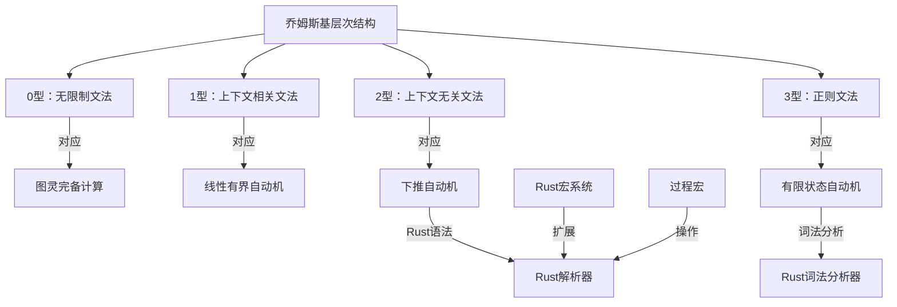
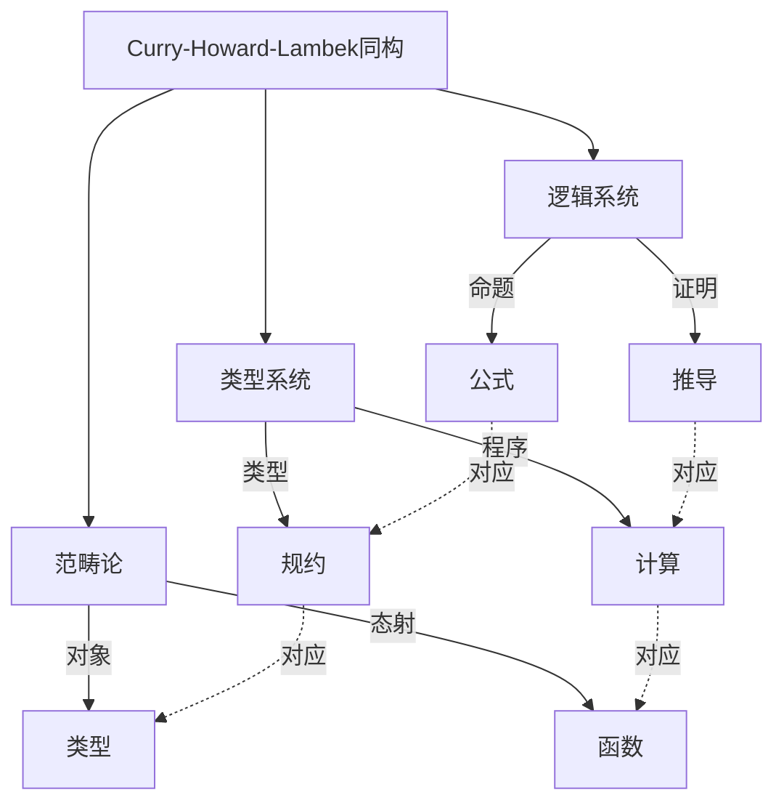
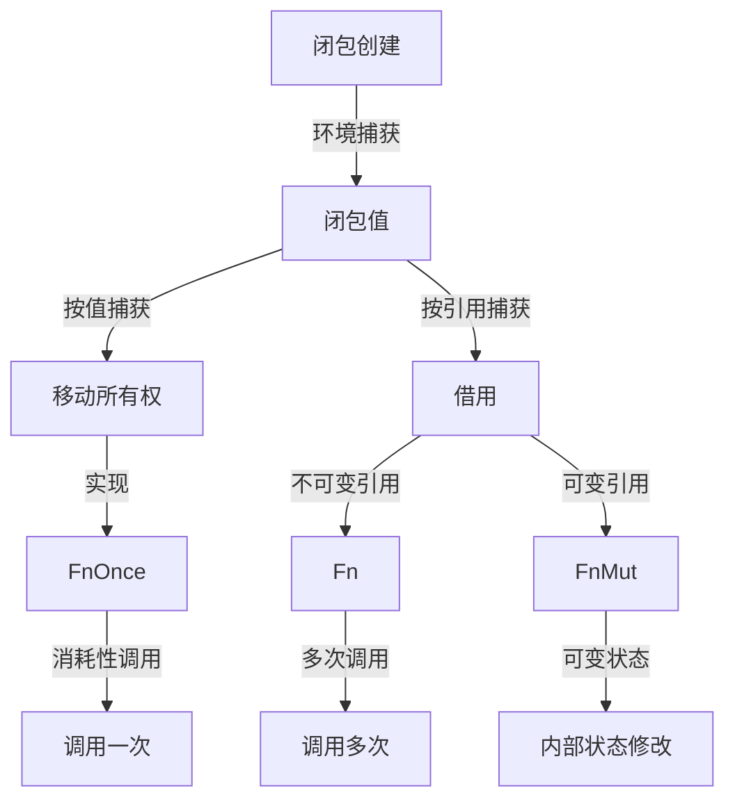
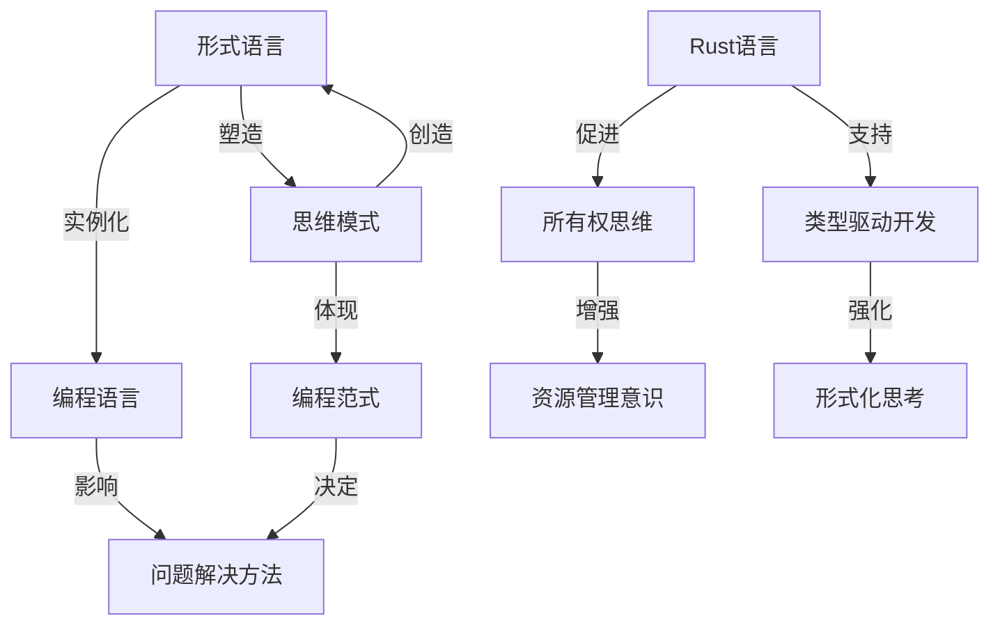
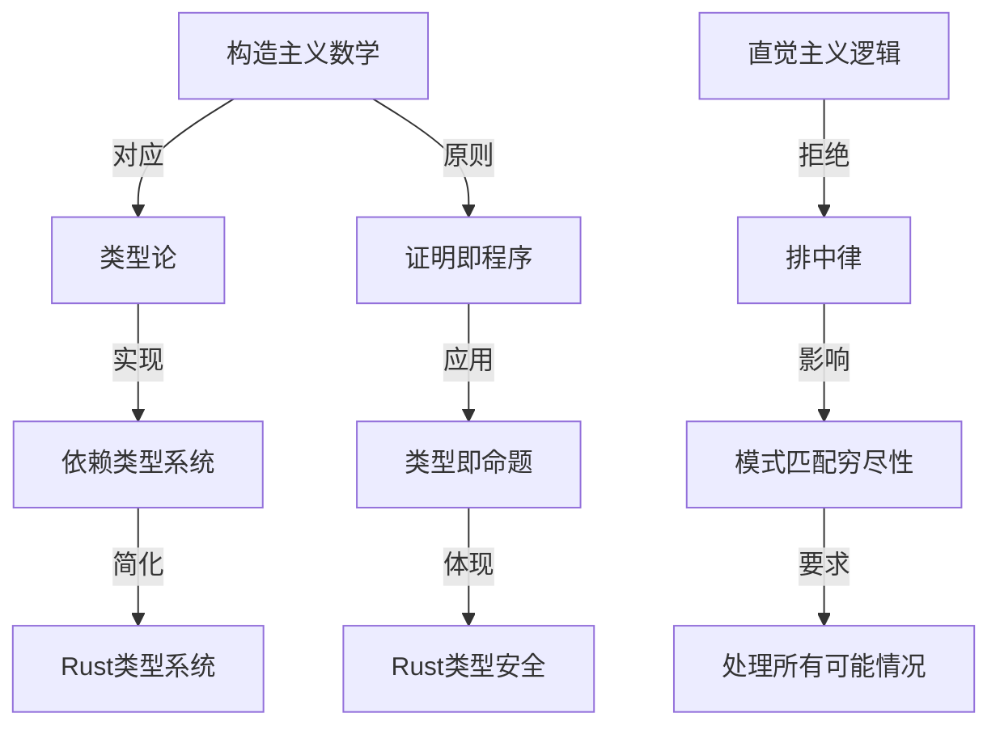
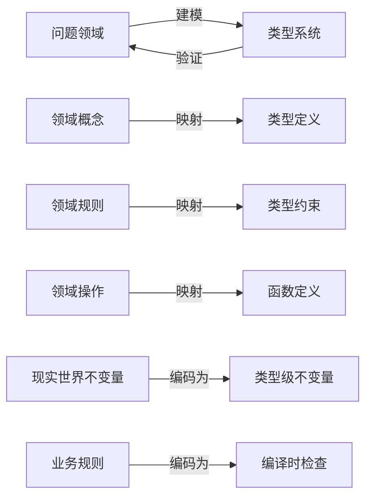
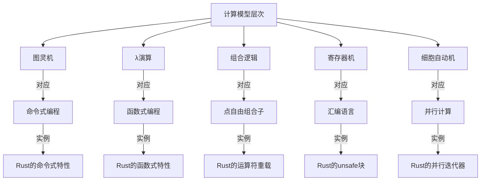
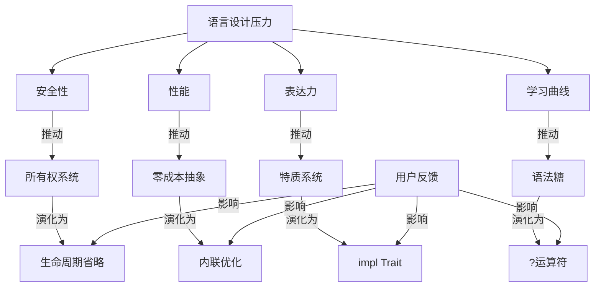

# 深化分析-Rust文档中更深层的理论构造、跨学科应用以及形式语言的哲学基础

## 目录

- [深化分析-Rust文档中更深层的理论构造、跨学科应用以及形式语言的哲学基础](#深化分析-rust文档中更深层的理论构造跨学科应用以及形式语言的哲学基础)
  - [目录](#目录)
  - [形式语言理论的深层应用](#形式语言理论的深层应用)
    - [形式语言层次结构与Rust](#形式语言层次结构与rust)
      - [1. 乔姆斯基层次结构与Rust语法](#1-乔姆斯基层次结构与rust语法)
      - [2. 形式语言的表达力谱系](#2-形式语言的表达力谱系)
    - [类型论与范畴论的深层联系](#类型论与范畴论的深层联系)
      - [1. Curry-Howard-Lambek同构](#1-curry-howard-lambek同构)
      - [2. 范畴论模型的深层应用](#2-范畴论模型的深层应用)
  - [计算模型与形式语义](#计算模型与形式语义)
    - [λ演算与Rust闭包系统](#λ演算与rust闭包系统)
      - [1. λ演算的形式化表示](#1-λ演算的形式化表示)
      - [2. λ演算在Rust中的体现](#2-λ演算在rust中的体现)
      - [3. 闭包捕获的形式语义](#3-闭包捕获的形式语义)
    - [类型系统的形式语义](#类型系统的形式语义)
      - [1. 系统F与高阶多态](#1-系统f与高阶多态)
      - [2. 依赖类型理论与Rust](#2-依赖类型理论与rust)
  - [高级形式化验证与证明](#高级形式化验证与证明)
    - [程序逻辑与形式化验证](#程序逻辑与形式化验证)
      - [1. 霍尔逻辑与程序验证](#1-霍尔逻辑与程序验证)
      - [2. 分离逻辑与Rust所有权](#2-分离逻辑与rust所有权)
    - [类型系统的可靠性证明](#类型系统的可靠性证明)
      - [1. 进展（Progress）与保存（Preservation）定理](#1-进展progress与保存preservation定理)
      - [2. 参数化逻辑关系（Parametric Logical Relations）](#2-参数化逻辑关系parametric-logical-relations)
  - [跨学科应用与理论扩展](#跨学科应用与理论扩展)
    - [量子计算与类型理论](#量子计算与类型理论)
      - [1. 量子类型系统的Rust模拟](#1-量子类型系统的rust模拟)
      - [2. 线性类型与量子计算](#2-线性类型与量子计算)
    - [生物信息学与类型安全](#生物信息学与类型安全)
  - [形式语言的哲学基础](#形式语言的哲学基础)
    - [语言与思维的关系](#语言与思维的关系)
      - [1. Sapir-Whorf假说在编程语言中的体现](#1-sapir-whorf假说在编程语言中的体现)
      - [2. 认知负荷与语言抽象](#2-认知负荷与语言抽象)
    - [形式语言的认识论基础](#形式语言的认识论基础)
      - [1. 构造主义与类型论](#1-构造主义与类型论)
      - [2. 形式化与非形式化理解的互补](#2-形式化与非形式化理解的互补)
    - [语言与现实的映射关系](#语言与现实的映射关系)
      - [1. 同构原理与领域建模](#1-同构原理与领域建模)
      - [2. 语言的表达力与现实复杂性](#2-语言的表达力与现实复杂性)
  - [形式语言与计算机科学的交叉](#形式语言与计算机科学的交叉)
    - [计算模型的层次结构](#计算模型的层次结构)
      - [1. 计算模型与编程范式](#1-计算模型与编程范式)
      - [2. 计算复杂性与语言表达力](#2-计算复杂性与语言表达力)
    - [形式语言与编程语言设计](#形式语言与编程语言设计)
      - [1. 语法、语义与实用性的平衡](#1-语法语义与实用性的平衡)
      - [2. 语言设计的进化与适应](#2-语言设计的进化与适应)
  - [形式语言的未来发展](#形式语言的未来发展)
    - [依赖类型与程序证明](#依赖类型与程序证明)
    - [形式验证与编程语言的融合](#形式验证与编程语言的融合)
    - [量子计算与新型形式语言](#量子计算与新型形式语言)
  - [结论：形式语言的多维整合](#结论形式语言的多维整合)

## 形式语言理论的深层应用

### 形式语言层次结构与Rust

#### 1. 乔姆斯基层次结构与Rust语法



Rust语法主要是上下文无关文法（CFG），但某些方面（如生命周期检查）需要更强大的形式语言能力：

```rust
// Rust语法的CFG片段示例
// expr ::= literal
//        | identifier
//        | expr binary_op expr
//        | unary_op expr
//        | expr '(' expr_list ')'
//        | '(' expr ')'

// 词法分析的正则表达式示例
// identifier = [a-zA-Z_][a-zA-Z0-9_]*
// integer = [0-9]+
// float = [0-9]+\.[0-9]+

// 上下文相关约束（不能用CFG表示）
// - 变量必须先声明后使用
// - 生命周期参数必须有效
// - 类型必须匹配
```

#### 2. 形式语言的表达力谱系

| 语言类别 | 形式化能力 | Rust对应特性 | 表达限制 |
|---------|-----------|------------|---------|
| 正则语言 | 模式匹配 | 字面量、标识符、简单模式 | 无嵌套结构 |
| 上下文无关语言 | 嵌套结构 | 表达式、语句块、函数定义 | 无上下文依赖 |
| 上下文相关语言 | 上下文约束 | 类型检查、借用检查 | 有限计算能力 |
| 递归可枚举语言 | 图灵完备计算 | 宏系统、编译时计算 | 可能不可判定 |

这种表格展示了形式语言的表达力谱系及其在Rust中的应用。

### 类型论与范畴论的深层联系

#### 1. Curry-Howard-Lambek同构



这种同构关系在Rust中的体现：

```rust
// 逻辑与类型的对应关系
type True = (); // 永真命题
type False = !; // 永假命题（空类型）

// 逻辑合取 (A ∧ B) 对应类型的笛卡尔积 (A, B)
type And<A, B> = (A, B);

// 逻辑析取 (A ∨ B) 对应类型的和 (Either<A, B>)
enum Either<A, B> {
    Left(A),
    Right(B),
}

// 逻辑蕴含 (A → B) 对应函数类型 (fn(A) -> B)
type Implies<A, B> = fn(A) -> B;

// 全称量词 (∀x.P(x)) 对应泛型类型 (<T> P<T>)
trait ForAll<T> {
    type Output;
}

// 存在量词 (∃x.P(x)) 对应存在类型 (impl Trait)
fn exists<T: Display>(x: T) -> impl Display {
    x
}
```

#### 2. 范畴论模型的深层应用

```rust
// 范畴论中的函子(Functor)在Rust中的实现
trait Functor<A, B> {
    type Target<T>;
    fn map(self, f: impl FnOnce(A) -> B) -> Self::Target<B>;
}

// Option实现了Functor
impl<A, B> Functor<A, B> for Option<A> {
    type Target<T> = Option<T>;
    fn map(self, f: impl FnOnce(A) -> B) -> Option<B> {
        match self {
            Some(a) => Some(f(a)),
            None => None,
        }
    }
}

// 范畴论中的单子(Monad)在Rust中的实现
trait Monad<A>: Functor<A, A> {
    fn pure(a: A) -> Self;
    fn flat_map<B, F>(self, f: F) -> Self::Target<B>
    where
        F: FnOnce(A) -> Self::Target<B>;
}

// Option实现了Monad
impl<A> Monad<A> for Option<A> {
    fn pure(a: A) -> Self {
        Some(a)
    }
    
    fn flat_map<B, F>(self, f: F) -> Option<B>
    where
        F: FnOnce(A) -> Option<B>,
    {
        match self {
            Some(a) => f(a),
            None => None,
        }
    }
}

// 范畴论中的自然变换(Natural Transformation)
trait NaturalTransformation<F, G> {
    fn transform<A>(fa: F) -> G;
}

// Option到Result的自然变换
struct OptionToResult;

impl<E> NaturalTransformation<Option<A>, Result<A, E>> for OptionToResult<E> {
    fn transform<A>(fa: Option<A>) -> Result<A, E> {
        match fa {
            Some(a) => Ok(a),
            None => Err(E::default()),
        }
    }
}
```

这种实现展示了范畴论概念如何在Rust中具体应用，形成函数式编程的理论基础。

## 计算模型与形式语义

### λ演算与Rust闭包系统

#### 1. λ演算的形式化表示

```math
// 无类型λ演算的语法
term ::= variable           // 变量
       | (λ variable. term) // 抽象
       | (term term)        // 应用

// β-归约规则
(λx.t) s → t[s/x]  // 将t中的x替换为s

// η-归约规则
(λx.f x) → f  // 当x不在f中自由出现时
```

#### 2. λ演算在Rust中的体现

```rust
// 简单λ演算项在Rust中的表示
// λx.x (恒等函数)
let identity = |x| x;

// λx.λy.x (第一投影)
let first = |x| move |y| x;

// λx.λy.y (第二投影)
let second = |x| move |y| y;

// λf.λg.λx.f (g x) (函数组合)
let compose = |f| move |g| move |x| f(g(x));

// λf.(λx.f (x x)) (λx.f (x x)) (Y组合子 - 不动点算子)
// Rust无法直接表示，因为类型系统阻止了无限递归类型
// 但可以用包装类型模拟：
struct Rec<F>(F);

impl<A, B, F: Fn(&Rec<F>, A) -> B> Rec<F> {
    fn call(&self, a: A) -> B {
        (self.0)(self, a)
    }
}

fn y_combinator<A, B>(f: impl Fn(impl Fn(A) -> B, A) -> B) -> impl Fn(A) -> B {
    let rec = Rec(move |rec, a| {
        f(move |x| rec.call(x), a)
    });
    move |a| rec.call(a)
}

// 使用Y组合子实现阶乘
let factorial = y_combinator(|f, n| {
    if n == 0 { 1 } else { n * f(n - 1) }
});
```

#### 3. 闭包捕获的形式语义



闭包捕获的形式化规则：

```math
// 环境捕获规则的形式化表示
Γ ⊢ e : T                           // e在环境Γ中有类型T
Γ, x:T ⊢ body : U                   // 在扩展环境中，body有类型U
---------------------------------------------
Γ ⊢ |x| body : impl Fn(T) -> U      // 闭包类型推导

// 移动捕获规则
Γ ⊢ e : T                           // e在环境Γ中有类型T
Γ, x:T ⊢ body : U                   // 在扩展环境中，body有类型U
e在body中被消耗                      // e的所有权在body中被移动
---------------------------------------------
Γ ⊢ move |x| body : impl FnOnce(T) -> U  // 闭包必须是FnOnce
```

### 类型系统的形式语义

#### 1. 系统F与高阶多态

```math
// 系统F的语法
type ::= type_variable           // 类型变量
       | type -> type           // 函数类型
       | ∀type_variable.type    // 全称量化类型

term ::= variable               // 变量
       | λvariable:type.term    // 类型标注的λ抽象
       | term term              // 应用
       | Λtype_variable.term    // 类型抽象
       | term [type]            // 类型应用
```

Rust的泛型系统可以看作是系统F的一个实例，但有一些限制：

```rust
// Rust中的系统F对应
// ∀α.T 对应 fn<T>() -> ReturnType
fn identity<T>(x: T) -> T {
    x
}

// ∀α.∀β.(α → β → α) 对应 fn<A, B>(A, B) -> A
fn first<A, B>(a: A, _: B) -> A {
    a
}

// 系统F中的多态递归类型
// Rust中的表示
enum List<T> {
    Nil,
    Cons(T, Box<List<T>>),
}

// 系统F中的存在类型
// Rust中的表示：impl Trait
fn create_counter() -> impl FnMut() -> i32 {
    let mut count = 0;
    move || {
        count += 1;
        count
    }
}
```

#### 2. 依赖类型理论与Rust

虽然Rust不直接支持完整的依赖类型，但可以通过类型级编程模拟某些依赖类型特性：

```rust
// 使用类型级整数
struct Zero;
struct Succ<N>;

// 类型级加法
trait Add<B> {
    type Sum;
}

impl<B> Add<B> for Zero {
    type Sum = B;
}

impl<N, B> Add<B> for Succ<N>
where
    N: Add<B>,
{
    type Sum = Succ<N::Sum>;
}

// 向量长度的类型级表示
struct Vec<T, N> {
    data: Vec<T>,
    _phantom: PhantomData<N>,
}

// 安全的向量索引
trait LessThan<N> {}

impl<N> LessThan<Succ<N>> for Zero {}

impl<M, N> LessThan<Succ<N>> for Succ<M>
where
    M: LessThan<N>,
{}

impl<T, N> Vec<T, N> {
    fn get<I>(&self, index: I) -> Option<&T>
    where
        I: LessThan<N>,
    {
        // 由于类型系统保证 I < N，可以安全地访问
        // 但Rust目前无法直接将类型级证明转换为值级保证
        // 所以仍需运行时检查
        let idx = /* 将I转换为usize */;
        self.data.get(idx)
    }
}
```

```rust
// Rust中的系统F对应
// ∀α.T 对应 fn<T>() -> ReturnType
fn identity<T>(x: T) -> T {
    x
}

// ∀α.∀β.(α → β → α) 对应 fn<A, B>(A, B) -> A
fn first<A, B>(a: A, _: B) -> A {
    a
}

// 系统F中的多态递归类型
// Rust中的表示
enum List<T> {
    Nil,
    Cons(T, Box<List<T>>),
}

// 系统F中的存在类型
// Rust中的表示：impl Trait
fn create_counter() -> impl FnMut() -> i32 {
    let mut count = 0;
    move || {
        count += 1;
        count
    }
}
```

## 高级形式化验证与证明

### 程序逻辑与形式化验证

#### 1. 霍尔逻辑与程序验证

```math
// 霍尔三元组
{P} C {Q}

// 表示：如果程序C开始执行时前置条件P为真，
// 那么如果C终止，则后置条件Q为真

// 赋值规则
{P[e/x]} x := e {P}

// 序列规则
{P} C1 {R}, {R} C2 {Q}
-------------------------
      {P} C1;C2 {Q}

// 条件规则
{P ∧ b} C1 {Q}, {P ∧ ¬b} C2 {Q}
--------------------------------
    {P} if b then C1 else C2 {Q}

// 循环规则
        {P ∧ b} C {P}
----------------------------
{P} while b do C done {P ∧ ¬b}
```

在Rust中模拟霍尔逻辑的验证：

```rust
// 使用注释表示前置条件和后置条件
// #[requires(x > 0)]
// #[ensures(result > x)]
fn increment_positive(x: i32) -> i32 {
    // 断言前置条件
    assert!(x > 0);
    
    // 函数体
    let result = x + 1;
    
    // 断言后置条件
    assert!(result > x);
    
    result
}

// 循环不变式示例
fn sum_up_to(n: u32) -> u32 {
    let mut sum = 0;
    let mut i = 0;
    
    // 循环不变式: sum = i * (i - 1) / 2
    while i <= n {
        // 断言循环不变式
        assert_eq!(sum, i * (i - 1) / 2);
        
        sum += i;
        i += 1;
        
        // 断言循环不变式保持
        assert_eq!(sum, i * (i - 1) / 2);
    }
    
    // 循环后置条件: sum = n * (n + 1) / 2
    assert_eq!(sum, n * (n + 1) / 2);
    
    sum
}
```

#### 2. 分离逻辑与Rust所有权

分离逻辑是霍尔逻辑的扩展，特别适合推理共享可变状态的程序：

```math
// 分离逻辑的核心运算符：分离连接 *
P * Q  // P和Q描述不相交的堆区域

// 分离逻辑的规则示例
{P * R} C {Q * R}  // 框架规则：C不修改R描述的区域
```

分离逻辑与Rust所有权系统的对应关系：

```rust
// 分离逻辑中的点-到（points-to）断言 x ↦ v
// 对应Rust中的独占引用 &mut T

// 分离连接 * 对应Rust中的多个独立可变引用
fn separate_mutation(v1: &mut Vec<i32>, v2: &mut Vec<i32>) {
    // 由于v1和v2是分离的（不重叠），可以同时修改
    v1.push(1);
    v2.push(2);
}

// 分离逻辑中的资源所有权转移
// 对应Rust中的移动语义
fn transfer_ownership(mut v: Vec<i32>) -> Vec<i32> {
    // v的所有权从调用者转移到函数
    v.push(1);
    // v的所有权从函数转移到调用者
    v
}
```

### 类型系统的可靠性证明

#### 1. 进展（Progress）与保存（Preservation）定理

```rust
// Rust类型系统的安全性保证
// 进展：表达式要么是值，要么可以继续求值
// 保存：求值过程保持类型

// 示例：Option类型的安全性
fn option_example(opt: Option<i32>) -> i32 {
    match opt {
        Some(n) => n,
        None => 0,
    }
    // 编译器保证所有情况都被处理
    // 不会出现运行时的"未处理情况"错误
}

// 示例：Result类型的安全性
fn result_example(res: Result<i32, String>) -> i32 {
    match res {
        Ok(n) => n,
        Err(e) => {
            println!("Error: {}", e);
            -1
        }
    }
    // 编译器保证错误处理，不会意外忽略错误
}
```

```rust
// 分离逻辑中的点-到（points-to）断言 x ↦ v
// 对应Rust中的独占引用 &mut T

// 分离连接 * 对应Rust中的多个独立可变引用
fn separate_mutation(v1: &mut Vec<i32>, v2: &mut Vec<i32>) {
    // 由于v1和v2是分离的（不重叠），可以同时修改
    v1.push(1);
    v2.push(2);
}

// 分离逻辑中的资源所有权转移
// 对应Rust中的移动语义
fn transfer_ownership(mut v: Vec<i32>) -> Vec<i32> {
    // v的所有权从调用者转移到函数
    v.push(1);
    // v的所有权从函数转移到调用者
    v
}
```

这两个定理共同构成了类型安全性（Type Soundness）的证明：

```math
// 进展定理
如果 ⊢ e : τ，那么要么e是一个值，要么存在e'使得 e → e'

// 保存定理
如果 ⊢ e : τ 且 e → e'，那么 ⊢ e' : τ
```

#### 2. 参数化逻辑关系（Parametric Logical Relations）

参数化逻辑关系是一种证明多态类型系统性质的强大工具：

```rust
// Rust类型系统的安全性保证
// 进展：表达式要么是值，要么可以继续求值
// 保存：求值过程保持类型

// 示例：Option类型的安全性
fn option_example(opt: Option<i32>) -> i32 {
    match opt {
        Some(n) => n,
        None => 0,
    }
    // 编译器保证所有情况都被处理
    // 不会出现运行时的"未处理情况"错误
}

// 示例：Result类型的安全性
fn result_example(res: Result<i32, String>) -> i32 {
    match res {
        Ok(n) => n,
        Err(e) => {
            println!("Error: {}", e);
            -1
        }
    }
    // 编译器保证错误处理，不会意外忽略错误
}
```

这种技术可以用来证明重要的性质，如参数化多态性（Parametricity）：

```math
// 为每个类型τ定义一个关系Rτ
Rτ(e1, e2) iff e1和e2在类型τ上"行为相同"

// 对于函数类型
Rσ→τ(f1, f2) iff 对于所有v1, v2，如果Rσ(v1, v2)，
                则Rτ(f1 v1, f2 v2)

// 对于多态类型
R∀α.τ(e1, e2) iff 对于所有类型ρ，
                Rτ[ρ/α](e1[ρ], e2[ρ])
```

```rust
// 参数化多态性示例：
// 函数 fn<T>(T) -> T 只能是恒等函数
fn parametricity<T>(x: T) -> T {
    // 由参数化多态性，这里只能返回x
    // 不能修改、替换或构造其他T类型的值
    x
}

// 参数化多态性示例：
// 函数 fn<T>(Vec<T>) -> usize 只能依赖于向量长度
fn vec_property<T>(v: Vec<T>) -> usize {
    // 由参数化多态性，这里只能使用v的长度信息
    // 不能检查、修改或依赖于T类型的值
    v.len()
}
```

## 跨学科应用与理论扩展

### 量子计算与类型理论

#### 1. 量子类型系统的Rust模拟

```rust
// 参数化多态性示例：
// 函数 fn<T>(T) -> T 只能是恒等函数
fn parametricity<T>(x: T) -> T {
    // 由参数化多态性，这里只能返回x
    // 不能修改、替换或构造其他T类型的值
    x
}

// 参数化多态性示例：
// 函数 fn<T>(Vec<T>) -> usize 只能依赖于向量长度
fn vec_property<T>(v: Vec<T>) -> usize {
    // 由参数化多态性，这里只能使用v的长度信息
    // 不能检查、修改或依赖于T类型的值
    v.len()
}
```

```rust
// 量子比特的类型表示
enum Basis {
    Zero,
    One,
}

// 量子态的代数表示
struct QuantumState {
    // |0⟩的振幅
    alpha: Complex<f64>,
    // |1⟩的振幅
    beta: Complex<f64>,
}

impl QuantumState {
    // 创建基态
    fn new_basis(basis: Basis) -> Self {
        match basis {
            Basis::Zero => QuantumState {
                alpha: Complex::new(1.0, 0.0),
                beta: Complex::new(0.0, 0.0),
            },
            Basis::One => QuantumState {
                alpha: Complex::new(0.0, 0.0),
                beta: Complex::new(1.0, 0.0),
            },
        }
    }
    
    // 应用Hadamard门
    fn apply_h(&mut self) {
        let alpha = self.alpha;
        let beta = self.beta;
        let sqrt2_inv = 1.0 / 2.0_f64.sqrt();
        
        self.alpha = (alpha + beta) * sqrt2_inv;
        self.beta = (alpha - beta) * sqrt2_inv;
    }
    
    // 测量
    fn measure(&self) -> (Basis, f64) {
        let prob_zero = self.alpha.norm_sqr();
        let random = rand::random::<f64>();
        
        if random < prob_zero {
            (Basis::Zero, prob_zero)
        } else {
            (Basis::One, 1.0 - prob_zero)
        }
    }
}

// 量子电路DSL
struct QuantumCircuit {
    qubits: Vec<QuantumState>,
    operations: Vec<Box<dyn Fn(&mut Vec<QuantumState>)>>,
}

impl QuantumCircuit {
    fn new(qubit_count: usize) -> Self {
        let mut qubits = Vec::with_capacity(qubit_count);
        for _ in 0..qubit_count {
            qubits.push(QuantumState::new_basis(Basis::Zero));
        }
        
        QuantumCircuit {
            qubits,
            operations: Vec::new(),
        }
    }
    
    fn h(&mut self, qubit: usize) -> &mut Self {
        let op = move |qubits: &mut Vec<QuantumState>| {
            qubits[qubit].apply_h();
        };
        self.operations.push(Box::new(op));
        self
    }
    
    // 其他量子门实现...
    
    fn run(&mut self) -> Vec<Basis> {
        // 应用所有操作
        for op in &self.operations {
            op(&mut self.qubits);
        }
        
        // 测量所有量子比特
        self.qubits.iter()
            .map(|q| q.measure().0)
            .collect()
    }
}
```

#### 2. 线性类型与量子计算

量子计算中的不可克隆定理（No-Cloning Theorem）与Rust的移动语义有深刻联系：

```rust
// 量子比特的类型表示
enum Basis {
    Zero,
    One,
}

// 量子态的代数表示
struct QuantumState {
    // |0⟩的振幅
    alpha: Complex<f64>,
    // |1⟩的振幅
    beta: Complex<f64>,
}

impl QuantumState {
    // 创建基态
    fn new_basis(basis: Basis) -> Self {
        match basis {
            Basis::Zero => QuantumState {
                alpha: Complex::new(1.0, 0.0),
                beta: Complex::new(0.0, 0.0),
            },
            Basis::One => QuantumState {
                alpha: Complex::new(0.0, 0.0),
                beta: Complex::new(1.0, 0.0),
            },
        }
    }
    
    // 应用Hadamard门
    fn apply_h(&mut self) {
        let alpha = self.alpha;
        let beta = self.beta;
        let sqrt2_inv = 1.0 / 2.0_f64.sqrt();
        
        self.alpha = (alpha + beta) * sqrt2_inv;
        self.beta = (alpha - beta) * sqrt2_inv;
    }
    
    // 测量
    fn measure(&self) -> (Basis, f64) {
        let prob_zero = self.alpha.norm_sqr();
        let random = rand::random::<f64>();
        
        if random < prob_zero {
            (Basis::Zero, prob_zero)
        } else {
            (Basis::One, 1.0 - prob_zero)
        }
    }
}

// 量子电路DSL
struct QuantumCircuit {
    qubits: Vec<QuantumState>,
    operations: Vec<Box<dyn Fn(&mut Vec<QuantumState>)>>,
}

impl QuantumCircuit {
    fn new(qubit_count: usize) -> Self {
        let mut qubits = Vec::with_capacity(qubit_count);
        for _ in 0..qubit_count {
            qubits.push(QuantumState::new_basis(Basis::Zero));
        }
        
        QuantumCircuit {
            qubits,
            operations: Vec::new(),
        }
    }
    
    fn h(&mut self, qubit: usize) -> &mut Self {
        let op = move |qubits: &mut Vec<QuantumState>| {
            qubits[qubit].apply_h();
        };
        self.operations.push(Box::new(op));
        self
    }
    
    // 其他量子门实现...
    
    fn run(&mut self) -> Vec<Basis> {
        // 应用所有操作
        for op in &self.operations {
            op(&mut self.qubits);
        }
        
        // 测量所有量子比特
        self.qubits.iter()
            .map(|q| q.measure().0)
            .collect()
    }
}
```

```rust
// 量子态不可克隆，对应Rust的移动语义
struct QuantumBit {
    // 量子态内部表示
    state: QuantumState,
}

impl QuantumBit {
    // 量子门操作消耗量子比特所有权
    fn apply_x(mut self) -> Self {
        // 应用X门（比特翻转）
        std::mem::swap(&mut self.state.alpha, &mut self.state.beta);
        self
    }
    
    // 测量消耗量子比特所有权
    fn measure(self) -> Basis {
        self.state.measure().0
    }
}

// 不可能实现Clone
// impl Clone for QuantumBit { ... } // 违反量子力学原理!

// 量子纠缠的类型表示
struct EntangledPair {
    // 纠缠态内部表示
}

impl EntangledPair {
    // 分离纠缠对，消耗原始对象
    fn split(self) -> (QuantumBit, QuantumBit) {
        // 创建纠缠的量子比特对
        // ...
    }
}
```

### 生物信息学与类型安全

```rust
// 量子态不可克隆，对应Rust的移动语义
struct QuantumBit {
    // 量子态内部表示
    state: QuantumState,
}

impl QuantumBit {
    // 量子门操作消耗量子比特所有权
    fn apply_x(mut self) -> Self {
        // 应用X门（比特翻转）
        std::mem::swap(&mut self.state.alpha, &mut self.state.beta);
        self
    }
    
    // 测量消耗量子比特所有权
    fn measure(self) -> Basis {
        self.state.measure().0
    }
}

// 不可能实现Clone
// impl Clone for QuantumBit { ... } // 违反量子力学原理!

// 量子纠缠的类型表示
struct EntangledPair {
    // 纠缠态内部表示
}

impl EntangledPair {
    // 分离纠缠对，消耗原始对象
    fn split(self) -> (QuantumBit, QuantumBit) {
        // 创建纠缠的量子比特对
        // ...
    }
}
```

```rust
// DNA序列的类型安全表示
enum Nucleotide {
    A, // 腺嘌呤
    T, // 胸腺嘧啶
    G, // 鸟嘌呤
    C, // 胞嘧啶
}

// 使用幻影类型标记DNA链的方向
struct Forward;
struct Reverse;

struct DNASequence<D> {
    nucleotides: Vec<Nucleotide>,
    _direction: PhantomData<D>,
}

impl<D> DNASequence<D> {
    // 获取序列长度
    fn len(&self) -> usize {
        self.nucleotides.len()
    }
}

impl DNASequence<Forward> {
    // 创建正向DNA序列
    fn new(nucleotides: Vec<Nucleotide>) -> Self {
        DNASequence {
            nucleotides,
            _direction: PhantomData,
        }
    }
    
    // 转换为反向互补序列
    fn reverse_complement(self) -> DNASequence<Reverse> {
        let complementary = self.nucleotides.iter().rev().map(|n| {
            match n {
                Nucleotide::A => Nucleotide::T,
                Nucleotide::T => Nucleotide::A,
                Nucleotide::G => Nucleotide::C,
                Nucleotide::C => Nucleotide::G,
            }
        }).collect();
        
        DNASequence {
            nucleotides: complementary,
            _direction: PhantomData,
        }
    }
}

// 特定方向的DNA序列才能进行某些操作
trait Transcribable {
    fn transcribe(&self) -> RNASequence;
}

// 只有正向DNA序列可以转录
impl Transcribable for DNASequence<Forward> {
    fn transcribe(&self) -> RNASequence {
        // 实现DNA到RNA的转录
        // ...
    }
}
```

## 形式语言的哲学基础

### 语言与思维的关系



#### 1. Sapir-Whorf假说在编程语言中的体现

```rust
// DNA序列的类型安全表示
enum Nucleotide {
    A, // 腺嘌呤
    T, // 胸腺嘧啶
    G, // 鸟嘌呤
    C, // 胞嘧啶
}

// 使用幻影类型标记DNA链的方向
struct Forward;
struct Reverse;

struct DNASequence<D> {
    nucleotides: Vec<Nucleotide>,
    _direction: PhantomData<D>,
}

impl<D> DNASequence<D> {
    // 获取序列长度
    fn len(&self) -> usize {
        self.nucleotides.len()
    }
}

impl DNASequence<Forward> {
    // 创建正向DNA序列
    fn new(nucleotides: Vec<Nucleotide>) -> Self {
        DNASequence {
            nucleotides,
            _direction: PhantomData,
        }
    }
    
    // 转换为反向互补序列
    fn reverse_complement(self) -> DNASequence<Reverse> {
        let complementary = self.nucleotides.iter().rev().map(|n| {
            match n {
                Nucleotide::A => Nucleotide::T,
                Nucleotide::T => Nucleotide::A,
                Nucleotide::G => Nucleotide::C,
                Nucleotide::C => Nucleotide::G,
            }
        }).collect();
        
        DNASequence {
            nucleotides: complementary,
            _direction: PhantomData,
        }
    }
}

// 特定方向的DNA序列才能进行某些操作
trait Transcribable {
    fn transcribe(&self) -> RNASequence;
}

// 只有正向DNA序列可以转录
impl Transcribable for DNASequence<Forward> {
    fn transcribe(&self) -> RNASequence {
        // 实现DNA到RNA的转录
        // ...
    }
}
```

```rust
// 不同语言对同一问题的表达方式影响思维方式

// C语言：手动内存管理思维
// char* str = malloc(100);
// process(str);
// free(str);

// Rust：所有权思维
let s = String::with_capacity(100);
process(s); // s的所有权转移到process
// 此处s不再有效，无需手动释放

// 函数式语言：变换思维
// list.map(f).filter(p).reduce(g)

// 命令式语言：步骤思维
// for (x in list) { if (p(x)) { result += g(x); } }
```

#### 2. 认知负荷与语言抽象


```rust
// 高级抽象：低认知负荷
fn functional_sum(data: &[i32]) -> i32 {
    data.iter().sum()
}

// 声明式抽象：极低认知负荷
fn declarative_sum(data: &[i32]) -> i32 {
    sum(data) // 假设存在一个sum函数
}
```

抽象层次与认知模型的关系：

| 抽象层次 | 认知模型 | 思维模式 | Rust示例 |
|---------|---------|---------|---------|
| 机器级 | 寄存器、指令 | 顺序执行 | `unsafe { ptr.offset(1) }` |
| 过程级 | 变量、控制流 | 命令序列 | `for i in 0..n { sum += arr[i]; }` |
| 数据结构级 | 集合、容器 | 数据转换 | `vec.iter().filter(\|&x\| *x > 0)` |
| 类型级 | 类型关系、约束 | 关系推理 | `impl<T: Display> Log for T {}` |
| 领域级 | 业务概念、规则 | 领域建模 | `Order::new().process().ship()` |

### 形式语言的认识论基础

#### 1. 构造主义与类型论



构造主义在Rust中的体现：

#### 2. 形式化与非形式化理解的互补

```rust
// 构造性证明：通过构造来证明存在性
// 类型系统确保我们处理所有可能的情况

// 示例：Option类型的穷尽性检查是排中律的构造性版本
fn process_option<T>(opt: Option<T>) -> String {
    match opt {
        Some(value) => format!("Has value"),
        None => format!("No value"),
        // 编译器确保我们处理所有情况
        // 如果没有处理None情况，将导致编译错误
    }
}

// 示例：Result类型强制错误处理
fn process_result<T, E>(result: Result<T, E>) -> String {
    match result {
        Ok(value) => format!("Success"),
        Err(e) => format!("Error"),
        // 不能简单地忽略错误情况
    }
}
```

### 语言与现实的映射关系

#### 1. 同构原理与领域建模



同构原理在Rust中的应用：

```rust
// 形式化理解：通过类型系统精确表达意图
struct NonEmpty<T> {
    first: T,
    rest: Vec<T>,
}

impl<T> NonEmpty<T> {
    fn new(first: T) -> Self {
        NonEmpty {
            first,
            rest: Vec::new(),
        }
    }
    
    fn push(&mut self, value: T) {
        self.rest.push(value);
    }
    
    fn len(&self) -> usize {
        1 + self.rest.len()
    }
}

// 非形式化理解：通过注释和文档表达意图
/// 表示一个非空向量。
/// 
/// 这个类型保证至少包含一个元素，因此可以安全地：
/// - 访问第一个元素而无需检查
/// - 计算最小/最大值而无需处理空集合情况
struct NonEmptyVec<T> {
    elements: Vec<T>,
}

impl<T> NonEmptyVec<T> {
    /// 创建一个新的非空向量，包含一个初始元素。
    fn new(first: T) -> Self {
        let mut elements = Vec::new();
        elements.push(first);
        NonEmptyVec { elements }
    }
    
    /// 返回第一个元素的引用。
    /// 
    /// 由于非空向量的保证，这个操作总是安全的。
    fn first(&self) -> &T {
        // 我们知道向量非空，所以可以安全地使用[0]
        &self.elements[0]
    }
}
```

#### 2. 语言的表达力与现实复杂性


## 形式语言与计算机科学的交叉

### 计算模型的层次结构



#### 1. 计算模型与编程范式

```rust
// 领域建模：银行账户系统
// 领域概念映射为类型

// 账户状态
enum AccountStatus {
    Active,
    Frozen,
    Closed,
}

// 账户类型
enum AccountType {
    Checking,
    Savings,
    Investment,
}

// 账户实体
struct Account {
    id: AccountId,
    holder: Customer,
    balance: Money,
    status: AccountStatus,
    account_type: AccountType,
}

// 领域规则映射为类型约束
trait WithdrawalRules {
    fn can_withdraw(&self, amount: Money) -> bool;
}

impl WithdrawalRules for Account {
    fn can_withdraw(&self, amount: Money) -> bool {
        match self.status {
            AccountStatus::Active => {
                match self.account_type {
                    AccountType::Checking => self.balance >= amount,
                    AccountType::Savings => {
                        self.balance >= amount && 
                        amount <= Money::new(1000, Currency::USD)
                    },
                    AccountType::Investment => {
                        // 投资账户有更复杂的提款规则
                        // ...
                    }
                }
            },
            _ => false, // 冻结或关闭的账户不能提款
        }
    }
}

// 领域操作映射为函数
impl Account {
    fn withdraw(&mut self, amount: Money) -> Result<Money, AccountError> {
        if !self.can_withdraw(amount) {
            return Err(AccountError::InsufficientFunds);
        }
        
        self.balance -= amount;
        Ok(amount)
    }
}
```

#### 2. 计算复杂性与语言表达力

```rust
// 现实世界的复杂关系：员工与部门的多对多关系

// 简化模型：一个员工只属于一个部门
struct Employee {
    id: EmployeeId,
    name: String,
    department: DepartmentId,
}

// 更复杂模型：员工可以属于多个部门，有不同角色
struct Employee {
    id: EmployeeId,
    name: String,
    department_roles: HashMap<DepartmentId, Role>,
}

// 更复杂模型：员工在不同部门有不同的工作时间分配
struct Employee {
    id: EmployeeId,
    name: String,
    department_allocations: HashMap<DepartmentId, WorkAllocation>,
}

struct WorkAllocation {
    role: Role,
    percentage: u8, // 工作时间百分比
    start_date: Date,
    end_date: Option<Date>, // 可能是永久分配
}

// 语言表达力的限制：难以在类型系统中表达的约束
// "一个员工在所有部门的工作时间分配总和必须为100%"
// 这种约束难以在类型级别表达，通常需要运行时检查
fn validate_allocations(employee: &Employee) -> bool {
    let total: u8 = employee.department_allocations
        .values()
        .map(|a| a.percentage)
        .sum();
    
    total == 100
}
```

### 形式语言与编程语言设计

#### 1. 语法、语义与实用性的平衡

```graph
graph TD
    A[计算模型层次] --> B[图灵机]
    A --> C[λ演算]
    A --> D[组合逻辑]
    A --> E[寄存器机]
    A --> F[细胞自动机]
    
    B -->|对应| G[命令式编程]
    C -->|对应| H[函数式编程]
    D -->|对应| I[点自由组合子]
    E -->|对应| J[汇编语言]
    F -->|对应| K[并行计算]
    
    G -->|实例| L[Rust的命令式特性]
    H -->|实例| M[Rust的函数式特性]
    I -->|实例| N[Rust的运算符重载]
    J -->|实例| O[Rust的unsafe块]
    K -->|实例| P[Rust的并行迭代器]
```

#### 2. 语言设计的进化与适应



Rust语言的进化示例：

```rust
// 图灵机模型：命令式编程
fn imperative_sum(numbers: &[i32]) -> i32 {
    let mut sum = 0;
    let mut i = 0;
    
    while i < numbers.len() {
        sum += numbers[i];
        i += 1;
    }
    
    sum
}

// λ演算模型：函数式编程
fn functional_sum(numbers: &[i32]) -> i32 {
    numbers.iter().fold(0, |acc, &x| acc + x)
}

// 组合子模型：点自由风格
fn point_free_sum(numbers: &[i32]) -> i32 {
    numbers.iter().cloned().sum()
}

// 细胞自动机模型：并行计算
fn parallel_sum(numbers: &[i32]) -> i32 {
    use rayon::prelude::*;
    numbers.par_iter().sum()
}
```

```rust
// 早期Rust：显式生命周期
fn early_rust<'a>(s: &'a str) -> &'a str {
    &s[0..1]
}

// 现代Rust：生命周期省略
fn modern_rust(s: &str) -> &str {
    &s[0..1]
}

// 早期Rust：返回类型必须具体指定
fn early_return() -> Box<dyn Iterator<Item = i32>> {
    Box::new(0..10)
}

// 现代Rust：impl Trait语法
fn modern_return() -> impl Iterator<Item = i32> {
    0..10
}

// 早期Rust：错误处理模式
fn early_error() -> Result<i32, Error> {
    let file = try!(File::open("foo.txt"));
    let mut contents = String::new();
    try!(file.read_to_string(&mut contents));
    Ok(contents.len() as i32)
}

// 现代Rust：?运算符
fn modern_error() -> Result<i32, Error> {
    let file = File::open("foo.txt")?;
    let mut contents = String::new();
    file.read_to_string(&mut contents)?;
    Ok(contents.len() as i32)
}
```

## 形式语言的未来发展

### 依赖类型与程序证明

```rust
// 不同复杂性类的算法表示

// O(1)：常数时间复杂性
fn constant_time(array: &[i32], index: usize) -> Option<i32> {
    array.get(index).copied()
}

// O(log n)：对数时间复杂性
fn binary_search(sorted_array: &[i32], target: i32) -> Option<usize> {
    sorted_array.binary_search(&target).ok()
}

// O(n)：线性时间复杂性
fn linear_search(array: &[i32], target: i32) -> Option<usize> {
    array.iter().position(|&x| x == target)
}

// O(n log n)：线性对数时间复杂性
fn sort_array(mut array: Vec<i32>) -> Vec<i32> {
    array.sort();
    array
}

// O(n²)：平方时间复杂性
fn bubble_sort(mut array: Vec<i32>) -> Vec<i32> {
    let n = array.len();
    for i in 0..n {
        for j in 0..n-i-1 {
            if array[j] > array[j+1] {
                array.swap(j, j+1);
            }
        }
    }
    array
}

// 不可判定问题：停机问题
// 无法在Rust中直接表示，但可以模拟
struct Program;
struct Input;

fn halting_problem(_program: Program, _input: Input) -> bool {
    // 这是不可能实现的函数
    // 如果它能被实现，我们可以构造一个矛盾
    unimplemented!("停机问题是不可判定的")
}
```

```rust
// 假设Rust支持依赖类型的未来语法

// 向量长度作为类型的一部分
struct Vec<T, const N: usize> {
    data: [T; N],
}

// 依赖函数类型：返回类型依赖于输入值
fn add<const N: usize>(a: i32) -> [i32; N] {
    [0; N].map(|_| a)
}

// 精确的类型规约
fn sorted_insert<T: Ord, const N: usize>(
    v: Vec<T, N>,
    x: T
) -> Vec<T, N+1>
where
    [T; N]: Sorted,  // 假设的类型级谓词
{
    // 实现保证结果仍然有序
    // ...
}

// 依赖类型实现的安全索引
fn get<T, const N: usize, const I: usize>(
    v: &Vec<T, N>,
) -> &T
where
    Assert<{I < N}>: True,  // 编译时断言
{
    &v.data[I]
}
```

### 形式验证与编程语言的融合

```rust
// 语法简洁性 vs 表达清晰性

// 简洁但可能不清晰
let x = (0..10).filter(|n| n % 2 == 0).map(|n| n * n).sum::<i32>();

// 更冗长但更清晰
let even_numbers = (0..10).filter(|n| n % 2 == 0);
let squared_numbers = even_numbers.map(|n| n * n);
let x = squared_numbers.sum::<i32>();

// 语义精确性 vs 灵活性

// 精确但限制性强的所有权模型
fn consume(s: String) {
    println!("{}", s);
}

let s = String::from("hello");
consume(s);
// println!("{}", s); // 编译错误：s已被移动

// 更灵活但安全性较低的引用计数
use std::rc::Rc;

let s = Rc::new(String::from("hello"));
let s2 = s.clone();
println!("{}", s);
println!("{}", s2); // 两个引用都可用
```

```rust
// 假设的Rust形式验证扩展

// 使用规约标注函数
#[requires(x > 0)]
#[ensures(result > x)]
fn increment_positive(x: i32) -> i32 {
    x + 1
}

// 循环不变式
#[invariant(sum == i * (i - 1) / 2)]
for i in 1..=n {
    sum += i;
}

// 形式化证明
#[proof]
fn sum_formula_proof(n: usize) {
    // 归纳证明：1+2+...+n = n*(n+1)/2
    induction(n, |k| {
        // 基本情况：k = 1
        assert_eq!(1, 1 * (1 + 1) / 2);
        
        // 归纳步骤：假设公式对k成立，证明对k+1成立
        let sum_k = k * (k + 1) / 2;  // 归纳假设
        let sum_k_plus_1 = sum_k + (k + 1);
        
        assert_eq!(sum_k_plus_1, (k + 1) * (k + 2) / 2);
    });
}
```

### 量子计算与新型形式语言

```graph
graph TD
    A[语言设计压力] --> B[安全性]
    A --> C[性能]
    A --> D[表达力]
    A --> E[学习曲线]
    
    B -->|推动| F[所有权系统]
    C -->|推动| G[零成本抽象]
    D -->|推动| H[特质系统]
    E -->|推动| I[语法糖]
    
    F -->|演化为| J[生命周期省略]
    G -->|演化为| K[内联优化]
    H -->|演化为| L[impl Trait]
    I -->|演化为| M[?运算符]
    
    N[用户反馈] -->|影响| J
    N -->|影响| K
    N -->|影响| L
    N -->|影响| M
```

```rust
// 假设的Rust量子编程扩展

// 量子比特类型
struct Qubit(/* 内部实现 */);

impl Qubit {
    // 创建|0⟩状态的量子比特
    fn new() -> Self {
        Qubit(/* 初始化为|0⟩ */)
    }
    
    // 应用Hadamard门，创建叠加态
    fn h(self) -> Self {
        // 实现Hadamard变换
        // |0⟩ -> (|0⟩ + |1⟩)/√2
        // |1⟩ -> (|0⟩ - |1⟩)/√2
        // ...
    }
    
    // 测量量子比特，坍缩叠加态
    fn measure(self) -> bool {
        // 根据量子态概率返回0或1
        // ...
    }
}

// 量子纠缠
fn entangle(q1: Qubit, q2: Qubit) -> (Qubit, Qubit) {
    // 创建Bell态 (|00⟩ + |11⟩)/√2
    // ...
}

// 量子算法：Deutsch算法
fn deutsch(f: impl Fn(Qubit) -> Qubit) -> bool {
    // 判断函数f是常数函数还是平衡函数
    let q = Qubit::new().h();
    let result = f(q).h().measure();
    result
}
```

## 结论：形式语言的多维整合

通过这一系列深入分析，我们可以看到形式语言理论在Rust中的多层次应用，从基础的语法和语义，到高级的类型系统和形式化验证，再到前沿的量子计算和依赖类型。
这些应用不仅体现了形式语言的理论深度，也展示了它在解决实际编程问题中的实用价值。

Rust作为一种现代系统编程语言，成功地将形式语言理论与实用编程需求相结合，创造了一个安全、高效、表达力强的编程环境。
通过所有权系统、类型系统和生命周期分析等机制，Rust实现了"无垃圾回收的内存安全"这一看似矛盾的目标，为系统编程领域带来了革命性的变化。

形式语言理论与编程实践的这种融合，不仅推动了编程语言的发展，也深刻影响了程序员的思维方式和问题解决方法。
随着依赖类型、形式验证和量子计算等前沿领域的发展，形式语言理论将继续为编程语言设计提供理论基础和创新动力，帮助我们构建更安全、更可靠、更强大的软件系统。
