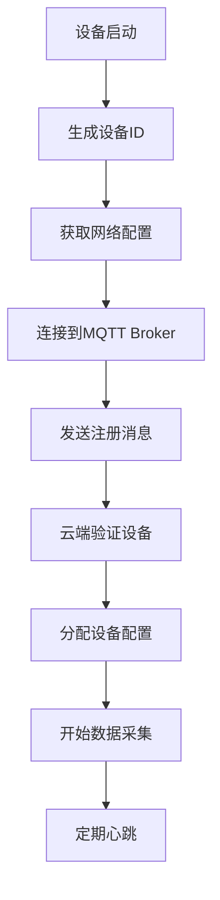
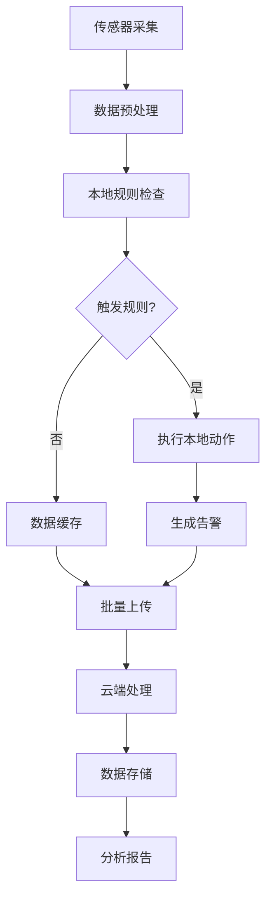
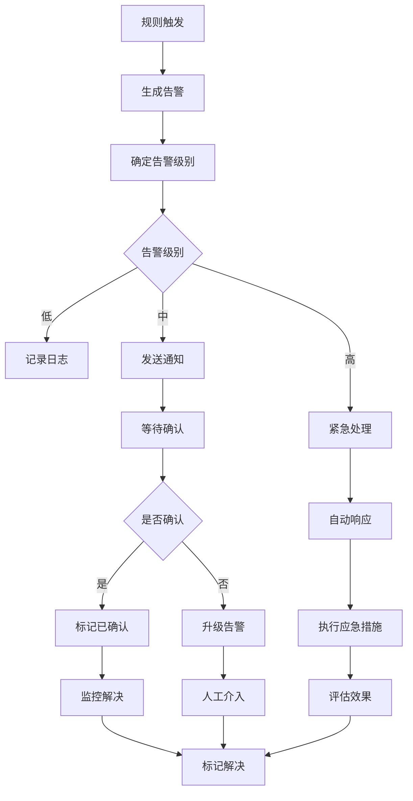

# 物联网行业 - 业务建模详细指南

## 概述

本文档详细描述了物联网行业的业务建模，包括业务流程、数据建模、流程建模和概念建模。

## 1. 业务领域概念建模

### 1.1 核心业务概念

#### 设备聚合根

```rust
#[derive(Debug, Clone)]
pub struct Device {
    pub id: DeviceId,
    pub name: String,
    pub device_type: DeviceType,
    pub model: String,
    pub manufacturer: String,
    pub firmware_version: String,
    pub location: Location,
    pub status: DeviceStatus,
    pub capabilities: Vec<Capability>,
    pub configuration: DeviceConfiguration,
    pub last_seen: DateTime<Utc>,
    pub created_at: DateTime<Utc>,
    pub updated_at: DateTime<Utc>,
}

#[derive(Debug, Clone)]
pub struct DeviceConfiguration {
    pub sampling_rate: Duration,
    pub threshold_values: HashMap<String, f64>,
    pub communication_interval: Duration,
    pub power_mode: PowerMode,
    pub security_settings: SecuritySettings,
}

#[derive(Debug, Clone)]
pub struct SecuritySettings {
    pub encryption_enabled: bool,
    pub authentication_required: bool,
    pub certificate_id: Option<String>,
    pub access_control_list: Vec<String>,
}

impl Device {
    pub fn is_online(&self) -> bool {
        self.status == DeviceStatus::Online &&
        self.last_seen > Utc::now() - Duration::from_secs(300) // 5分钟内有活动
    }
    
    pub fn can_communicate(&self) -> bool {
        self.is_online() && self.capabilities.contains(&Capability::Communication)
    }
    
    pub fn update_status(&mut self, status: DeviceStatus) {
        self.status = status;
        self.updated_at = Utc::now();
        if status == DeviceStatus::Online {
            self.last_seen = Utc::now();
        }
    }
    
    pub fn check_threshold(&self, sensor_type: &str, value: f64) -> Option<ThresholdAlert> {
        if let Some(threshold) = self.configuration.threshold_values.get(sensor_type) {
            if value > *threshold {
                Some(ThresholdAlert {
                    device_id: self.id.clone(),
                    sensor_type: sensor_type.to_string(),
                    value,
                    threshold: *threshold,
                    timestamp: Utc::now(),
                })
            } else {
                None
            }
        } else {
            None
        }
    }
}
```

#### 传感器数据聚合根

```rust
#[derive(Debug, Clone)]
pub struct SensorData {
    pub id: SensorDataId,
    pub device_id: DeviceId,
    pub sensor_type: SensorType,
    pub value: f64,
    pub unit: String,
    pub timestamp: DateTime<Utc>,
    pub quality: DataQuality,
    pub metadata: SensorMetadata,
}

#[derive(Debug, Clone)]
pub struct SensorMetadata {
    pub accuracy: f64,
    pub precision: f64,
    pub calibration_date: Option<DateTime<Utc>>,
    pub environmental_conditions: HashMap<String, f64>,
}

impl SensorData {
    pub fn is_valid(&self) -> bool {
        self.quality == DataQuality::Good && 
        self.value.is_finite() &&
        !self.value.is_nan()
    }
    
    pub fn is_outlier(&self, historical_data: &[SensorData]) -> bool {
        if historical_data.len() < 10 {
            return false;
        }
        
        let values: Vec<f64> = historical_data.iter()
            .map(|d| d.value)
            .collect();
        
        let mean = values.iter().sum::<f64>() / values.len() as f64;
        let variance = values.iter()
            .map(|v| (v - mean).powi(2))
            .sum::<f64>() / values.len() as f64;
        let std_dev = variance.sqrt();
        
        (self.value - mean).abs() > 3.0 * std_dev
    }
}
```

#### 规则聚合根

```rust
#[derive(Debug, Clone)]
pub struct Rule {
    pub id: RuleId,
    pub name: String,
    pub description: String,
    pub conditions: Vec<Condition>,
    pub actions: Vec<Action>,
    pub priority: u32,
    pub enabled: bool,
    pub created_at: DateTime<Utc>,
    pub updated_at: DateTime<Utc>,
}

#[derive(Debug, Clone)]
pub enum Condition {
    Threshold {
        device_id: DeviceId,
        sensor_type: String,
        operator: ComparisonOperator,
        value: f64,
    },
    TimeRange {
        start_time: TimeOfDay,
        end_time: TimeOfDay,
        days_of_week: Vec<DayOfWeek>,
    },
    DeviceStatus {
        device_id: DeviceId,
        status: DeviceStatus,
    },
    Composite {
        conditions: Vec<Condition>,
        operator: LogicalOperator,
    },
}

#[derive(Debug, Clone)]
pub enum Action {
    SendAlert {
        alert_type: AlertType,
        recipients: Vec<String>,
        message_template: String,
    },
    ControlDevice {
        device_id: DeviceId,
        command: DeviceCommand,
    },
    StoreData {
        data_type: String,
        destination: String,
    },
    TriggerWorkflow {
        workflow_id: String,
        parameters: HashMap<String, String>,
    },
}

impl Rule {
    pub async fn evaluate(&self, context: &RuleContext) -> Result<bool, RuleError> {
        for condition in &self.conditions {
            if !self.evaluate_condition(condition, context).await? {
                return Ok(false);
            }
        }
        Ok(true)
    }
    
    async fn evaluate_condition(&self, condition: &Condition, context: &RuleContext) -> Result<bool, RuleError> {
        match condition {
            Condition::Threshold { device_id, sensor_type, operator, value } => {
                if let Some(sensor_data) = context.get_latest_sensor_data(device_id, sensor_type) {
                    match operator {
                        ComparisonOperator::GreaterThan => Ok(sensor_data.value > *value),
                        ComparisonOperator::LessThan => Ok(sensor_data.value < *value),
                        ComparisonOperator::Equals => Ok(sensor_data.value == *value),
                        ComparisonOperator::NotEquals => Ok(sensor_data.value != *value),
                    }
                } else {
                    Ok(false)
                }
            }
            Condition::TimeRange { start_time, end_time, days_of_week } => {
                let now = Utc::now();
                let current_time = now.time();
                let current_day = now.weekday();
                
                let day_matches = days_of_week.contains(&current_day);
                let time_matches = current_time >= *start_time && current_time <= *end_time;
                
                Ok(day_matches && time_matches)
            }
            Condition::DeviceStatus { device_id, status } => {
                if let Some(device) = context.get_device(device_id) {
                    Ok(device.status == *status)
                } else {
                    Ok(false)
                }
            }
            Condition::Composite { conditions, operator } => {
                let results: Vec<bool> = futures::future::join_all(
                    conditions.iter().map(|c| self.evaluate_condition(c, context))
                ).await
                    .into_iter()
                    .collect::<Result<Vec<bool>, RuleError>>()?;
                
                match operator {
                    LogicalOperator::And => Ok(results.iter().all(|&r| r)),
                    LogicalOperator::Or => Ok(results.iter().any(|&r| r)),
                }
            }
        }
    }
}
```

### 1.2 值对象

```rust
#[derive(Debug, Clone, PartialEq, Eq, Hash)]
pub struct DeviceId(String);

#[derive(Debug, Clone, PartialEq, Eq, Hash)]
pub struct SensorDataId(String);

#[derive(Debug, Clone, PartialEq, Eq, Hash)]
pub struct RuleId(String);

#[derive(Debug, Clone)]
pub struct Location {
    pub latitude: f64,
    pub longitude: f64,
    pub altitude: Option<f64>,
    pub accuracy: Option<f64>,
}

#[derive(Debug, Clone)]
pub struct TimeOfDay {
    pub hour: u8,
    pub minute: u8,
    pub second: u8,
}

impl TimeOfDay {
    pub fn new(hour: u8, minute: u8, second: u8) -> Result<Self, TimeError> {
        if hour > 23 || minute > 59 || second > 59 {
            return Err(TimeError::InvalidTime);
        }
        Ok(Self { hour, minute, second })
    }
    
    pub fn from_chrono(time: chrono::NaiveTime) -> Self {
        Self {
            hour: time.hour() as u8,
            minute: time.minute() as u8,
            second: time.second() as u8,
        }
    }
}
```

## 2. 数据建模

### 2.1 数据库设计

#### 设备相关表

```sql
-- 设备表
CREATE TABLE devices (
    id UUID PRIMARY KEY,
    name VARCHAR(100) NOT NULL,
    device_type VARCHAR(50) NOT NULL,
    model VARCHAR(100) NOT NULL,
    manufacturer VARCHAR(100) NOT NULL,
    firmware_version VARCHAR(50) NOT NULL,
    latitude DECIMAL(10, 8),
    longitude DECIMAL(11, 8),
    altitude DECIMAL(8, 2),
    status VARCHAR(20) NOT NULL,
    capabilities JSONB NOT NULL,
    configuration JSONB NOT NULL,
    last_seen TIMESTAMP WITH TIME ZONE,
    created_at TIMESTAMP WITH TIME ZONE NOT NULL,
    updated_at TIMESTAMP WITH TIME ZONE NOT NULL
);

-- 设备状态历史表
CREATE TABLE device_status_history (
    id UUID PRIMARY KEY,
    device_id UUID NOT NULL,
    status VARCHAR(20) NOT NULL,
    reason TEXT,
    timestamp TIMESTAMP WITH TIME ZONE NOT NULL,
    FOREIGN KEY (device_id) REFERENCES devices(id)
);

-- 设备配置表
CREATE TABLE device_configurations (
    id UUID PRIMARY KEY,
    device_id UUID NOT NULL,
    config_key VARCHAR(100) NOT NULL,
    config_value TEXT NOT NULL,
    config_type VARCHAR(50) NOT NULL,
    updated_at TIMESTAMP WITH TIME ZONE NOT NULL,
    FOREIGN KEY (device_id) REFERENCES devices(id),
    UNIQUE(device_id, config_key)
);
```

#### 传感器数据表

```sql
-- 传感器数据表
CREATE TABLE sensor_data (
    id UUID PRIMARY KEY,
    device_id UUID NOT NULL,
    sensor_type VARCHAR(50) NOT NULL,
    value DECIMAL(15, 6) NOT NULL,
    unit VARCHAR(20) NOT NULL,
    timestamp TIMESTAMP WITH TIME ZONE NOT NULL,
    quality VARCHAR(20) NOT NULL,
    accuracy DECIMAL(8, 4),
    precision DECIMAL(8, 4),
    calibration_date TIMESTAMP WITH TIME ZONE,
    environmental_conditions JSONB,
    created_at TIMESTAMP WITH TIME ZONE NOT NULL,
    FOREIGN KEY (device_id) REFERENCES devices(id)
);

-- 传感器数据聚合表（按小时）
CREATE TABLE sensor_data_hourly (
    id UUID PRIMARY KEY,
    device_id UUID NOT NULL,
    sensor_type VARCHAR(50) NOT NULL,
    hour_start TIMESTAMP WITH TIME ZONE NOT NULL,
    min_value DECIMAL(15, 6) NOT NULL,
    max_value DECIMAL(15, 6) NOT NULL,
    avg_value DECIMAL(15, 6) NOT NULL,
    count INTEGER NOT NULL,
    FOREIGN KEY (device_id) REFERENCES devices(id),
    UNIQUE(device_id, sensor_type, hour_start)
);

-- 传感器数据聚合表（按天）
CREATE TABLE sensor_data_daily (
    id UUID PRIMARY KEY,
    device_id UUID NOT NULL,
    sensor_type VARCHAR(50) NOT NULL,
    day_start DATE NOT NULL,
    min_value DECIMAL(15, 6) NOT NULL,
    max_value DECIMAL(15, 6) NOT NULL,
    avg_value DECIMAL(15, 6) NOT NULL,
    count INTEGER NOT NULL,
    FOREIGN KEY (device_id) REFERENCES devices(id),
    UNIQUE(device_id, sensor_type, day_start)
);
```

#### 规则和告警表

```sql
-- 规则表
CREATE TABLE rules (
    id UUID PRIMARY KEY,
    name VARCHAR(100) NOT NULL,
    description TEXT,
    conditions JSONB NOT NULL,
    actions JSONB NOT NULL,
    priority INTEGER NOT NULL DEFAULT 0,
    enabled BOOLEAN NOT NULL DEFAULT true,
    created_at TIMESTAMP WITH TIME ZONE NOT NULL,
    updated_at TIMESTAMP WITH TIME ZONE NOT NULL
);

-- 告警表
CREATE TABLE alerts (
    id UUID PRIMARY KEY,
    device_id UUID NOT NULL,
    rule_id UUID,
    alert_type VARCHAR(50) NOT NULL,
    severity VARCHAR(20) NOT NULL,
    message TEXT NOT NULL,
    timestamp TIMESTAMP WITH TIME ZONE NOT NULL,
    acknowledged BOOLEAN NOT NULL DEFAULT false,
    resolved BOOLEAN NOT NULL DEFAULT false,
    acknowledged_by VARCHAR(100),
    acknowledged_at TIMESTAMP WITH TIME ZONE,
    resolved_at TIMESTAMP WITH TIME ZONE,
    FOREIGN KEY (device_id) REFERENCES devices(id),
    FOREIGN KEY (rule_id) REFERENCES rules(id)
);

-- 告警历史表
CREATE TABLE alert_history (
    id UUID PRIMARY KEY,
    alert_id UUID NOT NULL,
    action VARCHAR(50) NOT NULL,
    performed_by VARCHAR(100),
    timestamp TIMESTAMP WITH TIME ZONE NOT NULL,
    notes TEXT,
    FOREIGN KEY (alert_id) REFERENCES alerts(id)
);
```

### 2.2 时间序列数据存储

```rust
pub struct InfluxDBStorage {
    client: influxdb::Client,
    database: String,
}

impl InfluxDBStorage {
    pub async fn store_sensor_data(&self, data: &SensorData) -> Result<(), StorageError> {
        let point = influxdb::Point::new("sensor_data")
            .tag("device_id", data.device_id.to_string())
            .tag("sensor_type", data.sensor_type.to_string())
            .tag("unit", data.unit.clone())
            .tag("quality", data.quality.to_string())
            .field("value", data.value)
            .field("accuracy", data.metadata.accuracy)
            .field("precision", data.metadata.precision)
            .timestamp(data.timestamp.timestamp_nanos());
        
        self.client.query(&influxdb::Query::write_query(
            influxdb::Type::Write,
            &self.database,
            point,
        )).await?;
        
        Ok(())
    }
    
    pub async fn query_sensor_data(
        &self,
        device_id: &DeviceId,
        sensor_type: &str,
        start_time: DateTime<Utc>,
        end_time: DateTime<Utc>,
    ) -> Result<Vec<SensorData>, StorageError> {
        let query = format!(
            r#"
            SELECT value, unit, quality, accuracy, precision, time
            FROM sensor_data
            WHERE device_id = '{}' AND sensor_type = '{}'
            AND time >= {} AND time <= {}
            ORDER BY time ASC
            "#,
            device_id, sensor_type,
            start_time.timestamp_nanos(),
            end_time.timestamp_nanos()
        );
        
        let result = self.client.query(&influxdb::Query::raw_read_query(query)).await?;
        
        // 解析结果...
        Ok(vec![])
    }
    
    pub async fn aggregate_sensor_data(
        &self,
        device_id: &DeviceId,
        sensor_type: &str,
        aggregation: AggregationType,
        interval: Duration,
        start_time: DateTime<Utc>,
        end_time: DateTime<Utc>,
    ) -> Result<Vec<AggregatedData>, StorageError> {
        let interval_str = match interval.as_secs() {
            3600 => "1h",
            86400 => "1d",
            _ => "1m",
        };
        
        let query = format!(
            r#"
            SELECT mean(value) as avg_value, min(value) as min_value, max(value) as max_value, count(value) as count
            FROM sensor_data
            WHERE device_id = '{}' AND sensor_type = '{}'
            AND time >= {} AND time <= {}
            GROUP BY time({})
            "#,
            device_id, sensor_type,
            start_time.timestamp_nanos(),
            end_time.timestamp_nanos(),
            interval_str
        );
        
        let result = self.client.query(&influxdb::Query::raw_read_query(query)).await?;
        
        // 解析结果...
        Ok(vec![])
    }
}
```

## 3. 流程建模

### 3.1 设备注册流程



### 3.2 数据处理流程



### 3.3 告警处理流程



### 3.4 流程实现

```rust
pub struct DataProcessingWorkflow {
    data_processor: Box<dyn DataProcessor>,
    rule_engine: Box<dyn RuleEngine>,
    alert_service: Box<dyn AlertService>,
    storage_service: Box<dyn StorageService>,
}

impl DataProcessingWorkflow {
    pub async fn process_sensor_data(
        &self,
        raw_data: Vec<SensorData>,
    ) -> Result<ProcessingResult, WorkflowError> {
        let mut processed_data = Vec::new();
        let mut alerts = Vec::new();
        
        for data in raw_data {
            // 1. 数据预处理
            let processed = self.data_processor.preprocess(&data).await?;
            
            if !processed.is_valid() {
                continue; // 跳过无效数据
            }
            
            // 2. 异常检测
            if processed.is_outlier(&self.get_historical_data(&data.device_id, &data.sensor_type).await?) {
                self.handle_outlier(&processed).await?;
            }
            
            // 3. 规则评估
            let rule_results = self.rule_engine.evaluate_rules(&processed).await?;
            
            for result in rule_results {
                if !result.is_compliant {
                    let alert = self.alert_service.create_alert(&result).await?;
                    alerts.push(alert);
                }
            }
            
            processed_data.push(processed);
        }
        
        // 4. 批量存储
        self.storage_service.batch_store(&processed_data).await?;
        
        // 5. 处理告警
        for alert in alerts {
            self.alert_service.process_alert(&alert).await?;
        }
        
        Ok(ProcessingResult {
            processed_count: processed_data.len(),
            alert_count: alerts.len(),
        })
    }
    
    async fn handle_outlier(&self, data: &SensorData) -> Result<(), WorkflowError> {
        // 记录异常数据
        self.storage_service.store_outlier(data).await?;
        
        // 发送异常通知
        self.alert_service.send_outlier_notification(data).await?;
        
        Ok(())
    }
}
```

## 4. 规则引擎

### 4.1 规则评估

```rust
pub struct RuleEngine {
    rules: Vec<Rule>,
    context_provider: Box<dyn ContextProvider>,
}

impl RuleEngine {
    pub async fn evaluate_rules(&self, data: &SensorData) -> Result<Vec<RuleResult>, RuleError> {
        let context = self.context_provider.create_context(data).await?;
        let mut results = Vec::new();
        
        for rule in &self.rules {
            if !rule.enabled {
                continue;
            }
            
            let triggered = rule.evaluate(&context).await?;
            
            if triggered {
                let actions = self.execute_actions(&rule.actions, &context).await?;
                results.push(RuleResult {
                    rule_id: rule.id.clone(),
                    rule_name: rule.name.clone(),
                    triggered: true,
                    actions,
                });
            }
        }
        
        Ok(results)
    }
    
    async fn execute_actions(&self, actions: &[Action], context: &RuleContext) -> Result<Vec<ActionResult>, RuleError> {
        let mut results = Vec::new();
        
        for action in actions {
            let result = match action {
                Action::SendAlert { alert_type, recipients, message_template } => {
                    self.send_alert(alert_type, recipients, message_template, context).await?
                }
                Action::ControlDevice { device_id, command } => {
                    self.control_device(device_id, command).await?
                }
                Action::StoreData { data_type, destination } => {
                    self.store_data(data_type, destination, context).await?
                }
                Action::TriggerWorkflow { workflow_id, parameters } => {
                    self.trigger_workflow(workflow_id, parameters).await?
                }
            };
            
            results.push(result);
        }
        
        Ok(results)
    }
}
```

## 5. 事件系统

### 5.1 事件定义

```rust
#[derive(Debug, Clone, Serialize, Deserialize)]
pub enum IoTEvent {
    DeviceRegistered(DeviceRegisteredEvent),
    DeviceDisconnected(DeviceDisconnectedEvent),
    SensorDataReceived(SensorDataEvent),
    RuleTriggered(RuleTriggeredEvent),
    AlertGenerated(AlertGeneratedEvent),
    DeviceCommandExecuted(DeviceCommandEvent),
}

#[derive(Debug, Clone, Serialize, Deserialize)]
pub struct SensorDataEvent {
    pub device_id: DeviceId,
    pub sensor_type: String,
    pub value: f64,
    pub timestamp: DateTime<Utc>,
    pub quality: DataQuality,
}

#[derive(Debug, Clone, Serialize, Deserialize)]
pub struct RuleTriggeredEvent {
    pub rule_id: RuleId,
    pub device_id: DeviceId,
    pub sensor_data: SensorData,
    pub actions_executed: Vec<Action>,
    pub timestamp: DateTime<Utc>,
}
```

### 5.2 事件处理器

```rust
pub struct DataAnalyticsEventHandler {
    analytics_service: Box<dyn AnalyticsService>,
    report_service: Box<dyn ReportService>,
}

#[async_trait]
impl EventHandler for DataAnalyticsEventHandler {
    async fn handle(&self, event: &IoTEvent) -> Result<(), EventError> {
        match event {
            IoTEvent::SensorDataReceived(data_event) => {
                self.handle_sensor_data(data_event).await?;
            }
            IoTEvent::RuleTriggered(rule_event) => {
                self.handle_rule_triggered(rule_event).await?;
            }
            _ => {}
        }
        Ok(())
    }
}

impl DataAnalyticsEventHandler {
    async fn handle_sensor_data(&self, event: &SensorDataEvent) -> Result<(), EventError> {
        // 更新实时统计
        self.analytics_service.update_realtime_stats(event).await?;
        
        // 检查是否需要生成报告
        if self.should_generate_report(event).await? {
            self.report_service.generate_report(event.device_id.clone()).await?;
        }
        
        Ok(())
    }
    
    async fn handle_rule_triggered(&self, event: &RuleTriggeredEvent) -> Result<(), EventError> {
        // 记录规则执行统计
        self.analytics_service.record_rule_execution(event).await?;
        
        // 更新设备行为模式
        self.analytics_service.update_device_pattern(event.device_id.clone()).await?;
        
        Ok(())
    }
}
```

## 总结

物联网行业的业务建模需要特别关注：

1. **业务概念建模**: 明确定义设备、传感器数据、规则等核心概念
2. **数据建模**: 设计支持时间序列数据的高效存储结构
3. **流程建模**: 详细描述数据处理、告警处理等业务流程
4. **规则引擎**: 实现灵活的业务规则管理
5. **事件系统**: 支持实时数据处理和分析

通过这种详细的业务建模，可以构建出高效、可靠的物联网系统。
